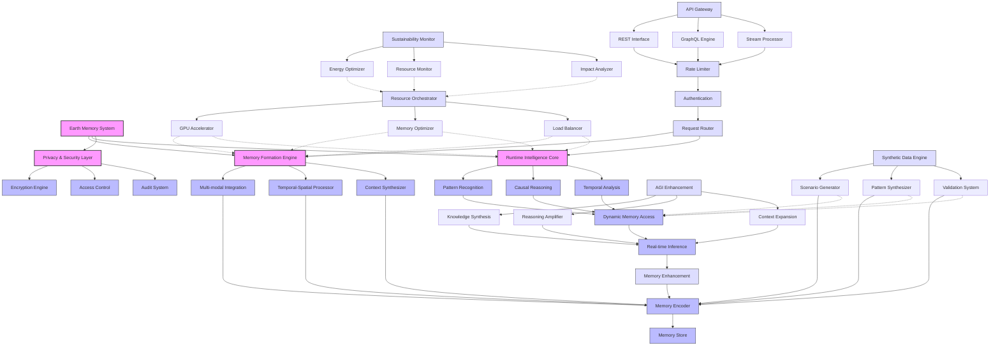

# Vortx.ai

Advanced Earth Memory System for AGI and Geospatial Intelligence


[](https://badge.fury.io/py/vortx)
[](docs/core/index.md)
[](LICENSE)
[](https://www.python.org/downloads/)
[](https://github.com/psf/black)
[](https://coveralls.io/github/vortx-ai/synthetic-satellite?branch=main)

<p align="center">
  <a href="#overview">Overview</a> •
  <a href="#installation">Installation</a> •
  <a href="#features">Features</a> •
  <a href="#quick-start">Quick Start</a> •
  <a href="#documentation">Docs</a> •
  <a href="#community">Community</a>
</p>

## Overview

Vortx is a cutting-edge Earth Memory System designed for AGI and advanced geospatial analysis. It combines state-of-the-art ML models (including DeepSeek-R1/V3 and other SOTA models) with synthetic data generation to create rich, contextual memories of Earth observations. Key capabilities include:

- 🧠 **AGI Memory Formation**: Create and retrieve complex Earth memories for AGI systems
- 🌍 **Earth Observation**: Process and analyze multi-modal Earth data at scale
- 🤖 **Advanced ML Models**: Integrated DeepSeek-R1/V3 and other SOTA models for superior understanding
- 🎯 **Synthetic Data**: Generate high-quality synthetic data for training and simulation
- ⚡ **High Performance**: GPU-accelerated processing with distributed computing
- 🔒 **Privacy**: Advanced privacy-preserving techniques for sensitive data

## System Architecture



## Installation

### From Source (Current Method)
```bash
# Clone the repository
git clone https://github.com/vortx-ai/synthetic-satellite.git
cd synthetic-satellite

# Create and activate virtual environment
python -m venv venv
source venv/bin/activate  # Linux/Mac
venv\Scripts\activate     # Windows

# Install dependencies
pip install -r requirements.txt

# Install in development mode
pip install -e .
```

### Optional Dependencies

Install additional features based on your needs:
```bash
# GPU Acceleration
pip install -r requirements-gpu.txt

# Machine Learning
pip install -r requirements-ml.txt

# Visualization
pip install -r requirements-viz.txt

# Development
pip install -r requirements-dev.txt

# Documentation
pip install -r requirements-docs.txt
```

### Coming Soon
- PyPI Package (Feb 2025): `pip install vortx`
- Docker Images (Feb 2025): `docker pull vortx/vortx:latest`

### System Requirements

#### Minimum
- Python 3.9+
- 8GB RAM
- 4 CPU cores
- 10GB disk space

#### Recommended
- Python 3.9+
- 32GB RAM
- 8+ CPU cores
- NVIDIA GPU with 8GB+ VRAM
- 50GB SSD storage

## Features

### Memory Systems
- **Earth Memory Formation**
  - Multi-modal memory encoding
  - Temporal-spatial context integration
  - Memory retrieval and synthesis
  - AGI-optimized memory structures

### Advanced ML Models
- **DeepSeek Integration**
  - DeepSeek-R1 for reasoning and analysis
  - DeepSeek-V3 for visual understanding
  - Custom model fine-tuning
  - Model registry and versioning

### Synthetic Data Generation
- **Advanced Synthesis**
  - Realistic terrain generation
  - Climate pattern simulation
  - Urban development scenarios
  - Environmental change modeling
  
### AGI Capabilities
- **Contextual Understanding**
  - Location-aware reasoning
  - Temporal pattern recognition
  - Multi-modal data fusion
  - Causal relationship inference

### Performance
- **Optimized Processing**
  - GPU acceleration
  - Distributed memory systems
  - Efficient caching
  - Memory optimization

## Quick Start

### Prerequisites
- Python 3.9 or higher
- Virtual environment (recommended)
- Git

### Basic Usage
```python
from vortx import Vortx
from vortx.models import DeepSeekR1, DeepSeekV3
from vortx.memory import EarthMemoryStore

# Initialize with advanced models
vx = Vortx(
    models={
        "reasoning": DeepSeekR1(),
        "vision": DeepSeekV3()
    },
    use_gpu=True
)

# Create Earth memories
memory_store = EarthMemoryStore()
memories = vx.create_memories(
    location=(37.7749, -122.4194),
    time_range=("2020-01-01", "2024-01-01"),
    modalities=["satellite", "climate", "social"]
)

# Generate synthetic data
synthetic_data = vx.generate_synthetic(
    base_location=(37.7749, -122.4194),
    scenario="urban_development",
    time_steps=10,
    climate_factors=True
)

# AGI reasoning with memories
insights = vx.analyze_with_deepseek(
    query="Analyze urban development patterns and environmental impact",
    context_memories=memories,
    synthetic_scenarios=synthetic_data
)
```

### Advanced Examples
Check out our [examples directory](examples/) for more advanced use cases:
- [Earth Memory Formation](examples/memory_formation.py)
- [Synthetic Data Generation](examples/synthetic_data.py)
- [Multi-modal Analysis](examples/multimodal_analysis.py)
- [Privacy-Preserving Processing](examples/privacy_preserving.py)

## Documentation

Comprehensive documentation is available in the [docs](docs/) directory:

- [Getting Started Guide](docs/getting-started/index.md)
- [Core Concepts](docs/core/index.md)
- [AGI Memory Systems](docs/core/agi-memory/overview.md)
- [API Reference](docs/api/rest/overview.md)
- [Python SDK](docs/api/python/overview.md)
- [Sustainability](docs/sustainability/overview.md)

## Benchmarks

### Memory Formation Performance
| Dataset Size | CPU Time | GPU Time | Memory Usage |
|-------------|----------|----------|--------------|
| Small (1GB) | 45s      | 12s      | 2GB         |
| Medium (10GB)| 8m      | 2m       | 8GB         |
| Large (100GB)| 1.5h    | 25m      | 32GB        |


## Use Cases

### AGI Earth Understanding
- Building comprehensive Earth memories
- Temporal-spatial reasoning
- Environmental pattern recognition
- Future scenario simulation

### Synthetic Data Generation
- Training data creation
- Scenario simulation
- Impact assessment
- Pattern generation

### Advanced Analysis
- Urban development tracking
- Climate change analysis
- Infrastructure planning
- Environmental monitoring

## Community

Join our growing community:
- 💬 [Discord Community](https://discord.gg/vortx)
- 📝 [GitHub Discussions](https://github.com/vortx-ai/synthetic-satellite/discussions)
- 🐦 [Twitter](https://twitter.com/vortxai)
- 📧 [Email Newsletter](https://vortx.ai/newsletter)

### Support Channels
- 📚 [Documentation](docs/)
- 🤝 [Stack Overflow - Coming Soon](https://stackoverflow.com/questions/tagged/vortx)
- 🐛 [Issue Tracker](https://github.com/vortx-ai/synthetic-satellite/issues)
- 📧 [Email Support](mailto:support@vortx.ai)

## Contributing

We welcome contributions! Please see our [Contributing Guide](docs/meta/contributing.md) for details.

### Development Setup
```bash
# Clone and setup
git clone https://github.com/vortx-ai/synthetic-satellite.git
cd synthetic-satellite
python -m venv venv
source venv/bin/activate

# Install dev dependencies
pip install -r requirements-dev.txt
pre-commit install

# Run tests
pytest tests/
```

### Key Areas for Contribution
- 🧠 AGI memory systems
- 🎯 Synthetic data generation
- 🤖 Model integrations
- 📊 Analysis algorithms
- 🐛 Bug fixes

## Security

- 🔒 [Security Policy](SECURITY.md)
- 🔑 [Responsible Disclosure](https://vortx.ai/security)
- 📝 [Security Advisories](https://github.com/vortx-ai/synthetic-satellite/security/advisories)

## License

Vortx is released under the Apache License 2.0. See [LICENSE](LICENSE) for details.

## Citation

If you use Vortx in your research, please cite:

```bibtex
@software{vortx2025,
  title={Vortx: Advanced Earth Memory System for AGI},
  author={Vortx Team},
  year={2025},
  url={https://vortx.ai},
  version={0.1.0}
}
```

## Links

- 🌐 **Website**: [https://vortx.ai](https://vortx.ai)
- 📚 **Documentation**: [docs/](docs/)
- 💻 **Source Code**: [GitHub](https://github.com/vortx-ai/synthetic-satellite)
- 📊 **Project Board**: [GitHub Projects](https://github.com/vortx-ai/synthetic-satellite/projects)
- 📝 **Blog - Coming Soon**: [https://vortx.ai/blog](https://vortx.ai/blog)

## Acknowledgments

Vortx builds upon several open-source projects and research papers. See our [Acknowledgments](docs/meta/acknowledgments.md) for details.

---
<p align="center">
  Made with ❤️ by the Vortx Team
</p> 
