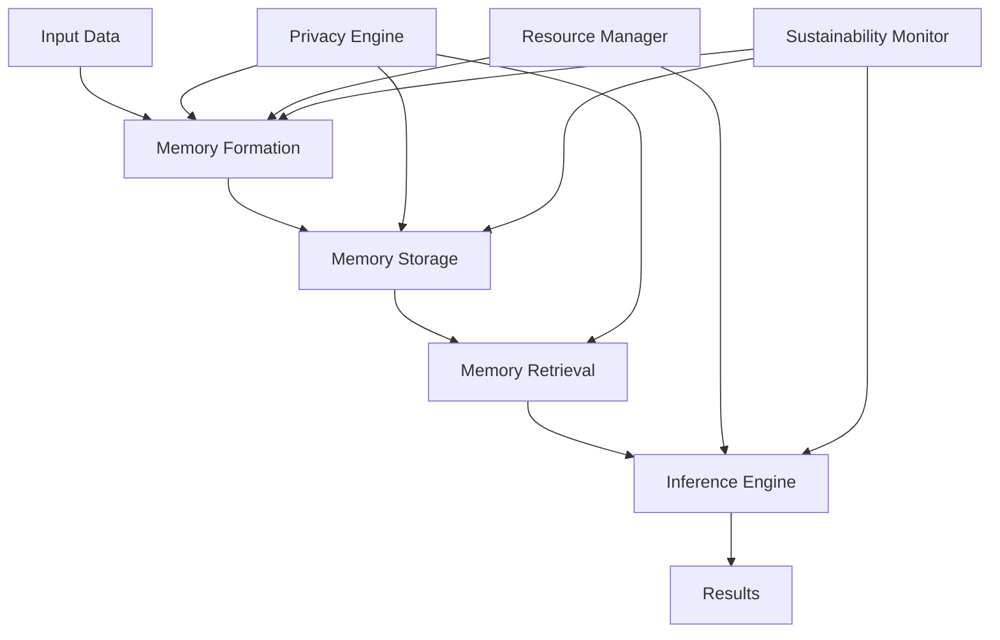

# Vortx Documentation

Welcome to the Vortx documentation! This directory contains comprehensive documentation for the Vortx Earth Memory System.

## Directory Structure

```
docs/
├── getting-started/     # Installation and quick start guides
├── core/               # Core concepts and architecture
│   ├── concepts/       # Basic concepts and terminology
│   ├── agi-memory/     # AGI memory system details
│   └── privacy/        # Privacy and security features
├── guides/             # Tutorials and how-to guides
│   ├── tutorials/      # Step-by-step tutorials
│   └── examples/       # Example use cases
├── api/                # API documentation
│   ├── rest/           # REST API reference
│   └── python/         # Python SDK documentation
├── sustainability/     # Environmental impact and sustainability
└── meta/              # Project meta information
```

## Key Documentation

1. [Getting Started](getting-started/index.md)
   - Installation guide
   - Quick start tutorial
   - Basic configuration

2. [Core Concepts](core/index.md)
   - System architecture
   - Memory formation
   - Runtime inference

3. [API Reference](api/rest/overview.md)
   - REST API
   - Python SDK
   - GraphQL endpoints

4. [Sustainability](sustainability/overview.md)
   - Environmental impact
   - Resource optimization
   - Green computing

## Workflow Architecture



## System Components


## Contributing

See our [Contributing Guide](meta/contributing.md) for information on how to contribute to the documentation.

## Building Documentation

```bash
# Install documentation dependencies
pip install -r requirements-docs.txt

# Build documentation
mkdocs build

# Serve documentation locally
mkdocs serve
```

## License

This documentation is licensed under the Apache License 2.0. See [LICENSE](../LICENSE) for details. 