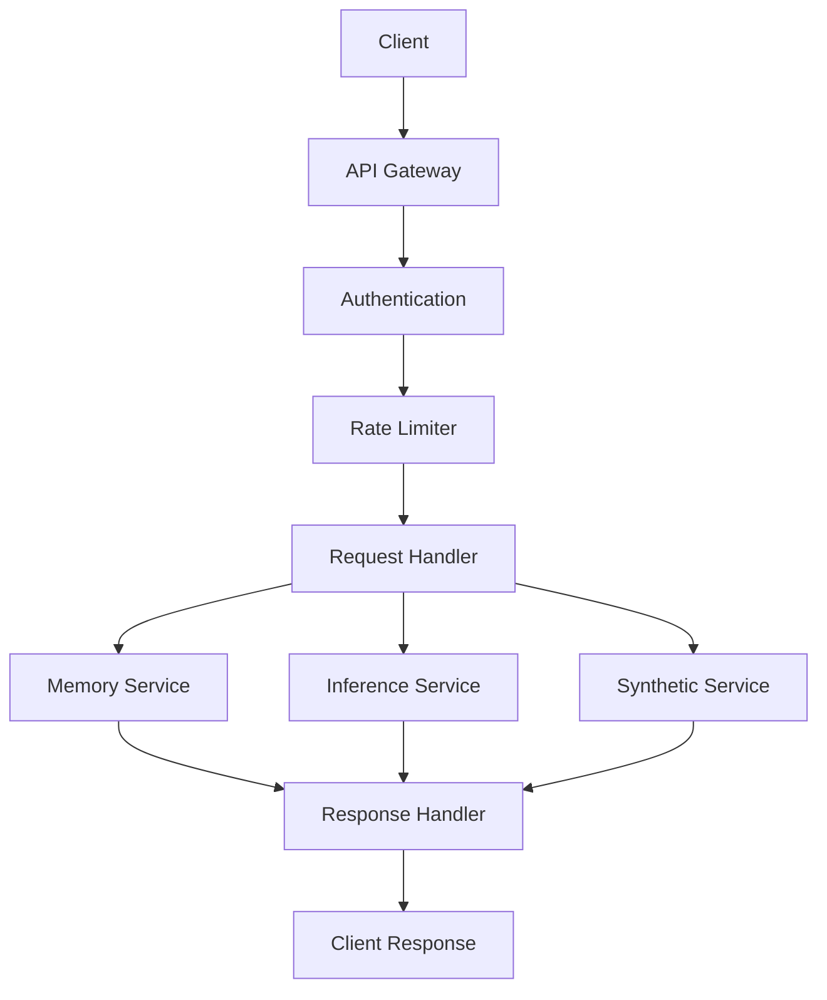
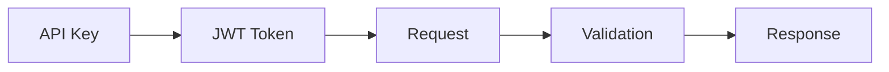

# API Documentation

This directory contains comprehensive API documentation for the Vortx Earth Memory System.

## Contents

### [REST API](rest/overview.md)
- API endpoints
- Authentication
- Request/response formats
- Rate limiting
- Error handling

### [Python SDK](python/overview.md)
- Installation
- Basic usage
- Advanced features
- Best practices
- Error handling

## API Architecture

## Authentication

## Quick Links

- [API Reference](rest/overview.md)
- [Python SDK Guide](python/overview.md)
- [Code Examples](../guides/examples/)
- [API Changelog](../meta/changelog.md)

## Support

For API support:
- Email: api-support@vortx.ai
- Documentation: https://vortx.ai/docs/api
- Status: https://status.vortx.ai 