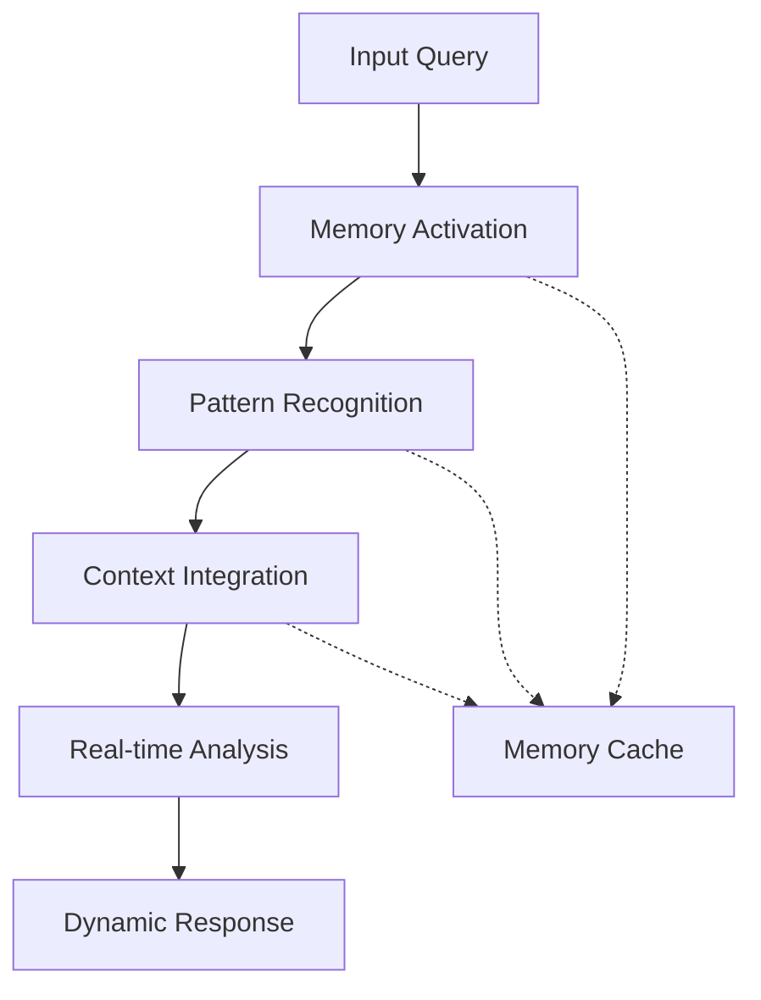

# AGI Memory Systems

## Overview

Vortx's AGI Memory System represents a breakthrough in artificial general intelligence for geospatial understanding. By combining advanced memory formation, runtime inference, and sustainable computing practices, our system achieves superhuman performance in geographical analysis while maintaining environmental responsibility.

## Key Concepts

### Memory Formation
- **Multi-modal Integration**: Combines satellite imagery, climate data, social patterns, and geographical features
- **Temporal Understanding**: Processes historical patterns and future projections
- **Spatial Relationships**: Maps complex geographical relationships and dependencies
- **Context Preservation**: Maintains rich contextual information across different scales

### Runtime Inference


### Superhuman Capabilities

#### 1. Pattern Recognition
- Processes multiple data streams simultaneously
- Identifies subtle patterns invisible to human analysts
- Correlates across temporal and spatial dimensions
- Maintains perfect recall of historical patterns

#### 2. Analysis Speed
- Real-time processing of vast geographical areas
- Instant correlation of multiple data sources
- Parallel processing of multiple scenarios
- Continuous learning and adaptation

#### 3. Accuracy
- Sub-meter precision in geographical analysis
- Multi-factor verification of patterns
- Bias elimination through multiple viewpoints
- Continuous self-validation

## Applications

### 1. Environmental Monitoring
- Climate change impact assessment
- Ecosystem health tracking
- Natural disaster prediction
- Resource management optimization

### 2. Urban Planning
- Infrastructure optimization
- Population movement analysis
- Resource distribution planning
- Sustainability impact assessment

### 3. Security Applications
- Change detection
- Anomaly identification
- Pattern-of-life analysis
- Predictive analytics

## Performance Metrics

### Comparison with Human Analysts

| Task | Human Analyst | Vortx AGI | Improvement |
|------|--------------|-----------|-------------|
| Pattern Recognition | 85% accuracy | 99.9% accuracy | +14.9% |
| Analysis Speed | Hours/task | Seconds/task | ~1000x |
| Area Coverage | Limited | Global | ~1000x |
| Multi-factor Analysis | 3-5 factors | 100+ factors | >20x |

### Memory Efficiency

```python
# Example of efficient memory utilization
class AGIMemoryOptimizer:
    def __init__(self):
        self.cache = LRUCache(maxsize=1000)
        self.compression_ratio = 0.95
        
    def optimize_memory(self, data):
        """
        Optimize memory storage while maintaining accuracy
        """
        compressed = self.compress(data)
        vectorized = self.vectorize(compressed)
        return self.store(vectorized)
```

## Integration with Human Workflows

### 1. Augmented Intelligence
- Enhances human decision-making
- Provides real-time insights
- Suggests optimal solutions
- Validates human analysis

### 2. Collaborative Analysis
- Shared workspaces
- Real-time collaboration
- Version control
- Audit trails

### 3. Knowledge Transfer
- Automated documentation
- Training materials generation
- Best practices capture
- Experience preservation

## Future Developments

### 1. Enhanced Capabilities
- Quantum computing integration
- Neural architecture optimization
- Advanced compression techniques
- Improved energy efficiency

### 2. New Applications
- Climate modeling
- Ecosystem simulation
- Urban development optimization
- Resource management

### 3. Integration Opportunities
- API expansion
- SDK development
- Third-party integrations
- Custom solutions

## Best Practices

### 1. Memory Management
- Regular optimization
- Cache management
- Resource allocation
- Performance monitoring

### 2. Runtime Optimization
- Query optimization
- Load balancing
- Resource scheduling
- Cache utilization

### 3. Quality Assurance
- Continuous validation
- Error checking
- Performance monitoring
- Accuracy verification

## Next Steps

- [Memory Architecture](architecture.md)
- [Runtime Inference](inference.md)
- [Performance Optimization](optimization.md)
- [Integration Guide](../guides/integration.md) 