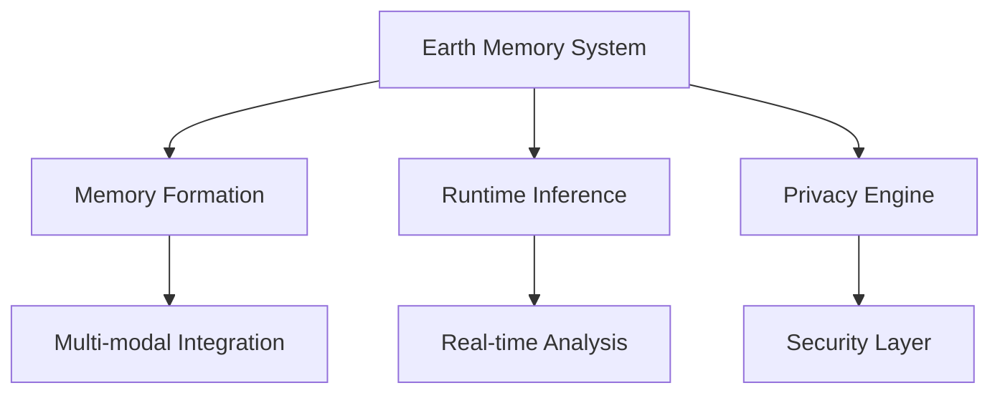

# Core Concepts

## System Architecture

Vortx Synthetic Satellite is built on several key components that work together to provide advanced Earth Memory capabilities:



## Key Components

### 1. [AGI Memory Systems](agi-memory/overview.md)
- Advanced memory formation
- Runtime inference
- Superhuman capabilities
- Performance metrics

### 2. [Memory Architecture](memory-system/architecture.md)
- Multi-modal integration
- Temporal-spatial processing
- Memory optimization
- Cache management

### 3. [Inference Engine](inference/overview.md)
- Real-time processing
- Pattern recognition
- Contextual analysis
- Performance optimization

### 4. [Privacy & Security](../technical/advanced/privacy.md)
- Data protection
- Access control
- Compliance
- Audit trails

## Advanced Features

### Memory Formation
```python
# Example of advanced memory formation
from vortx.memory import AdvancedMemorySystem
from vortx.privacy import PrivacyEngine

memory_system = AdvancedMemorySystem(
    privacy_engine=PrivacyEngine(level='high'),
    compression_ratio=0.95,
    cache_size='10GB'
)

# Create enhanced memories
memories = memory_system.form_memories(
    location=(37.7749, -122.4194),
    modalities=['satellite', 'climate', 'social'],
    temporal_range=('2020-01-01', '2024-01-01')
)
```

### Runtime Inference
```python
# Example of efficient inference
results = memory_system.infer(
    query="Analyze urban development patterns",
    context=memories,
    optimization_level='high',
    cache_results=True
)
```

## Best Practices

### 1. Memory Management
- Regular optimization
- Cache cleanup
- Resource monitoring
- Performance tuning

### 2. Inference Optimization
- Query optimization
- Resource allocation
- Load balancing
- Cache utilization

### 3. Privacy Compliance
- Data minimization
- Access controls
- Audit logging
- Regular reviews

## Integration Points

### 1. APIs
- REST endpoints
- GraphQL interface
- WebSocket connections
- Batch processing

### 2. SDKs
- Python library
- JavaScript client
- Java integration
- Go implementation

### 3. Extensions
- Custom modules
- Plugins
- Integrations
- Add-ons

## Performance Considerations

### 1. Resource Usage
- Memory optimization
- CPU utilization
- GPU acceleration
- Network efficiency

### 2. Scalability
- Horizontal scaling
- Vertical scaling
- Load distribution
- Resource management

### 3. Monitoring
- Performance metrics
- Resource tracking
- Error logging
- Usage analytics

## Next Steps

- [Getting Started](../getting-started/quickstart.md)
- [Technical Documentation](../technical/TECHNICAL.md)
- [API Reference](../technical/api/rest.md)
- [Tutorials](../guides/tutorials/basic.md) 