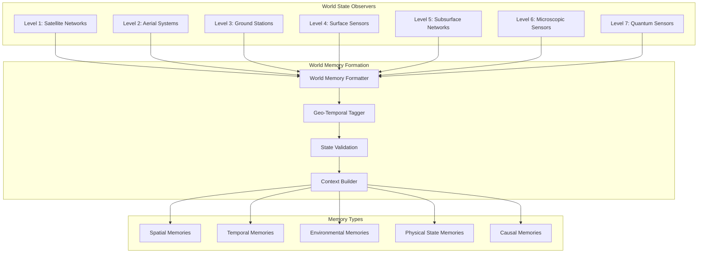
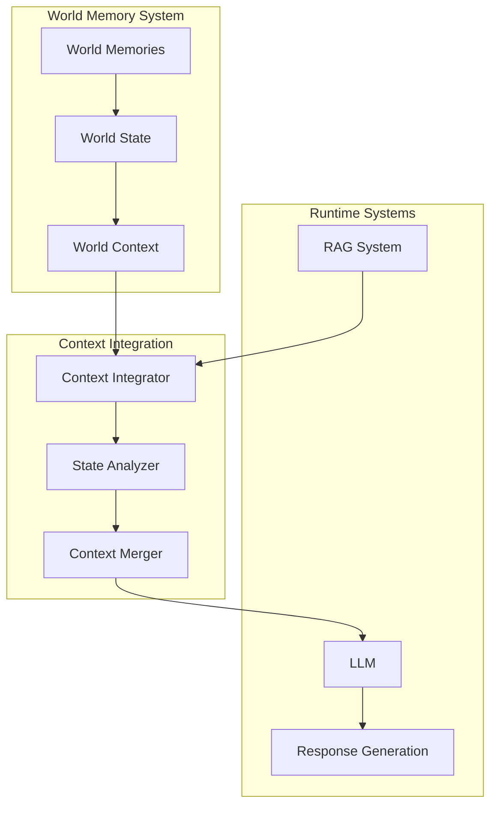
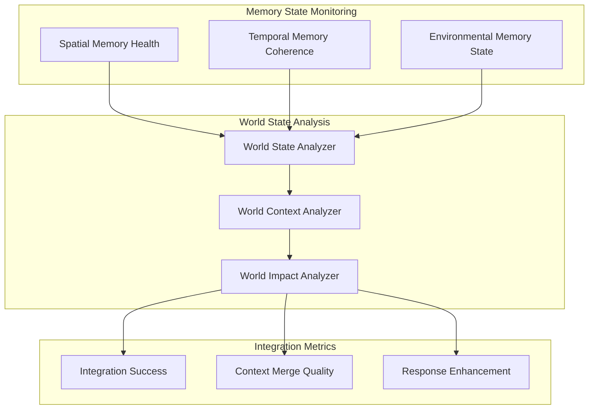

# Core Concepts: Earth Memory System Overview

## Introduction

The Vortx Synthetic Satellite is an advanced Earth Memory System designed for AGI and geospatial intelligence. At its core, it creates and maintains "World Memories" - a comprehensive, multi-layered understanding of Earth's state across different scales and dimensions. These memories work alongside traditional RAG systems as runtime context providers, enabling richer and more accurate AI interactions.

## World Memory Architecture

### Multi-Level World State Integration

The system creates a living memory of Earth's state across seven observational levels, each contributing to a holistic understanding:



#### World Memory Types
1. **Spatial Memories**
   - Geographical relationships
   - Spatial patterns and anomalies
   - Topological features
   - Infrastructure layouts

2. **Temporal Memories**
   - Historical patterns
   - Seasonal variations
   - Event sequences
   - Change detection

3. **Environmental Memories**
   - Ecosystem states
   - Climate patterns
   - Resource distributions
   - Environmental changes

4. **Physical State Memories**
   - Material properties
   - Physical conditions
   - Energy states
   - Matter distributions

5. **Causal Memories**
   - Event correlations
   - Cause-effect chains
   - System interactions
   - Impact propagation

## Memory Formation Process

```python
class WorldMemorySystem:
    def __init__(self):
        self.observers = self._initialize_observers()
        self.memory_types = {
            'spatial': SpatialMemoryManager(),
            'temporal': TemporalMemoryManager(),
            'environmental': EnvironmentalMemoryManager(),
            'physical': PhysicalStateManager(),
            'causal': CausalMemoryManager()
        }
        self.context_builder = ContextBuilder()
        
    def _initialize_observers(self):
        return {
            'satellite': SatelliteObserver(),
            'aerial': AerialObserver(),
            'ground': GroundObserver(),
            'surface': SurfaceObserver(),
            'subsurface': SubsurfaceObserver(),
            'microscopic': MicroObserver(),
            'quantum': QuantumObserver()
        }
        
    def create_world_memory(self):
        """Create comprehensive world state memory"""
        observations = self._gather_observations()
        world_state = self._process_world_state(observations)
        return self._form_memories(world_state)
        
    def _gather_observations(self):
        return {level: obs.observe() 
                for level, obs in self.observers.items()}
        
    def _process_world_state(self, observations):
        return WorldStateProcessor(observations).process()
        
    def _form_memories(self, world_state):
        memories = {}
        for memory_type, manager in self.memory_types.items():
            memories[memory_type] = manager.create_memory(world_state)
        return WorldMemory(memories)
```

## Runtime Integration Architecture



## Memory-Aware Response Generation

```python
class ContextualResponseGenerator:
    def __init__(self):
        self.world_memory = WorldMemorySystem()
        self.rag_system = RAGSystem()
        self.context_integrator = ContextIntegrator()
        
    async def generate_response(self, query):
        # Get world context
        world_context = await self.world_memory.get_relevant_context(query)
        
        # Get RAG context independently
        rag_context = await self.rag_system.get_context(query)
        
        # Merge contexts
        merged_context = self.context_integrator.merge(
            world_context=world_context,
            rag_context=rag_context,
            query=query
        )
        
        # Generate enhanced response
        return await self.llm.generate(
            query=query,
            context=merged_context
        )
```

## Environmental Integration

The system maintains environmental consciousness through world state monitoring:

```python
class WorldStateEnvironmentalMonitor:
    def __init__(self):
        self.world_memory = WorldMemorySystem()
        self.impact_analyzer = EnvironmentalImpactAnalyzer()
        
    async def monitor_environmental_state(self):
        world_state = await self.world_memory.get_current_state()
        
        impact_metrics = {
            'ecosystem_health': self.analyze_ecosystem_health(world_state),
            'resource_consumption': self.analyze_resource_usage(world_state),
            'environmental_change': self.analyze_environmental_changes(world_state)
        }
        
        return self.impact_analyzer.analyze(impact_metrics)
        
    def analyze_ecosystem_health(self, state):
        return self.impact_analyzer.analyze_ecosystem(
            biodiversity=state.get_biodiversity_metrics(),
            habitat_quality=state.get_habitat_metrics(),
            species_distribution=state.get_species_metrics()
        )
```

## World Memory Dashboard

