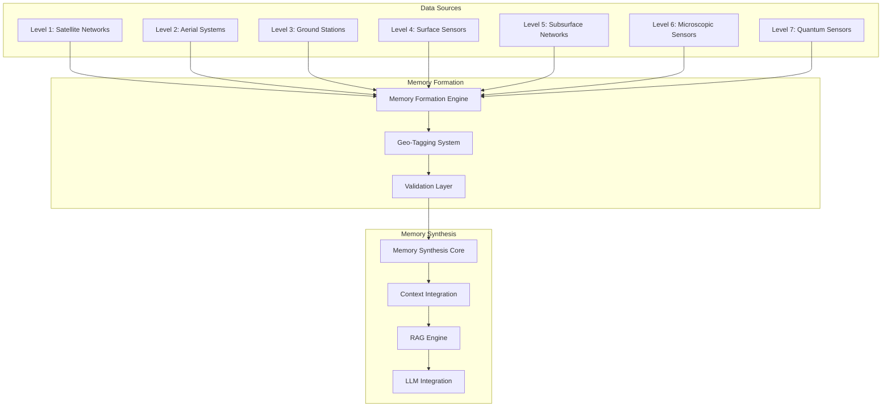
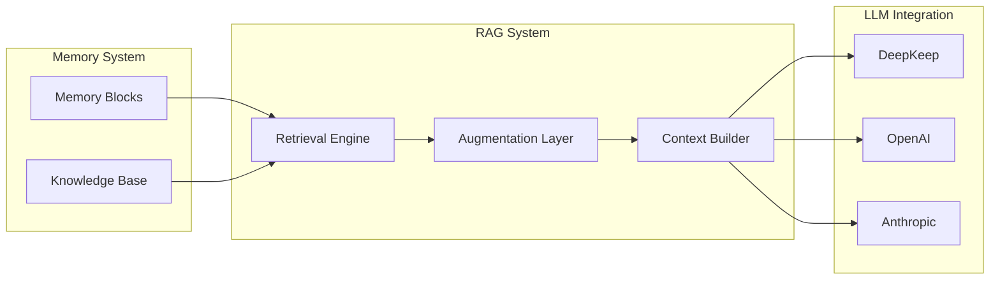
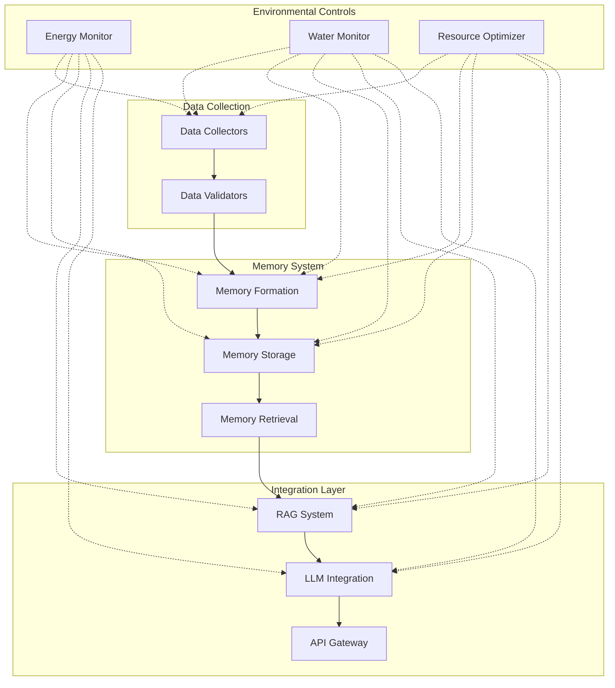
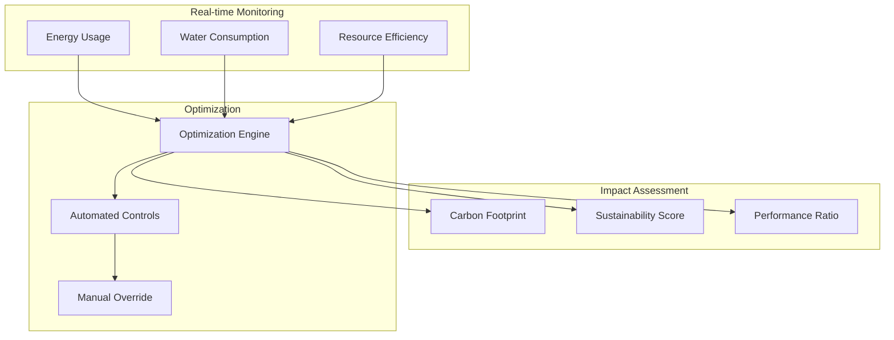

# Core Concepts: Earth Memory System Overview

## Introduction

The Vortx Synthetic Satellite is an advanced Earth Memory System designed for AGI and geospatial intelligence, integrating multi-level data sources with environmental consciousness. The system creates a comprehensive world context through hierarchical memory synthesis while maintaining strict environmental guardrails.

## Memory Synthesis Architecture

### Multi-Level Data Integration

The system integrates data from seven distinct observational levels:



#### Level Details
1. **Satellite Networks**
   - Earth observation satellites
   - Weather monitoring systems
   - Communication networks

2. **Aerial Systems**
   - Drones and UAVs
   - Aircraft sensors
   - Atmospheric probes

3. **Ground Stations**
   - Fixed monitoring stations
   - Mobile sensor networks
   - Urban monitoring systems

4. **Surface Sensors**
   - IoT device networks
   - Environmental sensors
   - Infrastructure monitoring

5. **Subsurface Networks**
   - Underground sensor arrays
   - Geological monitoring
   - Aquifer systems

6. **Microscopic Sensors**
   - Soil composition analysis
   - Microbial monitoring
   - Chemical detection

7. **Quantum Sensors**
   - Quantum state detection
   - Atomic-level monitoring
   - Quantum field sensors

## Memory Formation Process

```python
class MemoryFormation:
    def __init__(self):
        self.data_collectors = {
            'satellite': SatelliteCollector(),
            'aerial': AerialCollector(),
            'ground': GroundCollector(),
            'surface': SurfaceCollector(),
            'subsurface': SubsurfaceCollector(),
            'microscopic': MicroCollector(),
            'quantum': QuantumCollector()
        }
        self.geo_tagger = GeoTaggingSystem()
        self.validator = DataValidator()
        
    def collect_multi_level_data(self):
        """Collect data from all levels simultaneously"""
        data_streams = {}
        for level, collector in self.data_collectors.items():
            data_streams[level] = collector.gather_data()
        return data_streams
    
    def form_memory(self, data_streams):
        """Form memory from multi-level data"""
        geo_tagged_data = self.geo_tagger.tag_data(data_streams)
        validated_data = self.validator.validate(geo_tagged_data)
        return MemoryBlock(validated_data)
```

## Context Integration System

### RAG and LLM Integration



## Environmental Guardrails

The system implements strict environmental controls through a comprehensive monitoring and optimization system:

```python
class EnvironmentalGuardrails:
    def __init__(self):
        self.energy_monitor = EnergyMonitor()
        self.water_monitor = WaterMonitor()
        self.resource_optimizer = ResourceOptimizer()
        
    def check_deployment_impact(self, deployment_config):
        """Check environmental impact before deployment"""
        impact_metrics = {
            'energy_usage': self.energy_monitor.predict_usage(deployment_config),
            'water_consumption': self.water_monitor.predict_usage(deployment_config),
            'resource_efficiency': self.resource_optimizer.calculate_efficiency(deployment_config)
        }
        
        return self.validate_metrics(impact_metrics)
    
    def validate_metrics(self, metrics):
        """Validate metrics against environmental thresholds"""
        thresholds = {
            'energy_usage': MAX_ENERGY_USAGE,
            'water_consumption': MAX_WATER_USAGE,
            'resource_efficiency': MIN_RESOURCE_EFFICIENCY
        }
        
        return all(
            metrics[key] <= thresholds[key] 
            for key in metrics
        )
```

## Deployment Architecture



## Key Features

### 1. Multi-Level Data Integration
- Seamless integration of data from quantum to satellite levels
- Real-time data synchronization
- Automated data validation and cleaning
- Spatial-temporal alignment

### 2. Memory Formation
- Advanced geo-tagging system
- Multi-modal data fusion
- Quality assurance and validation
- Hierarchical memory organization

### 3. Context Integration
- RAG-based knowledge enhancement
- LLM integration for context understanding
- Real-time context updates
- Cross-reference validation

### 4. Environmental Consciousness
- Energy usage optimization
- Water consumption monitoring
- Resource utilization tracking
- Environmental impact assessment

## Best Practices

1. **Data Collection**
   - Regular sensor calibration
   - Data quality monitoring
   - Redundancy management
   - Error handling protocols

2. **Memory Management**
   - Regular optimization
   - Efficient storage utilization
   - Performance monitoring
   - Resource allocation

3. **Environmental Compliance**
   - Regular impact assessments
   - Resource usage optimization
   - Environmental metric tracking
   - Sustainability reporting

## Next Steps

- [Detailed Memory System Architecture](memory-system/architecture.md)
- [Environmental Impact Guidelines](../technical/advanced/environmental.md)
- [Integration Patterns](../technical/advanced/integration.md)
- [API Reference](../technical/api/python.md)

## Environmental Metrics Dashboard

