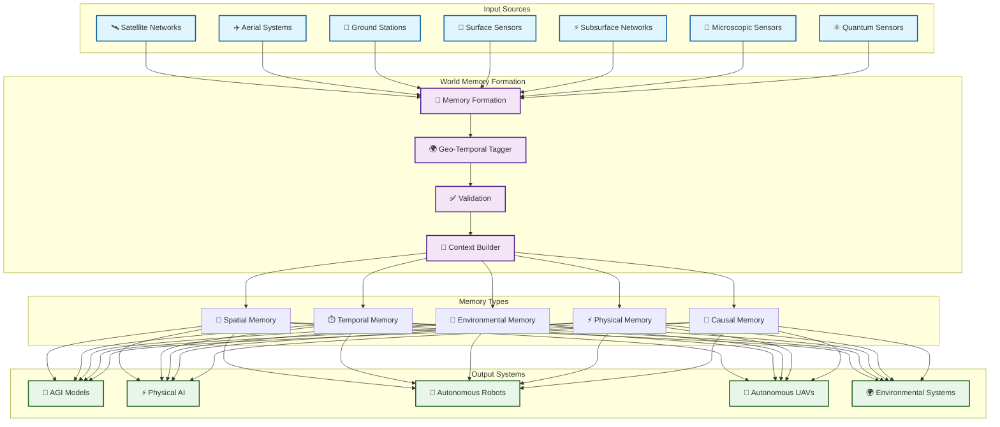
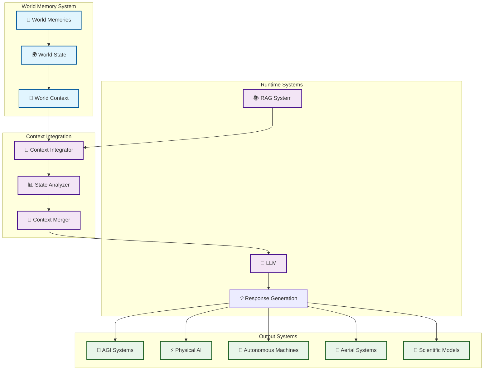
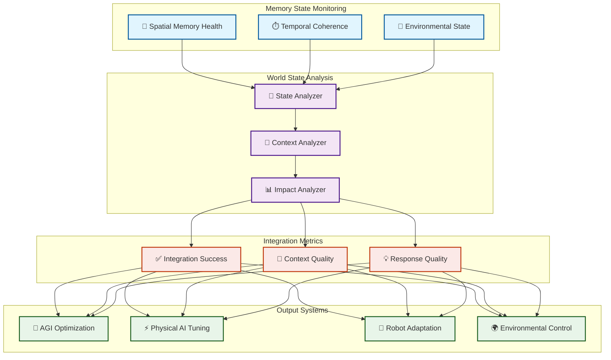
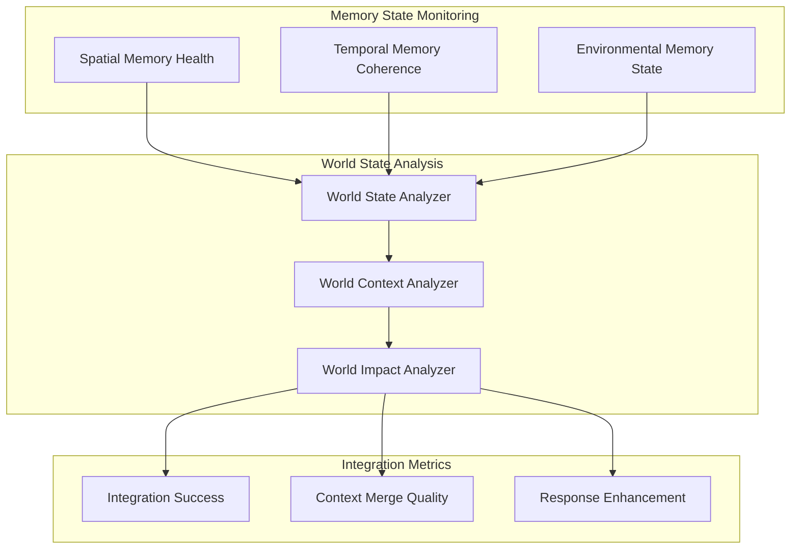
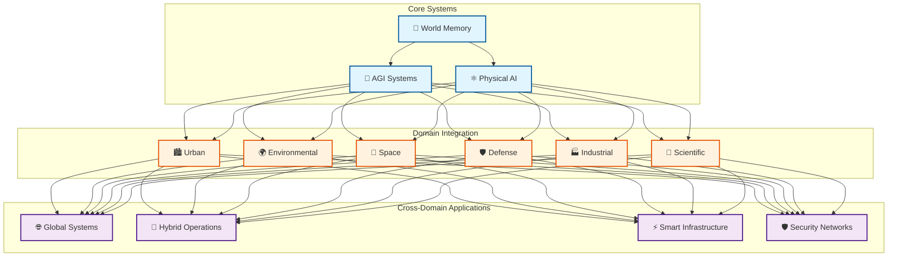

# Core Concepts: Earth Memory System Overview

## Introduction

The Vortx Synthetic Satellite is an advanced Earth Memory System designed for AGI and geospatial intelligence. At its core, it creates and maintains "World Memories" - a comprehensive, multi-layered understanding of Earth's state across different scales and dimensions. These memories work alongside traditional RAG systems as runtime context providers, enabling richer and more accurate AI interactions.

## World Memory Architecture

### Multi-Level World State Integration

The system creates a living memory of Earth's state across seven observational levels, each contributing to a holistic understanding:



#### World Memory Types
1. **Spatial Memories**
   - Geographical relationships
   - Spatial patterns and anomalies
   - Topological features
   - Infrastructure layouts

2. **Temporal Memories**
   - Historical patterns
   - Seasonal variations
   - Event sequences
   - Change detection

3. **Environmental Memories**
   - Ecosystem states
   - Climate patterns
   - Resource distributions
   - Environmental changes

4. **Physical State Memories**
   - Material properties
   - Physical conditions
   - Energy states
   - Matter distributions

5. **Causal Memories**
   - Event correlations
   - Cause-effect chains
   - System interactions
   - Impact propagation

## Memory Formation Process

```python
class WorldMemorySystem:
    def __init__(self):
        self.observers = self._initialize_observers()
        self.memory_types = {
            'spatial': SpatialMemoryManager(),
            'temporal': TemporalMemoryManager(),
            'environmental': EnvironmentalMemoryManager(),
            'physical': PhysicalStateManager(),
            'causal': CausalMemoryManager()
        }
        self.context_builder = ContextBuilder()
        
    def _initialize_observers(self):
        return {
            'satellite': SatelliteObserver(),
            'aerial': AerialObserver(),
            'ground': GroundObserver(),
            'surface': SurfaceObserver(),
            'subsurface': SubsurfaceObserver(),
            'microscopic': MicroObserver(),
            'quantum': QuantumObserver()
        }
        
    def create_world_memory(self):
        """Create comprehensive world state memory"""
        observations = self._gather_observations()
        world_state = self._process_world_state(observations)
        return self._form_memories(world_state)
        
    def _gather_observations(self):
        return {level: obs.observe() 
                for level, obs in self.observers.items()}
        
    def _process_world_state(self, observations):
        return WorldStateProcessor(observations).process()
        
    def _form_memories(self, world_state):
        memories = {}
        for memory_type, manager in self.memory_types.items():
            memories[memory_type] = manager.create_memory(world_state)
        return WorldMemory(memories)
```

## Runtime Integration Architecture



## Memory-Aware Response Generation

```python
class ContextualResponseGenerator:
    def __init__(self):
        self.world_memory = WorldMemorySystem()
        self.rag_system = RAGSystem()
        self.context_integrator = ContextIntegrator()
        
    async def generate_response(self, query):
        # Get world context
        world_context = await self.world_memory.get_relevant_context(query)
        
        # Get RAG context independently
        rag_context = await self.rag_system.get_context(query)
        
        # Merge contexts
        merged_context = self.context_integrator.merge(
            world_context=world_context,
            rag_context=rag_context,
            query=query
        )
        
        # Generate enhanced response
        return await self.llm.generate(
            query=query,
            context=merged_context
        )
```

## Environmental Integration

The system maintains environmental consciousness through world state monitoring:

```python
class WorldStateEnvironmentalMonitor:
    def __init__(self):
        self.world_memory = WorldMemorySystem()
        self.impact_analyzer = EnvironmentalImpactAnalyzer()
        
    async def monitor_environmental_state(self):
        world_state = await self.world_memory.get_current_state()
        
        impact_metrics = {
            'ecosystem_health': self.analyze_ecosystem_health(world_state),
            'resource_consumption': self.analyze_resource_usage(world_state),
            'environmental_change': self.analyze_environmental_changes(world_state)
        }
        
        return self.impact_analyzer.analyze(impact_metrics)
        
    def analyze_ecosystem_health(self, state):
        return self.impact_analyzer.analyze_ecosystem(
            biodiversity=state.get_biodiversity_metrics(),
            habitat_quality=state.get_habitat_metrics(),
            species_distribution=state.get_species_metrics()
        )
```

## World Memory Dashboard



## System Outputs

### AGI Integration
- 🤖 Advanced reasoning models
- 🧠 Cognitive enhancement systems
- 📊 Pattern recognition engines
- 🔄 Adaptive learning systems

### Physical AI Applications
- ⚡ Quantum computing interfaces
- 🔬 Molecular computing systems
- 🧪 Chemical processing units
- 🌡️ Thermal optimization systems

### Autonomous Systems
- 🦾 Robotic control systems
- 🚁 Aerial vehicle management
- 🚗 Ground vehicle navigation
- 🏭 Industrial automation

### Environmental Systems
- 🌍 Ecosystem management
- 🌱 Resource optimization
- 💧 Water system control
- ⚡ Energy distribution

### Scientific Applications
- 🔬 Research automation
- 📊 Data analysis systems
- 🧬 Genomic processing
- 🔋 Energy research

## World Memory Dashboard



## Advanced Output Systems & Applications

```mermaid
graph TD
    classDef inputNode fill:#e1f5fe,stroke:#01579b,stroke-width:2px;
    classDef processingNode fill:#f3e5f5,stroke:#4a148c,stroke-width:2px;
    classDef outputNode fill:#e8f5e9,stroke:#1b5e20,stroke-width:2px;
    classDef aiNode fill:#fff3e0,stroke:#e65100,stroke-width:2px;
    classDef domainNode fill:#ffecb3,stroke:#ff6f00,stroke-width:2px;

    subgraph "World Memory Core"
        WM["🧠 World Memory System"]
    end

    subgraph "AGI Systems"
        AGI1["🤖 Reasoning Engine"]
        AGI2["🧮 Knowledge Synthesis"]
        AGI3["🔮 Predictive Models"]
        AGI4["🎯 Decision Systems"]
    end

    subgraph "Physical AI"
        PAI1["⚛️ Quantum Processors"]
        PAI2["🧬 Molecular Computers"]
        PAI3["🔋 Energy Systems"]
        PAI4["🌡️ Thermal Controls"]
    end

    subgraph "Autonomous Systems"
        AS1["🚁 Aerial Vehicles"]
        AS2["🤖 Ground Robots"]
        AS3["🌊 Marine Systems"]
        AS4["🏭 Industrial Automation"]
    end

    subgraph "Environmental"
        ENV1["🌍 Climate Systems"]
        ENV2["🌱 Ecosystem Management"]
        ENV3["💧 Water Resources"]
        ENV4["🌪️ Weather Control"]
    end

    subgraph "Scientific Research"
        SCI1["🧬 Genomics"]
        SCI2["🔬 Materials Science"]
        SCI3["⚡ Energy Research"]
        SCI4["🧪 Chemical Systems"]
    end

    subgraph "Urban Systems"
        URB1["🏙️ Smart Cities"]
        URB2["🚦 Traffic Control"]
        URB3["⚡ Grid Management"]
        URB4["🏥 Healthcare Systems"]
    end

    subgraph "Space Systems"
        SPC1["🛸 Space Vehicles"]
        SPC2["🛰️ Orbital Systems"]
        SPC3["🌠 Deep Space"]
        SPC4["🌍 Earth Observation"]
    end

    subgraph "Defense Systems"
        DEF1["🛡️ Defense Networks"]
        DEF2["🎯 Tactical Systems"]
        DEF3["🔐 Security Systems"]
        DEF4["📡 Communication"]
    end

    WM --> AGI1 & AGI2 & AGI3 & AGI4
    WM --> PAI1 & PAI2 & PAI3 & PAI4
    WM --> AS1 & AS2 & AS3 & AS4
    WM --> ENV1 & ENV2 & ENV3 & ENV4
    WM --> SCI1 & SCI2 & SCI3 & SCI4
    WM --> URB1 & URB2 & URB3 & URB4
    WM --> SPC1 & SPC2 & SPC3 & SPC4
    WM --> DEF1 & DEF2 & DEF3 & DEF4

    class WM processingNode;
    class AGI1,AGI2,AGI3,AGI4 aiNode;
    class PAI1,PAI2,PAI3,PAI4 outputNode;
    class AS1,AS2,AS3,AS4 outputNode;
    class ENV1,ENV2,ENV3,ENV4 outputNode;
    class SCI1,SCI2,SCI3,SCI4 outputNode;
    class URB1,URB2,URB3,URB4 domainNode;
    class SPC1,SPC2,SPC3,SPC4 domainNode;
    class DEF1,DEF2,DEF3,DEF4 domainNode;
```



### AGI Systems
- 🤖 **Reasoning Engine**
  * Causal inference
  * Logical deduction
  * Pattern recognition
  * Anomaly detection

- 🧮 **Knowledge Synthesis**
  * Cross-domain learning
  * Information fusion
  * Knowledge graphs
  * Semantic networks

- 🔮 **Predictive Models**
  * Future state prediction
  * Trend analysis
  * Risk assessment
  * Opportunity identification

- 🎯 **Decision Systems**
  * Strategic planning
  * Resource allocation
  * Optimization
  * Risk management

### Physical AI Integration
- ⚛️ **Quantum Systems**
  * Quantum computing
  * Quantum sensing
  * Quantum communication
  * Quantum cryptography

- 🧬 **Molecular Computing**
  * DNA computing
  * Molecular storage
  * Chemical processing
  * Bio-computation

- 🔋 **Energy Systems**
  * Smart grids
  * Energy optimization
  * Power distribution
  * Renewable integration

- 🌡️ **Thermal Systems**
  * Heat management
  * Cooling optimization
  * Thermal computing
  * Temperature control

### Autonomous Systems
- 🚁 **Aerial Systems**
  * Drone swarms
  * UAV coordination
  * Aerial mapping
  * Search and rescue

- 🤖 **Ground Systems**
  * Mobile robots
  * Industrial automation
  * Service robots
  * Exploration systems

- 🌊 **Marine Systems**
  * Underwater vehicles
  * Ocean monitoring
  * Marine research
  * Port automation

- 🏭 **Industrial Systems**
  * Smart factories
  * Process automation
  * Quality control
  * Supply chain

### Environmental Applications
- 🌍 **Climate Systems**
  * Climate modeling
  * Carbon tracking
  * Emission control
  * Weather prediction

- 🌱 **Ecosystem Management**
  * Biodiversity monitoring
  * Habitat protection
  * Species tracking
  * Conservation planning

- 💧 **Water Resources**
  * Water quality
  * Distribution systems
  * Treatment plants
  * Usage optimization

- 🌪️ **Weather Systems**
  * Storm prediction
  * Disaster response
  * Climate adaptation
  * Weather modification

### Urban Applications
- 🏙️ **Smart Cities**
  * Urban planning
  * Infrastructure management
  * Service optimization
  * Public safety

- 🚦 **Traffic Systems**
  * Traffic flow optimization
  * Public transport
  * Emergency response
  * Parking management

- ⚡ **Grid Management**
  * Power distribution
  * Load balancing
  * Renewable integration
  * Demand response

- 🏥 **Healthcare Systems**
  * Hospital management
  * Emergency services
  * Patient care
  * Resource allocation

### Space Applications
- 🛸 **Space Vehicles**
  * Spacecraft control
  * Mission planning
  * Navigation systems
  * Landing systems

- 🛰️ **Orbital Systems**
  * Satellite networks
  * Space debris tracking
  * Earth observation
  * Communication systems

- 🌠 **Deep Space**
  * Exploration systems
  * Research platforms
  * Data collection
  * Analysis systems

- 🌍 **Earth Observation**
  * Climate monitoring
  * Resource tracking
  * Disaster detection
  * Change analysis

### Defense Applications
- 🛡️ **Defense Networks**
  * Threat detection
  * Response coordination
  * Resource management
  * Strategic planning

- 🎯 **Tactical Systems**
  * Mission planning
  * Real-time analysis
  * Decision support
  * Resource allocation

- 🔐 **Security Systems**
  * Cyber security
  * Physical security
  * Access control
  * Threat prevention

- 📡 **Communication**
  * Secure networks
  * Data transmission
  * Command control
  * Information sharing

## Cross-Domain Integration

