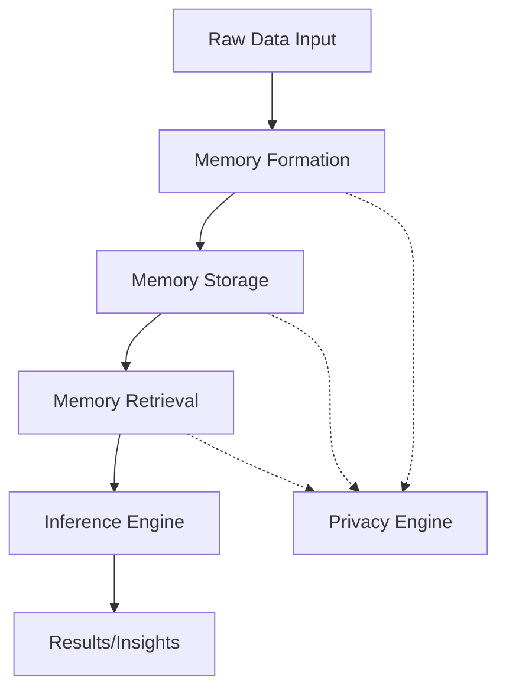

# Core Concepts

## Overview

Vortx Synthetic Satellite is an advanced Earth Memory System designed for AGI and geospatial intelligence. This section covers the core concepts and components of the system.

## Key Components

### 1. Memory System
The memory system is responsible for:
- Multi-modal memory formation
- Memory encoding and storage
- Memory retrieval and synthesis
- Memory optimization and compression

[Learn more about the Memory System](memory-system/architecture.md)

### 2. Inference Engine
The inference engine provides:
- Multi-model inference capabilities
- Pattern recognition and analysis
- Contextual understanding
- Real-time processing

[Learn more about the Inference System](inference/overview.md)

### 3. Privacy Engine
The privacy engine ensures:
- Data privacy preservation
- Secure memory storage
- Access control
- Compliance with regulations

[Learn more about Privacy](../technical/advanced/privacy.md)

## Architecture Overview

## Key Features

### Memory Formation
- Multi-modal data integration
- Temporal-spatial context
- Feature extraction and encoding
- Quality assurance

### Inference Capabilities
- Pattern recognition
- Relationship discovery
- Contextual analysis
- Predictive insights

### Privacy Features
- Data encryption
- Access control
- Audit logging
- Compliance tools

## Best Practices

1. **Memory Management**
   - Regular optimization
   - Proper cleanup
   - Performance monitoring
   - Resource management

2. **Inference Usage**
   - Batch processing
   - Cache utilization
   - Resource allocation
   - Error handling

3. **Privacy Compliance**
   - Data minimization
   - Access controls
   - Audit trails
   - Regular reviews

## Next Steps

- [Memory System Architecture](memory-system/architecture.md)
- [Inference System Overview](inference/overview.md)
- [Privacy & Security](../technical/advanced/privacy.md)
- [API Reference](../technical/api/python.md) 