# Core System Architecture

## Overview

The Vortx Earth Memory System represents a revolutionary approach to world-scale intelligence, combining multi-level observations with advanced memory synthesis for comprehensive Earth understanding.

## System Architecture

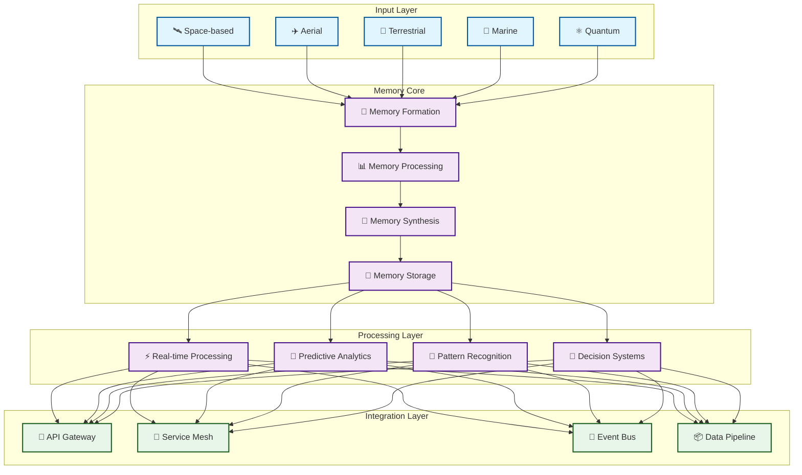

## Industry Applications

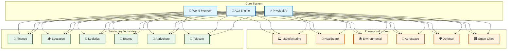

## Industry-Specific Implementations

### Manufacturing & Industry 4.0
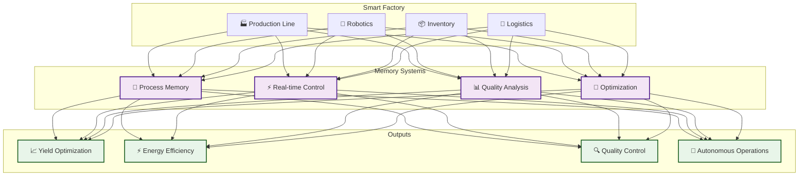

### Healthcare & Life Sciences
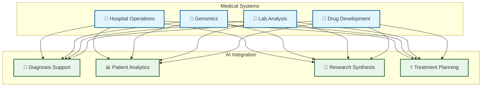

## AGI Runtime Applications

### Societal Intelligence
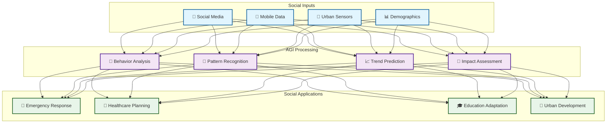

### Environmental Intelligence
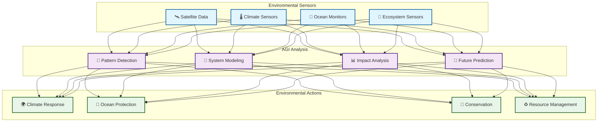

### Space Operations
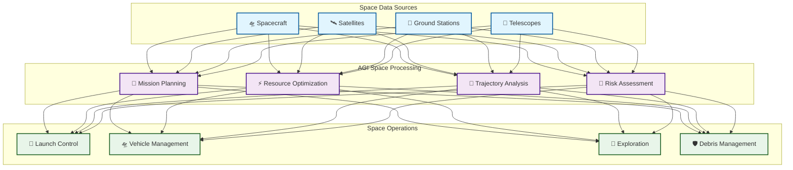

### Defense & Security
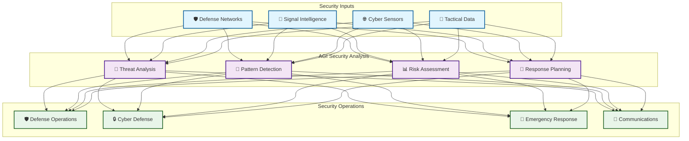

### Social Security & Welfare
```python
class SocialWelfareSystem:
    def __init__(self):
        self.population_analyzer = PopulationAnalyzer()
        self.welfare_optimizer = WelfareOptimizer()
        self.resource_allocator = ResourceAllocator()
        self.impact_assessor = ImpactAssessor()
        
    async def analyze_social_needs(self, data: SocialData):
        # Population analysis
        population_insights = await self.population_analyzer.analyze(
            demographics=data.demographics,
            economic_indicators=data.economic_data,
            social_metrics=data.social_metrics
        )
        
        # Welfare optimization
        welfare_plan = await self.welfare_optimizer.optimize(
            resources=data.available_resources,
            needs=population_insights.needs,
            constraints=data.resource_constraints
        )
        
        # Resource allocation
        allocation_strategy = await self.resource_allocator.allocate(
            plan=welfare_plan,
            distribution_network=data.distribution_network,
            priority_matrix=data.priorities
        )
        
        # Impact assessment
        impact_prediction = await self.impact_assessor.assess(
            strategy=allocation_strategy,
            historical_data=data.historical_impacts,
            social_indicators=data.social_indicators
        )
        
        return WelfarePlan(
            insights=population_insights,
            strategy=allocation_strategy,
            impact=impact_prediction
        )
```

### Public Health Intelligence
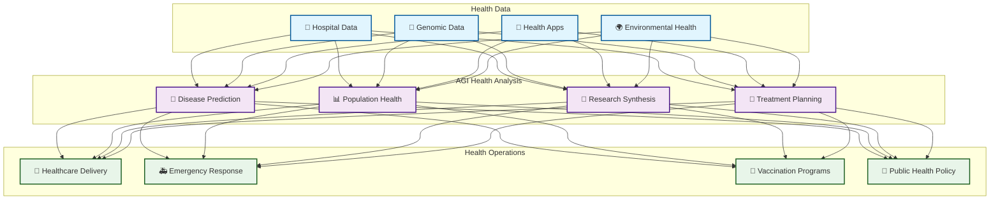

### Disaster Response & Management
```python
class DisasterResponseSystem:
    def __init__(self):
        self.risk_analyzer = RiskAnalyzer()
        self.response_planner = ResponsePlanner()
        self.resource_coordinator = ResourceCoordinator()
        
    async def manage_disaster_response(self, event: DisasterEvent):
        # Risk analysis
        risk_assessment = await self.risk_analyzer.analyze(
            event_type=event.type,
            magnitude=event.magnitude,
            location=event.location,
            population_data=event.population_impact
        )
        
        # Response planning
        response_plan = await self.response_planner.create_plan(
            risk_assessment=risk_assessment,
            available_resources=event.available_resources,
            infrastructure_status=event.infrastructure
        )
        
        # Resource coordination
        coordination_strategy = await self.resource_coordinator.coordinate(
            response_plan=response_plan,
            emergency_services=event.emergency_services,
            supply_chain=event.supply_chain,
            communication_networks=event.communication
        )
        
        return DisasterResponse(
            assessment=risk_assessment,
            plan=response_plan,
            coordination=coordination_strategy
        )
```

## Technical Implementation Details

### Memory Formation Process
```python
class AdvancedMemoryFormation:
    def __init__(self):
        self.spatial_encoder = SpatialEncoder(dimensions=4)  # 3D + time
        self.temporal_processor = TemporalProcessor(window_size=1000)
        self.causal_analyzer = CausalAnalyzer(confidence_threshold=0.95)
        
    async def form_memory(self, input_data: Dict[str, Any]) -> Memory:
        # Spatial encoding
        spatial_features = await self.spatial_encoder.encode(
            coordinates=input_data['coordinates'],
            resolution=input_data['resolution'],
            context=input_data['spatial_context']
        )
        
        # Temporal processing
        temporal_features = await self.temporal_processor.process(
            timestamp=input_data['timestamp'],
            sequence=input_data['event_sequence'],
            frequency=input_data['sampling_rate']
        )
        
        # Causal analysis
        causal_graph = await self.causal_analyzer.analyze(
            events=input_data['events'],
            conditions=input_data['conditions'],
            outcomes=input_data['outcomes']
        )
        
        return Memory(
            spatial=spatial_features,
            temporal=temporal_features,
            causal=causal_graph,
            metadata=self._generate_metadata(input_data)
        )
```

### Advanced Integration Patterns

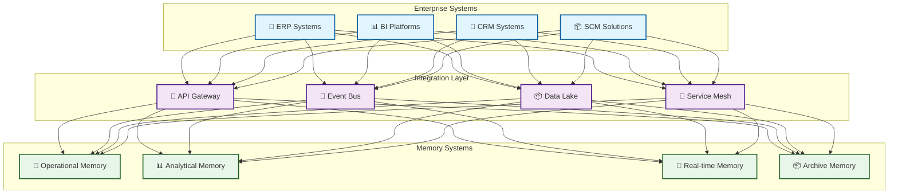

## Domain-Specific Implementations

### Environmental Monitoring
```python
class EnvironmentalMemorySystem:
    def __init__(self):
        self.climate_analyzer = ClimateAnalyzer()
        self.ecosystem_monitor = EcosystemMonitor()
        self.resource_tracker = ResourceTracker()
        
    async def process_environmental_data(self, data: EnvironmentalData):
        # Climate analysis
        climate_memory = await self.climate_analyzer.analyze(
            temperature=data.temperature,
            humidity=data.humidity,
            pressure=data.pressure,
            wind=data.wind_data
        )
        
        # Ecosystem monitoring
        ecosystem_memory = await self.ecosystem_monitor.track(
            biodiversity=data.species_data,
            habitat_health=data.habitat_metrics,
            population_dynamics=data.population_data
        )
        
        # Resource tracking
        resource_memory = await self.resource_tracker.monitor(
            water_quality=data.water_metrics,
            air_quality=data.air_metrics,
            soil_health=data.soil_data
        )
        
        return EnvironmentalMemory(
            climate=climate_memory,
            ecosystem=ecosystem_memory,
            resources=resource_memory
        )
```

## Advanced Usage Scenarios

### Real-time Decision Making
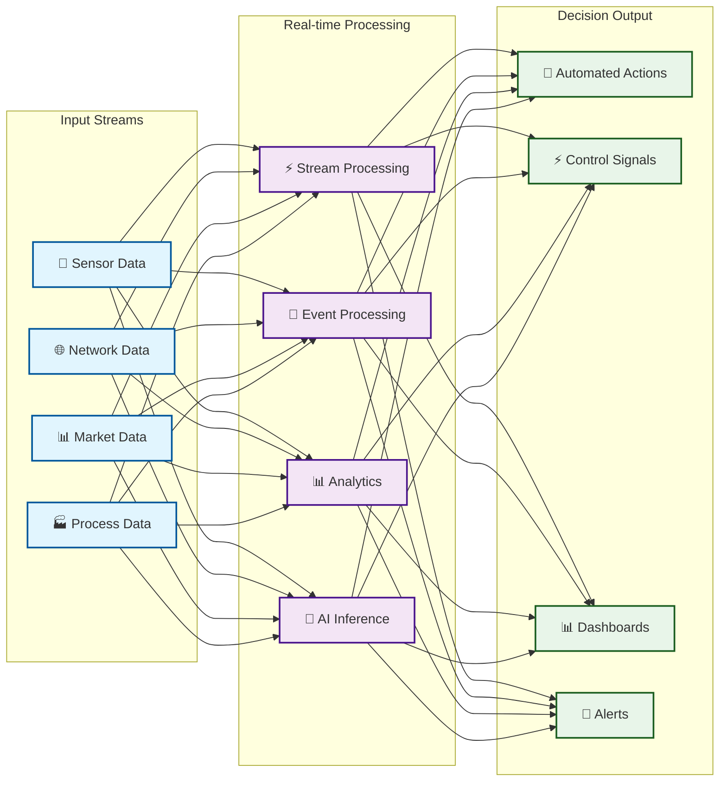

## Performance Optimization Strategies

### Memory Optimization Techniques
```python
class MemoryOptimizer:
    def __init__(self):
        self.compression_engine = CompressionEngine()
        self.index_manager = IndexManager()
        self.cache_controller = CacheController()
        
    async def optimize_memory(self, memory_block: MemoryBlock):
        # Compression optimization
        compressed_data = await self.compression_engine.compress(
            data=memory_block.data,
            algorithm='adaptive_lz4',
            quality_threshold=0.95
        )
        
        # Index optimization
        optimized_indices = await self.index_manager.optimize(
            indices=memory_block.indices,
            access_patterns=memory_block.access_stats,
            query_patterns=memory_block.query_stats
        )
        
        # Cache optimization
        cache_strategy = await self.cache_controller.optimize(
            access_frequency=memory_block.access_frequency,
            data_importance=memory_block.importance_score,
            resource_constraints=self.get_resource_constraints()
        )
        
        return OptimizedMemory(
            compressed_data=compressed_data,
            optimized_indices=optimized_indices,
            cache_strategy=cache_strategy
        )
```

## Usage Patterns

### Real-time Processing
- 🚀 Stream processing
- ⚡ Event handling
- 🔄 Continuous updates
- 📊 Live analytics

### Batch Processing
- 📦 Data aggregation
- 🔍 Deep analysis
- 🧮 Complex computations
- 📈 Trend analysis

### Hybrid Processing
- 🔄 Lambda architecture
- 🌊 Kappa architecture
- 🎯 CQRS patterns
- 🔗 Event sourcing

## Implementation Guidelines

### Memory Management
- 🧠 Dynamic allocation
- 📊 Resource optimization
- 🔄 Cache strategies
- ⚡ Performance tuning

### Integration Patterns
- 🔌 API-first design
- 🔗 Event-driven architecture
- 📦 Microservices
- 🔄 Service mesh

### Security & Privacy
- 🔒 End-to-end encryption
- 🛡️ Access control
- 📝 Audit logging
- 🔐 Data protection

## Quick Links

### Documentation
- [System Architecture](concepts/architecture.md)
- [Memory Formation](concepts/memory-formation.md)
- [Integration Guide](guides/integration.md)
- [API Reference](api/reference.md)

### Implementation
- [Getting Started](guides/getting-started.md)
- [Best Practices](guides/best-practices.md)
- [Examples](examples/README.md)
- [Tutorials](tutorials/README.md)

### Development
- [Contributing](meta/contributing.md)
- [Code Style](meta/code-style.md)
- [Testing Guide](meta/testing.md)
- [Release Process](meta/releases.md)

## Best Practices

### Development
1. 📝 Documentation
   - Comprehensive API docs
   - Integration guides
   - Usage examples
   - Performance tips

2. 🧪 Testing
   - Unit testing
   - Integration testing
   - Performance testing
   - Security testing

3. 🔄 CI/CD
   - Automated builds
   - Continuous testing
   - Deployment automation
   - Monitoring

### Operations
1. 📊 Monitoring
   - System health
   - Performance metrics
   - Resource usage
   - Error tracking

2. ⚡ Performance
   - Cache optimization
   - Query optimization
   - Resource management
   - Load balancing

3. 🔒 Security
   - Access control
   - Data encryption
   - Audit logging
   - Compliance checks 