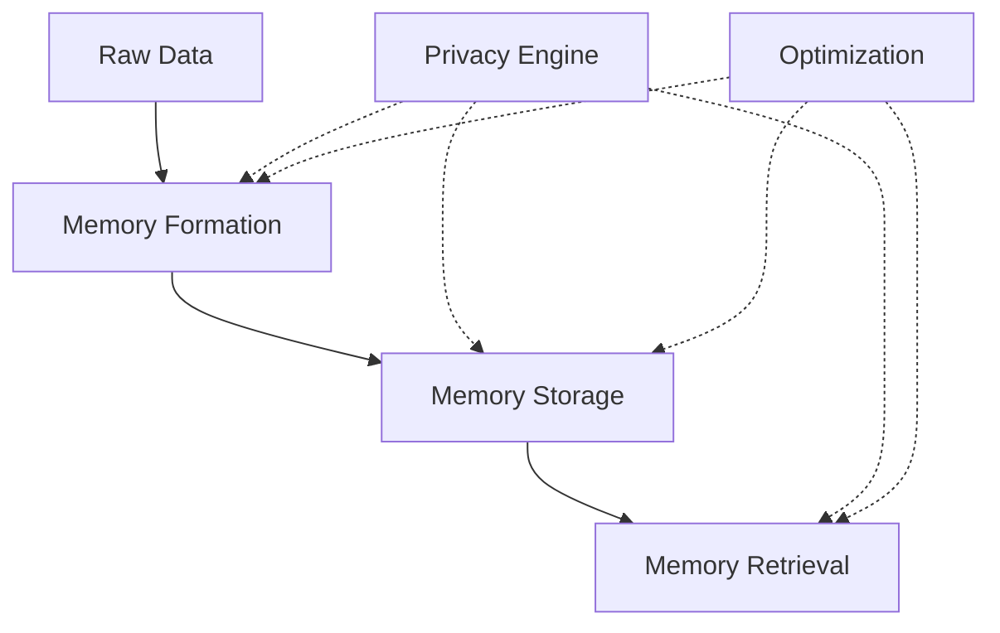
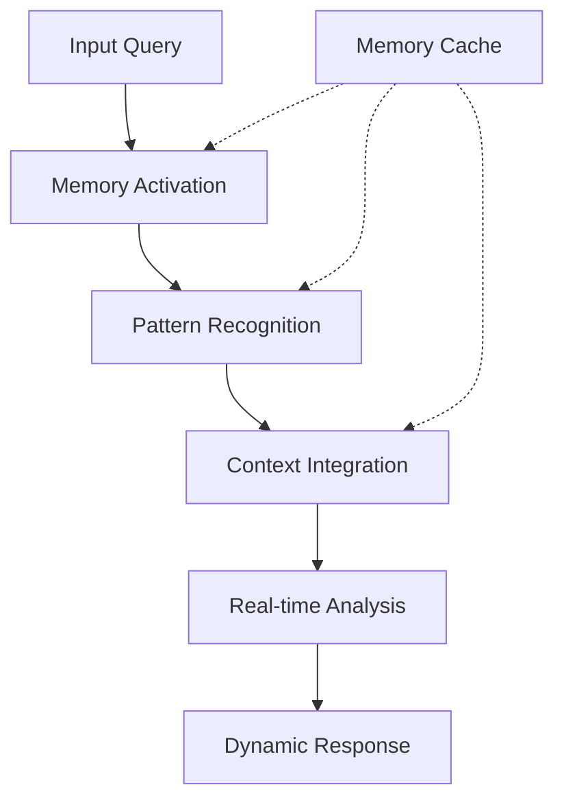
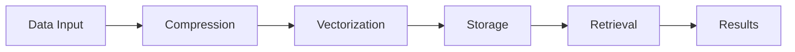

# Core Documentation

This directory contains documentation for the core concepts and components of the Vortx Earth Memory System.

## Contents

### [Concepts](concepts/overview.md)
- System architecture
- Memory formation
- Runtime inference
- Privacy and security

### [AGI Memory Systems](agi-memory/overview.md)
- Memory architecture
- Superhuman capabilities
- Performance metrics
- Integration workflows

### [Privacy](privacy/overview.md)
- Privacy preservation
- Security features
- Compliance
- Best practices

## Memory Architecture

## AGI Components

## Performance Optimization

## Quick Links

- [Getting Started](../getting-started/index.md)
- [API Reference](../api/rest/overview.md)
- [Examples](../guides/examples/)
- [Contributing](../meta/contributing.md)

## Best Practices

1. Memory Management
   - Regular optimization
   - Cache cleanup
   - Resource monitoring
   - Performance tuning

2. Privacy Compliance
   - Data minimization
   - Access controls
   - Audit logging
   - Regular reviews

3. Integration
   - API usage
   - Error handling
   - Resource management
   - Monitoring 