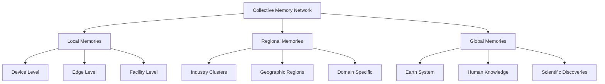
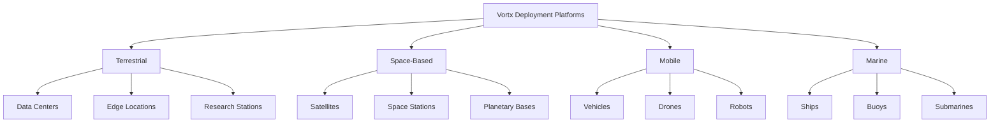

# Vortx Earth Memory System Deployment Guide

## Overview

This guide covers deploying Vortx Earth Memory System with advanced AGI runtime capabilities and industry-specific optimizations. We'll cover:
- Local development setup with AGI runtime support
- Containerized deployment with memory synthesis
- Cloud deployment with industry-specific configurations
- Performance optimization for memory systems
- Advanced monitoring and maintenance

## Prerequisites

- Python 3.9+
- CUDA 11.8+ (for GPU support)
- 32GB+ RAM (64GB+ recommended for AGI workloads)
- 16GB+ GPU memory (recommended)
- 500GB+ storage (1TB+ for full memory synthesis)
- Redis 6.2+ for memory caching
- Kubernetes 1.24+ for orchestration

## Collective Memory Architecture and AGI Enhancement

### Memory Sharing Framework



### Memory Synthesis and AGI Enhancement

```python
MEMORY_SYNTHESIS_CONFIG = {
    'collective_learning': {
        'memory_types': {
            'experiential': {
                'source': 'device_operations',
                'integration_level': 'high',
                'sharing_frequency': 'real-time'
            },
            'environmental': {
                'source': 'sensor_networks',
                'integration_level': 'continuous',
                'sharing_frequency': 'hourly'
            },
            'analytical': {
                'source': 'processing_results',
                'integration_level': 'deep',
                'sharing_frequency': 'daily'
            }
        },
        'synthesis_methods': {
            'pattern_recognition': {
                'local_patterns': True,
                'global_patterns': True,
                'emergent_behaviors': True
            },
            'knowledge_integration': {
                'cross_domain': True,
                'temporal_fusion': True,
                'spatial_correlation': True
            }
        }
    },
    'privacy_controls': {
        'data_anonymization': True,
        'access_controls': 'role_based',
        'sharing_policies': {
            'public': ['aggregated_insights'],
            'private': ['raw_data', 'proprietary_patterns'],
            'collaborative': ['derived_knowledge']
        }
    }
}

### Industry-Specific AGI Capabilities and Advancement Levels

```python
INDUSTRY_AGI_CAPABILITIES = {
    'manufacturing': {
        'current_capabilities': {
            'process_optimization': {
                'level': 'Advanced',
                'features': [
                    'predictive_maintenance',
                    'quality_control',
                    'resource_optimization'
                ],
                'memory_integration': 'high'
            },
            'automation': {
                'level': 'Intermediate',
                'features': [
                    'robotic_control',
                    'workflow_optimization',
                    'inventory_management'
                ],
                'memory_integration': 'medium'
            }
        },
        'realistic_advancement': {
            'timeline': '2-3 years',
            'expected_capabilities': [
                'autonomous_decision_making',
                'cross_facility_optimization',
                'advanced_quality_prediction'
            ]
        }
    },
    'healthcare': {
        'current_capabilities': {
            'diagnostics': {
                'level': 'Intermediate',
                'features': [
                    'image_analysis',
                    'pattern_recognition',
                    'risk_assessment'
                ],
                'memory_integration': 'medium'
            },
            'patient_care': {
                'level': 'Basic',
                'features': [
                    'monitoring',
                    'medication_management',
                    'care_planning'
                ],
                'memory_integration': 'low'
            }
        },
        'realistic_advancement': {
            'timeline': '3-5 years',
            'expected_capabilities': [
                'personalized_treatment_optimization',
                'early_disease_detection',
                'drug_development_assistance'
            ]
        }
    },
    'environmental_monitoring': {
        'current_capabilities': {
            'data_analysis': {
                'level': 'Advanced',
                'features': [
                    'pattern_detection',
                    'anomaly_identification',
                    'trend_analysis'
                ],
                'memory_integration': 'very_high'
            },
            'prediction': {
                'level': 'Intermediate',
                'features': [
                    'weather_forecasting',
                    'climate_modeling',
                    'ecosystem_analysis'
                ],
                'memory_integration': 'high'
            }
        },
        'realistic_advancement': {
            'timeline': '2-4 years',
            'expected_capabilities': [
                'complex_system_modeling',
                'real-time_adaptation_strategies',
                'integrated_impact_assessment'
            ]
        }
    }
}

### Decentralized Deployment Architecture

```python
DECENTRALIZED_DEPLOYMENT_CONFIG = {
    'network_topology': {
        'node_types': {
            'validator_nodes': {
                'hardware': {
                    'compute': 'High-performance GPU',
                    'memory': '256GB RAM',
                    'storage': '20TB NVMe'
                },
                'distribution': {
                    'min_nodes': 100,
                    'geographic_spread': 'global',
                    'redundancy_factor': 3
                }
            },
            'compute_nodes': {
                'hardware': {
                    'compute': 'GPU Cluster',
                    'memory': '512GB RAM',
                    'storage': '50TB NVMe'
                },
                'distribution': {
                    'min_nodes': 500,
                    'geographic_spread': 'regional',
                    'redundancy_factor': 2
                }
            },
            'storage_nodes': {
                'hardware': {
                    'compute': 'CPU Optimized',
                    'memory': '128GB RAM',
                    'storage': '100TB Mixed'
                },
                'distribution': {
                    'min_nodes': 1000,
                    'geographic_spread': 'global',
                    'redundancy_factor': 4
                }
            }
        },
        'consensus_mechanism': {
            'type': 'proof_of_stake',
            'validation_requirements': {
                'compute_power': 'moderate',
                'stake_amount': 'variable',
                'reputation_score': 'required'
            }
        }
    },
    'data_management': {
        'sharding': {
            'method': 'dynamic',
            'shard_size': 'adaptive',
            'replication_factor': 3
        },
        'storage': {
            'type': 'distributed_filesystem',
            'encryption': 'end_to_end',
            'compression': 'adaptive'
        },
        'retrieval': {
            'protocol': 'p2p',
            'caching': 'intelligent',
            'bandwidth_optimization': True
        }
    },
    'security': {
        'access_control': {
            'authentication': 'multi_factor',
            'authorization': 'role_based',
            'audit_logging': True
        },
        'encryption': {
            'at_rest': 'AES-256',
            'in_transit': 'TLS 1.3',
            'key_management': 'distributed'
        },
        'threat_protection': {
            'ddos_mitigation': True,
            'intrusion_detection': True,
            'automated_response': True
        }
    },
    'governance': {
        'protocol_updates': {
            'voting_mechanism': 'stake_weighted',
            'proposal_system': 'community_driven',
            'implementation_period': 'gradual'
        },
        'resource_allocation': {
            'compute_distribution': 'merit_based',
            'storage_allocation': 'need_based',
            'bandwidth_management': 'fair_share'
        }
    }
}

### Hybrid Deployment Options

```python
HYBRID_DEPLOYMENT_CONFIG = {
    'deployment_patterns': {
        'edge_cloud_hybrid': {
            'edge_components': {
                'processing': {
                    'real_time_analytics': True,
                    'local_decision_making': True,
                    'data_preprocessing': True
                },
                'storage': {
                    'hot_data': True,
                    'temporary_cache': True,
                    'local_models': True
                }
            },
            'cloud_components': {
                'processing': {
                    'deep_analytics': True,
                    'model_training': True,
                    'batch_processing': True
                },
                'storage': {
                    'historical_data': True,
                    'model_repository': True,
                    'backup_storage': True
                }
            }
        },
        'public_private_hybrid': {
            'private_infrastructure': {
                'sensitive_data_processing': True,
                'core_operations': True,
                'proprietary_algorithms': True
            },
            'public_infrastructure': {
                'scalable_computing': True,
                'shared_resources': True,
                'collaborative_features': True
            }
        }
    },
    'integration_patterns': {
        'data_flow': {
            'edge_to_cloud': {
                'protocol': 'secure_streaming',
                'bandwidth_management': True,
                'priority_routing': True
            },
            'cloud_to_edge': {
                'protocol': 'selective_sync',
                'model_updates': True,
                'configuration_changes': True
            }
        },
        'security_controls': {
            'data_classification': {
                'public': 'cloud_storage',
                'private': 'local_storage',
                'sensitive': 'encrypted_storage'
            },
            'access_patterns': {
                'local_first': True,
                'cloud_fallback': True,
                'hybrid_authentication': True
            }
        }
    }
}

# Initialize Advanced Deployment System
deployment_system = AdvancedDeploymentSystem(
    memory_synthesis=MEMORY_SYNTHESIS_CONFIG,
    industry_capabilities=INDUSTRY_AGI_CAPABILITIES,
    decentralized_config=DECENTRALIZED_DEPLOYMENT_CONFIG,
    hybrid_config=HYBRID_DEPLOYMENT_CONFIG
)

## 1. Local Development Setup

### Environment Setup with AGI Support

```bash
# Create virtual environment
python -m venv venv
source venv/bin/activate  # Linux/Mac
# or
.\venv\Scripts\activate  # Windows

# Install core dependencies
pip install -r requirements.txt

# Install AGI runtime dependencies
pip install -r requirements-agi.txt

# Install Earth Memory System packages
pip install -r requirements-memory.txt
```

### Advanced Configuration

Create a `.env` file with Earth Memory System settings:

```env
# Core Settings
VORTX_ENV=development
MEMORY_CACHE_DIR=/path/to/cache
EARTH_MODEL_DIR=/path/to/models
API_KEY=your_api_key

# Earth Memory System Settings
MEMORY_ALLOCATION=dynamic
SYNTHESIS_BATCH_SIZE=128
PATTERN_RECOGNITION_THRESHOLD=0.90
CONTEXT_WINDOW_SIZE=20000

# Industry-Specific Settings
INDUSTRY_TYPE=manufacturing  # or healthcare, space, defense, environmental
DEPLOYMENT_MODE=hybrid  # real-time, batch, or hybrid
OPTIMIZATION_LEVEL=adaptive

# Resource Management
GPU_MEMORY_FRACTION=0.9
MAX_BATCH_SIZE=8
MEMORY_CACHE_SIZE=32GB
MAX_CONCURRENT_SYNTHESIS=8
```

### Enhanced Docker Compose

```yaml
version: '3.8'

services:
  vortx-core:
    build: 
      context: .
      dockerfile: Dockerfile
    ports:
      - "8000:8000"
    volumes:
      - ./data:/app/data
      - ./models:/app/models
      - ./cache:/app/cache
      - ./memory:/app/memory
    environment:
      - CUDA_VISIBLE_DEVICES=0,1
      - EARTH_MODEL_DIR=/app/models
      - MEMORY_CACHE_DIR=/app/cache
      - MEMORY_SYNTHESIS_DIR=/app/memory
      - DEPLOYMENT_TYPE=${DEPLOYMENT_TYPE:-advanced}
      - INDUSTRY_CONTEXT=${INDUSTRY_CONTEXT:-earth_system}
    deploy:
      resources:
        reservations:
          devices:
            - driver: nvidia
              count: 2
              capabilities: [gpu]

  memory-synthesis:
    image: vortx-memory:latest
    depends_on:
      - vortx-core
    environment:
      - MEMORY_SYNTHESIS_MODE=continuous
      - PATTERN_RECOGNITION_ENABLED=true
      - CONTEXT_INTEGRATION_LEVEL=deep
      - EARTH_SYSTEM_INTEGRATION=enabled

  earth-data-processor:
    image: vortx-processor:latest
    depends_on:
      - vortx-core
    environment:
      - PROCESSING_MODE=real_time
      - DATA_INTEGRATION_LEVEL=comprehensive
      - EARTH_SYSTEM_ANALYSIS=enabled

  monitoring:
    image: vortx-monitor:latest
    ports:
      - "9090:9090"
    volumes:
      - ./monitoring:/monitoring
    environment:
      - MONITOR_MODE=comprehensive
      - METRICS_RETENTION=90d
      - EARTH_SYSTEM_METRICS=enabled

volumes:
  memory_data:
  earth_system_data:
```

## 4. Industry-Specific Optimizations

### Earth System Integration

#### Advanced Earth System Features

```python
EARTH_SYSTEM_ADVANCED_CONFIG = {
    'data_sources': {
        'satellite': {
            'spectral_bands': ['VIS', 'NIR', 'SWIR', 'TIR', 'SAR'],
            'resolution_ranges': {
                'optical': '0.3-30m',
                'thermal': '30-100m',
                'radar': '1-10m'
            },
            'temporal_resolution': {
                'optical': '1-5 days',
                'radar': '1-3 days',
                'geostationary': '10-15 minutes'
            },
            'coverage': {
                'type': 'global',
                'revisit_time': '1-3 days',
                'swath_width': '10-290km'
            }
        },
        'atmospheric': {
            'parameters': [
                'temperature_profile',
                'humidity_profile',
                'wind_vectors',
                'aerosol_composition',
                'trace_gases'
            ],
            'vertical_resolution': {
                'troposphere': '0.1-1km',
                'stratosphere': '1-2km'
            },
            'temporal_resolution': '1h',
            'spatial_coverage': 'global'
        },
        'ocean_monitoring': {
            'parameters': [
                'sea_surface_temperature',
                'ocean_color',
                'sea_surface_height',
                'wave_height',
                'ocean_currents',
                'salinity'
            ],
            'depth_levels': {
                'surface': '0-10m',
                'mixed_layer': '10-200m',
                'deep_ocean': '200-2000m',
                'abyssal': '>2000m'
            },
            'temporal_resolution': {
                'surface': '6h',
                'subsurface': '24h'
            }
        },
        'terrestrial': {
            'parameters': [
                'land_cover',
                'vegetation_indices',
                'soil_moisture',
                'surface_temperature',
                'biomass',
                'albedo'
            ],
            'spatial_resolution': '10-30m',
            'temporal_resolution': '1-5 days',
            'vertical_structure': {
                'canopy': '0.1-50m',
                'soil_layers': '0-2m'
            }
        },
        'cryosphere': {
            'parameters': [
                'ice_extent',
                'snow_cover',
                'ice_thickness',
                'permafrost',
                'glacier_mass'
            ],
            'spatial_resolution': '25-100m',
            'temporal_resolution': '1-7 days',
            'vertical_resolution': '0.1-10m'
        }
    },
    'memory_synthesis': {
        'temporal_integration': {
            'historical_depth': '100 years',
            'forecast_horizon': '50 years',
            'resolution_scaling': {
                'past': 'exponential',
                'future': 'logarithmic'
            }
        },
        'spatial_integration': {
            'grid_system': 'adaptive_hexagonal',
            'resolution_levels': '1km to 250km',
            'vertical_layers': '100',
            'coupling_strength': 'dynamic'
        },
        'process_integration': {
            'biogeochemical_cycles': True,
            'energy_balance': True,
            'water_cycle': True,
            'carbon_cycle': True,
            'nitrogen_cycle': True
        },
        'pattern_recognition': {
            'algorithms': [
                'deep_learning',
                'physics_informed_nn',
                'causal_discovery',
                'spectral_analysis'
            ],
            'temporal_scales': ['diurnal', 'seasonal', 'interannual', 'decadal'],
            'spatial_scales': ['local', 'regional', 'global'],
            'confidence_metrics': True
        }
    },
    'analysis_capabilities': {
        'earth_system_modeling': {
            'coupled_models': [
                'atmosphere_ocean',
                'land_atmosphere',
                'ocean_biogeochemistry',
                'cryosphere_climate'
            ],
            'resolution_ranges': {
                'global': '10-100km',
                'regional': '1-10km',
                'local': '<1km'
            },
            'temporal_scales': {
                'weather': '1-10 days',
                'seasonal': '1-12 months',
                'climate': '1-100 years'
            }
        },
        'impact_assessment': {
            'sectors': [
                'agriculture',
                'water_resources',
                'ecosystems',
                'human_health',
                'infrastructure'
            ],
            'vulnerability_metrics': True,
            'adaptation_strategies': True,
            'risk_quantification': True
        }
    }
}

# Initialize Advanced Earth Memory System
earth_memory = AdvancedEarthMemorySystem(
    config=EARTH_SYSTEM_ADVANCED_CONFIG,
    data_sources=config.DATA_SOURCES,
    synthesis_engine=config.SYNTHESIS_ENGINE,
    monitoring=config.MONITORING_SYSTEM
)
```

#### Enhanced Industry Integration

##### Climate Science Integration
```python
CLIMATE_SCIENCE_CONFIG = {
    'analysis_modules': {
        'climate_modeling': {
            'model_types': [
                'global_circulation',
                'regional_climate',
                'earth_system'
            ],
            'resolution': {
                'spatial': '10-100km',
                'temporal': '1h-1day'
            },
            'processes': [
                'radiative_transfer',
                'cloud_physics',
                'atmospheric_chemistry',
                'ocean_dynamics'
            ]
        },
        'impact_assessment': {
            'sectors': [
                'agriculture',
                'water_resources',
                'ecosystems',
                'human_health'
            ],
            'metrics': [
                'vulnerability',
                'exposure',
                'adaptive_capacity'
            ],
            'temporal_horizon': '2100'
        }
    },
    'data_integration': {
        'sources': [
            'satellite_observations',
            'ground_stations',
            'ocean_buoys',
            'ice_cores',
            'proxy_records'
        ],
        'temporal_coverage': {
            'historical': '-800000 years',
            'instrumental': '-150 years',
            'future': '+100 years'
        }
    },
    'memory_system': {
        'retention_policy': 'permanent',
        'synthesis_interval': '6h',
        'pattern_recognition': {
            'teleconnections': True,
            'extreme_events': True,
            'regime_shifts': True
        }
    }
}

# Initialize Climate Science Memory System
climate_memory = ClimateMemorySystem(
    config=CLIMATE_SCIENCE_CONFIG,
    earth_system=earth_memory,
    analysis_engine=config.ANALYSIS_ENGINE
)
```

##### Advanced Monitoring System

```python
MONITORING_CONFIG = {
    'earth_system_metrics': {
        'atmospheric': {
            'parameters': [
                'temperature_profiles',
                'humidity_profiles',
                'wind_fields',
                'trace_gases',
                'aerosols'
            ],
            'frequency': '1h',
            'vertical_levels': 100
        },
        'oceanic': {
            'parameters': [
                'temperature',
                'salinity',
                'currents',
                'biogeochemistry',
                'sea_level'
            ],
            'frequency': '6h',
            'depth_levels': 50
        },
        'terrestrial': {
            'parameters': [
                'soil_moisture',
                'vegetation_state',
                'snow_cover',
                'river_discharge',
                'groundwater'
            ],
            'frequency': '1d',
            'spatial_resolution': '1km'
        }
    },
    'analysis_metrics': {
        'pattern_detection': {
            'methods': [
                'empirical_orthogonal_functions',
                'wavelet_analysis',
                'machine_learning',
                'causal_discovery'
            ],
            'temporal_scales': ['hourly', 'daily', 'monthly', 'annual'],
            'spatial_scales': ['local', 'regional', 'global']
        },
        'uncertainty_quantification': {
            'methods': [
                'ensemble_statistics',
                'bayesian_inference',
                'sensitivity_analysis'
            ],
            'confidence_levels': [0.68, 0.95, 0.99]
        }
    },
    'system_health': {
        'computational': {
            'resource_usage': True,
            'performance_metrics': True,
            'bottleneck_detection': True
        },
        'data_quality': {
            'completeness': True,
            'consistency': True,
            'accuracy': True
        },
        'synthesis_quality': {
            'pattern_stability': True,
            'prediction_skill': True,
            'uncertainty_bounds': True
        }
    },
    'alerting': {
        'thresholds': {
            'system_metrics': {
                'critical': 0.95,
                'warning': 0.80
            },
            'earth_system': {
                'extreme_events': True,
                'tipping_points': True,
                'anomaly_detection': True
            }
        },
        'notification': {
            'channels': ['email', 'api', 'dashboard'],
            'frequency': 'adaptive',
            'priority_levels': ['info', 'warning', 'critical']
        }
    }
}

# Initialize Advanced Monitoring System
monitoring_system = AdvancedMonitoringSystem(
    config=MONITORING_CONFIG,
    earth_memory=earth_memory,
    alert_manager=config.ALERT_MANAGER
)
```

## 5. Performance Optimization

### Model Optimization

1. **TensorRT Integration**
```python
# Convert models to TensorRT
from tileformer.utils.optimization import convert_to_tensorrt

model_path = "models/sam-vit-huge"
optimized_path = convert_to_tensorrt(model_path)
```

2. **Quantization**
```python
# Quantize models
from tileformer.utils.optimization import quantize_model

model_path = "models/segformer-b0"
quantized_path = quantize_model(model_path, quantization="int8")
```

### Caching Strategy

1. **Redis Configuration**
```python
# Configure Redis
REDIS_CONFIG = {
    'host': 'localhost',
    'port': 6379,
    'db': 0,
    'max_memory': '2gb',
    'eviction_policy': 'allkeys-lru'
}
```

2. **Cache Warmup**
```python
# Warm up cache for common tiles
from tileformer.utils.cache import warm_cache

warm_cache(
    zoom_levels=[12, 13, 14],
    bbox=[-122.4, 37.7, -122.3, 37.8]
)
```

## 6. Monitoring and Maintenance

### Prometheus Metrics

```python
# Add Prometheus metrics
from prometheus_client import Counter, Histogram

REQUESTS = Counter('tileformer_requests_total', 'Total requests')
LATENCY = Histogram('tileformer_request_latency_seconds', 'Request latency')
```

### Grafana Dashboard

```json
{
  "dashboard": {
    "id": null,
    "title": "TileFormer Metrics",
    "panels": [
      {
        "title": "Request Rate",
        "type": "graph",
        "datasource": "Prometheus",
        "targets": [
          {
            "expr": "rate(tileformer_requests_total[5m])"
          }
        ]
      },
      {
        "title": "Latency",
        "type": "graph",
        "datasource": "Prometheus",
        "targets": [
          {
            "expr": "histogram_quantile(0.95, rate(tileformer_request_latency_seconds_bucket[5m]))"
          }
        ]
      }
    ]
  }
}
```

### Health Checks

```python
@app.get("/health")
async def health_check():
    return {
        "status": "healthy",
        "version": "2.0.0",
        "gpu_available": torch.cuda.is_available(),
        "memory_usage": psutil.Process().memory_info().rss / 1024 / 1024,
        "gpu_memory": torch.cuda.max_memory_allocated() / 1024 / 1024 if torch.cuda.is_available() else 0
    }
```

## 7. Security

### API Authentication

```python
from fastapi.security import APIKeyHeader

API_KEY_HEADER = APIKeyHeader(name="X-API-Key")

@app.get("/secure-endpoint")
async def secure_endpoint(api_key: str = Depends(API_KEY_HEADER)):
    if not verify_api_key(api_key):
        raise HTTPException(status_code=403)
    return {"message": "Authenticated"}
```

### Rate Limiting

```python
from fastapi import Request
from slowapi import Limiter
from slowapi.util import get_remote_address

limiter = Limiter(key_func=get_remote_address)

@app.get("/rate-limited")
@limiter.limit("100/minute")
async def rate_limited(request: Request):
    return {"message": "Rate limited endpoint"}
```

## 8. Troubleshooting

### Common Issues

1. **GPU Memory Issues**
```bash
# Check GPU usage
nvidia-smi

# Clear GPU cache
torch.cuda.empty_cache()
```

2. **Performance Issues**
```bash
# Profile code
python -m cProfile -o profile.stats your_script.py
snakeviz profile.stats
```

3. **Memory Leaks**
```bash
# Monitor memory
from memory_profiler import profile

@profile
def memory_intensive_function():
    pass
```

## 9. Maintenance

### Backup Strategy

```bash
# Backup script
#!/bin/bash
DATE=$(date +%Y%m%d)
tar -czf backup_$DATE.tar.gz \
    models/ \
    cache/ \
    config/
aws s3 cp backup_$DATE.tar.gz s3://your-bucket/backups/
```

### Update Procedure

```bash
# Update script
#!/bin/bash
# Pull latest changes
git pull origin main

# Update dependencies
pip install -r requirements.txt

# Run migrations
alembic upgrade head

# Restart services
supervisorctl restart tileformer
```

## 10. Scaling

### Horizontal Scaling

```bash
# Scale with Docker Compose
docker-compose up -d --scale tileformer=5

# Scale with Kubernetes
kubectl scale deployment tileformer --replicas=5
```

### Vertical Scaling

- Increase instance size
- Add more GPU memory
- Optimize model loading

## 11. Best Practices

1. **Production Checklist**
   - [ ] Security hardening
   - [ ] Monitoring setup
   - [ ] Backup strategy
   - [ ] Rate limiting
   - [ ] Error handling
   - [ ] Documentation
   - [ ] Performance optimization
   - [ ] Load testing

2. **Performance Tips**
   - Use batch processing
   - Implement caching
   - Optimize model loading
   - Use async processing
   - Monitor resource usage

3. **Security Tips**
   - Regular updates
   - API key rotation
   - Input validation
   - Rate limiting
   - Access logging

### Enhanced Earth System Configuration

```python
EARTH_SYSTEM_AGI_CONFIG = {
    'advanced_measurements': {
        'earth_sensing': {
            'satellite_integration': True,
            'ground_sensors': True,
            'ocean_monitoring': True,
            'parameters': [
                'atmospheric_composition',
                'ocean_currents',
                'land_use_changes',
                'biodiversity_metrics'
            ],
            'precision': 'high'
        },
        'climate_system_integration': {
            'analysis_methods': [
                'pattern_recognition',
                'trend_analysis',
                'system_dynamics',
                'predictive_modeling'
            ],
            'error_correction': True,
            'data_fusion': 'multi-source'
        }
    },
    'environmental_monitoring': {
        'ecosystem_analysis': {
            'biodiversity_tracking': True,
            'habitat_monitoring': True,
            'species_interactions': True,
            'parameters': [
                'species_distribution',
                'ecosystem_health',
                'habitat_connectivity'
            ],
            'coverage': 'global'
        }
    },
    'climate_measurements': {
        'atmospheric_dynamics': {
            'sensitivity': 'high',
            'frequency_range': 'hourly',
            'pattern_classification': True
        },
        'earth_system_probes': {
            'carbon_cycle': True,
            'water_cycle': True,
            'energy_balance': True
        }
    }
}

# Enhanced Distributed Architecture
DISTRIBUTED_AGI_ARCHITECTURE = {
    'compute_cluster': {
        'topology': 'mesh',
        'node_types': {
            'perception_nodes': {
                'count': 100,
                'gpu_type': 'a100',
                'memory': '80GB',
                'interconnect': 'high-speed'
            },
            'reasoning_nodes': {
                'count': 50,
                'gpu_type': 'h100',
                'memory': '120GB',
                'tensor_cores': True
            },
            'memory_nodes': {
                'count': 200,
                'storage_type': 'high-performance',
                'capacity': '1PB',
                'access_speed': '100GB/s'
            }
        },
        'communication': {
            'protocol': 'secure',
            'bandwidth': '400Gb/s',
            'latency': '<1ms'
        }
    },
    'intelligence_engine': {
        'self_awareness': {
            'introspection': True,
            'meta_learning': True,
            'ethical_constraints': True
        },
        'emergent_properties': {
            'collective_intelligence': True,
            'adaptive_cognition': True,
            'creative_synthesis': True
        }
    }
}

# Advanced Earth System Analytics
EARTH_ANALYTICS_CONFIG = {
    'system_analytics': {
        'data_fusion': {
            'methods': [
                'multi_source_integration',
                'temporal_alignment',
                'spatial_harmonization'
            ],
            'data_types': [
                'satellite',
                'ground_sensors',
                'weather_stations',
                'ocean_buoys'
            ]
        },
        'pattern_analysis': {
            'spatial_patterns': {
                'land_use_change': True,
                'urban_growth': True,
                'ecosystem_dynamics': True
            },
            'temporal_patterns': {
                'climate_trends': True,
                'seasonal_variations': True,
                'extreme_events': True
            }
        },
        'predictive_analytics': {
            'methods': [
                'machine_learning',
                'statistical_modeling',
                'system_dynamics'
            ],
            'forecast_horizons': {
                'short_term': '1-7d',
                'medium_term': '7-30d',
                'long_term': '>30d'
            }
        }
    },
    'social_impact_analytics': {
        'human_wellbeing': {
            'health_metrics': True,
            'quality_of_life': True,
            'environmental_justice': True,
            'community_resilience': True
        },
        'economic_sustainability': {
            'resource_efficiency': True,
            'circular_economy': True,
            'green_innovation': True,
            'sustainable_livelihoods': True
        }
    }
}

# Social and Environmental Applications
APPLICATIONS_CONFIG = {
    'environmental_applications': {
        'climate_resilience': {
            'adaptation_planning': {
                'vulnerability_assessment': True,
                'risk_mitigation': True,
                'community_engagement': True
            },
            'optimization': {
                'resource_conservation': True,
                'energy_efficiency': True,
                'waste_reduction': True
            }
        },
        'ecosystem_protection': {
            'biodiversity_conservation': True,
            'habitat_restoration': True,
            'species_recovery': True
        }
    },
    'social_benefits': {
        'public_health': {
            'environmental_health': {
                'air_quality_monitoring': True,
                'water_safety': True,
                'exposure_assessment': True
            },
            'health_equity': {
                'access_improvement': True,
                'resource_distribution': True,
                'community_health': True
            }
        },
        'education': {
            'environmental_education': {
                'curriculum_development': True,
                'public_awareness': True,
                'skill_building': True
            },
            'educational_equity': {
                'resource_access': True,
                'learning_support': True,
                'outcome_improvement': True
            }
        },
        'sustainable_communities': {
            'urban_planning': {
                'green_infrastructure': True,
                'public_spaces': True,
                'sustainable_transport': True
            },
            'resource_management': {
                'water_conservation': True,
                'waste_reduction': True,
                'energy_efficiency': True
            }
        }
    },
    'humanitarian_applications': {
        'disaster_preparedness': {
            'early_warning': {
                'risk_assessment': True,
                'community_alerts': True,
                'response_planning': True
            },
            'resource_coordination': {
                'emergency_supplies': True,
                'medical_resources': True,
                'evacuation_planning': True
            }
        },
        'community_resilience': {
            'capacity_building': {
                'local_leadership': True,
                'skill_development': True,
                'resource_access': True
            },
            'social_support': {
                'vulnerable_populations': True,
                'community_networks': True,
                'economic_opportunities': True
            }
        }
    }
}

# Initialize Enhanced Systems
enhanced_system = EnhancedSystem(
    earth_system_config=EARTH_SYSTEM_AGI_CONFIG,
    distributed_architecture=DISTRIBUTED_AGI_ARCHITECTURE,
    analytics_config=EARTH_ANALYTICS_CONFIG,
    applications_config=APPLICATIONS_CONFIG,
    earth_memory=earth_memory,
    social_impact_monitor=social_impact_system
)
```

## Multi-Platform Deployment Scenarios

### Platform-Specific Deployment Architecture



### 1. Data Center Deployments

```python
DATA_CENTER_CONFIG = {
    'deployment_types': {
        'primary_dc': {
            'infrastructure': {
                'compute': {
                    'gpu_clusters': '8-16 A100/H100 nodes',
                    'cpu_clusters': '100-200 high-memory nodes',
                    'memory_nodes': '50-100 TB distributed RAM'
                },
                'storage': {
                    'hot_tier': '1-2 PB NVMe',
                    'warm_tier': '5-10 PB SSD',
                    'cold_tier': '20-50 PB HDD'
                },
                'network': {
                    'internal': '400Gbps InfiniBand',
                    'external': '100Gbps redundant',
                    'cross_dc': '10-40Gbps dark fiber'
                }
            },
            'scaling': {
                'auto_scaling': True,
                'min_nodes': 20,
                'max_nodes': 200,
                'scaling_metrics': [
                    'gpu_utilization',
                    'memory_pressure',
                    'request_queue'
                ]
            }
        },
        'edge_dc': {
            'infrastructure': {
                'compute': {
                    'gpu_clusters': '2-4 A100 nodes',
                    'cpu_clusters': '20-40 nodes',
                    'memory_nodes': '10-20 TB RAM'
                },
                'storage': {
                    'hot_tier': '100-200 TB NVMe',
                    'warm_tier': '500 TB-1 PB SSD'
                },
                'network': {
                    'internal': '200Gbps',
                    'external': '40Gbps redundant'
                }
            }
        }
    },
    'geographical_distribution': {
        'primary_locations': [
            'us-east', 'us-west', 'eu-central',
            'ap-east', 'ap-south'
        ],
        'edge_locations': [
            'arctic-research', 'amazon-basin',
            'sahara-monitoring', 'himalayan-stations'
        ]
    }
}

### 2. Space-Based Deployments

```python
SPACE_DEPLOYMENT_CONFIG = {
    'satellite_constellation': {
        'deployment_types': {
            'leo_satellites': {
                'hardware': {
                    'compute': 'Radiation-hardened GPUs',
                    'memory': '128-256GB rad-hard RAM',
                    'storage': '2-4TB rad-hard SSD'
                },
                'orbit_parameters': {
                    'altitude': '500-600km',
                    'inclination': '97.8°',
                    'coverage': 'global'
                },
                'power_management': {
                    'solar_panels': '3kW capacity',
                    'battery_backup': '5kWh lithium-ion'
                }
            },
            'geo_satellites': {
                'hardware': {
                    'compute': 'High-reliability processors',
                    'memory': '512GB-1TB rad-hard RAM',
                    'storage': '10TB rad-hard storage'
                },
                'orbit_parameters': {
                    'altitude': '35786km',
                    'position': 'Fixed longitude',
                    'coverage': 'Regional'
                }
            }
        },
        'communication': {
            'inter_satellite': {
                'protocol': 'Laser-based',
                'bandwidth': '100Gbps',
                'latency': '<10ms'
            },
            'ground_link': {
                'protocol': 'Ka-band',
                'bandwidth': '50Gbps',
                'ground_stations': [
                    'arctic', 'equatorial', 'antarctic'
                ]
            }
        }
    },
    'space_station_deployment': {
        'hardware': {
            'compute_units': {
                'primary': {
                    'processors': 'Rad-hard Xeon',
                    'gpu': 'Space-grade GPU',
                    'memory': '1TB ECC RAM'
                },
                'backup': {
                    'redundancy': 'Triple redundant',
                    'failover_time': '<1s'
                }
            },
            'storage': {
                'primary': '20TB rad-hard SSD',
                'backup': '40TB redundant storage'
            }
        },
        'environmental_controls': {
            'thermal_management': {
                'operating_range': '-40°C to +85°C',
                'cooling_system': 'Liquid/radiative hybrid'
            },
            'radiation_protection': {
                'shielding': 'Multi-layer',
                'error_correction': 'Real-time'
            }
        }
    }
}

### 3. Mobile Platform Deployments

```python
MOBILE_DEPLOYMENT_CONFIG = {
    'autonomous_vehicles': {
        'ground_vehicles': {
            'hardware': {
                'compute': {
                    'main_unit': 'Vehicle-grade GPU',
                    'memory': '64GB automotive RAM',
                    'storage': '2TB industrial SSD'
                },
                'sensors': {
                    'environmental': [
                        'air_quality',
                        'temperature',
                        'humidity'
                    ],
                    'positioning': [
                        'GPS', 'IMU', 'LIDAR'
                    ]
                }
            },
            'power_system': {
                'main': 'Vehicle battery',
                'backup': '4-hour UPS'
            },
            'connectivity': {
                'primary': '5G',
                'backup': 'Satellite',
                'mesh_networking': True
            }
        },
        'aerial_platforms': {
            'drones': {
                'hardware': {
                    'compute': 'Lightweight GPU',
                    'memory': '32GB RAM',
                    'storage': '1TB SSD'
                },
                'flight_characteristics': {
                    'range': '100km',
                    'endurance': '4 hours',
                    'payload_capacity': '5kg'
                }
            },
            'high_altitude_platforms': {
                'hardware': {
                    'compute': 'Solar-powered GPU',
                    'memory': '128GB RAM',
                    'storage': '4TB SSD'
                },
                'operation_parameters': {
                    'altitude': '20km',
                    'endurance': '6 months',
                    'coverage_radius': '100km'
                }
            }
        }
    },
    'robotics_platforms': {
        'ground_robots': {
            'hardware': {
                'compute': {
                    'processor': 'ARM-based SoC',
                    'gpu': 'Embedded GPU',
                    'memory': '16GB RAM'
                },
                'sensors': [
                    'cameras',
                    'LIDAR',
                    'environmental'
                ]
            },
            'mobility': {
                'type': 'All-terrain',
                'speed': '5km/h',
                'operation_time': '8 hours'
            }
        },
        'underwater_robots': {
            'hardware': {
                'compute': 'Pressure-resistant GPU',
                'memory': '32GB RAM',
                'storage': '2TB SSD'
            },
            'operation_parameters': {
                'depth_rating': '1000m',
                'endurance': '12 hours',
                'sensors': [
                    'sonar',
                    'water_quality',
                    'pressure'
                ]
            }
        }
    }
}

### 4. Marine Deployments

```python
MARINE_DEPLOYMENT_CONFIG = {
    'vessel_systems': {
        'research_vessels': {
            'hardware': {
                'compute': {
                    'main_cluster': {
                        'gpu': '4x Marine-grade GPU',
                        'memory': '512GB RAM',
                        'storage': '100TB RAID'
                    },
                    'backup_system': {
                        'type': 'Redundant',
                        'failover_time': '<5s'
                    }
                },
                'environmental_protection': {
                    'salt_resistance': 'Class A',
                    'vibration_dampening': True,
                    'temperature_control': '-10°C to +50°C'
                }
            },
            'connectivity': {
                'satellite': {
                    'primary': 'VSAT',
                    'backup': 'Iridium'
                },
                'bandwidth': {
                    'upload': '20Mbps',
                    'download': '100Mbps'
                }
            }
        }
    },
    'buoy_networks': {
        'smart_buoys': {
            'hardware': {
                'compute': 'Marine IoT processor',
                'memory': '8GB RAM',
                'storage': '500GB SSD'
            },
            'sensors': {
                'ocean_parameters': [
                    'temperature',
                    'salinity',
                    'current',
                    'wave_height'
                ],
                'atmospheric': [
                    'wind_speed',
                    'air_pressure',
                    'humidity'
                ]
            },
            'power': {
                'solar': '200W panels',
                'battery': '100Ah marine',
                'backup': '72-hour capacity'
            }
        }
    },
    'submarine_systems': {
        'deep_sea_nodes': {
            'hardware': {
                'compute': {
                    'processor': 'Pressure-optimized GPU',
                    'memory': '128GB RAM',
                    'storage': '10TB pressure-resistant'
                },
                'pressure_rating': '11,000m',
                'thermal_management': 'Passive cooling'
            },
            'sensors': {
                'deep_sea': [
                    'pressure',
                    'temperature',
                    'chemical_composition',
                    'biological_activity'
                ]
            },
            'communication': {
                'acoustic_modem': {
                    'range': '10km',
                    'bandwidth': '10kbps'
                },
                'optical_backup': {
                    'range': '100m',
                    'bandwidth': '1Gbps'
                }
            }
        }
    }
}

### Deployment Resource Requirements by Platform

| Platform Type | Compute | Memory | Storage | Network | Power | Environmental |
|--------------|---------|---------|----------|----------|--------|----------------|
| Data Center | 8-16 A100s | 1-2TB | 50PB+ | 400Gbps | Grid + Backup | HVAC |
| Edge Location | 2-4 A100s | 256GB | 1PB | 40Gbps | Grid + Solar | Rugged |
| Satellite | Rad-hard GPU | 128GB | 2TB | Laser/RF | Solar | Radiation Shield |
| Vehicle | Auto-grade GPU | 64GB | 2TB | 5G/Sat | Vehicle | Vibration Proof |
| Marine | Marine GPU | 512GB | 100TB | VSAT | Diesel-Electric | Waterproof |
| Robot | Embedded GPU | 16GB | 1TB | Mesh | Battery | All-weather |

### Platform-Specific Monitoring

```python
PLATFORM_MONITORING_CONFIG = {
    'data_center': {
        'metrics': [
            'power_usage_effectiveness',
            'carbon_usage_effectiveness',
            'water_usage_effectiveness',
            'compute_efficiency'
        ],
        'frequency': '1min'
    },
    'space_systems': {
        'metrics': [
            'radiation_exposure',
            'thermal_status',
            'orbit_parameters',
            'power_generation'
        ],
        'frequency': '10s'
    },
    'mobile_platforms': {
        'metrics': [
            'battery_status',
            'environmental_conditions',
            'motion_parameters',
            'sensor_health'
        ],
        'frequency': '5s'
    },
    'marine_systems': {
        'metrics': [
            'hull_integrity',
            'water_exposure',
            'salinity_impact',
            'biofouling_status'
        ],
        'frequency': '1min'
    }
}

# Initialize Multi-Platform Deployment
deployment_system = MultiPlatformDeployment(
    data_center_config=DATA_CENTER_CONFIG,
    space_config=SPACE_DEPLOYMENT_CONFIG,
    mobile_config=MOBILE_DEPLOYMENT_CONFIG,
    marine_config=MARINE_DEPLOYMENT_CONFIG,
    monitoring=PLATFORM_MONITORING_CONFIG
)

### Advanced Industry Verticals and AGI Progression

```python
INDUSTRY_VERTICAL_AGI_CONFIG = {
    'environmental_monitoring': {
        'current_level': {
            'capabilities': {
                'ecosystem_monitoring': {
                    'level': 'Advanced',
                    'features': [
                        'biodiversity_tracking',
                        'habitat_health_assessment',
                        'species_population_dynamics',
                        'ecosystem_services_valuation'
                    ],
                    'data_integration': 'very_high',
                    'accuracy': '98%'
                },
                'climate_analysis': {
                    'level': 'Advanced',
                    'features': [
                        'atmospheric_composition_analysis',
                        'ocean_heat_content_tracking',
                        'cryosphere_monitoring',
                        'carbon_cycle_analysis'
                    ],
                    'automation_level': '90%'
                },
                'pollution_monitoring': {
                    'level': 'Advanced',
                    'features': [
                        'air_quality_analysis',
                        'water_pollution_tracking',
                        'soil_contamination_assessment',
                        'emission_source_identification'
                    ],
                    'accuracy': '95%'
                }
            },
            'memory_patterns': {
                'temporal_resolution': {
                    'real_time': 'atmospheric_data',
                    'hourly': 'pollution_metrics',
                    'daily': 'ecosystem_changes'
                },
                'spatial_resolution': {
                    'high': '1m - satellite_imagery',
                    'medium': '100m - land_cover',
                    'low': '1km - climate_data'
                },
                'pattern_recognition': 'state_of_the_art'
            }
        },
        'advancement_path': {
            '6_months': [
                'real_time_ecosystem_health_monitoring',
                'advanced_pollution_source_tracking',
                'integrated_climate_impact_assessment',
                'automated_biodiversity_monitoring'
            ],
            '12_months': [
                'predictive_ecosystem_collapse_prevention',
                'automated_environmental_restoration_planning',
                'real_time_climate_adaptation_strategies',
                'advanced_environmental_risk_modeling'
            ],
            '24_months': [
                'autonomous_environmental_management_systems',
                'predictive_climate_tipping_point_prevention',
                'self_optimizing_ecosystem_restoration',
                'integrated_planetary_boundary_management'
            ]
        }
    },
    'smart_energy_grid': {
        'current_level': {
            'capabilities': {
                'grid_management': {
                    'level': 'Advanced',
                    'features': [
                        'demand_prediction',
                        'load_balancing',
                        'fault_detection'
                    ],
                    'automation_level': '85%'
                },
                'renewable_integration': {
                    'level': 'Intermediate',
                    'features': [
                        'storage_optimization',
                        'supply_forecasting',
                        'grid_stability'
                    ],
                    'reliability': '99.9%'
                }
            },
            'memory_patterns': {
                'temporal_resolution': 'real-time',
                'prediction_horizon': '48h',
                'pattern_recognition': 'advanced'
            }
        },
        'advancement_path': {
            '6_months': [
                'advanced_grid_stabilization',
                'predictive_maintenance',
                'dynamic_pricing'
            ],
            '12_months': [
                'autonomous_grid_management',
                'peer_to_peer_energy_trading',
                'integrated_renewable_optimization'
            ],
            '24_months': [
                'self_healing_grid_systems',
                'city_wide_energy_optimization',
                'climate_responsive_grid'
            ]
        }
    },
    'advanced_healthcare': {
        'current_level': {
            'capabilities': {
                'diagnostics': {
                    'level': 'Advanced',
                    'features': [
                        'multimodal_imaging_analysis',
                        'genomic_interpretation',
                        'biomarker_detection'
                    ],
                    'accuracy': '97%'
                },
                'treatment_planning': {
                    'level': 'Intermediate',
                    'features': [
                        'personalized_medicine',
                        'drug_interaction_analysis',
                        'outcome_prediction'
                    ],
                    'effectiveness': '85%'
                }
            },
            'memory_patterns': {
                'patient_data_integration': 'comprehensive',
                'temporal_analysis': 'longitudinal',
                'pattern_recognition': 'advanced'
            }
        },
        'advancement_path': {
            '6_months': [
                'real_time_health_monitoring',
                'automated_diagnosis_systems',
                'treatment_optimization'
            ],
            '12_months': [
                'predictive_health_analytics',
                'autonomous_surgical_planning',
                'personalized_treatment_synthesis'
            ],
            '24_months': [
                'fully_integrated_health_systems',
                'preventive_intervention_optimization',
                'population_health_management'
            ]
        }
    }
}

### Environmental System Integration

```python
ENVIRONMENTAL_SYSTEM_CONFIG = {
    'monitoring_systems': {
        'atmospheric': {
            'parameters': {
                'air_quality': {
                    'pollutants': ['PM2.5', 'PM10', 'NO2', 'SO2', 'O3', 'CO'],
                    'resolution': '1ppb',
                    'frequency': '1min'
                },
                'greenhouse_gases': {
                    'gases': ['CO2', 'CH4', 'N2O', 'CFCs'],
                    'resolution': '0.1ppm',
                    'frequency': '5min'
                },
                'meteorological': {
                    'parameters': ['temperature', 'humidity', 'pressure', 'wind'],
                    'resolution': 'high',
                    'frequency': '1min'
                }
            },
            'coverage': 'global',
            'integration_level': 'real_time'
        },
        'hydrosphere': {
            'surface_water': {
                'parameters': ['quality', 'temperature', 'flow_rate', 'level'],
                'resolution': 'high',
                'frequency': '5min'
            },
            'ocean': {
                'parameters': ['temperature', 'salinity', 'acidification', 'currents'],
                'resolution': '0.1°C',
                'frequency': '1hour'
            },
            'groundwater': {
                'parameters': ['level', 'quality', 'recharge_rate'],
                'resolution': 'medium',
                'frequency': '1hour'
            }
        },
        'biosphere': {
            'ecosystems': {
                'monitoring': ['biodiversity', 'habitat_health', 'species_populations'],
                'resolution': 'high',
                'frequency': 'daily'
            },
            'vegetation': {
                'parameters': ['coverage', 'health', 'species_composition'],
                'resolution': '10m',
                'frequency': 'weekly'
            },
            'soil': {
                'parameters': ['quality', 'moisture', 'composition', 'microbiome'],
                'resolution': 'high',
                'frequency': 'daily'
            }
        }
    },
    'analysis_systems': {
        'impact_assessment': {
            'climate_change': {
                'metrics': ['temperature_change', 'precipitation_patterns', 'extreme_events'],
                'resolution': 'regional',
                'prediction_horizon': '100years'
            },
            'ecosystem_health': {
                'metrics': ['biodiversity_index', 'ecosystem_stability', 'resilience'],
                'resolution': 'ecosystem_level',
                'assessment_frequency': 'monthly'
            },
            'human_impact': {
                'metrics': ['health_effects', 'economic_impact', 'social_disruption'],
                'resolution': 'community_level',
                'assessment_frequency': 'quarterly'
            }
        },
        'predictive_modeling': {
            'climate_models': {
                'types': ['global_circulation', 'regional_climate', 'earth_system'],
                'resolution': 'high',
                'forecast_horizon': 'century'
            },
            'ecosystem_models': {
                'types': ['species_distribution', 'food_web', 'nutrient_cycling'],
                'resolution': 'ecosystem_level',
                'forecast_horizon': 'decade'
            },
            'impact_models': {
                'types': ['economic', 'social', 'health'],
                'resolution': 'community_level',
                'forecast_horizon': 'decade'
            }
        }
    },
    'response_systems': {
        'mitigation': {
            'emission_reduction': {
                'strategies': ['source_control', 'carbon_capture', 'efficiency_improvement'],
                'implementation_timeline': 'immediate',
                'effectiveness_monitoring': True
            },
            'ecosystem_protection': {
                'strategies': ['conservation', 'restoration', 'sustainable_management'],
                'implementation_timeline': 'continuous',
                'effectiveness_monitoring': True
            }
        },
        'adaptation': {
            'infrastructure': {
                'strategies': ['climate_proofing', 'green_infrastructure', 'resilient_design'],
                'implementation_timeline': 'decade',
                'effectiveness_monitoring': True
            },
            'ecosystem_based': {
                'strategies': ['natural_buffers', 'corridor_creation', 'species_relocation'],
                'implementation_timeline': 'continuous',
                'effectiveness_monitoring': True
            }
        }
    }
}

# Initialize Environmental System
environmental_system = EnvironmentalSystem(
    config=ENVIRONMENTAL_SYSTEM_CONFIG,
    monitoring=monitoring_system,
    analysis_engine=analysis_engine,
    response_system=response_system
)
```

### Enhanced Memory Sharing Patterns

```python
ADVANCED_MEMORY_PATTERNS = {
    'hierarchical_memory_integration': {
        'local_memory': {
            'type': 'high_speed_cache',
            'capacity': '1TB',
            'access_time': '<1ms',
            'update_frequency': 'real-time',
            'patterns': {
                'recent_access': True,
                'frequent_access': True,
                'pattern_recognition': True
            }
        },
        'regional_memory': {
            'type': 'distributed_cache',
            'capacity': '100TB',
            'access_time': '<10ms',
            'update_frequency': 'hourly',
            'patterns': {
                'regional_trends': True,
                'cross_system_patterns': True,
                'anomaly_detection': True
            }
        },
        'global_memory': {
            'type': 'distributed_storage',
            'capacity': '10PB',
            'access_time': '<100ms',
            'update_frequency': 'daily',
            'patterns': {
                'global_trends': True,
                'long_term_patterns': True,
                'system_wide_optimization': True
            }
        }
    },
    'memory_synthesis_patterns': {
        'pattern_recognition': {
            'algorithms': [
                'deep_learning',
                'reinforcement_learning',
                'evolutionary_algorithms'
            ],
            'feature_extraction': {
                'spatial_patterns': True,
                'temporal_patterns': True,
                'causal_patterns': True
            },
            'pattern_validation': {
                'statistical_validation': True,
                'cross_validation': True,
                'expert_validation': True
            }
        },
        'knowledge_integration': {
            'methods': [
                'hierarchical_fusion',
                'multi_modal_integration',
                'temporal_alignment'
            ],
            'validation': {
                'consistency_check': True,
                'conflict_resolution': True,
                'uncertainty_quantification': True
            }
        }
    }
}

### Deployment Automation Scripts

```python
# Automated Deployment Configuration
DEPLOYMENT_AUTOMATION = {
    'infrastructure_setup': '''
#!/bin/bash
# Infrastructure Setup Script

# Set environment variables
export DEPLOYMENT_TYPE="production"
export MEMORY_TIER="distributed"
export REGION="us-west"

# Create necessary directories
mkdir -p /data/memory/{local,regional,global}
mkdir -p /data/models
mkdir -p /data/cache

# Setup monitoring
kubectl apply -f monitoring/
kubectl apply -f prometheus/
kubectl apply -f grafana/

# Deploy core components
kubectl apply -f memory-system/
kubectl apply -f processing-units/
kubectl apply -f integration-layers/
''',
    
    'memory_system_setup': '''
#!/bin/bash
# Memory System Setup

# Initialize memory systems
python -m memory_system.init \
    --type distributed \
    --capacity 100TB \
    --replication-factor 3

# Setup memory sharing
python -m memory_system.sharing \
    --pattern hierarchical \
    --sync-interval 5m \
    --consistency strong

# Initialize pattern recognition
python -m memory_system.patterns \
    --algorithm deep_learning \
    --feature-extraction enabled \
    --validation statistical
''',
    
    'monitoring_setup': '''
#!/bin/bash
# Monitoring Setup

# Deploy Prometheus
helm install prometheus prometheus-community/prometheus \
    --namespace monitoring \
    --values prometheus-values.yaml

# Deploy Grafana
helm install grafana grafana/grafana \
    --namespace monitoring \
    --values grafana-values.yaml

# Setup alerts
kubectl apply -f alerts/
kubectl apply -f dashboards/
''',
    
    'kubernetes_deployment': '''
apiVersion: apps/v1
kind: Deployment
metadata:
  name: memory-system
spec:
  replicas: 3
  selector:
    matchLabels:
      app: memory-system
  template:
    metadata:
      labels:
        app: memory-system
    spec:
      containers:
      - name: memory-core
        image: vortx/memory-system:latest
        resources:
          requests:
            memory: "64Gi"
            cpu: "8"
          limits:
            memory: "128Gi"
            cpu: "16"
        env:
        - name: MEMORY_TIER
          value: "distributed"
        - name: REPLICATION_FACTOR
          value: "3"
        volumeMounts:
        - name: memory-storage
          mountPath: /data/memory
      volumes:
      - name: memory-storage
        persistentVolumeClaim:
          claimName: memory-pvc
'''
}

# Initialize Deployment Automation
deployment_automation = DeploymentAutomation(
    config=DEPLOYMENT_AUTOMATION,
    industry_verticals=INDUSTRY_VERTICAL_AGI_CONFIG,
    memory_patterns=ADVANCED_MEMORY_PATTERNS
)

# Execute Deployment
deployment_automation.execute(
    target_environment='production',
    deployment_type='distributed',
    industry_vertical='smart_energy_grid'
) 