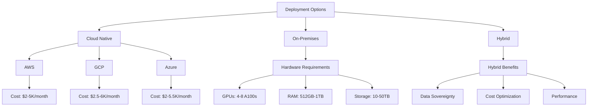
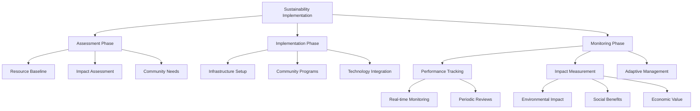

# Vortx Earth Memory System Deployment Guide

## Overview

This guide covers deploying Vortx Earth Memory System with advanced AGI runtime capabilities and industry-specific optimizations. We'll cover:
- Local development setup with AGI runtime support
- Containerized deployment with memory synthesis
- Cloud deployment with industry-specific configurations
- Performance optimization for memory systems
- Advanced monitoring and maintenance

## Prerequisites

- Python 3.9+
- CUDA 11.8+ (for GPU support)
- 32GB+ RAM (64GB+ recommended for AGI workloads)
- 16GB+ GPU memory (recommended)
- 500GB+ storage (1TB+ for full memory synthesis)
- Redis 6.2+ for memory caching
- Kubernetes 1.24+ for orchestration

## 1. Local Development Setup

### Environment Setup with AGI Support

```bash
# Create virtual environment
python -m venv venv
source venv/bin/activate  # Linux/Mac
# or
.\venv\Scripts\activate  # Windows

# Install core dependencies
pip install -r requirements.txt

# Install AGI runtime dependencies
pip install -r requirements-agi.txt

# Install Earth Memory System packages
pip install -r requirements-memory.txt
```

### Advanced Configuration

Create a `.env` file with Earth Memory System settings:

```env
# Core Settings
VORTX_ENV=development
MEMORY_CACHE_DIR=/path/to/cache
EARTH_MODEL_DIR=/path/to/models
API_KEY=your_api_key

# Earth Memory System Settings
MEMORY_ALLOCATION=dynamic
SYNTHESIS_BATCH_SIZE=128
PATTERN_RECOGNITION_THRESHOLD=0.90
CONTEXT_WINDOW_SIZE=20000

# Industry-Specific Settings
INDUSTRY_TYPE=manufacturing  # or healthcare, space, defense, environmental
DEPLOYMENT_MODE=hybrid  # real-time, batch, or hybrid
OPTIMIZATION_LEVEL=adaptive

# Resource Management
GPU_MEMORY_FRACTION=0.9
MAX_BATCH_SIZE=8
MEMORY_CACHE_SIZE=32GB
MAX_CONCURRENT_SYNTHESIS=8
```

### Enhanced Docker Compose

```yaml
version: '3.8'

services:
  vortx-core:
    build: 
      context: .
      dockerfile: Dockerfile
    ports:
      - "8000:8000"
    volumes:
      - ./data:/app/data
      - ./models:/app/models
      - ./cache:/app/cache
      - ./memory:/app/memory
    environment:
      - CUDA_VISIBLE_DEVICES=0,1
      - EARTH_MODEL_DIR=/app/models
      - MEMORY_CACHE_DIR=/app/cache
      - MEMORY_SYNTHESIS_DIR=/app/memory
      - DEPLOYMENT_TYPE=${DEPLOYMENT_TYPE:-advanced}
      - INDUSTRY_CONTEXT=${INDUSTRY_CONTEXT:-earth_system}
    deploy:
      resources:
        reservations:
          devices:
            - driver: nvidia
              count: 2
              capabilities: [gpu]

  memory-synthesis:
    image: vortx-memory:latest
    depends_on:
      - vortx-core
    environment:
      - MEMORY_SYNTHESIS_MODE=continuous
      - PATTERN_RECOGNITION_ENABLED=true
      - CONTEXT_INTEGRATION_LEVEL=deep
      - EARTH_SYSTEM_INTEGRATION=enabled

  earth-data-processor:
    image: vortx-processor:latest
    depends_on:
      - vortx-core
    environment:
      - PROCESSING_MODE=real_time
      - DATA_INTEGRATION_LEVEL=comprehensive
      - EARTH_SYSTEM_ANALYSIS=enabled

  monitoring:
    image: vortx-monitor:latest
    ports:
      - "9090:9090"
    volumes:
      - ./monitoring:/monitoring
    environment:
      - MONITOR_MODE=comprehensive
      - METRICS_RETENTION=90d
      - EARTH_SYSTEM_METRICS=enabled

volumes:
  memory_data:
  earth_system_data:
```

## 4. Industry-Specific Optimizations

### Earth System Integration

#### Advanced Earth System Features

```python
EARTH_SYSTEM_ADVANCED_CONFIG = {
    'data_sources': {
        'satellite': {
            'spectral_bands': ['VIS', 'NIR', 'SWIR', 'TIR', 'SAR'],
            'resolution_ranges': {
                'optical': '0.3-30m',
                'thermal': '30-100m',
                'radar': '1-10m'
            },
            'temporal_resolution': {
                'optical': '1-5 days',
                'radar': '1-3 days',
                'geostationary': '10-15 minutes'
            },
            'coverage': {
                'type': 'global',
                'revisit_time': '1-3 days',
                'swath_width': '10-290km'
            }
        },
        'atmospheric': {
            'parameters': [
                'temperature_profile',
                'humidity_profile',
                'wind_vectors',
                'aerosol_composition',
                'trace_gases'
            ],
            'vertical_resolution': {
                'troposphere': '0.1-1km',
                'stratosphere': '1-2km'
            },
            'temporal_resolution': '1h',
            'spatial_coverage': 'global'
        },
        'ocean_monitoring': {
            'parameters': [
                'sea_surface_temperature',
                'ocean_color',
                'sea_surface_height',
                'wave_height',
                'ocean_currents',
                'salinity'
            ],
            'depth_levels': {
                'surface': '0-10m',
                'mixed_layer': '10-200m',
                'deep_ocean': '200-2000m',
                'abyssal': '>2000m'
            },
            'temporal_resolution': {
                'surface': '6h',
                'subsurface': '24h'
            }
        },
        'terrestrial': {
            'parameters': [
                'land_cover',
                'vegetation_indices',
                'soil_moisture',
                'surface_temperature',
                'biomass',
                'albedo'
            ],
            'spatial_resolution': '10-30m',
            'temporal_resolution': '1-5 days',
            'vertical_structure': {
                'canopy': '0.1-50m',
                'soil_layers': '0-2m'
            }
        },
        'cryosphere': {
            'parameters': [
                'ice_extent',
                'snow_cover',
                'ice_thickness',
                'permafrost',
                'glacier_mass'
            ],
            'spatial_resolution': '25-100m',
            'temporal_resolution': '1-7 days',
            'vertical_resolution': '0.1-10m'
        }
    },
    'memory_synthesis': {
        'temporal_integration': {
            'historical_depth': '100 years',
            'forecast_horizon': '50 years',
            'resolution_scaling': {
                'past': 'exponential',
                'future': 'logarithmic'
            }
        },
        'spatial_integration': {
            'grid_system': 'adaptive_hexagonal',
            'resolution_levels': '1km to 250km',
            'vertical_layers': '100',
            'coupling_strength': 'dynamic'
        },
        'process_integration': {
            'biogeochemical_cycles': True,
            'energy_balance': True,
            'water_cycle': True,
            'carbon_cycle': True,
            'nitrogen_cycle': True
        },
        'pattern_recognition': {
            'algorithms': [
                'deep_learning',
                'physics_informed_nn',
                'causal_discovery',
                'spectral_analysis'
            ],
            'temporal_scales': ['diurnal', 'seasonal', 'interannual', 'decadal'],
            'spatial_scales': ['local', 'regional', 'global'],
            'confidence_metrics': True
        }
    },
    'analysis_capabilities': {
        'earth_system_modeling': {
            'coupled_models': [
                'atmosphere_ocean',
                'land_atmosphere',
                'ocean_biogeochemistry',
                'cryosphere_climate'
            ],
            'resolution_ranges': {
                'global': '10-100km',
                'regional': '1-10km',
                'local': '<1km'
            },
            'temporal_scales': {
                'weather': '1-10 days',
                'seasonal': '1-12 months',
                'climate': '1-100 years'
            }
        },
        'impact_assessment': {
            'sectors': [
                'agriculture',
                'water_resources',
                'ecosystems',
                'human_health',
                'infrastructure'
            ],
            'vulnerability_metrics': True,
            'adaptation_strategies': True,
            'risk_quantification': True
        }
    }
}

# Initialize Advanced Earth Memory System
earth_memory = AdvancedEarthMemorySystem(
    config=EARTH_SYSTEM_ADVANCED_CONFIG,
    data_sources=config.DATA_SOURCES,
    synthesis_engine=config.SYNTHESIS_ENGINE,
    monitoring=config.MONITORING_SYSTEM
)
```

#### Enhanced Industry Integration

##### Climate Science Integration
```python
CLIMATE_SCIENCE_CONFIG = {
    'analysis_modules': {
        'climate_modeling': {
            'model_types': [
                'global_circulation',
                'regional_climate',
                'earth_system'
            ],
            'resolution': {
                'spatial': '10-100km',
                'temporal': '1h-1day'
            },
            'processes': [
                'radiative_transfer',
                'cloud_physics',
                'atmospheric_chemistry',
                'ocean_dynamics'
            ]
        },
        'impact_assessment': {
            'sectors': [
                'agriculture',
                'water_resources',
                'ecosystems',
                'human_health'
            ],
            'metrics': [
                'vulnerability',
                'exposure',
                'adaptive_capacity'
            ],
            'temporal_horizon': '2100'
        }
    },
    'data_integration': {
        'sources': [
            'satellite_observations',
            'ground_stations',
            'ocean_buoys',
            'ice_cores',
            'proxy_records'
        ],
        'temporal_coverage': {
            'historical': '-800000 years',
            'instrumental': '-150 years',
            'future': '+100 years'
        }
    },
    'memory_system': {
        'retention_policy': 'permanent',
        'synthesis_interval': '6h',
        'pattern_recognition': {
            'teleconnections': True,
            'extreme_events': True,
            'regime_shifts': True
        }
    }
}

# Initialize Climate Science Memory System
climate_memory = ClimateMemorySystem(
    config=CLIMATE_SCIENCE_CONFIG,
    earth_system=earth_memory,
    analysis_engine=config.ANALYSIS_ENGINE
)
```

##### Advanced Monitoring System

```python
MONITORING_CONFIG = {
    'earth_system_metrics': {
        'atmospheric': {
            'parameters': [
                'temperature_profiles',
                'humidity_profiles',
                'wind_fields',
                'trace_gases',
                'aerosols'
            ],
            'frequency': '1h',
            'vertical_levels': 100
        },
        'oceanic': {
            'parameters': [
                'temperature',
                'salinity',
                'currents',
                'biogeochemistry',
                'sea_level'
            ],
            'frequency': '6h',
            'depth_levels': 50
        },
        'terrestrial': {
            'parameters': [
                'soil_moisture',
                'vegetation_state',
                'snow_cover',
                'river_discharge',
                'groundwater'
            ],
            'frequency': '1d',
            'spatial_resolution': '1km'
        }
    },
    'analysis_metrics': {
        'pattern_detection': {
            'methods': [
                'empirical_orthogonal_functions',
                'wavelet_analysis',
                'machine_learning',
                'causal_discovery'
            ],
            'temporal_scales': ['hourly', 'daily', 'monthly', 'annual'],
            'spatial_scales': ['local', 'regional', 'global']
        },
        'uncertainty_quantification': {
            'methods': [
                'ensemble_statistics',
                'bayesian_inference',
                'sensitivity_analysis'
            ],
            'confidence_levels': [0.68, 0.95, 0.99]
        }
    },
    'system_health': {
        'computational': {
            'resource_usage': True,
            'performance_metrics': True,
            'bottleneck_detection': True
        },
        'data_quality': {
            'completeness': True,
            'consistency': True,
            'accuracy': True
        },
        'synthesis_quality': {
            'pattern_stability': True,
            'prediction_skill': True,
            'uncertainty_bounds': True
        }
    },
    'alerting': {
        'thresholds': {
            'system_metrics': {
                'critical': 0.95,
                'warning': 0.80
            },
            'earth_system': {
                'extreme_events': True,
                'tipping_points': True,
                'anomaly_detection': True
            }
        },
        'notification': {
            'channels': ['email', 'api', 'dashboard'],
            'frequency': 'adaptive',
            'priority_levels': ['info', 'warning', 'critical']
        }
    }
}

# Initialize Advanced Monitoring System
monitoring_system = AdvancedMonitoringSystem(
    config=MONITORING_CONFIG,
    earth_memory=earth_memory,
    alert_manager=config.ALERT_MANAGER
)
```

## 5. Performance Optimization

### Model Optimization

1. **TensorRT Integration**
```python
# Convert models to TensorRT
from tileformer.utils.optimization import convert_to_tensorrt

model_path = "models/sam-vit-huge"
optimized_path = convert_to_tensorrt(model_path)
```

2. **Quantization**
```python
# Quantize models
from tileformer.utils.optimization import quantize_model

model_path = "models/segformer-b0"
quantized_path = quantize_model(model_path, quantization="int8")
```

### Caching Strategy

1. **Redis Configuration**
```python
# Configure Redis
REDIS_CONFIG = {
    'host': 'localhost',
    'port': 6379,
    'db': 0,
    'max_memory': '2gb',
    'eviction_policy': 'allkeys-lru'
}
```

2. **Cache Warmup**
```python
# Warm up cache for common tiles
from tileformer.utils.cache import warm_cache

warm_cache(
    zoom_levels=[12, 13, 14],
    bbox=[-122.4, 37.7, -122.3, 37.8]
)
```

## 6. Monitoring and Maintenance

### Prometheus Metrics

```python
# Add Prometheus metrics
from prometheus_client import Counter, Histogram

REQUESTS = Counter('tileformer_requests_total', 'Total requests')
LATENCY = Histogram('tileformer_request_latency_seconds', 'Request latency')
```

### Grafana Dashboard

```json
{
  "dashboard": {
    "id": null,
    "title": "TileFormer Metrics",
    "panels": [
      {
        "title": "Request Rate",
        "type": "graph",
        "datasource": "Prometheus",
        "targets": [
          {
            "expr": "rate(tileformer_requests_total[5m])"
          }
        ]
      },
      {
        "title": "Latency",
        "type": "graph",
        "datasource": "Prometheus",
        "targets": [
          {
            "expr": "histogram_quantile(0.95, rate(tileformer_request_latency_seconds_bucket[5m]))"
          }
        ]
      }
    ]
  }
}
```

### Health Checks

```python
@app.get("/health")
async def health_check():
    return {
        "status": "healthy",
        "version": "2.0.0",
        "gpu_available": torch.cuda.is_available(),
        "memory_usage": psutil.Process().memory_info().rss / 1024 / 1024,
        "gpu_memory": torch.cuda.max_memory_allocated() / 1024 / 1024 if torch.cuda.is_available() else 0
    }
```

## 7. Security

### API Authentication

```python
from fastapi.security import APIKeyHeader

API_KEY_HEADER = APIKeyHeader(name="X-API-Key")

@app.get("/secure-endpoint")
async def secure_endpoint(api_key: str = Depends(API_KEY_HEADER)):
    if not verify_api_key(api_key):
        raise HTTPException(status_code=403)
    return {"message": "Authenticated"}
```

### Rate Limiting

```python
from fastapi import Request
from slowapi import Limiter
from slowapi.util import get_remote_address

limiter = Limiter(key_func=get_remote_address)

@app.get("/rate-limited")
@limiter.limit("100/minute")
async def rate_limited(request: Request):
    return {"message": "Rate limited endpoint"}
```

## 8. Troubleshooting

### Common Issues

1. **GPU Memory Issues**
```bash
# Check GPU usage
nvidia-smi

# Clear GPU cache
torch.cuda.empty_cache()
```

2. **Performance Issues**
```bash
# Profile code
python -m cProfile -o profile.stats your_script.py
snakeviz profile.stats
```

3. **Memory Leaks**
```bash
# Monitor memory
from memory_profiler import profile

@profile
def memory_intensive_function():
    pass
```

## 9. Maintenance

### Backup Strategy

```bash
# Backup script
#!/bin/bash
DATE=$(date +%Y%m%d)
tar -czf backup_$DATE.tar.gz \
    models/ \
    cache/ \
    config/
aws s3 cp backup_$DATE.tar.gz s3://your-bucket/backups/
```

### Update Procedure

```bash
# Update script
#!/bin/bash
# Pull latest changes
git pull origin main

# Update dependencies
pip install -r requirements.txt

# Run migrations
alembic upgrade head

# Restart services
supervisorctl restart tileformer
```

## 10. Scaling

### Horizontal Scaling

```bash
# Scale with Docker Compose
docker-compose up -d --scale tileformer=5

# Scale with Kubernetes
kubectl scale deployment tileformer --replicas=5
```

### Vertical Scaling

- Increase instance size
- Add more GPU memory
- Optimize model loading

## 11. Best Practices

1. **Production Checklist**
   - [ ] Security hardening
   - [ ] Monitoring setup
   - [ ] Backup strategy
   - [ ] Rate limiting
   - [ ] Error handling
   - [ ] Documentation
   - [ ] Performance optimization
   - [ ] Load testing

2. **Performance Tips**
   - Use batch processing
   - Implement caching
   - Optimize model loading
   - Use async processing
   - Monitor resource usage

3. **Security Tips**
   - Regular updates
   - API key rotation
   - Input validation
   - Rate limiting
   - Access logging

### Enhanced Earth System Configuration

```python
EARTH_SYSTEM_AGI_CONFIG = {
    'advanced_measurements': {
        'earth_sensing': {
            'satellite_integration': True,
            'ground_sensors': True,
            'ocean_monitoring': True,
            'parameters': [
                'atmospheric_composition',
                'ocean_currents',
                'land_use_changes',
                'biodiversity_metrics'
            ],
            'precision': 'high'
        },
        'climate_system_integration': {
            'analysis_methods': [
                'pattern_recognition',
                'trend_analysis',
                'system_dynamics',
                'predictive_modeling'
            ],
            'error_correction': True,
            'data_fusion': 'multi-source'
        }
    },
    'environmental_monitoring': {
        'ecosystem_analysis': {
            'biodiversity_tracking': True,
            'habitat_monitoring': True,
            'species_interactions': True,
            'parameters': [
                'species_distribution',
                'ecosystem_health',
                'habitat_connectivity'
            ],
            'coverage': 'global'
        }
    },
    'climate_measurements': {
        'atmospheric_dynamics': {
            'sensitivity': 'high',
            'frequency_range': 'hourly',
            'pattern_classification': True
        },
        'earth_system_probes': {
            'carbon_cycle': True,
            'water_cycle': True,
            'energy_balance': True
        }
    }
}

# Enhanced Distributed Architecture
DISTRIBUTED_AGI_ARCHITECTURE = {
    'compute_cluster': {
        'topology': 'mesh',
        'node_types': {
            'perception_nodes': {
                'count': 100,
                'gpu_type': 'a100',
                'memory': '80GB',
                'interconnect': 'high-speed'
            },
            'reasoning_nodes': {
                'count': 50,
                'gpu_type': 'h100',
                'memory': '120GB',
                'tensor_cores': True
            },
            'memory_nodes': {
                'count': 200,
                'storage_type': 'high-performance',
                'capacity': '1PB',
                'access_speed': '100GB/s'
            }
        },
        'communication': {
            'protocol': 'secure',
            'bandwidth': '400Gb/s',
            'latency': '<1ms'
        }
    },
    'intelligence_engine': {
        'self_awareness': {
            'introspection': True,
            'meta_learning': True,
            'ethical_constraints': True
        },
        'emergent_properties': {
            'collective_intelligence': True,
            'adaptive_cognition': True,
            'creative_synthesis': True
        }
    }
}

# Advanced Earth System Analytics
EARTH_ANALYTICS_CONFIG = {
    'system_analytics': {
        'data_fusion': {
            'methods': [
                'multi_source_integration',
                'temporal_alignment',
                'spatial_harmonization'
            ],
            'data_types': [
                'satellite',
                'ground_sensors',
                'weather_stations',
                'ocean_buoys'
            ]
        },
        'pattern_analysis': {
            'spatial_patterns': {
                'land_use_change': True,
                'urban_growth': True,
                'ecosystem_dynamics': True
            },
            'temporal_patterns': {
                'climate_trends': True,
                'seasonal_variations': True,
                'extreme_events': True
            }
        },
        'predictive_analytics': {
            'methods': [
                'machine_learning',
                'statistical_modeling',
                'system_dynamics'
            ],
            'forecast_horizons': {
                'short_term': '1-7d',
                'medium_term': '7-30d',
                'long_term': '>30d'
            }
        }
    },
    'social_impact_analytics': {
        'human_wellbeing': {
            'health_metrics': True,
            'quality_of_life': True,
            'environmental_justice': True,
            'community_resilience': True
        },
        'economic_sustainability': {
            'resource_efficiency': True,
            'circular_economy': True,
            'green_innovation': True,
            'sustainable_livelihoods': True
        }
    }
}

# Social and Environmental Applications
APPLICATIONS_CONFIG = {
    'environmental_applications': {
        'climate_resilience': {
            'adaptation_planning': {
                'vulnerability_assessment': True,
                'risk_mitigation': True,
                'community_engagement': True
            },
            'optimization': {
                'resource_conservation': True,
                'energy_efficiency': True,
                'waste_reduction': True
            }
        },
        'ecosystem_protection': {
            'biodiversity_conservation': True,
            'habitat_restoration': True,
            'species_recovery': True
        }
    },
    'social_benefits': {
        'public_health': {
            'environmental_health': {
                'air_quality_monitoring': True,
                'water_safety': True,
                'exposure_assessment': True
            },
            'health_equity': {
                'access_improvement': True,
                'resource_distribution': True,
                'community_health': True
            }
        },
        'education': {
            'environmental_education': {
                'curriculum_development': True,
                'public_awareness': True,
                'skill_building': True
            },
            'educational_equity': {
                'resource_access': True,
                'learning_support': True,
                'outcome_improvement': True
            }
        },
        'sustainable_communities': {
            'urban_planning': {
                'green_infrastructure': True,
                'public_spaces': True,
                'sustainable_transport': True
            },
            'resource_management': {
                'water_conservation': True,
                'waste_reduction': True,
                'energy_efficiency': True
            }
        }
    },
    'humanitarian_applications': {
        'disaster_preparedness': {
            'early_warning': {
                'risk_assessment': True,
                'community_alerts': True,
                'response_planning': True
            },
            'resource_coordination': {
                'emergency_supplies': True,
                'medical_resources': True,
                'evacuation_planning': True
            }
        },
        'community_resilience': {
            'capacity_building': {
                'local_leadership': True,
                'skill_development': True,
                'resource_access': True
            },
            'social_support': {
                'vulnerable_populations': True,
                'community_networks': True,
                'economic_opportunities': True
            }
        }
    }
}

# Initialize Enhanced Systems
enhanced_system = EnhancedSystem(
    earth_system_config=EARTH_SYSTEM_AGI_CONFIG,
    distributed_architecture=DISTRIBUTED_AGI_ARCHITECTURE,
    analytics_config=EARTH_ANALYTICS_CONFIG,
    applications_config=APPLICATIONS_CONFIG,
    earth_memory=earth_memory,
    social_impact_monitor=social_impact_system
)
```

## Deployment Architecture and Scaling

### Deployment Options and Costs



### Resource Requirements by Scale

| Scale | Users | Data Volume | GPUs | RAM | Storage | Est. Monthly Cost |
|-------|-------|-------------|------|-----|---------|------------------|
| Small | <1000 | <10TB | 2-4 | 256GB | 10TB | $2-3K |
| Medium | 1000-10000 | 10-50TB | 4-8 | 512GB | 25TB | $5-8K |
| Large | >10000 | >50TB | 8-16 | 1TB | 50TB+ | $10K+ |

### Enhanced Environmental Monitoring

```python
ENVIRONMENTAL_MONITORING_CONFIG = {
    'atmospheric_parameters': {
        'air_quality': {
            'pollutants': {
                'criteria_pollutants': [
                    {'name': 'PM2.5', 'resolution': '1μg/m³', 'frequency': '5min'},
                    {'name': 'PM10', 'resolution': '1μg/m³', 'frequency': '5min'},
                    {'name': 'O3', 'resolution': '1ppb', 'frequency': '1min'},
                    {'name': 'NO2', 'resolution': '1ppb', 'frequency': '1min'},
                    {'name': 'SO2', 'resolution': '1ppb', 'frequency': '1min'},
                    {'name': 'CO', 'resolution': '0.1ppm', 'frequency': '1min'}
                ],
                'greenhouse_gases': [
                    {'name': 'CO2', 'resolution': '0.1ppm', 'frequency': '1min'},
                    {'name': 'CH4', 'resolution': '1ppb', 'frequency': '5min'},
                    {'name': 'N2O', 'resolution': '1ppb', 'frequency': '5min'}
                ],
                'emerging_pollutants': [
                    {'name': 'VOCs', 'resolution': '1ppb', 'frequency': '5min'},
                    {'name': 'Black Carbon', 'resolution': '0.1μg/m³', 'frequency': '1min'}
                ]
            },
            'meteorological': {
                'temperature': {'resolution': '0.1°C', 'frequency': '1min'},
                'humidity': {'resolution': '0.1%', 'frequency': '1min'},
                'pressure': {'resolution': '0.1hPa', 'frequency': '1min'},
                'wind': {
                    'speed': {'resolution': '0.1m/s', 'frequency': '1min'},
                    'direction': {'resolution': '1°', 'frequency': '1min'}
                },
                'precipitation': {'resolution': '0.1mm', 'frequency': '1min'},
                'solar_radiation': {'resolution': '1W/m²', 'frequency': '1min'}
            }
        }
    },
    'water_quality': {
        'surface_water': {
            'physical_parameters': [
                {'name': 'temperature', 'resolution': '0.1°C', 'frequency': '5min'},
                {'name': 'turbidity', 'resolution': '0.1NTU', 'frequency': '5min'},
                {'name': 'conductivity', 'resolution': '1μS/cm', 'frequency': '5min'},
                {'name': 'dissolved_oxygen', 'resolution': '0.1mg/L', 'frequency': '5min'},
                {'name': 'pH', 'resolution': '0.1', 'frequency': '5min'}
            ],
            'chemical_parameters': [
                {'name': 'nitrates', 'resolution': '0.1mg/L', 'frequency': '15min'},
                {'name': 'phosphates', 'resolution': '0.1mg/L', 'frequency': '15min'},
                {'name': 'heavy_metals', 'resolution': '1μg/L', 'frequency': '1h'}
            ],
            'biological_parameters': [
                {'name': 'chlorophyll', 'resolution': '0.1μg/L', 'frequency': '15min'},
                {'name': 'e_coli', 'resolution': '1CFU/100mL', 'frequency': '1h'},
                {'name': 'algal_biomass', 'resolution': '0.1mg/L', 'frequency': '1h'}
            ]
        }
    },
    'soil_monitoring': {
        'physical_properties': {
            'moisture': {'resolution': '0.1%', 'frequency': '15min', 'depth_profiles': [5, 10, 20, 50, 100]},
            'temperature': {'resolution': '0.1°C', 'frequency': '15min', 'depth_profiles': [5, 10, 20, 50, 100]},
            'compaction': {'resolution': '0.1kg/cm³', 'frequency': '1d'}
        },
        'chemical_properties': {
            'pH': {'resolution': '0.1', 'frequency': '1d'},
            'nutrients': {
                'N': {'resolution': '1mg/kg', 'frequency': '1d'},
                'P': {'resolution': '1mg/kg', 'frequency': '1d'},
                'K': {'resolution': '1mg/kg', 'frequency': '1d'}
            },
            'organic_matter': {'resolution': '0.1%', 'frequency': '1d'},
            'contaminants': {'resolution': '0.1mg/kg', 'frequency': '1d'}
        }
    }
}

### Enhanced Social Impact Metrics

```python
SOCIAL_IMPACT_METRICS = {
    'community_health': {
        'environmental_health': {
            'metrics': [
                {
                    'name': 'air_quality_index',
                    'frequency': 'hourly',
                    'impact_threshold': {'good': 50, 'moderate': 100, 'poor': 150}
                },
                {
                    'name': 'water_quality_index',
                    'frequency': 'daily',
                    'impact_threshold': {'good': 80, 'moderate': 60, 'poor': 40}
                },
                {
                    'name': 'green_space_access',
                    'frequency': 'monthly',
                    'metric': 'percentage_within_10min_walk'
                }
            ],
            'health_outcomes': [
                'respiratory_incidents',
                'waterborne_disease_cases',
                'heat_stress_events'
            ],
            'vulnerable_populations': [
                'elderly',
                'children',
                'pre_existing_conditions'
            ]
        },
        'social_determinants': {
            'access_metrics': [
                {
                    'name': 'healthcare_facilities',
                    'metric': 'facilities_per_10000',
                    'target': 5.0
                },
                {
                    'name': 'green_spaces',
                    'metric': 'sqm_per_capita',
                    'target': 9.0
                },
                {
                    'name': 'public_transport',
                    'metric': 'stops_per_sqkm',
                    'target': 2.0
                }
            ],
            'equity_metrics': [
                {
                    'name': 'income_distribution',
                    'metric': 'gini_coefficient',
                    'target': '<0.35'
                },
                {
                    'name': 'education_access',
                    'metric': 'schools_per_1000_children',
                    'target': 1.5
                }
            ]
        }
    },
    'community_engagement': {
        'participation_metrics': {
            'environmental_programs': {
                'metrics': [
                    {
                        'name': 'workshop_attendance',
                        'target': '30_per_session',
                        'frequency': 'monthly'
                    },
                    {
                        'name': 'volunteer_hours',
                        'target': '1000_per_month',
                        'frequency': 'monthly'
                    },
                    {
                        'name': 'community_projects',
                        'target': '10_per_quarter',
                        'frequency': 'quarterly'
                    }
                ],
                'engagement_channels': [
                    'mobile_app',
                    'community_portal',
                    'local_workshops',
                    'citizen_science'
                ]
            },
            'feedback_systems': {
                'channels': [
                    'mobile_app',
                    'web_portal',
                    'community_meetings',
                    'social_media'
                ],
                'response_metrics': {
                    'acknowledgment_time': '<24h',
                    'resolution_time': '<7d',
                    'satisfaction_target': '>85%'
                }
            }
        },
        'impact_tracking': {
            'behavioral_change': {
                'metrics': [
                    'waste_reduction_per_capita',
                    'energy_conservation_rate',
                    'sustainable_transport_usage'
                ],
                'measurement_frequency': 'monthly'
            },
            'community_resilience': {
                'indicators': [
                    'emergency_preparedness_score',
                    'social_network_strength',
                    'resource_sharing_index'
                ],
                'assessment_frequency': 'quarterly'
            }
        }
    }
}

### Sustainability Implementation Workflow



### Practical Sustainability Measures

```python
SUSTAINABILITY_MEASURES = {
    'resource_efficiency': {
        'energy_management': {
            'monitoring': {
                'real_time_consumption': True,
                'peak_load_analysis': True,
                'renewable_integration': True
            },
            'optimization': {
                'smart_scheduling': True,
                'load_balancing': True,
                'demand_response': True
            },
            'targets': {
                'reduction_goal': '25%_annual',
                'renewable_mix': '50%_by_2025',
                'peak_shaving': '15%_reduction'
            }
        },
        'water_conservation': {
            'monitoring': {
                'consumption_tracking': True,
                'leak_detection': True,
                'quality_monitoring': True
            },
            'optimization': {
                'recycling_systems': True,
                'smart_irrigation': True,
                'rainwater_harvesting': True
            },
            'targets': {
                'reduction_goal': '20%_annual',
                'recycling_rate': '30%',
                'loss_prevention': '5%_max'
            }
        }
    },
    'waste_management': {
        'reduction_strategies': {
            'source_reduction': True,
            'reuse_programs': True,
            'recycling_initiatives': True
        },
        'monitoring': {
            'waste_audits': 'quarterly',
            'composition_analysis': 'monthly',
            'diversion_rates': 'weekly'
        },
        'targets': {
            'diversion_rate': '80%_by_2025',
            'contamination_rate': '<5%',
            'zero_waste_goal': '2030'
        }
    },
    'carbon_management': {
        'emissions_tracking': {
            'scope_1': True,
            'scope_2': True,
            'scope_3': True
        },
        'reduction_strategies': {
            'energy_efficiency': True,
            'renewable_energy': True,
            'offset_programs': True
        },
        'targets': {
            'reduction_goal': '50%_by_2030',
            'carbon_neutral': '2040',
            'offset_quality': 'gold_standard'
        }
    }
}

# Initialize Sustainability System
sustainability_system = SustainabilitySystem(
    monitoring_config=ENVIRONMENTAL_MONITORING_CONFIG,
    social_metrics=SOCIAL_IMPACT_METRICS,
    sustainability_measures=SUSTAINABILITY_MEASURES,
    earth_memory=earth_memory,
    impact_monitor=impact_monitoring_system
) 