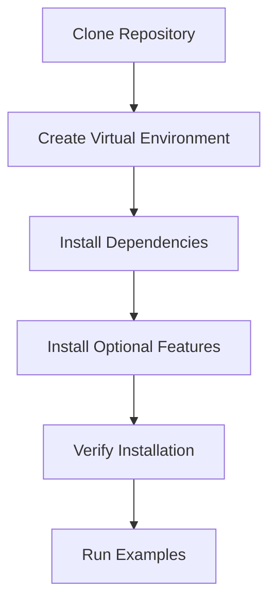

# Getting Started

Welcome to Vortx! This directory contains everything you need to get started with the Vortx Earth Memory System.

## Quick Start

### Installation

```bash
# Clone the repository
git clone https://github.com/vortx-ai/synthetic-satellite.git
cd synthetic-satellite

# Create and activate virtual environment
python -m venv venv
source venv/bin/activate  # Linux/Mac
venv\Scripts\activate     # Windows

# Install dependencies
pip install -r requirements.txt

# Install in development mode
pip install -e .
```

### Basic Usage

```python
from vortx import Vortx
from vortx.models import DeepSeekR1, DeepSeekV3

# Initialize Vortx
vx = Vortx(
    models={
        "reasoning": DeepSeekR1(),
        "vision": DeepSeekV3()
    },
    use_gpu=True
)

# Create memories
memories = vx.create_memories(
    location=(37.7749, -122.4194),
    time_range=("2020-01-01", "2024-01-01")
)
```

## System Requirements

### Minimum
- Python 3.9+
- 8GB RAM
- 4 CPU cores
- 10GB disk space

### Recommended
- Python 3.9+
- 32GB RAM
- 8+ CPU cores
- NVIDIA GPU with 8GB+ VRAM
- 50GB SSD storage

## Optional Dependencies

```bash
# GPU Acceleration
pip install -r requirements-gpu.txt

# Machine Learning
pip install -r requirements-ml.txt

# Visualization
pip install -r requirements-viz.txt

# Development
pip install -r requirements-dev.txt

# Documentation
pip install -r requirements-docs.txt
```

## Setup Flow



## Configuration

```python
# Example configuration
config = {
    "memory": {
        "cache_size": "10GB",
        "compression_ratio": 0.95
    },
    "inference": {
        "batch_size": 32,
        "precision": "mixed"
    },
    "privacy": {
        "level": "high",
        "encryption": True
    }
}
```

## Next Steps

1. [Quick Start Guide](quickstart.md)
2. [Configuration Guide](configuration.md)
3. [Basic Tutorial](../guides/tutorials/basic.md)
4. [API Reference](../api/rest/overview.md)

## Support

- [Documentation Home](../README.md)
- [Community Forums](https://community.vortx.ai)
- [GitHub Issues](https://github.com/vortx-ai/synthetic-satellite/issues)
- [Email Support](mailto:support@vortx.ai) 