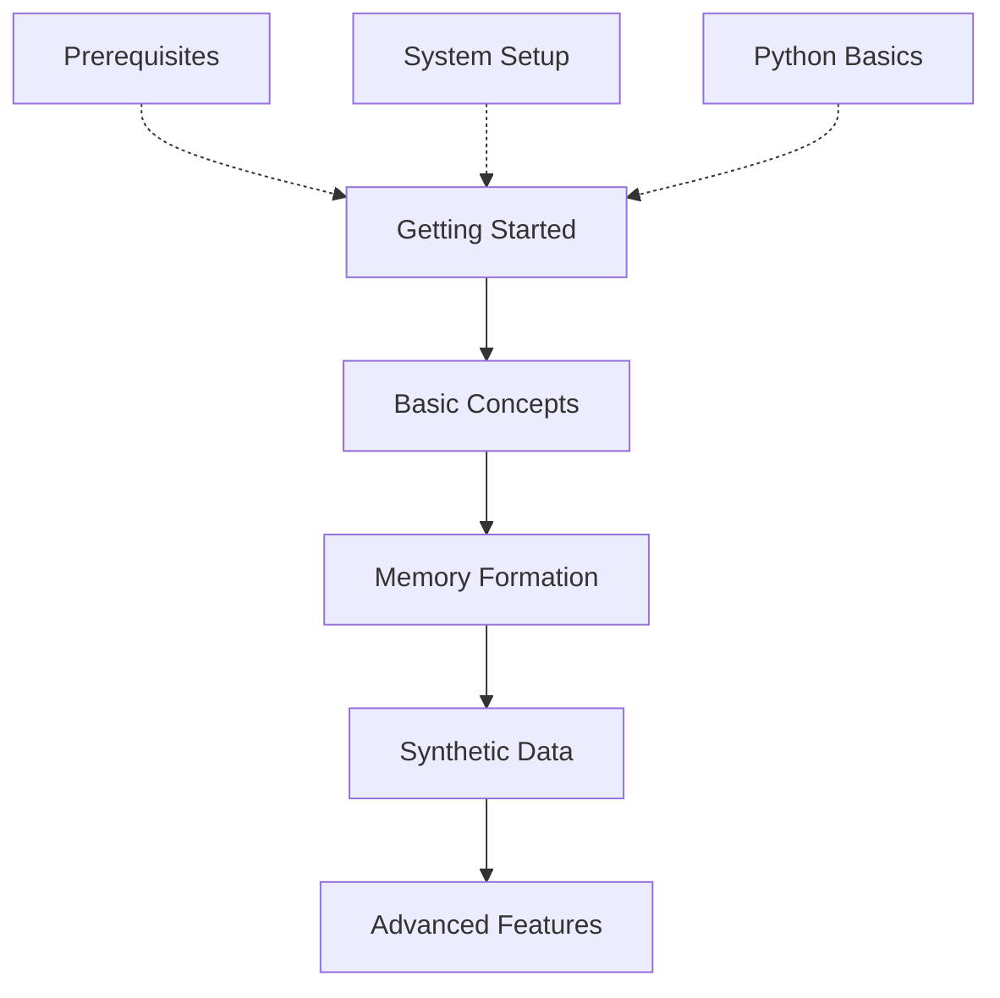

# Guides & Tutorials

This directory contains tutorials, examples, and best practices for using the Vortx Earth Memory System.

## Contents

### [Tutorials](tutorials/)
- Basic usage guides
- Advanced features
- Integration examples
- Best practices

### [Examples](examples/)
- Memory formation
- Synthetic data generation
- Multi-modal analysis
- Privacy preservation

## Learning Path



## Example Workflows

### Memory Formation
```python
from vortx import Vortx
from vortx.memory import EarthMemoryStore

# Initialize Vortx
vx = Vortx(use_gpu=True)

# Create memories
memories = vx.create_memories(
    location=(37.7749, -122.4194),
    time_range=("2020-01-01", "2024-01-01"),
    modalities=["satellite", "climate", "social"]
)
```

### Synthetic Data Generation
```python
# Generate synthetic data
synthetic_data = vx.generate_synthetic(
    base_location=(37.7749, -122.4194),
    scenario="urban_development",
    time_steps=10,
    climate_factors=True
)
```

### Advanced Analysis
```python
# Run advanced analysis
results = vx.analyze_with_deepseek(
    query="Analyze urban development patterns",
    context_memories=memories,
    synthetic_scenarios=synthetic_data
)
```

## Use Cases

### Earth Understanding
- Building comprehensive Earth memories
- Temporal-spatial reasoning
- Environmental pattern recognition
- Future scenario simulation

### Data Generation
- Training data creation
- Scenario simulation
- Impact assessment
- Pattern generation

### Analysis
- Urban development tracking
- Climate change analysis
- Infrastructure planning
- Environmental monitoring

## Best Practices

1. Memory Management
   - Regular optimization
   - Cache cleanup
   - Resource monitoring
   - Performance tuning

2. Data Handling
   - Efficient processing
   - Privacy preservation
   - Quality assurance
   - Version control

3. Integration
   - API usage
   - Error handling
   - Resource management
   - Monitoring

## Quick Links

- [Getting Started](../getting-started/index.md)
- [API Reference](../api/rest/overview.md)
- [Core Concepts](../core/index.md)
- [Contributing](../meta/contributing.md) 