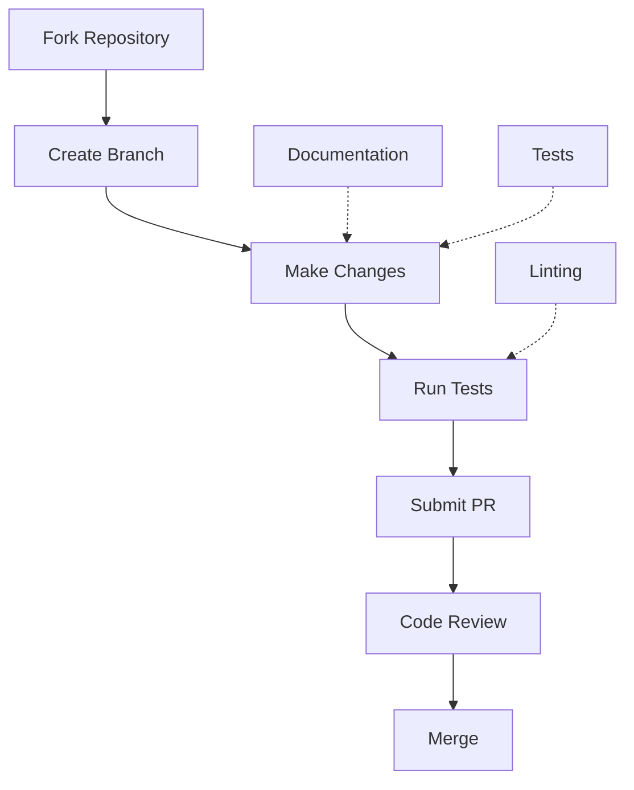
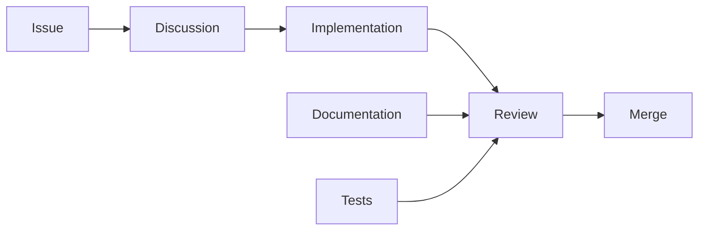

# Meta Documentation

This directory contains meta information about the Vortx Earth Memory System project.

## Contents

### [Contributing](contributing.md)
- Development setup
- Code standards
- Pull request process
- Community guidelines

### [Changelog](changelog.md)
- Version history
- Feature updates
- Bug fixes
- Breaking changes

### [License](../../LICENSE)
- License terms
- Usage rights
- Restrictions
- Attribution

## Development Process



## Contribution Workflow



## Project Structure

```
vortx/
├── src/               # Source code
├── tests/             # Test suite
├── docs/              # Documentation
├── examples/          # Example code
└── scripts/           # Utility scripts
```

## Development Setup

```bash
# Clone and setup
git clone https://github.com/vortx-ai/synthetic-satellite.git
cd synthetic-satellite
python -m venv venv
source venv/bin/activate

# Install dev dependencies
pip install -r requirements-dev.txt
pre-commit install

# Run tests
pytest tests/
```

## Code Standards

1. Style Guide
   - Black code formatting
   - isort import sorting
   - flake8 linting
   - Type hints

2. Testing
   - Unit tests
   - Integration tests
   - Performance tests
   - Documentation tests

3. Documentation
   - Docstrings
   - Type hints
   - Examples
   - Architecture docs

## Quick Links

- [Contributing Guide](contributing.md)
- [Code of Conduct](code_of_conduct.md)
- [Security Policy](security.md)
- [License](../../LICENSE) 