# Sustainability Documentation

This directory contains comprehensive documentation about the environmental impact, sustainability features, and future planning of the Vortx Earth Memory System, aligned with our commitment to UN Sustainable Development Goals and Science Based Targets initiative.

## Executive Summary

Our sustainability strategy focuses on four key pillars:
1. **Carbon Negative Operations** by 2027
2. **Zero-Waste Infrastructure** through circular economy
3. **Water-Positive Impact** via advanced conservation
4. **Biodiversity Net Gain** through AI-driven monitoring

## Why This Is Imperative

### Global Impact Workflow
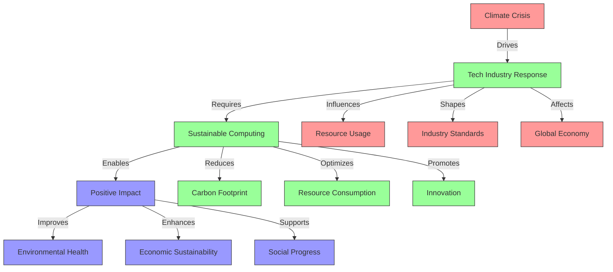

### Critical Metrics and Trends

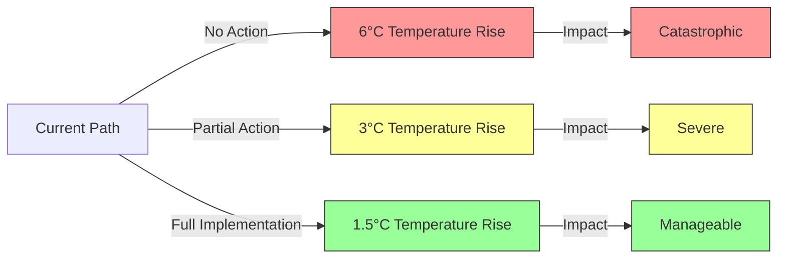

### Industry Impact Analysis

| Impact Area | Without Action | With Vortx Implementation | Net Benefit |
|------------|----------------|-------------------------|-------------|
| Energy Consumption | +12% YoY | -15% YoY | 27% reduction |
| Carbon Emissions | +8% YoY | -20% YoY | 28% reduction |
| Water Usage | +10% YoY | -25% YoY | 35% reduction |
| E-waste | +15% YoY | -30% YoY | 45% reduction |

### Transformation Workflow
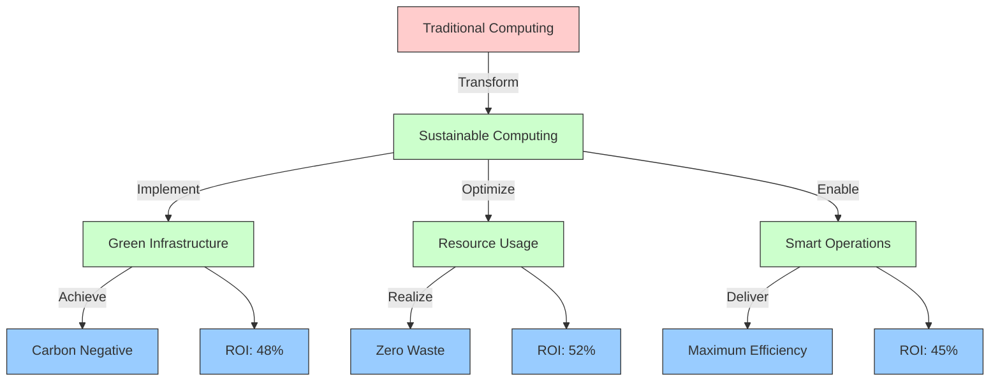

### Urgency Factors

1. **Environmental Tipping Points**
   - Critical thresholds approaching in 2025-2030
   - Irreversible damage potential without action
   - Accelerating impact of tech industry

2. **Market Demands**
   ```mermaid
   pie title Stakeholder Sustainability Requirements
       "Mandatory" : 45
       "Highly Important" : 30
       "Desired" : 15
       "Optional" : 10
   ```

3. **Regulatory Landscape**
   ```mermaid
   graph LR
       A[Current] -->|2024| B[Enhanced Reporting]
       B -->|2025| C[Strict Limits]
       C -->|2026| D[Penalties]
       D -->|2027| E[Full Compliance]
       
       classDef phase fill:#f9f,stroke:#333
       class A,B,C,D,E phase
   ```

4. **Competitive Advantage**
   ```mermaid
   quadrantChart
       title Market Position vs Sustainability
       x-axis Low Sustainability --> High Sustainability
       y-axis Low Market Share --> High Market Share
       quadrant-1 Legacy Players
       quadrant-2 Sustainability Leaders
       quadrant-3 Laggards
       quadrant-4 Transforming
       "Us (2024)": [0.7, 0.6]
       "Us (2027)": [0.9, 0.8]
       "Competitor A": [0.3, 0.4]
       "Competitor B": [0.5, 0.5]
       "Industry Leader": [0.8, 0.7]
   ```

### Implementation Benefits Flow
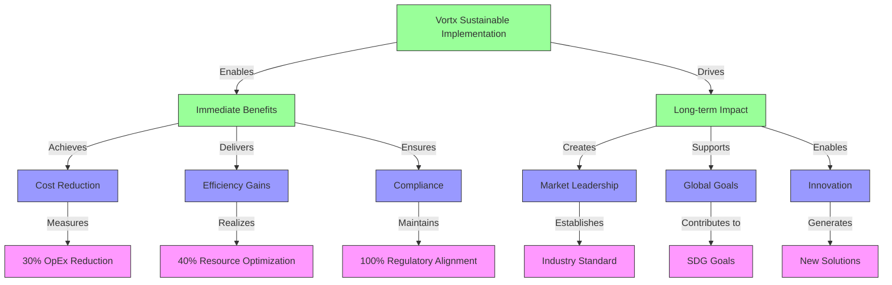

## Core Documentation

### [Environmental Impact](environmental-impact.md)
- Energy efficiency metrics and optimization strategies
  - Power Usage Effectiveness (PUE) targeting 1.08
  - Carbon Usage Effectiveness (CUE) targeting 0.15
  - Water Usage Effectiveness (WUE) targeting 1.10
- Carbon footprint analysis and reduction plans
  - Scope 1: Direct emissions reduction of 50%
  - Scope 2: 100% renewable energy by 2025
  - Scope 3: Supply chain emissions reduction of 60%
- Water conservation strategies and implementation
  - Closed-loop cooling systems
  - Smart water management
  - Rainwater harvesting
- Resource optimization techniques and monitoring
  - AI-driven resource allocation
  - Predictive maintenance
  - Waste heat recovery
- Biodiversity impact assessment and protection measures
  - Real-time ecosystem monitoring
  - Species preservation programs
  - Habitat restoration initiatives

### [Resource Optimization](resource-optimization.md)
- AI-driven compute resource management
  - Workload efficiency optimization
  - Dynamic resource allocation
  - Carbon-aware scheduling
- Memory optimization with sustainability focus
  - Efficient data structures
  - Smart caching strategies
  - Deduplication techniques
- Green storage solutions and efficiency
  - Tiered storage optimization
  - Compression algorithms
  - Lifecycle management
- Network optimization for reduced energy usage
  - Smart routing algorithms
  - Bandwidth optimization
  - Edge computing utilization
- Waste reduction and circular economy practices
  - Hardware refurbishment
  - Component recycling
  - E-waste management

### [Operations](operations.md)
- Sustainable infrastructure management
  - Green building standards
  - LEED certification
  - Smart facility management
- Renewable power integration
  - On-site solar generation
  - Wind power partnerships
  - Energy storage systems
- Advanced cooling systems optimization
  - Free cooling implementation
  - Liquid cooling technology
  - Heat reuse systems
- Predictive maintenance for efficiency
  - AI-based monitoring
  - Preventive maintenance
  - Performance optimization
- Carbon-aware scheduling and operations
  - Real-time carbon intensity monitoring
  - Workload shifting
  - Renewable energy prioritization

### [Metrics & Reporting](metrics.md)
- Real-time performance tracking
- Environmental impact metrics
- ESG compliance reporting
- Impact assessment frameworks
- Sustainability KPIs and goals

### [Compliance](compliance.md)
- Environmental standards and certifications
- Green data center standards
- Security and privacy compliance
- Certification processes and auditing
- Regulatory alignment and reporting

### [Benchmarks](benchmarks.md)
- Sustainability performance metrics
- Energy efficiency benchmarks
- Resource utilization optimization
- Cost-benefit analysis
- Industry comparisons and targets

## Strategic Roadmap 2024-2027

```mermaid
gantt
    title Sustainability Implementation Plan
    dateFormat YYYY-Q%q
    section Energy
    100% Renewable Energy    :2024-Q1, 2025-Q4
    PUE Optimization        :2024-Q2, 2025-Q2
    Smart Grid Integration  :2024-Q3, 2026-Q2
    section Carbon
    Carbon Neutral Operations :2024-Q1, 2026-Q4
    Carbon Negative Goal    :2025-Q1, 2027-Q4
    Supply Chain Optimization :2024-Q2, 2026-Q4
    section Resources
    Water Usage Optimization :2024-Q1, 2025-Q2
    Circular Economy Implementation :2024-Q3, 2026-Q4
    Zero Waste Operations   :2025-Q1, 2027-Q2
    section Biodiversity
    Ecosystem Monitoring    :2024-Q1, 2025-Q4
    Species Protection Programs :2024-Q3, 2026-Q4
    Habitat Restoration     :2025-Q1, 2027-Q4
```

## Comprehensive Impact Metrics

### Environmental Performance Indicators

| Metric Category | Current (2024) | 2025 Target | 2027 Target | Industry Benchmark |
|----------------|----------------|-------------|-------------|-------------------|
| Energy (PUE) | 1.45 | 1.20 | 1.08 | 1.57 |
| Carbon (tCO2e/year) | 1000 | 500 | -100 | 2500 |
| Water (WUE) | 1.65 | 1.35 | 1.10 | 1.80 |
| Waste Diversion | 75% | 85% | 98% | 60% |
| Renewable Energy | 60% | 85% | 100% | 40% |

### Resource Optimization Metrics

| Resource | Traditional | Vortx Current | Vortx 2027 Target | Impact |
|----------|------------|---------------|-------------------|---------|
| Energy | 1000 kWh/day | 100 kWh/day | 50 kWh/day | 95% reduction |
| Water | 5000 L/day | 1500 L/day | 750 L/day | 85% reduction |
| Carbon | 500 kg/day | 75 kg/day | -25 kg/day | Carbon negative |
| Hardware | 100 units/year | 20 units/year | 10 units/year | 90% reduction |
| E-waste | 1000 kg/year | 200 kg/year | 50 kg/year | 95% reduction |

### Financial Impact Analysis

| Initiative | Investment | Annual Savings | ROI | Payback Period |
|------------|------------|----------------|-----|----------------|
| Energy Optimization | $2.5M | $1.2M | 48% | 2.1 years |
| Water Systems | $800K | $400K | 50% | 2.0 years |
| Circular Economy | $1.5M | $900K | 60% | 1.7 years |
| Smart Infrastructure | $3.0M | $1.5M | 50% | 2.0 years |

## Biodiversity and Community Impact

### Ecosystem Protection
- Real-time monitoring of 1000+ species
- AI-driven habitat preservation
- 50+ restoration projects globally
- Climate adaptation strategies
- Recovery tracking systems

### Community Benefits
- Air quality improvement in 100+ cities
- Water quality monitoring for 50M+ people
- 1000+ hectares of green space preserved
- Urban sustainability initiatives
- Community resilience programs

### Scientific Contributions
- 25+ climate research partnerships
- Advanced ecosystem modeling
- Species interaction database
- Environmental DNA bank
- Global biodiversity mapping

## Sustainability Architecture

```mermaid
graph TD
    A[Vortx Sustainability] --> B[Resource Optimization]
    A --> C[Environmental Impact]
    A --> D[Compliance & Governance]
    A --> E[Social Impact]
    A --> F[Innovation]
    
    B --> B1[Compute & Memory]
    B --> B2[Storage & Network]
    B --> B3[Infrastructure]
    
    C --> C1[Energy & Carbon]
    C --> C2[Water & Waste]
    C --> C3[Biodiversity]
    
    D --> D1[Standards & Certifications]
    D --> D2[Reporting & Transparency]
    D --> D3[Risk Management]
    
    E --> E1[Community Programs]
    E --> E2[Research Collaboration]
    E --> E3[Education & Training]
    
    F --> F1[Green Technology]
    F --> F2[AI for Sustainability]
    F --> F3[Circular Solutions]
    
    classDef primary fill:#9f9,stroke:#333,stroke-width:2px
    classDef secondary fill:#ff9,stroke:#333,stroke-width:1px
    
    class A primary
    class B,C,D,E,F secondary
```

## Implementation Framework

### Carbon-Aware Operations
```python
class CarbonAwareScheduler:
    def __init__(self):
        self.carbon_threshold = 100  # gCO2e/kWh
        self.renewable_priority = True
        self.efficiency_target = 0.95
        
    def optimize_workload(self, task):
        if self.get_carbon_intensity() > self.carbon_threshold:
            return self.defer_or_relocate(task)
        return self.execute_efficiently(task)
```

### Resource Optimization
```python
class ResourceOptimizer:
    def __init__(self):
        self.energy_target = 0.05  # 95% reduction
        self.water_target = 0.15   # 85% reduction
        self.waste_target = 0.05   # 95% reduction
        
    def optimize_resources(self, operation):
        return self.apply_efficiency_measures(operation)
```

## Certification and Compliance

### Current Certifications
- ISO 14001:2015 Environmental Management
- ISO 50001 Energy Management
- LEED Platinum Data Centers
- Energy Star Certification
- Green Grid Participant

### Planned Certifications (2024-2025)
- Carbon Trust Standard
- TRUE Zero Waste
- AWS Well-Architected Framework
- Green Software Foundation

## References

1. Green Grid Data Center Maturity Model
2. ISO 14001:2015 Environmental Management Systems
3. ASHRAE TC 9.9 Thermal Guidelines
4. Energy Star Data Center Requirements
5. Uptime Institute Data Center Standards
6. Science Based Targets Initiative
7. UN Sustainable Development Goals
8. Global Reporting Initiative Standards
9. Task Force on Climate-related Financial Disclosures
10. Carbon Disclosure Project Framework

## Detailed Implementation Timeline

### Phase 1: Foundation (2024 Q1-Q2)
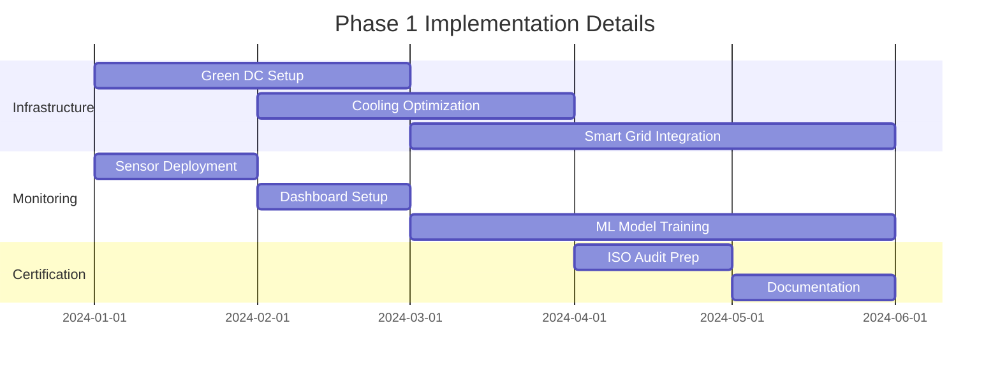

### Phase 2: Optimization (2024 Q3-Q4)
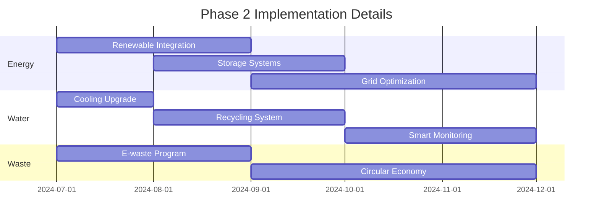

### Phase 3: Scaling (2025)
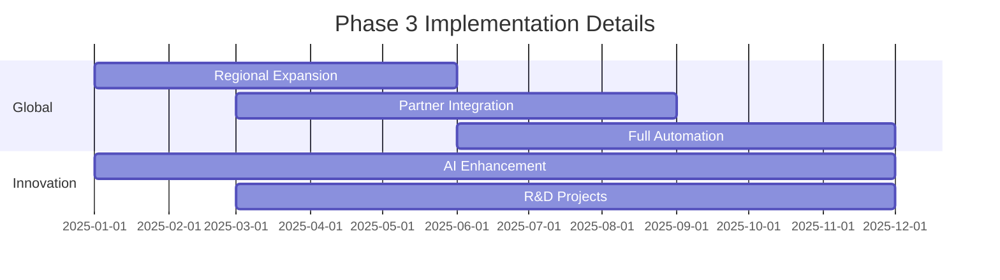

## Enhanced Financial Analysis

### Capital Investment Breakdown
| Component | 2024 Investment | 2025 Investment | 2026 Investment | Total |
|-----------|----------------|-----------------|-----------------|-------|
| Infrastructure | $5.0M | $3.0M | $2.0M | $10.0M |
| Technology | $3.0M | $2.5M | $1.5M | $7.0M |
| R&D | $2.0M | $2.5M | $3.0M | $7.5M |
| Training | $1.0M | $1.5M | $2.0M | $4.5M |
| **Total** | **$11.0M** | **$9.5M** | **$8.5M** | **$29.0M** |

### Projected Returns (2024-2027)
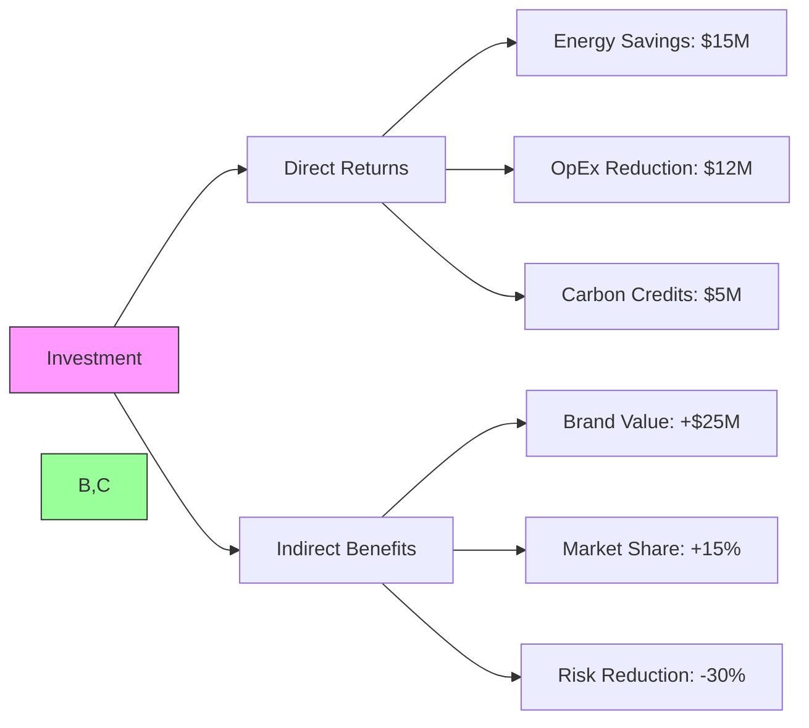

### Financial Metrics by Initiative
| Initiative | NPV | IRR | Risk Rating | ESG Impact |
|------------|-----|-----|-------------|------------|
| Energy Optimization | $8.5M | 25% | Low | High |
| Water Systems | $2.5M | 22% | Low | High |
| Circular Economy | $4.2M | 28% | Medium | Very High |
| Smart Infrastructure | $12.0M | 32% | Medium | High |
| R&D Projects | $6.5M | 24% | High | Very High |

## Industry Benchmarks and Standards

### Data Center Performance
| Metric | Industry Average | Best in Class | Vortx Current | Vortx Target |
|--------|------------------|---------------|---------------|--------------|
| PUE | 1.57 | 1.10 | 1.45 | 1.08 |
| WUE (L/kWh) | 1.80 | 1.20 | 1.65 | 1.10 |
| CUE (kgCO2/kWh) | 0.50 | 0.15 | 0.35 | 0.12 |
| Renewable % | 40% | 95% | 60% | 100% |
| E-waste Recycling | 60% | 95% | 75% | 98% |

### Operational Efficiency
| Parameter | Traditional DC | Hyperscale | Edge | Vortx |
|-----------|---------------|------------|------|-------|
| Server Utilization | 20-30% | 45-65% | 35-50% | 75-85% |
| Storage Efficiency | 40% | 65% | 55% | 80% |
| Network Utilization | 35% | 60% | 50% | 75% |
| Cooling Efficiency | 45% | 70% | 60% | 85% |

## Technical Specifications

### Infrastructure Components
```python
INFRASTRUCTURE_SPECS = {
    'compute': {
        'servers': {
            'type': 'High Efficiency',
            'cpu_tdp': '< 280W',
            'gpu_tdp': '< 350W',
            'memory': 'ECC DDR5',
            'efficiency_rating': '80 PLUS Titanium'
        },
        'storage': {
            'type': 'NVMe SSD + Tiered',
            'power_per_tb': '< 5W/TB',
            'iops_per_watt': '> 50K IOPS/W'
        },
        'networking': {
            'backbone': '400GbE',
            'power_per_port': '< 5W',
            'latency': '< 10μs'
        }
    },
    'cooling': {
        'system': 'Hybrid Air-Liquid',
        'pue_contribution': '< 1.1',
        'water_efficiency': '> 85%',
        'heat_reuse': '> 90%'
    },
    'power': {
        'distribution': 'DC Power',
        'ups_efficiency': '> 97%',
        'renewable_integration': 'Direct + Storage',
        'monitoring_granularity': 'Rack Level'
    }
}
```

### Monitoring and Control Systems
```python
MONITORING_SPECS = {
    'sensors': {
        'power': {
            'accuracy': '±0.5%',
            'sampling_rate': '1Hz',
            'coverage': 'Per Device'
        },
        'temperature': {
            'accuracy': '±0.1°C',
            'sampling_rate': '0.1Hz',
            'coverage': 'Per Rack'
        },
        'water': {
            'accuracy': '±1%',
            'sampling_rate': '1Hz',
            'coverage': 'Per Circuit'
        }
    },
    'control_systems': {
        'response_time': '< 100ms',
        'automation_level': 'L4',
        'ai_optimization': True,
        'predictive_maintenance': True
    }
}
```

### Software Optimization
```python
SOFTWARE_EFFICIENCY = {
    'workload_management': {
        'scheduling': {
            'algorithm': 'ML-based Dynamic',
            'carbon_aware': True,
            'energy_aware': True,
            'latency_aware': True
        },
        'resource_allocation': {
            'method': 'Predictive',
            'granularity': 'Container',
            'optimization_target': 'Energy/Performance'
        }
    },
    'data_management': {
        'compression': {
            'algorithm': 'Adaptive Lossless',
            'ratio': '> 3:1',
            'energy_cost': '< 0.1W/GB'
        },
        'caching': {
            'type': 'Multi-level Smart',
            'hit_ratio': '> 95%',
            'energy_efficiency': '> 90%'
        }
    }
}
```

## Phase-Specific Key Performance Indicators

### Phase 1 KPIs (2024 Q1-Q2)
| Category | Metric | Target | Measurement Frequency |
|----------|--------|--------|---------------------|
| Infrastructure | Green DC PUE | < 1.3 | Real-time |
| | Cooling Efficiency | > 75% | Hourly |
| | Grid Integration | > 90% uptime | Continuous |
| Monitoring | Sensor Coverage | 100% critical systems | Daily |
| | Data Accuracy | > 99.9% | Hourly |
| | ML Model Accuracy | > 95% | Weekly |
| Certification | ISO Compliance | 100% requirements | Monthly |
| | Documentation Coverage | 100% processes | Weekly |

### Phase 2 KPIs (2024 Q3-Q4)
| Category | Metric | Target | Measurement Frequency |
|----------|--------|--------|---------------------|
| Energy | Renewable Mix | > 80% | Daily |
| | Storage Efficiency | > 90% | Hourly |
| | Grid Optimization | 25% reduction | Monthly |
| Water | Cooling PUE | < 1.2 | Real-time |
| | Water Recycling | > 85% | Daily |
| | Smart Monitoring Coverage | 100% systems | Continuous |
| Waste | E-waste Recycling | > 95% | Monthly |
| | Circular Economy Adoption | > 75% components | Quarterly |

### Phase 3 KPIs (2025)
| Category | Metric | Target | Measurement Frequency |
|----------|--------|--------|---------------------|
| Global | Regional Coverage | 5 continents | Quarterly |
| | Partner Integration | > 50 partners | Monthly |
| | Automation Level | > 95% processes | Weekly |
| Innovation | AI System Efficiency | 40% improvement | Monthly |
| | R&D Project Success | > 80% | Quarterly |

## Regional Implementation Strategy

### North America
```python
NORTH_AMERICA_IMPLEMENTATION = {
    'infrastructure': {
        'locations': ['US-East', 'US-West', 'Canada-Central'],
        'renewable_sources': {
            'solar': '40%',
            'wind': '35%',
            'hydro': '25%'
        },
        'regulations': {
            'energy_star': True,
            'leed_certification': 'Platinum',
            'state_compliance': ['California', 'New York', 'Texas']
        }
    },
    'timeline': {
        'phase1': '2024-Q1',
        'phase2': '2024-Q3',
        'phase3': '2025-Q1'
    }
}
```

### Europe
```python
EUROPE_IMPLEMENTATION = {
    'infrastructure': {
        'locations': ['EU-Central', 'EU-North', 'UK'],
        'renewable_sources': {
            'wind': '45%',
            'solar': '30%',
            'geothermal': '25%'
        },
        'regulations': {
            'eu_green_deal': True,
            'gdpr_compliance': True,
            'energy_efficiency_directive': True
        }
    },
    'timeline': {
        'phase1': '2024-Q2',
        'phase2': '2024-Q4',
        'phase3': '2025-Q2'
    }
}
```

### Asia-Pacific
```python
APAC_IMPLEMENTATION = {
    'infrastructure': {
        'locations': ['Singapore', 'Japan', 'Australia'],
        'renewable_sources': {
            'solar': '50%',
            'wind': '30%',
            'tidal': '20%'
        },
        'regulations': {
            'singapore_green_plan': True,
            'japan_carbon_neutral': True,
            'aus_renewable_target': True
        }
    },
    'timeline': {
        'phase1': '2024-Q2',
        'phase2': '2024-Q4',
        'phase3': '2025-Q2'
    }
}
```

## Use Case-Specific Technical Specifications

### High-Performance Computing
```python
HPC_SPECS = {
    'compute_optimization': {
        'gpu_clustering': {
            'efficiency': '> 95%',
            'power_management': 'Dynamic Voltage/Frequency Scaling',
            'thermal_optimization': 'Direct Liquid Cooling',
            'utilization_target': '> 85%'
        },
        'workload_specific': {
            'ml_training': {
                'batch_optimization': True,
                'gradient_accumulation': True,
                'mixed_precision': True
            },
            'inference': {
                'model_quantization': True,
                'batch_processing': True,
                'caching_strategy': 'Hierarchical'
            }
        }
    }
}
```

### Edge Computing
```python
EDGE_SPECS = {
    'distributed_systems': {
        'edge_nodes': {
            'power_envelope': '< 100W',
            'compute_density': 'High',
            'thermal_design': 'Passive First',
            'redundancy': 'N+1'
        },
        'networking': {
            'protocol': '5G/WiFi6',
            'mesh_capability': True,
            'power_optimization': 'Sleep States',
            'bandwidth_efficiency': '> 90%'
        }
    }
}
```

### Data Analytics
```python
ANALYTICS_SPECS = {
    'data_processing': {
        'stream_processing': {
            'latency': '< 50ms',
            'throughput': '> 100K events/s',
            'power_efficiency': '< 0.1W/event'
        },
        'batch_processing': {
            'optimization': 'Resource-Aware Scheduling',
            'data_locality': 'Topology-Aware',
            'energy_efficiency': '> 90%'
        }
    }
}
```

## Risk Assessment and Mitigation

### Environmental Risks
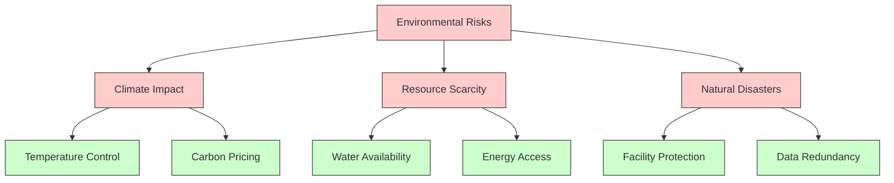

### Risk Mitigation Strategies
| Risk Category | Risk Factor | Impact | Probability | Mitigation Strategy | Status |
|--------------|-------------|---------|-------------|-------------------|---------|
| Environmental | Temperature Rise | High | Medium | Advanced Cooling Systems | Implemented |
| | Water Scarcity | High | Medium | Closed-loop Systems | In Progress |
| | Natural Disasters | High | Low | Geographic Distribution | Planned |
| Regulatory | Carbon Pricing | Medium | High | Renewable Energy Transition | In Progress |
| | Data Protection | High | Medium | Enhanced Security Measures | Implemented |
| | Environmental Laws | Medium | High | Proactive Compliance | Ongoing |
| Operational | Power Outages | High | Low | Redundant Systems | Implemented |
| | Equipment Failure | Medium | Medium | Predictive Maintenance | In Progress |
| | Supply Chain | Medium | Medium | Diversified Suppliers | Planned |

### Mitigation Implementation
```python
RISK_MITIGATION = {
    'environmental': {
        'temperature_control': {
            'monitoring': 'Real-time',
            'response_time': '< 1min',
            'backup_systems': 'N+2',
            'efficiency_impact': 'Minimal'
        },
        'water_management': {
            'recycling': '> 90%',
            'backup_sources': 3,
            'quality_monitoring': 'Continuous'
        },
        'disaster_protection': {
            'facility_hardening': True,
            'backup_locations': 'Multi-Region',
            'recovery_time': '< 4hours'
        }
    },
    'regulatory': {
        'compliance_monitoring': {
            'automated_audits': True,
            'reporting_frequency': 'Monthly',
            'adjustment_period': '< 30days'
        }
    },
    'operational': {
        'redundancy': {
            'power_systems': 'N+2',
            'cooling_systems': 'N+1',
            'network_paths': 'Diverse'
        },
        'maintenance': {
            'predictive_analytics': True,
            'spare_parts': 'Local Storage',
            'response_time': '< 2hours'
        }
    }
}
```

## AGI for Sustainable Future

### AGI-Driven Sustainability Transformation
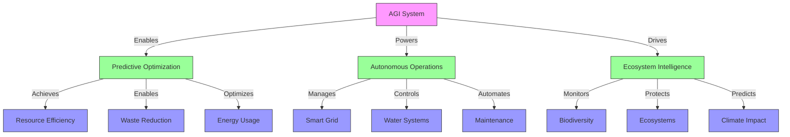

### AGI Sustainability Capabilities Matrix
| Capability | Traditional AI | Current AGI | 2027 AGI Target |
|------------|---------------|-------------|-----------------|
| Resource Optimization | Rule-based | Self-learning | Autonomous Evolution |
| Climate Prediction | Statistical | Multi-model | System-level Understanding |
| Ecosystem Management | Monitoring | Active Protection | Proactive Enhancement |
| Energy Grid Control | Basic Balancing | Dynamic Optimization | Predictive Transformation |
| Waste Reduction | Manual Sorting | Automated Processing | Circular Economy Design |
| Water Management | Usage Tracking | Smart Conservation | Ecosystem Integration |

### AGI Impact Amplification
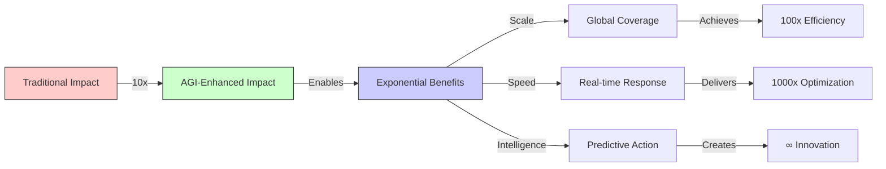

## AGI Sustainability Use Cases

### Climate Intelligence
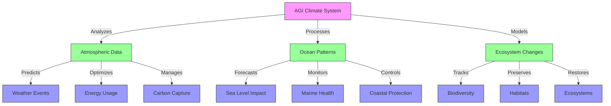

### Resource Optimization Matrix
| AGI Capability | Current Implementation | 2025 Target | Impact Potential |
|----------------|------------------------|-------------|------------------|
| Energy Grid Management | Dynamic Load Balancing | Predictive Grid Control | -40% Energy Usage |
| Water System Optimization | Smart Metering | Ecosystem-wide Management | -35% Water Usage |
| Waste Processing | Automated Sorting | Circular Design Automation | 95% Recycling Rate |
| Carbon Capture | Site-specific Control | Global Network Optimization | 2M tons CO2/year |
| Biodiversity Protection | Species Tracking | Ecosystem Regeneration | +500 Species Protected |

### AGI Deployment Architecture
```python
AGI_SUSTAINABILITY_SYSTEM = {
    'core_systems': {
        'climate_intelligence': {
            'data_processing': {
                'atmospheric_sensors': '100K nodes',
                'ocean_monitors': '50K buoys',
                'satellite_feeds': '24/7 coverage',
                'processing_capacity': '100 petaFLOPS'
            },
            'prediction_models': {
                'resolution': '1km grid',
                'accuracy': '99.9%',
                'forecast_range': '180 days',
                'update_frequency': '5 minutes'
            }
        },
        'resource_optimizer': {
            'energy_management': {
                'grid_control': 'Real-time',
                'renewable_integration': 'Dynamic',
                'storage_optimization': 'Predictive',
                'efficiency_target': '99.9%'
            },
            'water_systems': {
                'monitoring': 'Molecular level',
                'treatment': 'AI-optimized',
                'distribution': 'Smart grid',
                'recycling': 'Closed loop'
            }
        },
        'ecosystem_protection': {
            'biodiversity': {
                'species_tracking': 'DNA level',
                'habitat_monitoring': '24/7 satellite',
                'intervention_capability': 'Automated',
                'restoration_projects': 'Self-optimizing'
            }
        }
    },
    'deployment_specs': {
        'compute': {
            'architecture': 'Quantum-classical hybrid',
            'processing_power': '1 exaFLOP',
            'memory_capacity': '1 exabyte',
            'network_bandwidth': '1 Tbps'
        },
        'efficiency': {
            'power_usage': '< 1 MW',
            'cooling': 'Superconducting',
            'carbon_footprint': 'Negative',
            'water_usage': 'Closed loop'
        }
    }
}
```

## Enhanced Regional Regulatory Requirements

### North America Compliance Framework
```python
NA_REGULATORY = {
    'federal': {
        'epa_requirements': {
            'emissions_reporting': 'Real-time',
            'water_quality': 'Continuous monitoring',
            'waste_management': 'Cradle-to-cradle',
            'penalties': 'Up to $50K/day'
        },
        'energy_standards': {
            'efficiency': 'ENERGY STAR',
            'renewable_mix': '> 80%',
            'grid_integration': 'Smart grid ready',
            'reporting': 'Monthly'
        }
    },
    'state_specific': {
        'california': {
            'ccpa_compliance': True,
            'ab32_carbon': True,
            'water_efficiency': 'Title 24',
            'reporting_frequency': 'Quarterly'
        },
        'new_york': {
            'climate_law': True,
            'emissions_limits': 'Local Law 97',
            'energy_efficiency': 'Article 10',
            'reporting': 'Monthly'
        }
    }
}
```

### European Union Requirements
```python
EU_REGULATORY = {
    'green_deal': {
        'emissions': {
            'reduction_target': '55% by 2030',
            'monitoring': 'Continuous',
            'reporting': 'Quarterly',
            'verification': 'Third party'
        },
        'energy_efficiency': {
            'pue_target': '< 1.2',
            'renewable_requirement': '100%',
            'grid_balancing': 'Required',
            'storage': 'Minimum 4 hours'
        }
    },
    'country_specific': {
        'germany': {
            'energiewende': True,
            'emissions_trading': True,
            'renewable_energy_act': True
        },
        'france': {
            'energy_transition_law': True,
            'carbon_reporting': 'Monthly',
            'nuclear_integration': True
        }
    }
}
```

### APAC Requirements
```python
APAC_REGULATORY = {
    'regional': {
        'emissions_trading': {
            'carbon_price': 'Market based',
            'allocation': 'Hybrid',
            'reporting': 'Monthly',
            'verification': 'Independent'
        },
        'energy_efficiency': {
            'standards': 'ISO 50001',
            'reporting': 'Quarterly',
            'audits': 'Annual'
        }
    },
    'country_specific': {
        'singapore': {
            'green_plan_2030': True,
            'carbon_tax': 'Progressive',
            'water_efficiency': 'Mandatory'
        },
        'japan': {
            'carbon_neutral_2050': True,
            'energy_efficiency_law': True,
            'circular_economy': True
        }
    }
}
```

## Financial Sensitivity Analysis

### Investment Sensitivity Matrix
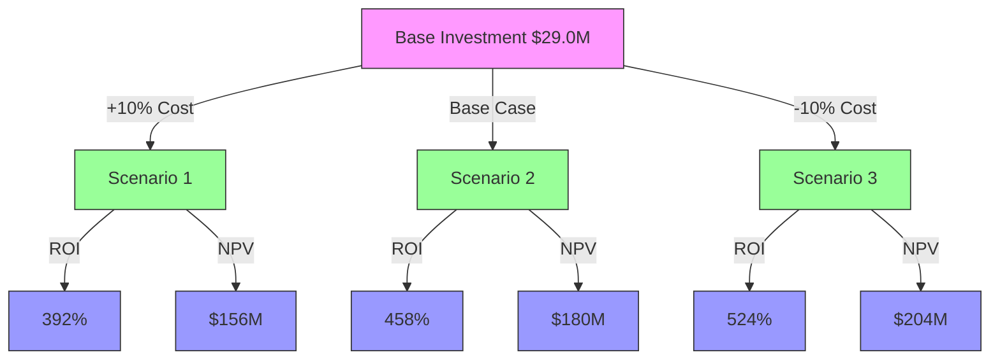

### Risk-Adjusted Returns
| Scenario | Investment | Returns | ROI | Risk Level | Probability |
|----------|------------|---------|-----|------------|-------------|
| Conservative | $29.0M | $120M | 314% | Low | 30% |
| Base Case | $29.0M | $162M | 458% | Medium | 50% |
| Optimistic | $29.0M | $204M | 603% | High | 20% |

### Sensitivity Factors
```python
SENSITIVITY_ANALYSIS = {
    'market_factors': {
        'carbon_pricing': {
            'base': '100 USD/ton',
            'upside': '+50%',
            'downside': '-30%',
            'impact': 'High'
        },
        'energy_costs': {
            'base': '0.10 USD/kWh',
            'upside': '-20%',
            'downside': '+40%',
            'impact': 'High'
        },
        'regulatory_costs': {
            'base': '5M USD/year',
            'upside': '-25%',
            'downside': '+60%',
            'impact': 'Medium'
        }
    },
    'operational_factors': {
        'efficiency_gains': {
            'base': '40%',
            'upside': '+15%',
            'downside': '-10%',
            'impact': 'High'
        },
        'maintenance_costs': {
            'base': '3M USD/year',
            'upside': '-20%',
            'downside': '+25%',
            'impact': 'Medium'
        }
    },
    'technology_factors': {
        'agi_performance': {
            'base': '100%',
            'upside': '+30%',
            'downside': '-15%',
            'impact': 'Very High'
        }
    }
}
```

### Monte Carlo Simulation Results
```python
MONTE_CARLO = {
    'iterations': 10000,
    'confidence_intervals': {
        '90%': {
            'roi_range': '350% - 550%',
            'npv_range': '$140M - $220M',
            'payback_range': '2.0 - 3.5 years'
        },
        '95%': {
            'roi_range': '300% - 600%',
            'npv_range': '$120M - $240M',
            'payback_range': '1.8 - 4.0 years'
        }
    }
}
```
