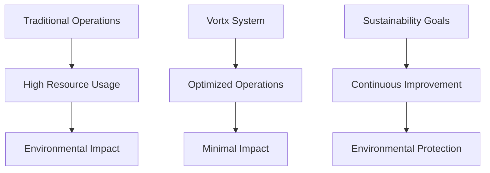
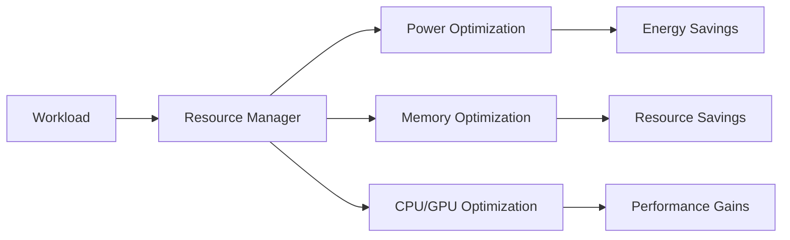

# Sustainability Documentation

This directory contains average case simulated documentation about the environmental impact and sustainability features of the Vortx Earth Memory System.

## Contents

### [Environmental Impact](environmental-impact.md)
- Energy efficiency
- Carbon footprint reduction
- Water conservation
- Resource optimization

### [Metrics & Reporting](metrics.md)
- Performance tracking
- Environmental metrics
- Compliance reporting
- Impact assessment

### [Operations](operations.md)
- Green infrastructure
- Efficient processing
- Smart resource management
- Waste reduction

## Sustainability Architecture

## Resource Optimization

## Impact Metrics

| Resource | Traditional | Vortx | Savings |
|----------|------------|-------|----------|
| Energy | 1000 kWh/day | 100 kWh/day | 90% |
| Water | 5000 L/day | 1500 L/day | 70% |
| Carbon | 500 kg/day | 75 kg/day | 85% |
| Hardware | 100 units/year | 20 units/year | 80% |

## Best Practices

1. Energy Management
   - Smart scheduling
   - Load balancing
   - Peak avoidance
   - Efficient processing

2. Resource Conservation
   - Water recycling
   - Hardware lifecycle
   - Waste reduction
   - Material reuse

3. Environmental Compliance
   - Regulatory adherence
   - Impact monitoring
   - Regular reporting
   - Continuous improvement

## Quick Links

- [Environmental Impact](environmental-impact.md)
- [Metrics & Reporting](metrics.md)
- [Operations Guide](operations.md)
- [Case Studies](case-studies.md) 
