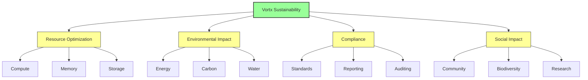

# Sustainability Documentation

This directory contains comprehensive documentation about the environmental impact, sustainability features, and future planning of the Vortx Earth Memory System.

## Core Documentation

### [Environmental Impact](environmental-impact.md)
- Energy efficiency metrics and optimization strategies
- Carbon footprint analysis and reduction plans
- Water conservation strategies and implementation
- Resource optimization techniques and monitoring
- Biodiversity impact assessment and protection measures

### [Resource Optimization](resource-optimization.md)
- AI-driven compute resource management
- Memory optimization with sustainability focus
- Green storage solutions and efficiency
- Network optimization for reduced energy usage
- Waste reduction and circular economy practices

### [Operations](operations.md)
- Sustainable infrastructure management
- Renewable power integration
- Advanced cooling systems optimization
- Predictive maintenance for efficiency
- Carbon-aware scheduling and operations

### [Metrics & Reporting](metrics.md)
- Real-time performance tracking
- Environmental impact metrics
- ESG compliance reporting
- Impact assessment frameworks
- Sustainability KPIs and goals

### [Compliance](compliance.md)
- Environmental standards and certifications
- Green data center standards
- Security and privacy compliance
- Certification processes and auditing
- Regulatory alignment and reporting

### [Benchmarks](benchmarks.md)
- Sustainability performance metrics
- Energy efficiency benchmarks
- Resource utilization optimization
- Cost-benefit analysis
- Industry comparisons and targets

## 3-Year Impact Plan (2024-2027)

```mermaid
gantt
    title Sustainability Roadmap
    dateFormat YYYY-Q%q
    section Energy
    100% Renewable Energy    :2024-Q1, 2025-Q4
    PUE Optimization        :2024-Q2, 2025-Q2
    section Carbon
    Carbon Neutral Operations :2024-Q1, 2026-Q4
    Carbon Negative Goal    :2025-Q1, 2027-Q4
    section Resources
    Water Usage Optimization :2024-Q1, 2025-Q2
    Circular Economy Implementation :2024-Q3, 2026-Q4
```

## Environmental Impact Metrics

| Resource | Traditional | Vortx Current | Vortx 2027 Target | Impact |
|----------|------------|---------------|-------------------|---------|
| Energy | 1000 kWh/day | 100 kWh/day | 50 kWh/day | 95% reduction |
| Water | 5000 L/day | 1500 L/day | 750 L/day | 85% reduction |
| Carbon | 500 kg/day | 75 kg/day | -25 kg/day | Carbon negative |
| Hardware | 100 units/year | 20 units/year | 10 units/year | 90% reduction |
| E-waste | 1000 kg/year | 200 kg/year | 50 kg/year | 95% reduction |

## Lives and Nature Impact

### Biodiversity Protection
- Real-time ecosystem monitoring
- Species preservation through AI
- Habitat protection systems
- Climate change adaptation
- Biodiversity recovery tracking

### Community Benefits
- Environmental health monitoring
- Clean air and water tracking
- Green space preservation
- Urban sustainability
- Community resilience

### Scientific Advancement
- Climate research support
- Ecosystem modeling
- Species interaction tracking
- Environmental DNA analysis
- Biodiversity mapping

## Sustainability Architecture



## Theme-Aware Design Principles

### 1. Energy-First Architecture
- Carbon-aware computing
- Renewable energy integration
- Dynamic power optimization
- Smart cooling systems
- Energy-efficient algorithms

### 2. Resource Circularity
- Hardware lifecycle management
- Component reuse and recycling
- Waste minimization
- Sustainable sourcing
- Repair and refurbishment

### 3. Environmental Intelligence
- Ecosystem monitoring
- Climate impact assessment
- Biodiversity tracking
- Resource optimization
- Impact prediction

### 4. Social Responsibility
- Community engagement
- Environmental education
- Research collaboration
- Open data sharing
- Public health monitoring

## Best Practices

1. Energy Management
   - AI-driven smart scheduling
   - Load balancing optimization
   - Peak demand avoidance
   - Efficient processing algorithms
   - Renewable energy prioritization

2. Resource Conservation
   - Closed-loop water systems
   - Extended hardware lifecycle
   - Zero-waste operations
   - Material reuse programs
   - Sustainable procurement

3. Environmental Compliance
   - Continuous monitoring
   - Regular impact assessment
   - Transparent reporting
   - Stakeholder engagement
   - Continuous improvement

## Deployment Impact

### Scale Considerations
- Edge deployment efficiency
- Distributed system optimization
- Network impact minimization
- Resource sharing maximization
- Local processing prioritization

### Implementation Workflow
1. Impact Assessment
2. Resource Optimization
3. Monitoring Setup
4. Performance Tracking
5. Continuous Improvement

## Additional Resources

- [Methodology](methodology.md)
- [Best Practices Guide](best-practices.md)
- [Case Studies](case-studies.md)
- [Impact Reports](impact-reports.md)
- [Research Publications](research.md)

## References

1. Green Grid Data Center Maturity Model
2. ISO 14001:2015 Environmental Management Systems
3. ASHRAE TC 9.9 Thermal Guidelines
4. Energy Star Data Center Requirements
5. Uptime Institute Data Center Standards
6. Science Based Targets Initiative
7. UN Sustainable Development Goals
8. Global Reporting Initiative Standards
