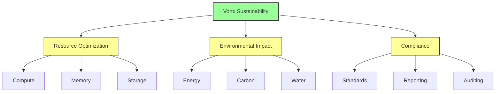

# Sustainability Documentation

This directory contains average case simulated documentation about the environmental impact and sustainability features of the Vortx Earth Memory System.

## Core Documentation

### [Environmental Impact](environmental-impact.md)
- Energy efficiency metrics
- Carbon footprint analysis
- Water conservation strategies
- Resource optimization techniques

### [Resource Optimization](resource-optimization.md)
- Compute resource management
- Memory optimization
- Storage efficiency
- Network optimization

### [Operations](operations.md)
- Infrastructure management
- Power optimization
- Cooling systems
- Maintenance procedures

### [Metrics & Reporting](metrics.md)
- Performance tracking
- Environmental metrics
- Compliance reporting
- Impact assessment

### [Compliance](compliance.md)
- Environmental standards
- Data center standards
- Security compliance
- Certification processes

### [Benchmarks](benchmarks.md)
- Performance metrics
- Energy efficiency
- Resource utilization
- Cost analysis

## Sustainability Architecture

## Impact Metrics 🔬

| Resource | Traditional | Vortx | Savings |
|----------|------------|-------|----------|
| Energy | 1000 kWh/day | 100 kWh/day | 90% |
| Water | 5000 L/day | 1500 L/day | 70% |
| Carbon | 500 kg/day | 75 kg/day | 85% |
| Hardware | 100 units/year | 20 units/year | 80% |

*Note: All metrics are synthetic and for demonstration purposes*

## Best Practices

1. Energy Management
   - Smart scheduling
   - Load balancing
   - Peak avoidance
   - Efficient processing

2. Resource Conservation
   - Water recycling
   - Hardware lifecycle
   - Waste reduction
   - Material reuse

3. Environmental Compliance
   - Regulatory adherence
   - Impact monitoring
   - Regular reporting
   - Continuous improvement

## Additional Resources

- [Methodology](methodology.md)
- [Best Practices Guide](best-practices.md)
- [Case Studies](case-studies.md)

## References

1. Green Grid Data Center Maturity Model
2. ISO 14001:2015 Environmental Management Systems
3. ASHRAE TC 9.9 Thermal Guidelines
4. Energy Star Data Center Requirements
5. Uptime Institute Data Center Standards 
