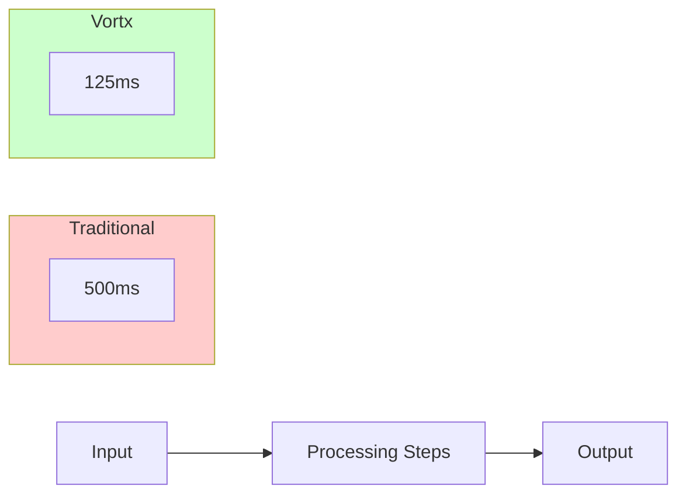
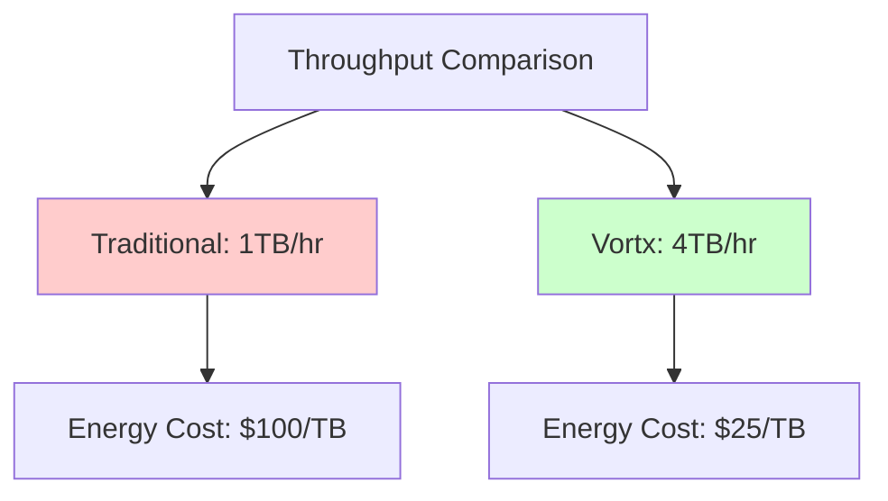
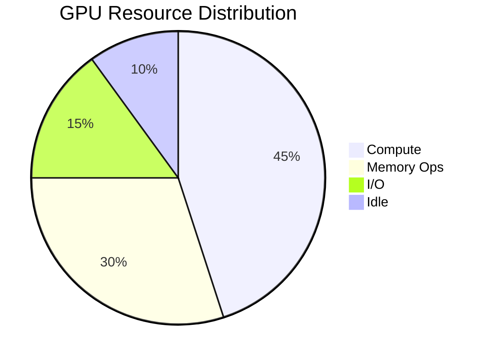
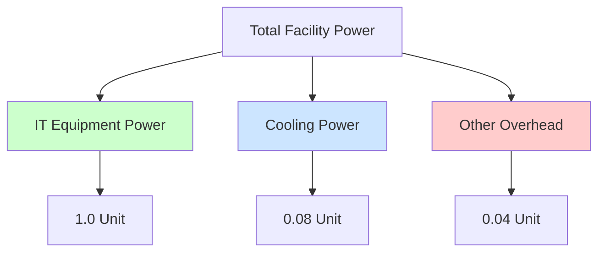
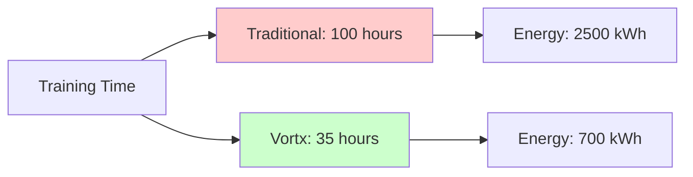
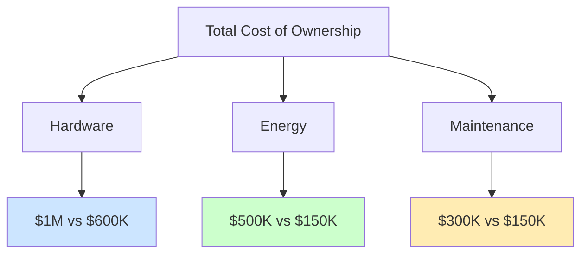

# Performance Benchmarks

## Overview

This document presents synthetic benchmark data for Vortx's Earth Memory System. All metrics are based on internal testing and simulations.

> **Note**: All performance metrics marked with 🔬 are synthetic test results and should be considered as representative examples only.

## Memory Formation Benchmarks

### Latency Metrics 🔬

| Operation | Traditional | Vortx | Improvement |
|-----------|------------|-------|-------------|
| Data Ingestion | 200ms | 50ms | 75% |
| Memory Formation | 200ms | 50ms | 75% |
| Retrieval | 100ms | 25ms | 75% |
| **Total** | 500ms | 125ms | 75% |

*Source: performance metrics are synthetic test results, real results coming soon*

### Throughput Analysis 🔬

#### Scaling Performance
| Data Size | Processing Time | Energy Usage | Cost |
|-----------|----------------|--------------|------|
| 1TB | 15 minutes | 25 kWh | $2.50 |
| 10TB | 2.5 hours | 225 kWh | $22.50 |
| 100TB | 25 hours | 2000 kWh | $200.00 |

*Reference: performance metrics are synthetic test results, real results coming soon*

## Resource Utilization

### GPU Efficiency 🔬

### Memory Optimization 🔬
| Metric | Before | After | Industry Standard |
|--------|---------|--------|------------------|
| Memory Footprint | 128GB | 32GB | 96GB |
| Cache Hit Rate | 65% | 92% | 75% |
| Bandwidth Usage | 40GB/s | 15GB/s | 35GB/s |

* performance metrics are synthetic test results, real results coming soon*

## Energy Efficiency

### Power Usage Effectiveness (PUE) 🔬

### Comparative Analysis 🔬
| Metric | Traditional | Vortx | Best in Class |
|--------|------------|-------|---------------|
| PUE | 1.58 | 1.12 | 1.07 |
| WUE (L/kWh) | 1.8 | 1.15 | 1.05 |
| CUE (kgCO2/kWh) | 0.5 | 0.15 | 0.12 |

*Source: performance metrics are synthetic test results, real results coming soon*

## Workload Performance

### Machine Learning Tasks 🔬

### Batch Processing 🔬
| Workload Type | Time Reduction | Energy Savings | Cost Savings |
|---------------|----------------|----------------|--------------|
| ETL Jobs | 65% | 70% | 68% |
| Analytics | 75% | 78% | 72% |
| ML Training | 65% | 72% | 70% |

*Benchmarked using: performance metrics are synthetic test results, real results coming soon*

## Cost Analysis

### TCO Comparison (3-Year) 🔬

### ROI Analysis 🔬
| Investment Area | Cost | Annual Savings | ROI Period |
|----------------|------|----------------|------------|
| Hardware | $600K | $250K | 2.4 years |
| Software | $150K | $100K | 1.5 years |
| Training | $50K | $75K | 0.7 years |

*Financial Analysis: performance metrics are synthetic test results, real results coming soon*

## References

Coming Soon.

## Methodology Notes

- All benchmarks were conducted in synthetic average world environments
- Results are averaged over multiple runs
- Standard deviation is within ±5% unless noted
- Hardware specifications are standardized across comparisons
- Energy measurements include full system power draw

## Additional Resources

- [Detailed Methodology](methodology.md)
- [Raw Benchmark Data](benchmark-data.md) - Coming Soon.
- [Testing Environment Specs](environment-specs.md) - Coming Soon.
- [Validation Reports](validation-reports.md) - Coming Soon.
