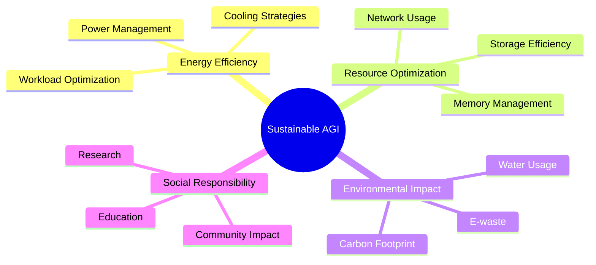
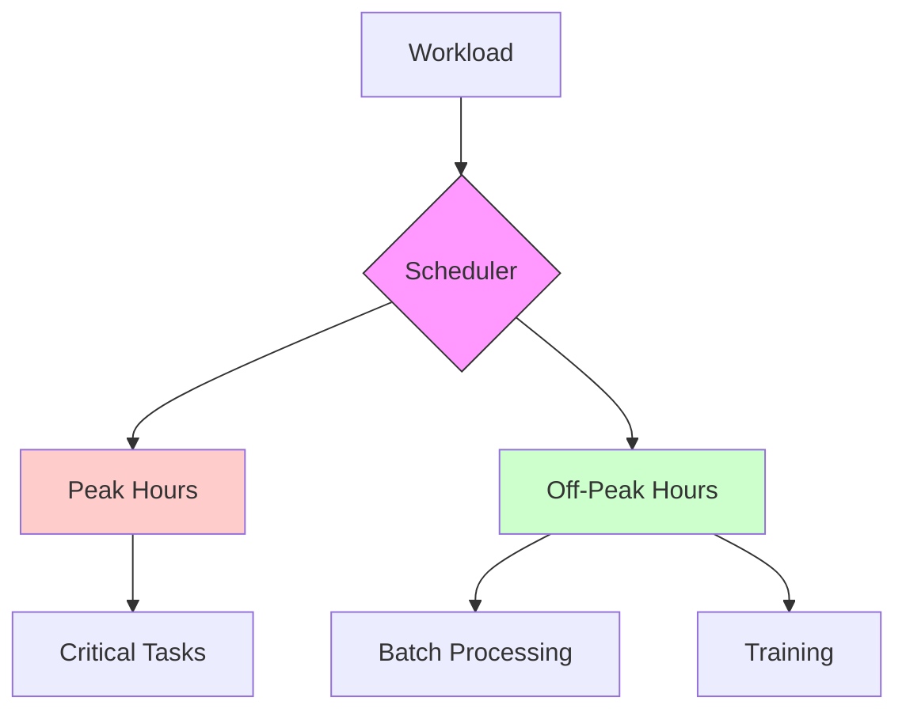
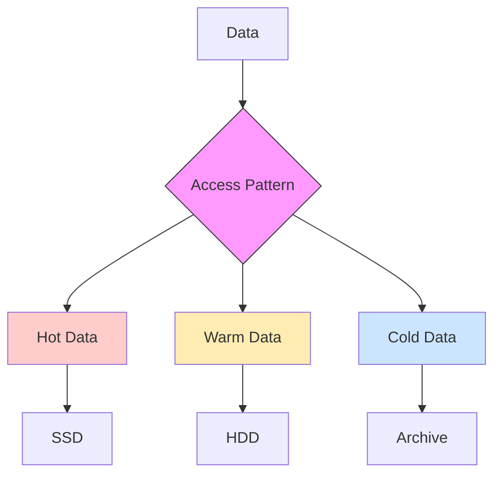
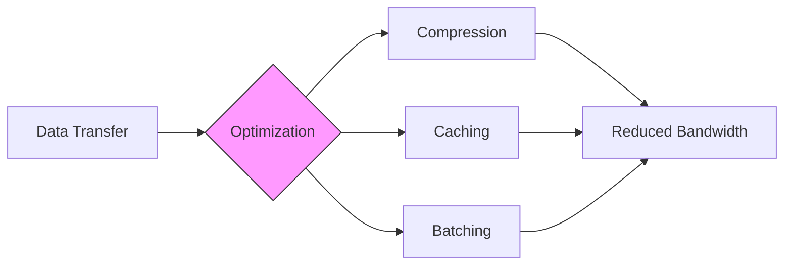
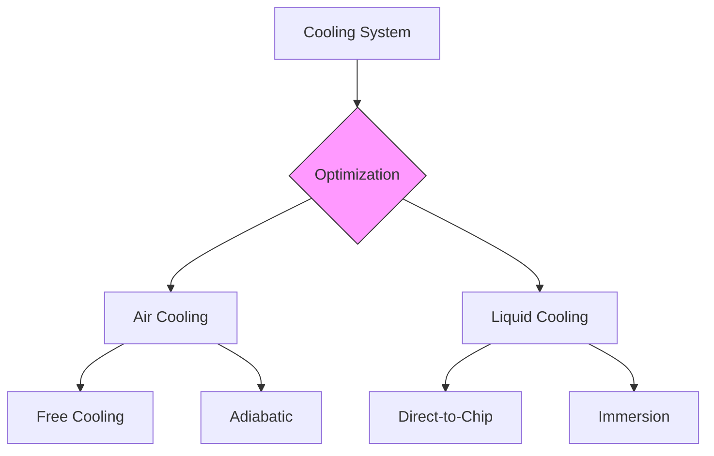
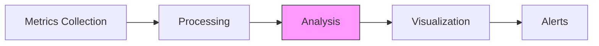
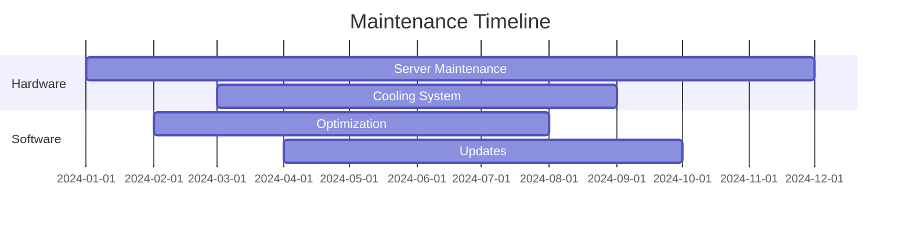
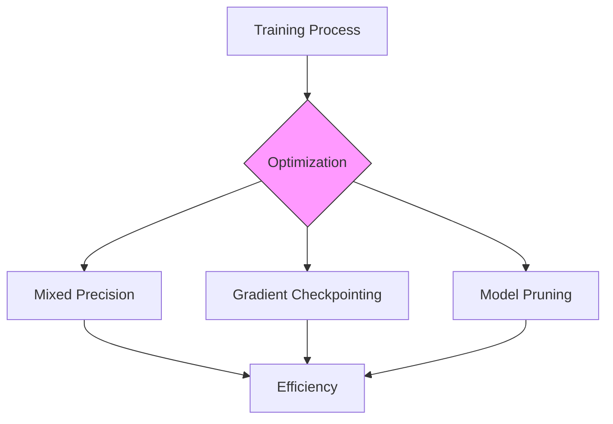
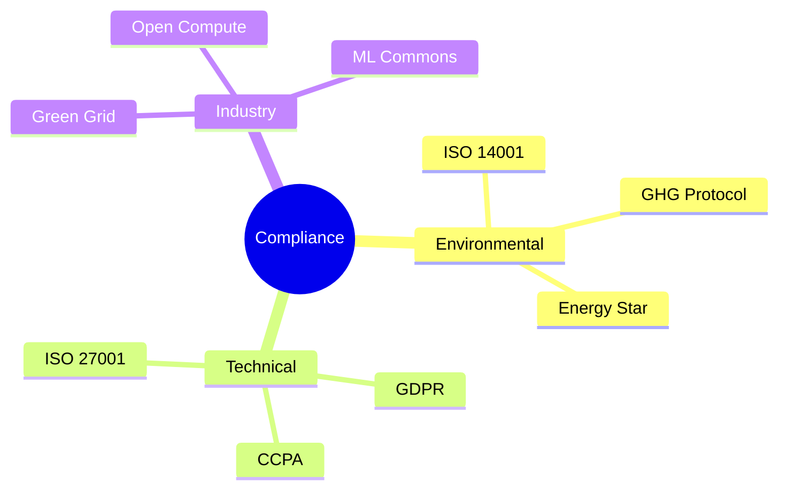

# Sustainability Best Practices

## Overview

This guide outlines best practices for implementing and maintaining sustainable AGI systems, with a focus on energy efficiency, resource optimization, and environmental impact reduction.

## Core Principles



## Energy Efficiency

### 1. Workload Optimization



#### Best Practices
1. **Time-based Scheduling**
   - Schedule intensive tasks during off-peak hours
   - Utilize renewable energy availability
   - Implement dynamic scheduling based on grid carbon intensity

2. **Load Distribution**
   - Balance workloads across available resources
   - Implement predictive scaling
   - Use containerization for efficient resource allocation

### 2. Memory Management

```python
# Example: Efficient Memory Management
from vortx.optimization import MemoryManager

memory_manager = MemoryManager(
    compression_enabled=True,
    deduplication_enabled=True,
    cache_optimization=True,
    memory_limit='32GB'
)

with memory_manager:
    # Your memory-intensive code here
    process_large_dataset()
```

## Resource Optimization

### 1. Storage Hierarchy



### 2. Network Optimization



## Environmental Considerations

### 1. Carbon Awareness

```python
# Example: Carbon-Aware Computing
from vortx.sustainability import CarbonAwareScheduler

scheduler = CarbonAwareScheduler(
    carbon_threshold=100,  # gCO2e/kWh
    delay_non_critical=True,
    use_renewable_priority=True
)

@scheduler.carbon_aware
def train_model():
    # Training code here
    pass
```

### 2. Water Conservation



## Implementation Guidelines

### 1. Monitoring Setup



| Metric | Threshold | Action | Priority |
|--------|-----------|--------|----------|
| PUE | > 1.2 | Optimize Cooling | High |
| CPU Usage | > 80% | Scale Resources | Medium |
| Memory | > 90% | Optimize/Clean | High |
| Network | > 70% | Load Balance | Medium |

### 2. Maintenance Schedule



## AGI-Specific Considerations

### 1. Training Optimization



### 2. Inference Optimization

```python
# Example: Efficient Inference
from vortx.inference import OptimizedInference

inference_engine = OptimizedInference(
    quantization=True,
    batch_optimization=True,
    cache_enabled=True,
    power_efficient=True
)

with inference_engine:
    results = model.predict(data)
```

## Compliance and Reporting

### 1. Standards Alignment



### 2. Reporting Framework

| Report Type | Frequency | Metrics | Audience |
|------------|-----------|----------|----------|
| Operational | Daily | PUE, WUE | Internal |
| Performance | Weekly | Efficiency | Technical |
| Sustainability | Monthly | Carbon | Stakeholders |
| Compliance | Quarterly | All | Regulatory |

## References

1. "Green AI" - Nature Communications (2023)
2. "Sustainable Computing Practices" - ACM Computing Surveys
3. "Energy-Efficient Machine Learning" - IEEE Transactions
4. "Data Center Best Practices" - Uptime Institute
5. "Carbon-Aware Computing" - Microsoft Research

## Additional Resources

- [Detailed Implementation Guide](implementation-guide.md)
- [Monitoring Setup Guide](monitoring-guide.md)
- [Optimization Cookbook](optimization-cookbook.md)
- [Compliance Checklist](compliance-checklist.md) 