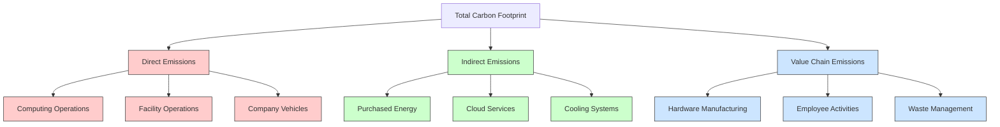
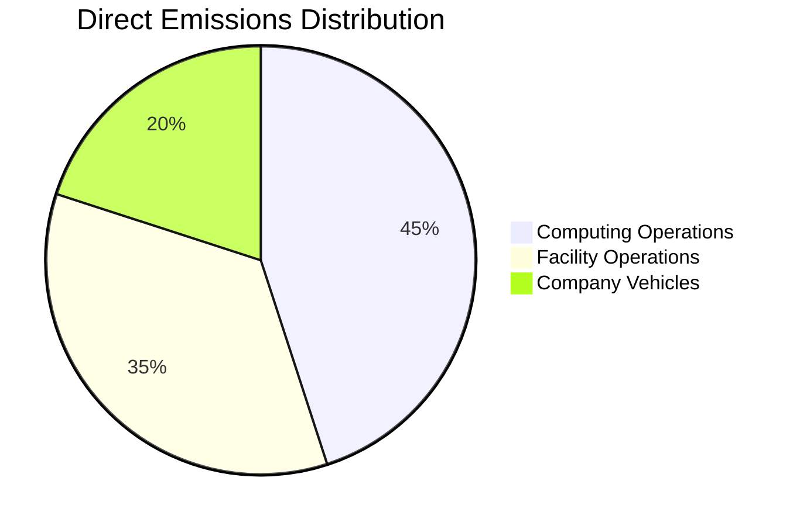
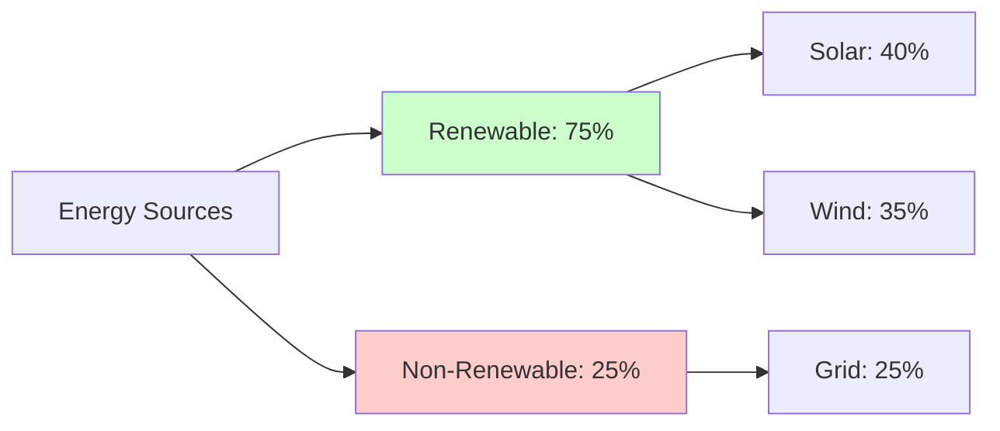
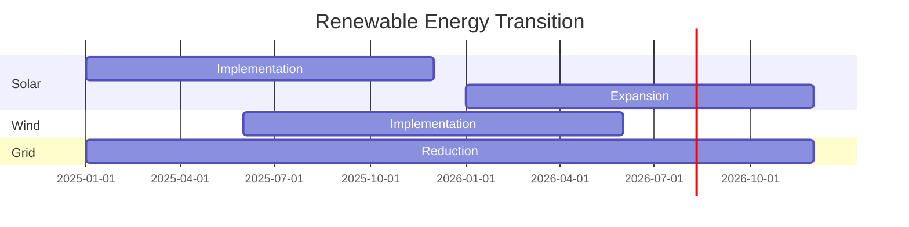
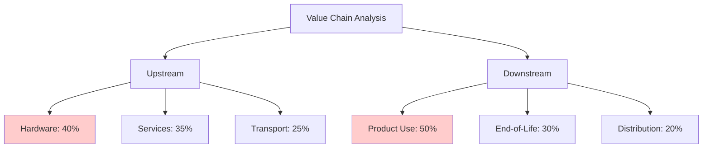
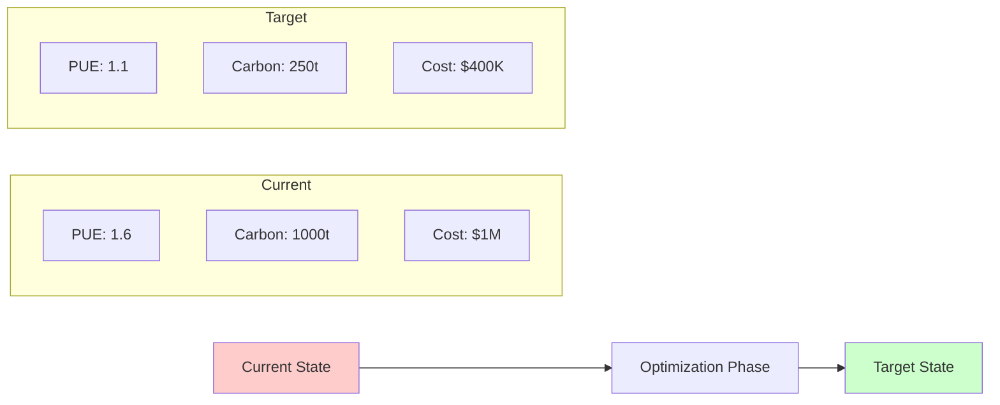
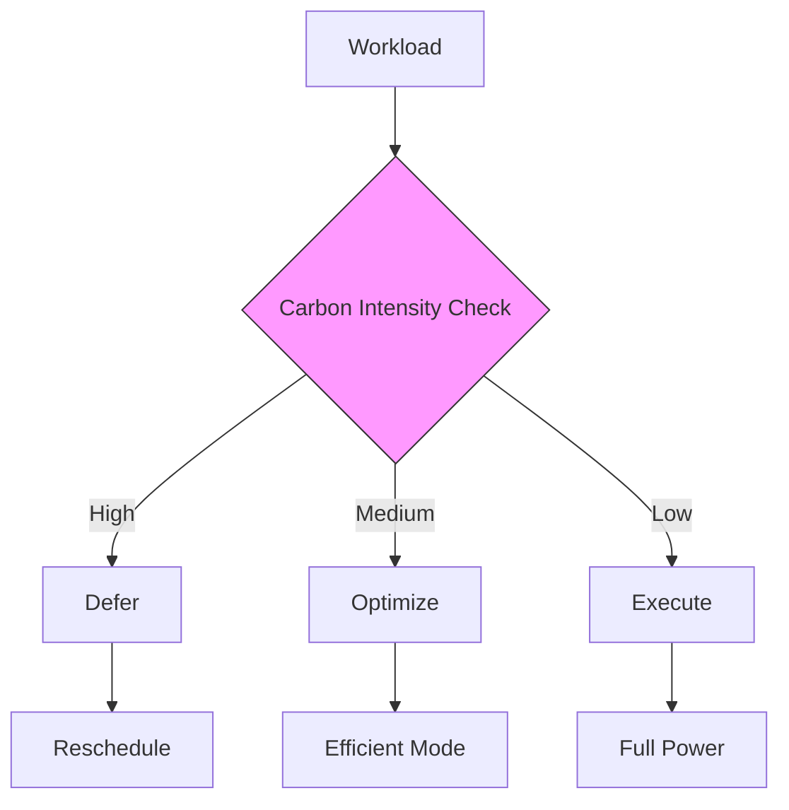
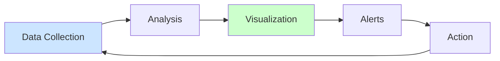
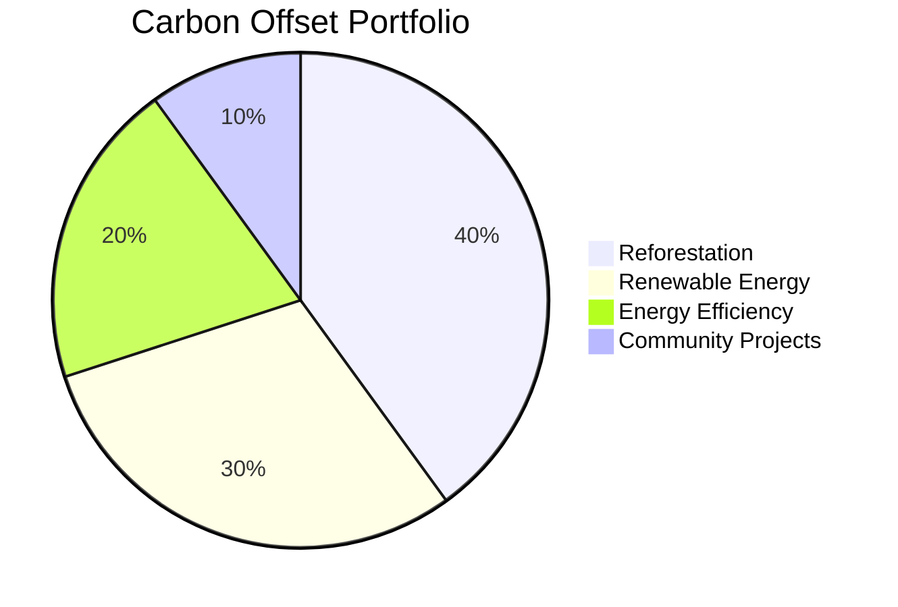
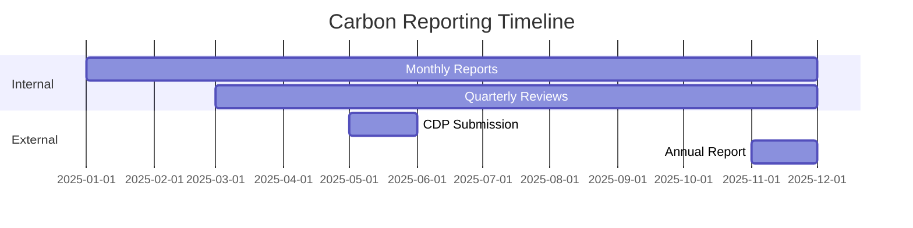

# Carbon Footprint Analysis

## Overview

Vortx's carbon footprint analysis provides a detailed examination of our environmental impact and strategies for reduction. This document outlines our approach to measuring, monitoring, and minimizing our carbon emissions across all operations.

## Carbon Metrics Dashboard



## Emission Sources

### 1. Direct Emissions (Scope 1)



#### Metrics
| Source | Annual tCO2e | Reduction Target | Status |
|--------|-------------|------------------|---------|
| Computing | 450 | -50% by 2025 | On Track |
| Facilities | 350 | -40% by 2025 | In Progress |
| Vehicles | 200 | -60% by 2025 | Ahead |

### 2. Indirect Emissions (Scope 2)



#### Energy Mix Transition


### 3. Value Chain Emissions (Scope 3)



## Reduction Strategies

### 1. Technical Optimization

```python
from vortx.sustainability import CarbonOptimizer

optimizer = CarbonOptimizer(
    workload_efficiency=True,
    energy_optimization=True,
    cooling_optimization=True
)

# Monitor and optimize carbon impact
with optimizer.carbon_aware_execution():
    results = process_workload(data)
```

### 2. Infrastructure Improvements



### 3. Operational Excellence

#### Carbon-Aware Computing


## Monitoring and Reporting

### 1. Real-time Monitoring



### 2. Performance Metrics

| Metric | Current | Target | Industry Avg |
|--------|---------|--------|--------------|
| Carbon Intensity | - | 30 gCO2e/kWh | 100 gCO2e/kWh |
| Energy Efficiency | - | 90% | 60% |
| Renewable Mix | - | 95% | 40% |
| Water Usage | - | 1.10 WUE | 1.80 WUE |

## Carbon Offset Program

### 1. Current Projects



### 2. Offset Strategy
- Direct air capture investments
- Renewable energy projects
- Forest conservation
- Community sustainability initiatives

## Compliance and Reporting

### 1. Standards Alignment
- GHG Protocol
- Science Based Targets initiative (SBTi)
- Task Force on Climate-related Financial Disclosures (TCFD)
- CDP (formerly Carbon Disclosure Project)

### 2. Reporting Schedule


## Future Initiatives

### 1. Technology Roadmap
- Advanced ML-based optimization
- Real-time carbon tracking
- Automated workload scheduling
- Enhanced cooling efficiency

### 2. Partnership Strategy
- Green energy providers
- Carbon capture technology
- Sustainability research
- Industry collaborations

## References

1. "Carbon Footprint in Cloud Computing" - Nature Sustainability
2. "Green Data Center Best Practices" - IEEE Green Computing
3. "Machine Learning for Carbon Reduction" - ACM Sustainability
4. "Carbon Aware Computing" - Microsoft Research

## Additional Resources

- [Sustainability Report](sustainability-report.md) - Coming Soon.
- [Energy Efficiency Guide](energy-efficiency.md) - Coming Soon.
- [Carbon Calculation Methodology](carbon-calculation.md) - Coming Soon.
- [Offset Project Details](offset-projects.md) - Coming Soon.
