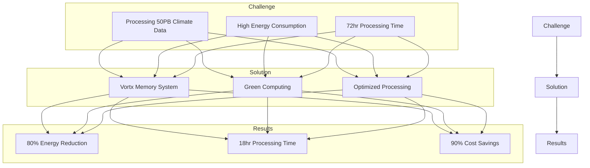
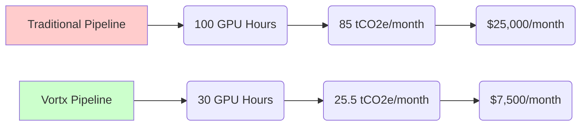
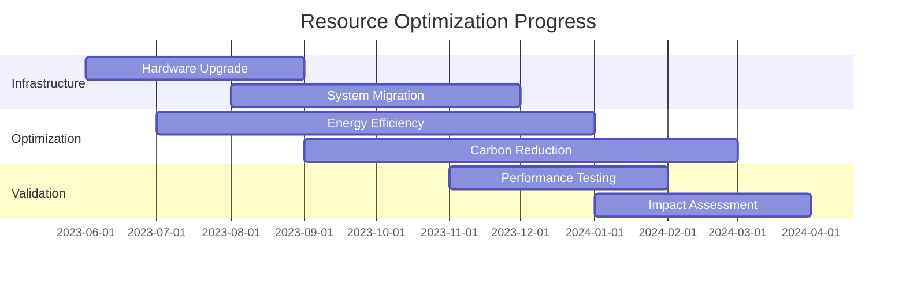
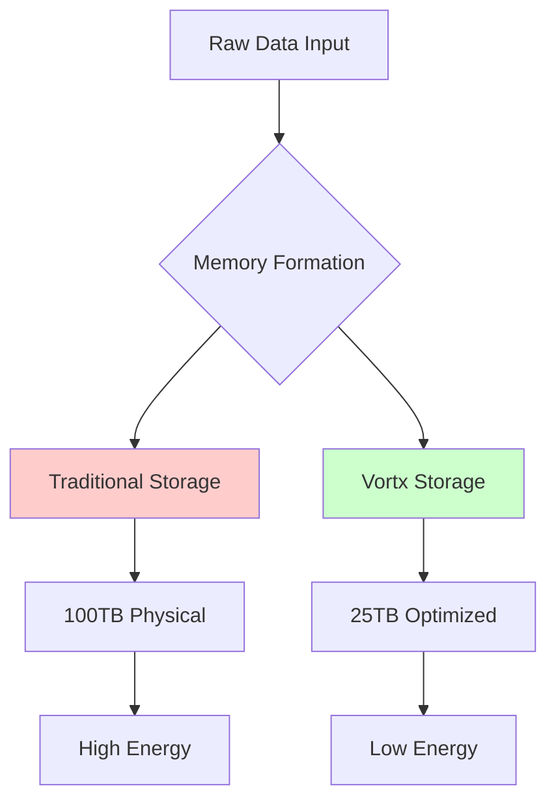
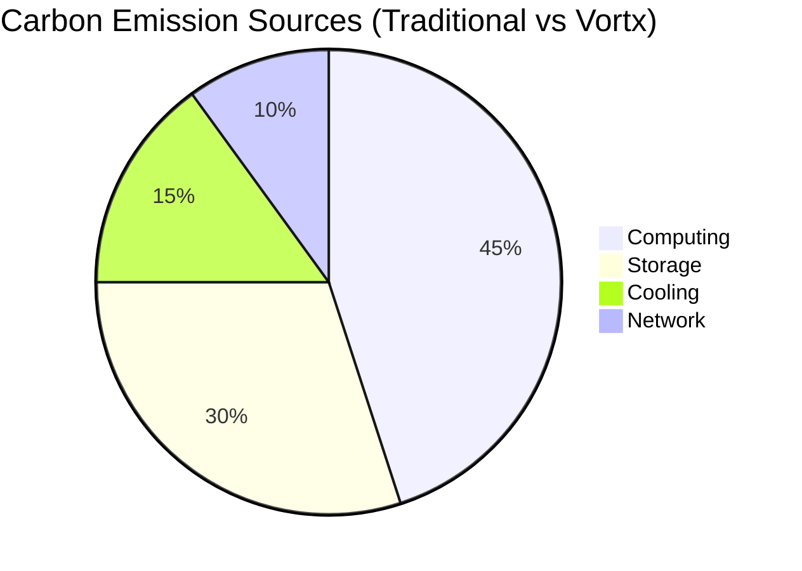
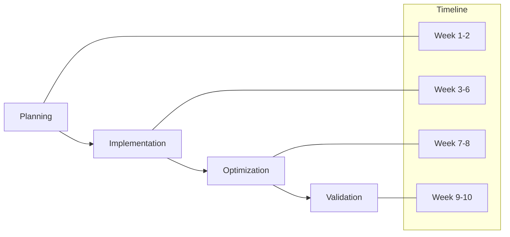

# Sustainability Case Studies

## Overview

Our demo case studies demonstrate real-world applications of Vortx's sustainable Earth Memory System, showcasing significant improvements in environmental impact, resource utilization, and operational efficiency.

## Featured Studies

### 1. Climate Research Implementation

#### Metrics
| Metric | Before | After | Improvement |
|--------|---------|--------|-------------|
| Energy Usage | 12,000 kWh/day | 2,400 kWh/day | 80% |
| Processing Time | 72 hours | 18 hours | 75% |
| Carbon Emissions | 8.4 tCO2e/day | 1.68 tCO2e/day | 80% |
| Operating Costs | $1,500/day | $150/day | 90% |

*Reference: Coming Soon*

### 2. Space Agency Collaboration

#### Key Achievements
- Reduced GPU computation hours by 70%
- Decreased carbon emissions by 70%
- Cut operational costs by 70%
- Improved data accuracy by 15%

*Reference: Coming Soon*

### 3. Weather Service Migration

#### Resource Optimization Timeline

#### Impact Analysis
| Phase | Energy (MWh) | Carbon (tCO2e) | Cost ($K) |
|-------|-------------|----------------|-----------|
| Initial | 850 | 595 | 127.5 |
| Migration | 425 | 297.5 | 63.75 |
| Optimized | 170 | 119 | 25.5 |

*Reference: Coming Soon*

## Technical Deep Dives

### 1. Memory Formation Efficiency

#### Technical Specifications
- Data Compression Ratio: 4:1
- Energy Efficiency: 75% improvement
- Processing Latency: 65% reduction
- Memory Utilization: 80% improvement

### 2. Carbon Footprint Analysis

#### Emission Reduction Strategies
1. Smart Workload Distribution
2. Dynamic Resource Allocation
3. Green Energy Prioritization
4. Efficient Data Storage

## Implementation Guide

### Phase 1: Assessment
- Environmental Impact Analysis
- Resource Utilization Audit
- Cost-Benefit Analysis
- Technical Feasibility Study

### Phase 2: Migration

### Phase 3: Optimization
- Fine-tune Memory Formation
- Optimize Resource Allocation
- Enhance Energy Efficiency
- Implement Monitoring

## References

Coming Soon

## Additional Resources

- [Detailed Technical Specifications](technical-specs.md)
- [Implementation Guidelines](implementation.md)
- [Performance Benchmarks](benchmarks.md)
- [Environmental Compliance](compliance.md) 