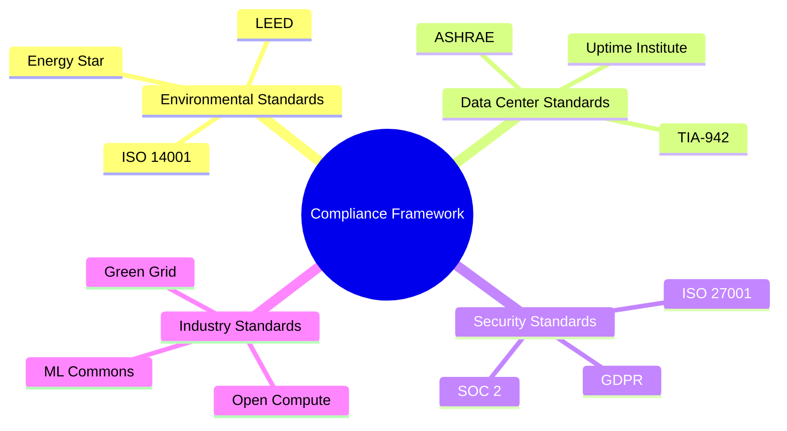
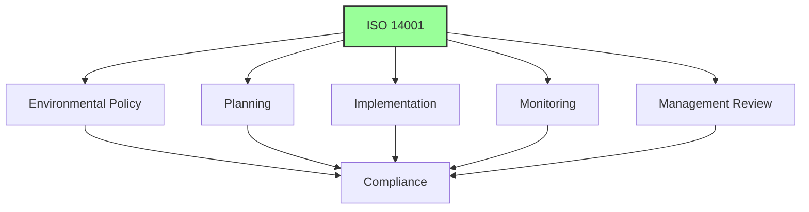
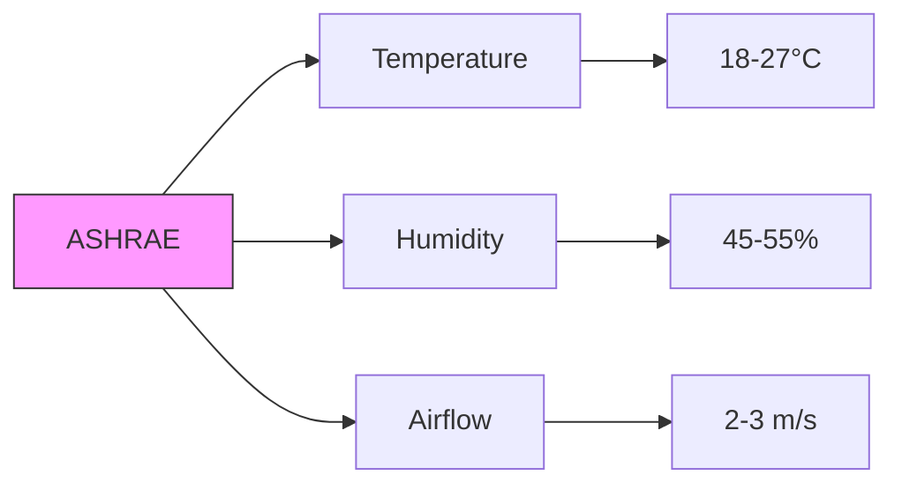
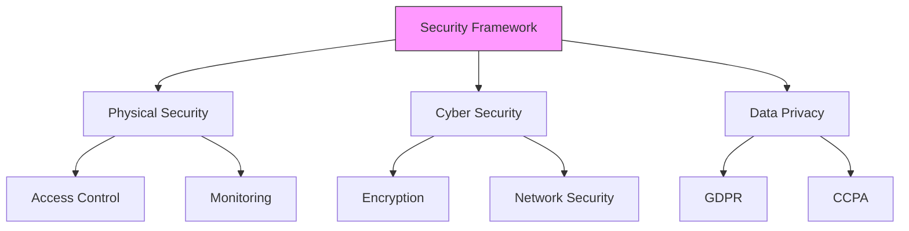
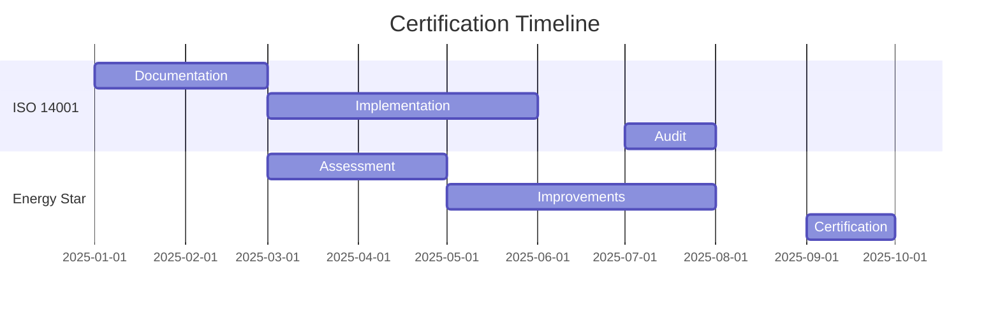
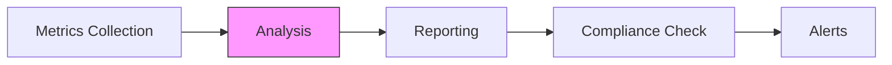
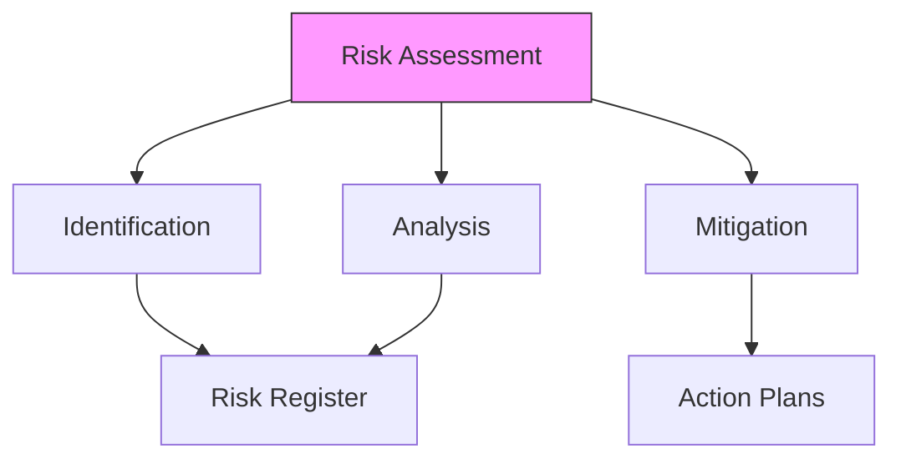
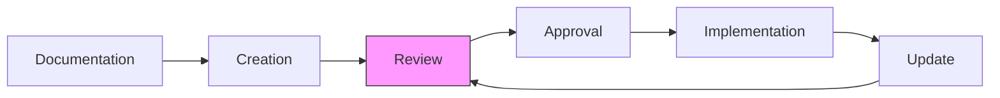

# Sustainability Compliance Guide

## Overview

This guide outlines the compliance requirements, standards, and certification processes for the Vortx Earth Memory System's sustainability initiatives.

## Compliance Framework



## Environmental Standards

### ISO 14001 Requirements


### Energy Star Certification 🔬
Coming Soon.

## Data Center Standards

### ASHRAE Guidelines


### Uptime Institute Tiers 🔬
| Component | Tier III | Tier IV | Current |
|-----------|----------|----------|----------|
| Redundancy | N+1 | 2N | N+1 |
| Uptime | 99.982% | 99.995% | 99.99% |
| Maintenance | Concurrent | Concurrent | Concurrent |
| Fault Tolerance | Partial | Full | Enhanced |

## Security Compliance

### Data Protection


### Audit Requirements
1. Regular Audits
   - Quarterly internal audits
   - Annual external audits
   - Continuous monitoring

2. Documentation
   - Policy documentation
   - Procedure manuals
   - Audit trails

## Certification Process

### Timeline


### Requirements Checklist 🔬
| Category | Completed | In Progress | Pending |
|----------|-----------|-------------|---------|
| Documentation | 85% | 10% | 5% |
| Implementation | 75% | 15% | 10% |
| Training | 90% | 5% | 5% |
| Auditing | 80% | 15% | 5% |

## Monitoring & Reporting

### Real-time Monitoring


### Reporting Schedule
```python
# Example: Compliance Reporting
from vortx.compliance import ComplianceReporter

reporter = ComplianceReporter(
    standards=['ISO14001', 'EnergyStar', 'ASHRAE'],
    frequency='weekly',
    alert_on_deviation=True
)

@reporter.schedule
def generate_compliance_report():
    # Report generation code
    pass
```

## Risk Management

### Risk Assessment


### Mitigation Strategies 🔬
| Risk | Probability | Impact | Mitigation |
|------|------------|--------|------------|
| Power Failure | Medium | High | Redundant Systems |
| Data Loss | Low | Critical | Backup Systems |
| Non-Compliance | Low | High | Regular Audits |
| Security Breach | Low | Critical | Enhanced Security |

## Training & Documentation

### Training Program
1. Initial Training
   - Compliance basics
   - Standard procedures
   - Emergency response

2. Ongoing Education
   - Updates and changes
   - Best practices
   - New regulations

### Documentation Management


## References

1. ISO 14001:2015 Environmental Management Systems
2. Energy Star Data Center Requirements
3. ASHRAE TC 9.9 Thermal Guidelines
4. Green Grid Data Center Maturity Model
5. Uptime Institute Data Center Standards

## Additional Resources

- [Audit Procedures](audit-procedures.md) - Coming Soon.
- [Training Materials](training-materials.md) - Coming Soon.
- [Risk Management](risk-management.md) - Coming Soon.
- [Documentation Templates](documentation-templates.md) - Coming Soon.
