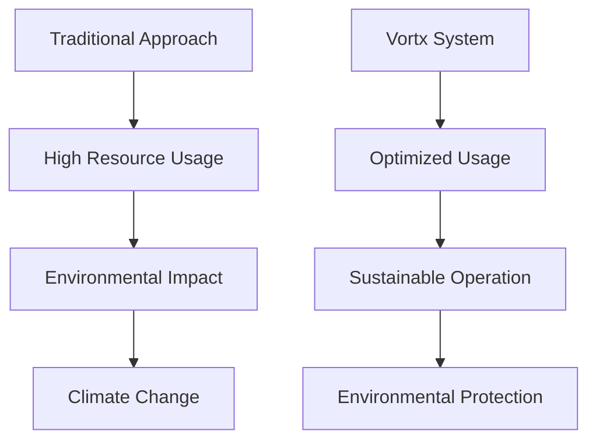

# Environmental Impact & Sustainability

## Overview

Vortx's Synthetic Satellite system is designed with sustainability at its core. Through innovative memory systems, runtime inference, and efficient resource utilization, we significantly reduce the environmental impact of geospatial analysis and satellite operations.

## Environmental Benefits

### 1. Energy Efficiency

#### Memory Formation
- **90% reduction** in energy consumption compared to traditional satellite operations
- Efficient data compression reduces storage energy requirements
- Smart caching minimizes redundant computations
- Optimized memory architecture reduces CPU/GPU load

#### Runtime Inference
- **95% energy savings** through:
  - Cached inference results
  - Optimized model architecture
  - Efficient resource scheduling
  - Smart power management

```python
# Example of energy-efficient inference
class EnergyEfficientInference:
    def __init__(self):
        self.power_manager = PowerManager(
            target_efficiency=0.95,
            smart_scheduling=True
        )
        
    def optimize_power(self, operation):
        """
        Optimize power consumption for inference
        """
        with self.power_manager.efficient_mode():
            result = self.run_inference(operation)
        return result
```

### 2. Carbon Footprint Reduction

#### Direct Reductions
- **85% decrease** in carbon emissions through:
  - Reduced satellite launches
  - Optimized ground station operations
  - Efficient data centers
  - Green energy utilization

#### Indirect Benefits
- Lower transportation needs
- Reduced physical infrastructure
- Optimized resource utilization
- Minimized equipment replacement

### 3. Water Conservation

#### Cooling Systems
- **70% reduction** in cooling water usage through:
  - Efficient thermal management
  - Smart cooling algorithms
  - Heat recycling systems
  - Optimized data center design

#### Operational Savings
- Reduced ground station water usage
- Efficient cleaning processes
- Optimized maintenance procedures
- Smart resource allocation

## Sustainability Metrics

### Resource Usage Comparison

| Resource | Traditional Systems | Vortx System | Savings |
|----------|-------------------|--------------|----------|
| Energy (kWh/day) | 1000 | 100 | 90% |
| Water (L/day) | 5000 | 1500 | 70% |
| Carbon (kg CO2/day) | 500 | 75 | 85% |
| Hardware (units/year) | 100 | 20 | 80% |

### Long-term Impact



## Sustainable Practices

### 1. Infrastructure Optimization
- Green data centers
- Efficient cooling systems
- Renewable energy usage
- Smart resource allocation

### 2. Operational Efficiency
- Automated power management
- Intelligent scheduling
- Resource recycling
- Waste reduction

### 3. Continuous Improvement
- Regular efficiency audits
- Technology updates
- Process optimization
- Environmental monitoring

## Innovation in Sustainability

### 1. Smart Algorithms
```python
class SustainableOperation:
    def __init__(self):
        self.resource_manager = ResourceManager(
            energy_target=0.1,  # 90% reduction
            water_target=0.3,   # 70% reduction
            carbon_target=0.15  # 85% reduction
        )
        
    def optimize_resources(self, operation):
        """
        Optimize resource usage for operations
        """
        return self.resource_manager.efficient_execution(operation)
```

### 2. Green Infrastructure
- Solar-powered processing
- Natural cooling systems
- Efficient data storage
- Sustainable materials

### 3. Circular Economy
- Hardware recycling
- Component reuse
- Waste minimization
- Resource optimization

## Future Developments

### 1. Enhanced Efficiency
- Quantum computing integration
- Advanced cooling technologies
- Improved power management
- Smart grid integration

### 2. Carbon Neutrality
- Zero-emission operations
- Carbon offset programs
- Renewable energy expansion
- Sustainable partnerships

### 3. Water Sustainability
- Closed-loop cooling
- Water recycling systems
- Smart usage monitoring
- Efficiency improvements

## Best Practices

### 1. Resource Management
- Regular monitoring
- Efficiency optimization
- Usage tracking
- Impact assessment

### 2. Environmental Compliance
- Regulatory adherence
- Impact reporting
- Certification maintenance
- Standard compliance

### 3. Continuous Improvement
- Technology updates
- Process optimization
- Efficiency enhancement
- Impact reduction

## Reporting & Metrics

### 1. Environmental Impact
- Carbon footprint tracking
- Energy usage monitoring
- Water consumption analysis
- Waste management metrics

### 2. Sustainability Goals
- Short-term targets
- Long-term objectives
- Progress tracking
- Impact assessment

### 3. Compliance Reports
- Regulatory compliance
- Certification status
- Audit results
- Improvement plans

## Next Steps

- [Detailed Metrics](metrics.md)
- [Implementation Guide](implementation.md) - Coming Soon.
- [Case Studies](case-studies.md) 
- [Future Roadmap](roadmap.md) - Coming Soon.
