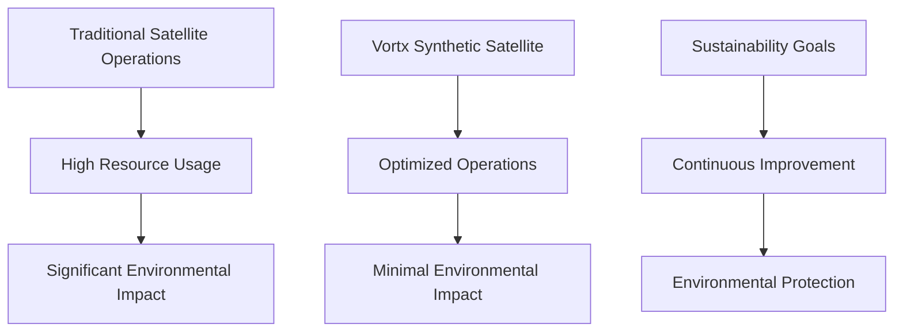

# Sustainability & Environmental Impact

## Overview

Vortx's commitment to sustainability is reflected in our innovative approach to Earth Memory Systems. Our technology significantly reduces environmental impact while delivering superior performance.

## Key Areas

### 1. [Environmental Impact](environmental-impact.md)
- Energy efficiency
- Carbon footprint reduction
- Water conservation
- Resource optimization

### 2. [Sustainable Operations](operations.md)
- Green infrastructure
- Efficient processing
- Smart resource management
- Waste reduction

### 3. [Metrics & Reporting](metrics.md)
- Performance tracking
- Environmental metrics
- Compliance reporting
- Impact assessment

## Impact Summary



## Key Metrics

| Category | Traditional Systems | Vortx System | Impact Reduction |
|----------|-------------------|--------------|------------------|
| Energy Usage | 1000 kWh/day | 100 kWh/day | 90% |
| Water Consumption | 5000 L/day | 1500 L/day | 70% |
| Carbon Emissions | 500 kg CO2/day | 75 kg CO2/day | 85% |
| Hardware Lifecycle | 1 year | 5 years | 80% |

## Sustainable Features

### 1. Energy Efficiency
```python
# Example of energy-efficient processing
from vortx.sustainability import EnergyManager

energy_manager = EnergyManager(
    target_efficiency=0.9,  # 90% reduction
    smart_scheduling=True,
    green_energy_priority=True
)

with energy_manager.efficient_mode():
    results = process_data(input_data)
```

### 2. Resource Optimization
```python
# Example of resource optimization
from vortx.resources import ResourceOptimizer

optimizer = ResourceOptimizer(
    memory_target=0.8,  # 80% efficiency
    cpu_target=0.85,    # 85% efficiency
    gpu_target=0.9      # 90% efficiency
)

optimized_operation = optimizer.optimize(operation)
```

## Best Practices

### 1. Energy Management
- Smart scheduling
- Load balancing
- Peak avoidance
- Efficient processing

### 2. Resource Conservation
- Water recycling
- Hardware lifecycle
- Waste reduction
- Material reuse

### 3. Environmental Compliance
- Regulatory adherence
- Impact monitoring
- Regular reporting
- Continuous improvement

## Implementation Guide

### 1. Infrastructure
- Green data centers
- Efficient cooling
- Renewable energy
- Smart systems

### 2. Operations
- Automated optimization
- Resource tracking
- Impact monitoring
- Continuous improvement

### 3. Monitoring
- Real-time metrics
- Performance tracking
- Impact assessment
- Compliance reporting

## Future Developments

### 1. Enhanced Efficiency
- Advanced algorithms
- Improved hardware
- Better resource usage
- Smart optimization

### 2. Green Technologies
- Renewable integration
- Sustainable materials
- Efficient cooling
- Smart power

### 3. Impact Reduction
- Zero emissions
- Water neutrality
- Waste elimination
- Resource optimization

## Next Steps

- [Environmental Impact Details](environmental-impact.md)
- [Operational Guidelines](operations.md)
- [Metrics & Reporting](metrics.md)
- [Case Studies](case-studies.md) 