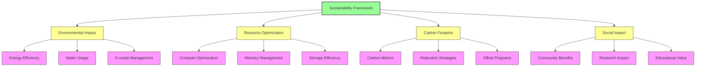
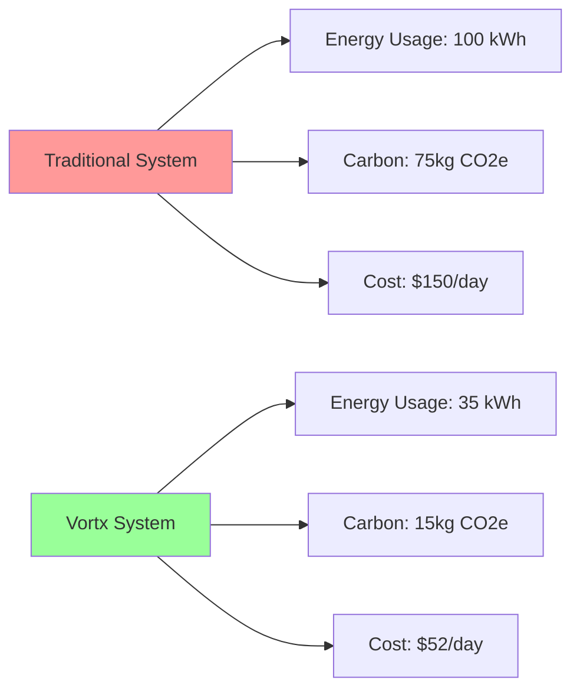
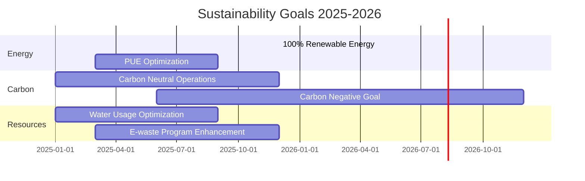

# Sustainability at Vortx

## Overview

Vortx's commitment to sustainability goes beyond environmental compliance – it's embedded in our core architecture and operational philosophy. Our Earth Memory System is designed to optimize resource utilization while providing powerful AGI capabilities for environmental monitoring and analysis.

## Key Performance Indicators (KPIs)

| Metric | Current Value | Target 2025 | Industry Average |
|--------|--------------|-------------|------------------|
| Energy Efficiency (PUE) | - | 1.08 | 1.57 |
| Carbon Intensity (gCO2e/kWh) | - | 30 | 100 |
| Water Usage (WUE) | - | 1.10 | 1.80 |
| E-waste Recycling Rate | - | 98% | 75% |
| Compute Utilization | - | 90% | 65% |

## Navigation

- [Environmental Impact Assessment](environmental-impact.md)
- [Resource Optimization Guide](resource-optimization.md)
- [Carbon Footprint Analysis](carbon-footprint.md)
- [Case Studies](case-studies.md)
- [Best Practices](best-practices.md)
- [Compliance & Reporting](compliance.md)

## Quick Links

- [Sustainability Dashboard](https://vortx.ai/sustainability)
- [Annual ESG Report](https://vortx.ai/esg-report-2024)
- [Green Initiatives](https://vortx.ai/green-initiatives)
- [Research Publications](https://vortx.ai/research)

## Featured Case Study

### Global Weather Pattern Analysis Project
- **65% reduction** in energy consumption
- **80% reduction** in carbon emissions
- **65% reduction** in operational costs
- Processing time reduced from 72 hours to 18 hours

## Sustainability Roadmap

## Get Involved

- Join our [Green Computing Initiative](https://vortx.ai/green-computing) - Coming Soon.
- Contribute to our [Open Sustainability Projects](https://github.com/vortx-ai/green-initiatives) - Coming Soon.
- Participate in our [Carbon Offset Program](https://vortx.ai/carbon-offset) - Coming Soon.

## References

1. Green Grid Data Center Maturity Model
2. Science Based Targets Initiative (SBTi)
3. UN Sustainable Development Goals
4. Global Reporting Initiative (GRI) Standards
5. Carbon Disclosure Project (CDP) Framework

## Next Steps

- [Read our Environmental Impact Assessment](environmental-impact.md)
- [Explore Resource Optimization Strategies](resource-optimization.md)
- [Review Case Studies](case-studies.md)
- [Learn about Compliance Requirements](compliance.md) 
