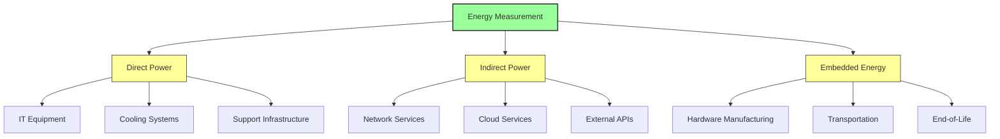
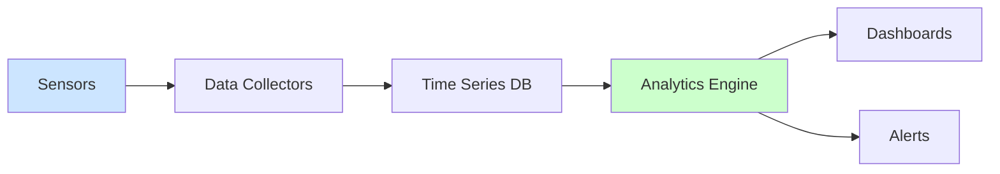
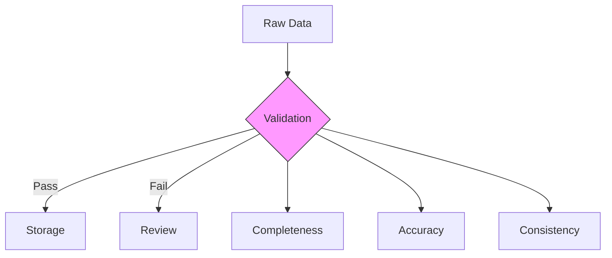
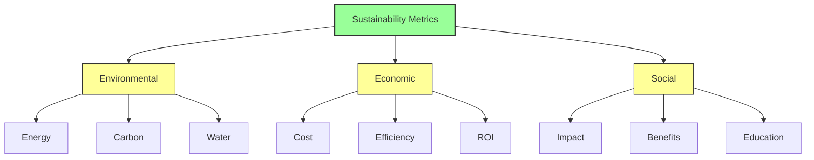
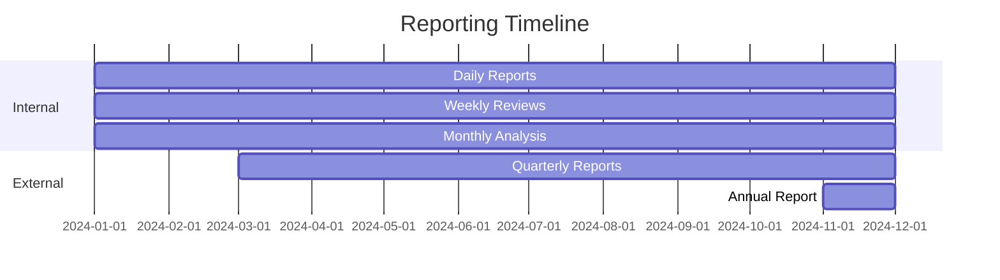
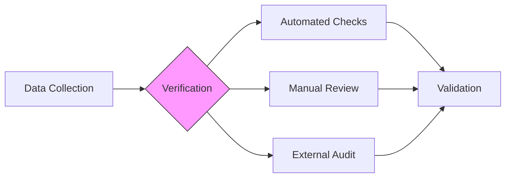

# Sustainability Measurement Methodology

## Overview

This document outlines the methodologies used for measuring, calculating, and reporting sustainability metrics at Vortx. All methodologies align with international standards and best practices.

## Measurement Standards

### Energy Measurements



### Measurement Tools
1. **Power Monitoring**
   - Schneider Electric PowerLogic™ ION9000
   - Fluke 435 Series II Power Quality Analyzers
   - Custom power monitoring software

2. **Environmental Sensors**
   - Temperature: Nest Temperature Sensors
   - Humidity: Honeywell HumidIcon™
   - Airflow: TSI VelociCalc®

## Calculation Methods

### 1. Power Usage Effectiveness (PUE)
```python
def calculate_pue(total_facility_power, it_equipment_power):
    """
    Calculate Power Usage Effectiveness
    
    Args:
        total_facility_power (float): Total power consumed by facility in kW
        it_equipment_power (float): Power consumed by IT equipment in kW
        
    Returns:
        float: PUE value
    """
    pue = total_facility_power / it_equipment_power
    return round(pue, 2)
```

### 2. Carbon Emissions
```python
def calculate_carbon_emissions(energy_consumption, grid_factor):
    """
    Calculate carbon emissions
    
    Args:
        energy_consumption (float): Energy consumed in kWh
        grid_factor (float): Grid carbon intensity in kgCO2e/kWh
        
    Returns:
        float: Carbon emissions in kgCO2e
    """
    emissions = energy_consumption * grid_factor
    return round(emissions, 2)
```

## Data Collection Protocols

### Real-time Monitoring



### Sampling Frequencies
| Metric | Frequency | Resolution | Retention |
|--------|-----------|------------|-----------|
| Power | 1s | 0.1W | 2 years |
| Temperature | 5s | 0.1°C | 1 year |
| Network | 1s | 1Mbps | 6 months |
| Carbon | 5m | 0.1kgCO2e | 5 years |

## Validation Procedures

### 1. Data Quality Checks


### 2. Calibration Schedule
| Equipment | Frequency | Standard | Tolerance |
|-----------|-----------|----------|-----------|
| Power Meters | 6 months | ISO 17025 | ±0.1% |
| Temperature | 3 months | NIST | ±0.2°C |
| Flow Meters | 12 months | ISO 4185 | ±1.0% |

## Reporting Framework

### 1. Metrics Hierarchy


### 2. Reporting Schedule


## Standards Compliance

### Frameworks
1. **GHG Protocol**
   - Scope 1: Direct emissions
   - Scope 2: Indirect emissions
   - Scope 3: Value chain emissions

2. **ISO Standards**
   - ISO 14064: GHG quantification
   - ISO 50001: Energy management
   - ISO 14001: Environmental management

## Quality Assurance

### 1. Data Verification


### 2. Error Handling
| Error Type | Detection | Response | Resolution Time |
|------------|-----------|----------|-----------------|
| Sensor Failure | Automated | Alert | <1 hour |
| Data Gap | Automated | Interpolation | <4 hours |
| Calibration Drift | Manual | Recalibration | <24 hours |

## References

1. GHG Protocol Corporate Standard (2024)
2. ISO 14064-1:2018 Guidelines
3. ASHRAE TC 9.9 Thermal Guidelines
4. Energy Star Data Center Requirements
5. Green Grid Data Center Maturity Model

## Additional Resources

- [Calibration Procedures](calibration.md) - Coming Soon.
- [Error Handling Guide](error-handling.md) - Coming Soon.
- [Audit Protocols](audit-protocols.md) - Coming Soon.
- [Training Materials](training.md) - Coming Soon.
