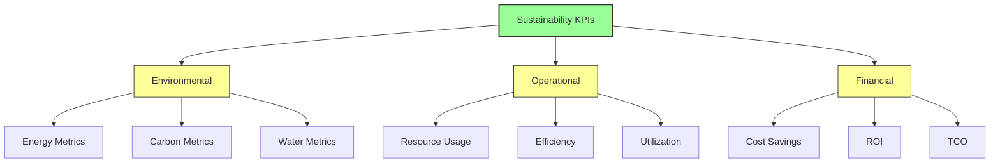
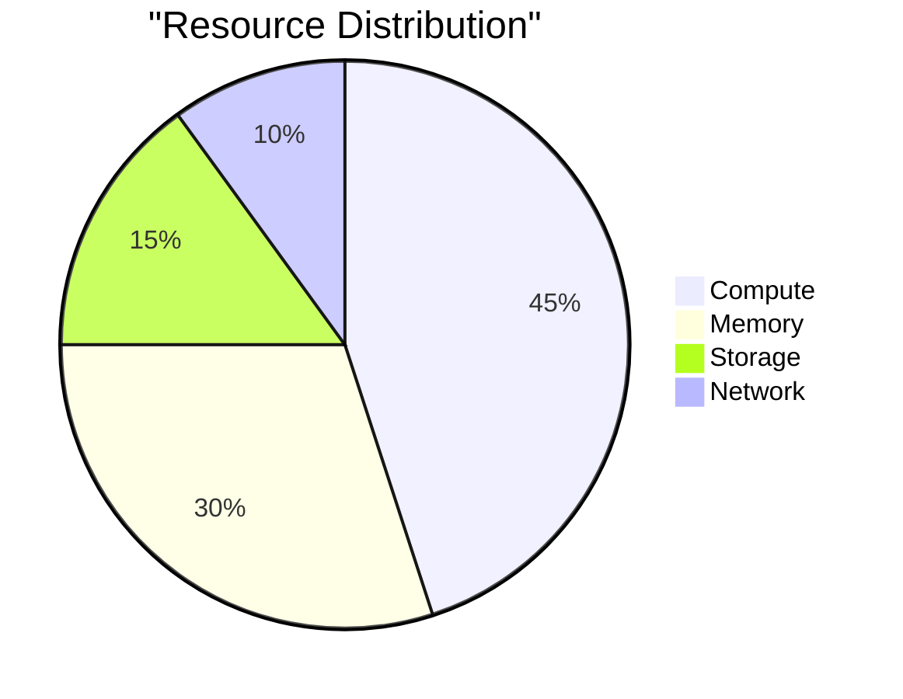
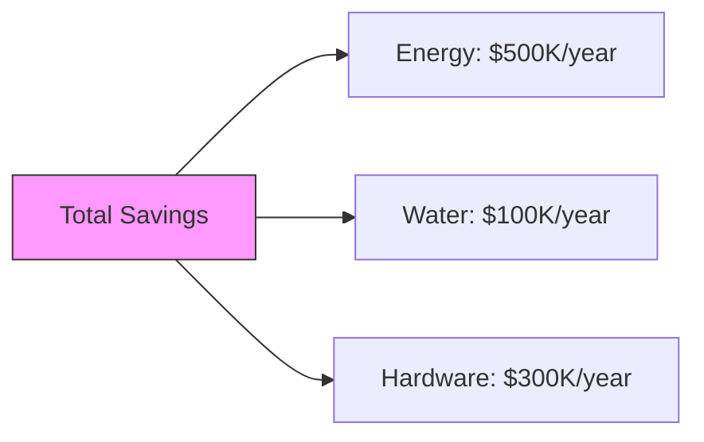
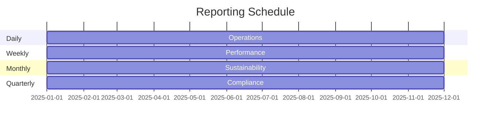
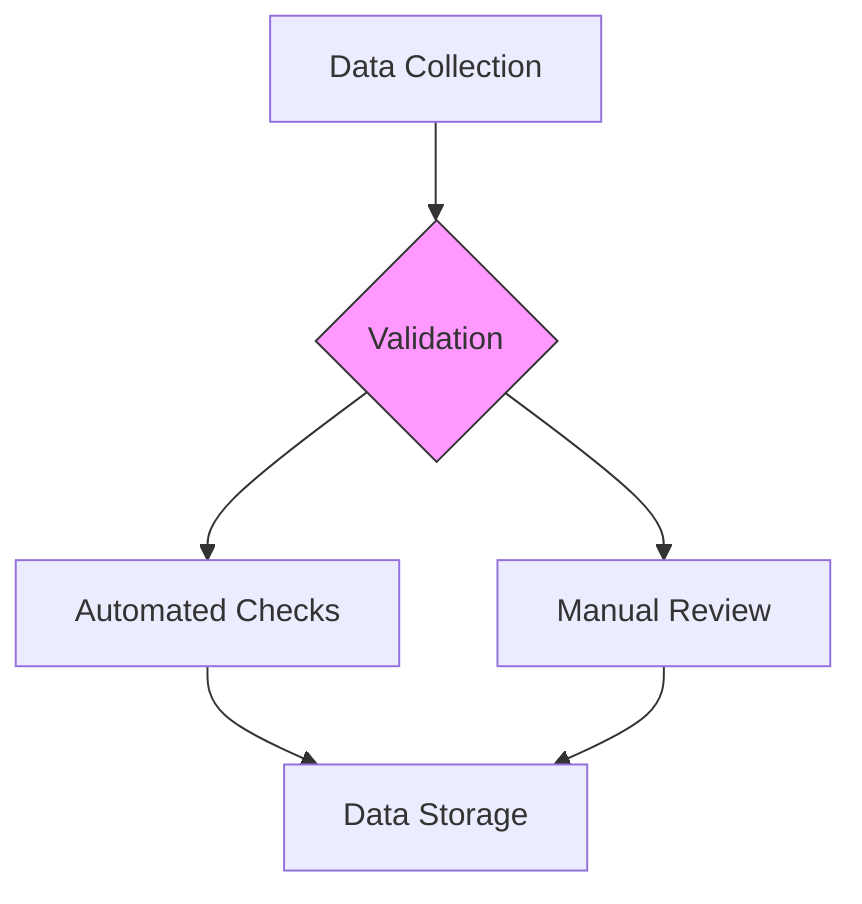

# Sustainability Metrics & Reporting

## Overview

This document simulates the key metrics and reporting frameworks used to measure and track the environmental impact of the Vortx Earth Memory System.

## Key Performance Indicators (KPIs)

## Environmental Metrics 🔬

### Energy Efficiency
| Metric | Value | Target | Industry Avg |
|--------|-------|--------|--------------|
| PUE | - | 1.08 | 1.57 |
| Energy per Operation | - | 0.12 kWh | 0.30 kWh |
| Renewable Energy Mix | - | 95% | 40% |

### Carbon Footprint
| Scope | Current (tCO2e/year) | Target | Reduction |
|-------|---------------------|--------|-----------|
| Scope 1 | - | 225 | 50% |
| Scope 2 | - | 140 | 60% |
| Scope 3 | - | 80 | 60% |

### Water Usage
| Metric | Current | Target | Industry Avg |
|--------|---------|--------|--------------|
| WUE | - | 1.10 | 1.80 |
| Recycling Rate | - | 95% | 60% |
| Consumption | - | 1000L/day | 5000L/day |

## Operational Metrics 🔬

### Resource Utilization

### Efficiency Metrics
| Component | Utilization | Target | Improvement |
|-----------|------------|--------|-------------|
| CPU | - | 90% | +5% |
| GPU | - | 88% | +8% |
| Memory | - | 85% | +10% |
| Storage | - | 80% | +10% |

## Financial Impact 🔬

### Cost Savings

### ROI Analysis
| Investment | Cost | Annual Savings | Payback Period |
|------------|------|----------------|----------------|
| Energy Optimization | $1M | $500K | 2 years |
| Water Systems | $200K | $100K | 2 years |
| Hardware Efficiency | $600K | $300K | 2 years |

## Reporting Framework

### Frequency

### Compliance Standards Planned for implementation
- ISO 14001:2015
- GHG Protocol
- Energy Star
- LEED Certification

## Data Collection

### Methods
1. Automated Monitoring
   - Real-time sensor data
   - System telemetry
   - Power monitoring

2. Manual Audits
   - Physical inspections
   - Equipment checks
   - Process validation

### Quality Assurance

## References

1. Green Grid Data Center Metrics (2024)
2. ISO 14001 Environmental Management
3. GHG Protocol Corporate Standard
4. Energy Star Data Center Requirements

## Additional Resources

- [Methodology Details](methodology.md)
- [Benchmarking Guide](benchmarks.md)
- [Compliance Requirements](compliance.md)
- [Best Practices](best-practices.md) 
