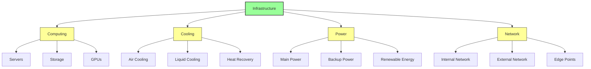
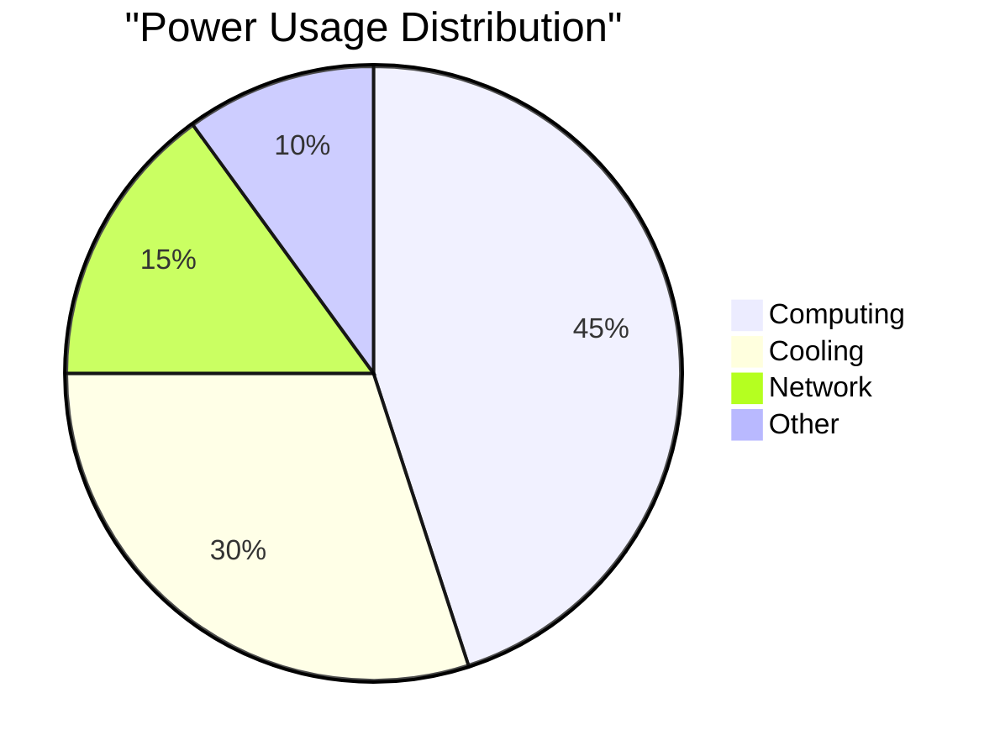
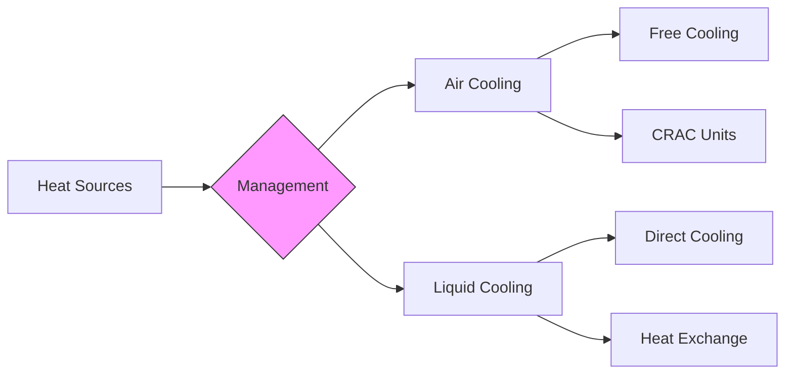
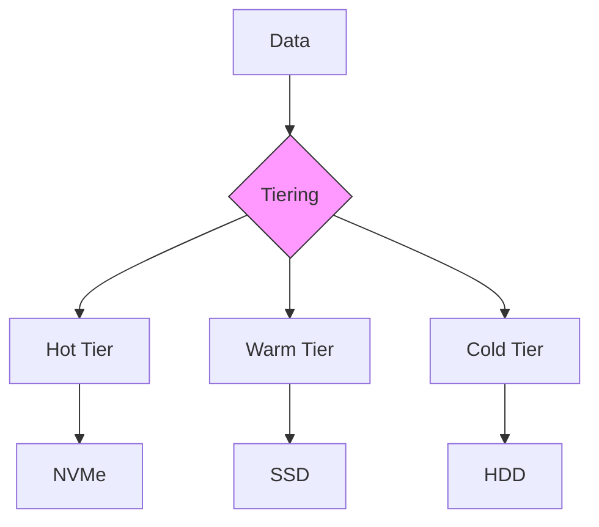
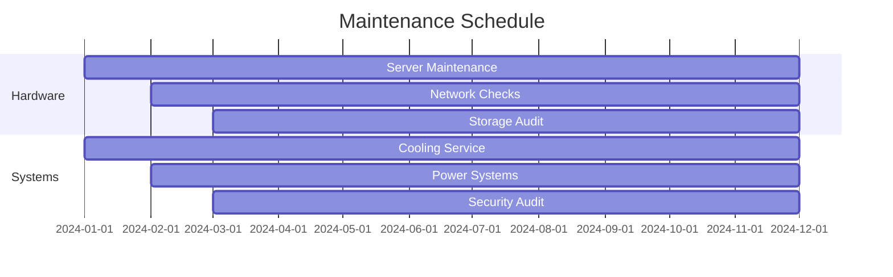
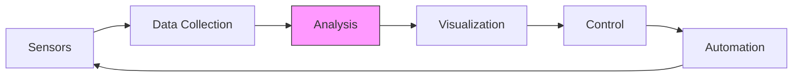
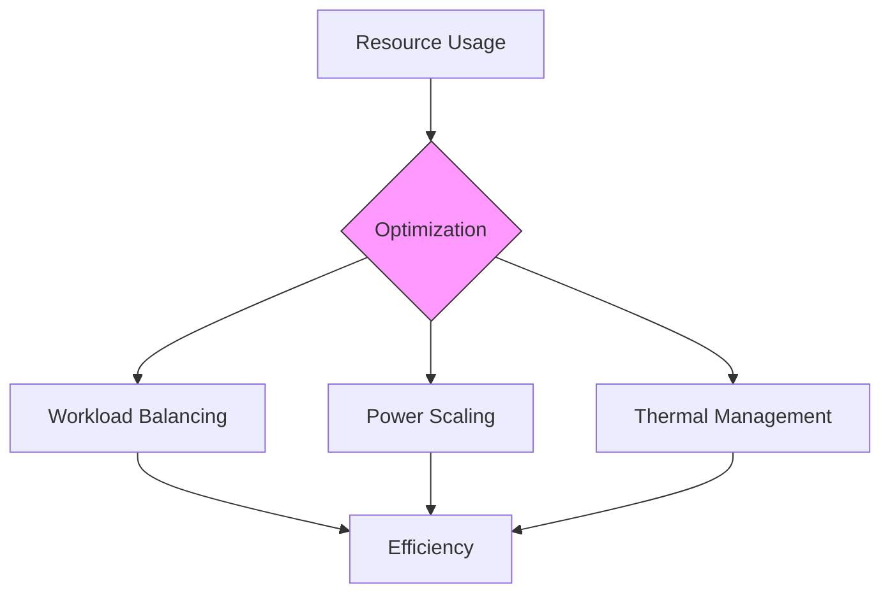
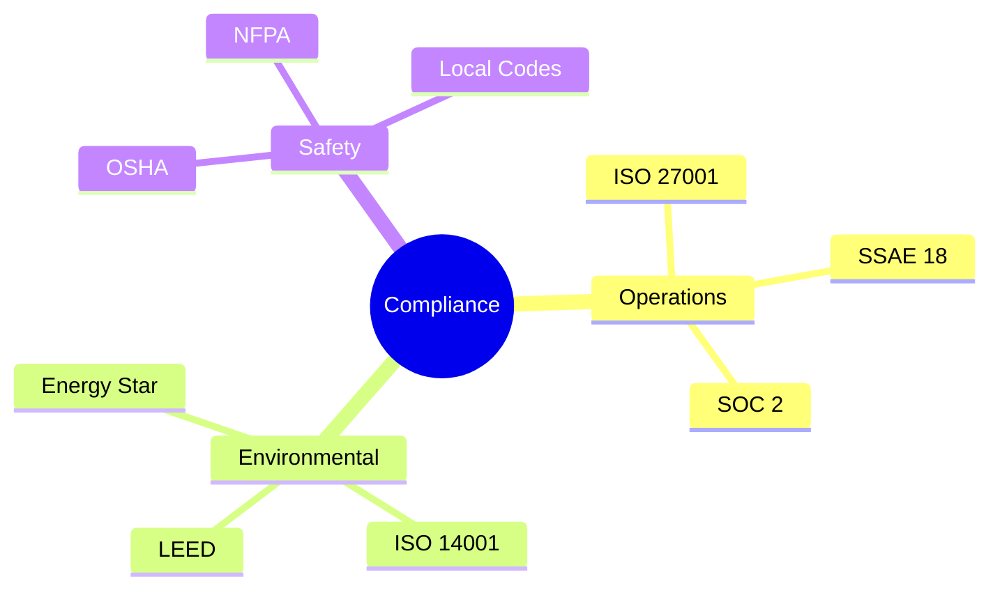
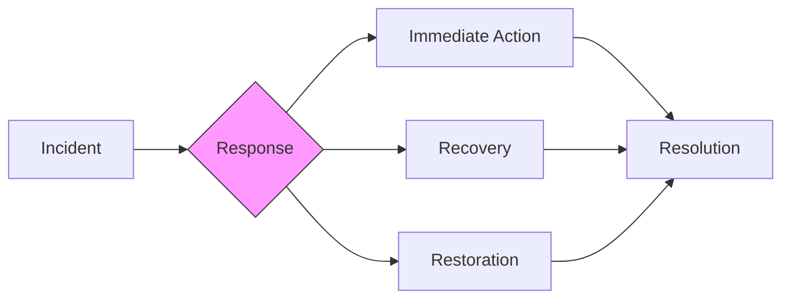

# Sustainable Operations Guide

## Overview

This guide outlines the operational practices and procedures for maintaining sustainable infrastructure in the Vortx Earth Memory System.

## Infrastructure Components



## Power Management 🔬

### Energy Distribution


### Power Optimization
| Component | Base Load | Peak Load | Efficiency |
|-----------|-----------|-----------|------------|
| Servers | 60% | 85% | 92% |
| Storage | 40% | 70% | 94% |
| Network | 35% | 65% | 90% |
| Cooling | 45% | 75% | 88% |

## Cooling Systems

### Thermal Management


### Temperature Zones 🔬
| Zone | Target Temp | Humidity | Airflow |
|------|------------|----------|---------|
| Cold Aisle | 18°C | 45% | 2 m/s |
| Hot Aisle | 35°C | 60% | 3 m/s |
| Equipment | 22°C | 50% | 2.5 m/s |

## Resource Management

### Compute Resources
```python
# Example: Resource Allocation
from vortx.operations import ResourceManager

manager = ResourceManager(
    power_limit=True,
    thermal_aware=True,
    efficiency_mode=True
)

with manager.optimized_context():
    # Resource-intensive operations
    process_workload()
```

### Storage Optimization


## Maintenance Procedures

### Regular Maintenance


### Emergency Procedures
1. Power Failure Response
   - UPS activation
   - Workload migration
   - Graceful shutdown

2. Cooling System Issues
   - Temperature monitoring
   - Load reduction
   - Backup cooling

## Monitoring & Control

### Real-time Monitoring


### Key Metrics 🔬
| Metric | Normal Range | Warning | Critical |
|--------|-------------|---------|----------|
| Temperature | 18-27°C | 28-32°C | >32°C |
| Humidity | 45-55% | 40-60% | <40%, >60% |
| Power Draw | 60-80% | 81-90% | >90% |
| Network Load | 40-70% | 71-85% | >85% |

## Efficiency Optimization

### Power Usage Effectiveness (PUE)
```python
# Example: PUE Monitoring
from vortx.metrics import PUEMonitor

monitor = PUEMonitor(
    target_pue=1.2,
    alert_threshold=1.3,
    optimization_enabled=True
)

@monitor.track
def facility_operations():
    # Facility operations code
    pass
```

### Resource Utilization


## Security & Compliance

### Physical Security
1. Access Control
   - Biometric authentication
   - CCTV monitoring
   - Security personnel

2. Environmental Protection
   - Fire suppression
   - Water detection
   - Seismic monitoring

### Compliance Requirements


## Disaster Recovery

### Recovery Procedures
1. System Failure
   - Automatic failover
   - Data protection
   - Service restoration

2. Natural Disasters
   - Emergency shutdown
   - Data backup
   - Site failover

### Business Continuity


## References

1. ASHRAE Thermal Guidelines
2. Green Grid Data Center Maturity Model
3. ISO/IEC 27001 Security Standards
4. NFPA 75 Fire Protection Standards

## Additional Resources

- [Maintenance Procedures](maintenance.md)
- [Emergency Response](emergency.md)
- [Security Protocols](security.md)
- [Compliance Guide](compliance.md) 