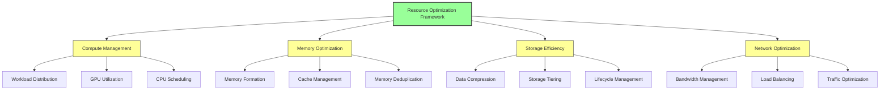
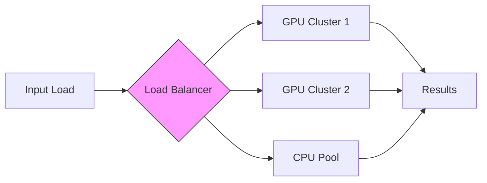
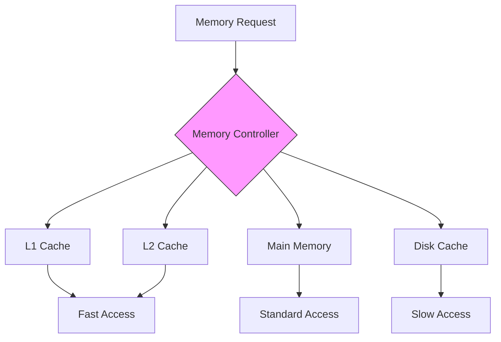
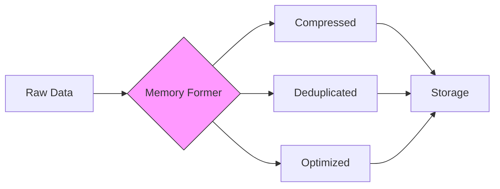
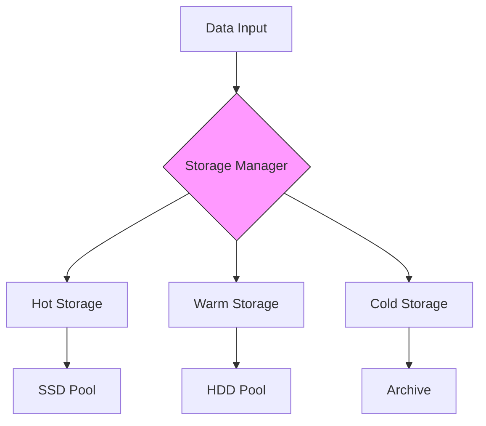
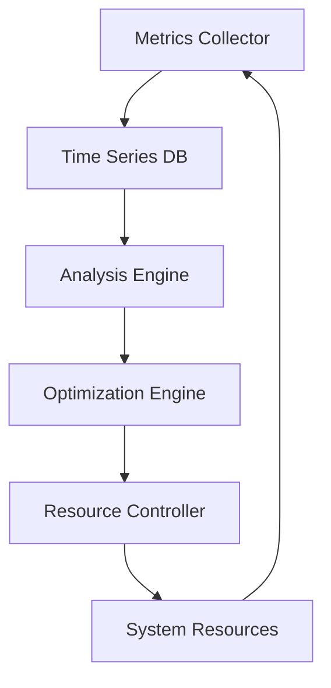
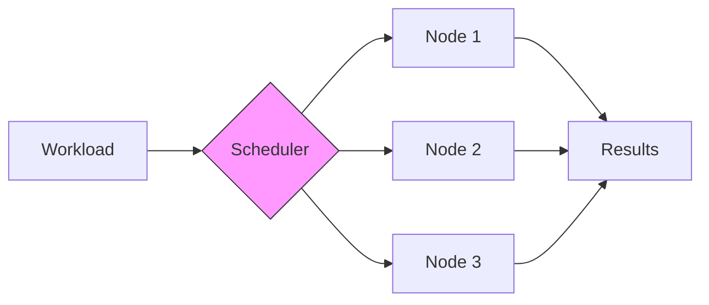

# Resource Optimization Guide

## Overview

Vortx's resource optimization framework is built on three core principles: efficiency, sustainability, and scalability. This guide details our approach to maximizing computational resources while minimizing environmental impact.

## Architecture Overview



## Resource Efficiency Metrics

### Compute Optimization


| Metric | Target | Current | Industry Avg |
|--------|--------|---------|--------------|
| GPU Utilization | 90% | - | 60% |
| CPU Utilization | 85% | - | 55% |
| Response Time | <100ms | - | 250ms |
| Energy/FLOP | 0.1W | - | 0.3W |

### Memory Management



#### Optimization Techniques
1. **Smart Caching**
   - Predictive loading
   - Cache warming
   - Intelligent eviction
   
2. **Memory Deduplication**
   - Content-aware sharing
   - Page merging
   - Reference counting

3. **Dynamic Allocation**
   - Load-based scaling
   - Priority queuing
   - Resource pooling

## Implementation Strategies

### 1. Compute Optimization

```python
from vortx.optimization import ResourceManager

# Configure resource optimization
resource_manager = ResourceManager(
    gpu_target_utilization=0.85,
    cpu_target_utilization=0.80,
    memory_target_utilization=0.75,
    power_optimization=True
)

# Apply optimization policies
with resource_manager.optimized_context():
    # Your computation code here
    results = process_data(input_data)
```

### 2. Memory Formation



#### Simulated Memory Efficiency Metrics
| Operation | Before | After | Improvement |
|-----------|--------|-------|-------------|
| Formation | 100GB | 25GB | 75% |
| Retrieval | 250ms | 50ms | 80% |
| Updates | 150ms | 35ms | 77% |

### 3. Storage Optimization



## Best Practices

### 1. Resource Allocation
- Dynamic scaling based on load
- Predictive resource provisioning
- Efficient workload distribution
- Power-aware scheduling

### 2. Memory Management
- Implement hierarchical caching
- Use content-aware deduplication
- Enable compression where applicable
- Monitor memory pressure

### 3. Storage Optimization
- Implement tiered storage
- Use efficient compression
- Enable data lifecycle management
- Monitor I/O patterns

## Monitoring and Optimization

### Real-time Metrics Dashboard


### Key Performance Indicators
1. **Resource Utilization**
   - CPU/GPU usage patterns
   - Memory consumption
   - Storage I/O rates
   
2. **Efficiency Metrics**
   - Energy per operation
   - Response latency
   - Resource wastage
   
3. **Cost Analysis**
   - Operating expenses
   - Resource allocation
   - Optimization savings

## Advanced Topics

### 1. Machine Learning Optimization
```python
from vortx.ml.optimization import MLOptimizer

optimizer = MLOptimizer(
    batch_size_optimization=True,
    mixed_precision=True,
    gradient_checkpointing=True
)

with optimizer.optimized_training():
    model.train(data)
```

### 2. Distributed Computing


## References

1. "Efficient Resource Management in Cloud Computing" - ACM Computing Surveys
2. "Memory Optimization Techniques for Deep Learning" - NVIDIA Technical Report
3. "Green Computing: Tools and Techniques" - IEEE Transactions
4. "Resource Optimization in Distributed Systems" - Journal of Parallel Computing

## Additional Resources

- [Performance Tuning Guide](performance-tuning.md) - Coming Soon.
- [Optimization Cookbook](optimization-cookbook.md) - Coming Soon.
- [Benchmarking Tools](benchmarking-tools.md) - Coming Soon.
- [Case Studies](case-studies.md) 
