# Vortx Earth Memory System Technical Whitepapers

## Authors
**Lead Author:** Kumari Jaya  
**Contributors:** Vortx Research Division  
**Version:** 2.0.0 (2024)

## 🌍 Vision
Creating a decentralized, sustainable AGI ecosystem that democratizes access to advanced intelligence while ensuring fair compensation for all stakeholders through transparent, ethical mechanisms.

## 📊 Ecosystem Architecture

### Stakeholder Flow
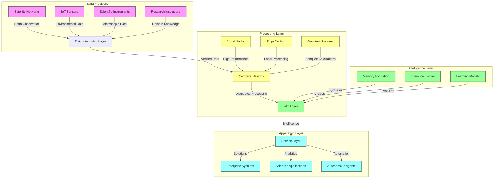

### Value Flow Architecture
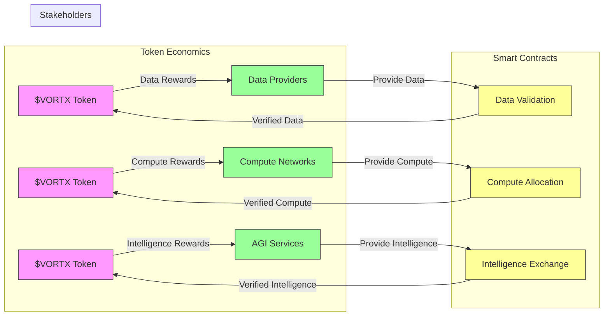

## 📚 Available Whitepapers

### 1. [System Architecture](architecture.md)
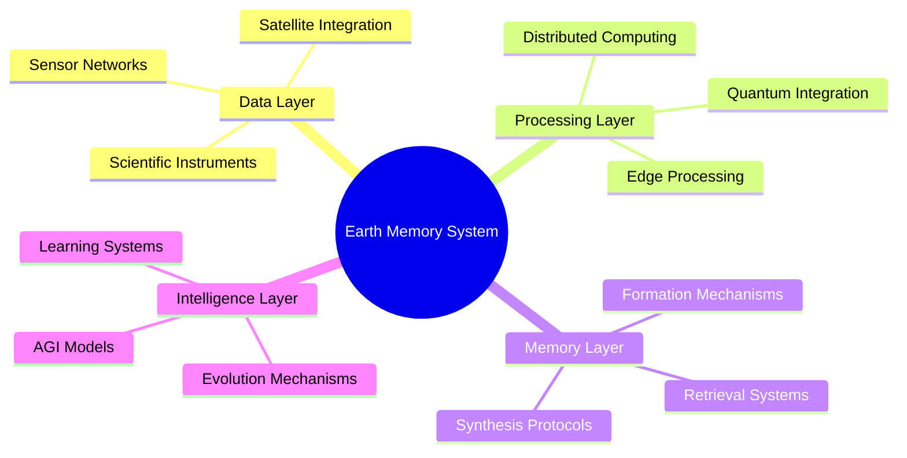

### 2. [Decentralized AGI Exchange](agi-exchange.md)
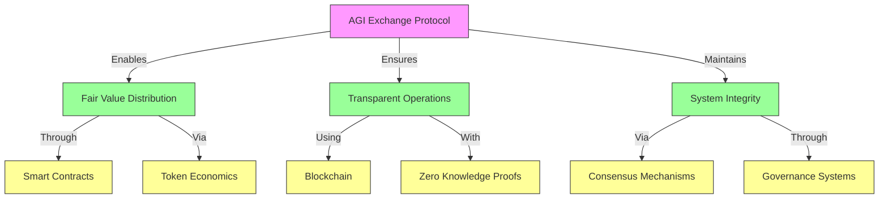

### 3. [Token Economics](token-economics.md)
```python
TOKEN_ARCHITECTURE = {
    'vortx': {
        'symbol': '$VORTX',
        'type': 'Unified Utility Token',
        'total_supply': '1,000,000,000',
        'utilities': {
            'data_operations': 'Data validation and quality staking',
            'compute_resources': 'Processing power allocation',
            'intelligence_services': 'AGI model access and deployment',
            'governance': 'Protocol decision making'
        },
        'distribution': {
            'ecosystem_rewards': '40%',
            'development': '20%',
            'foundation': '15%',
            'team': '15%',
            'advisors': '5%',
            'community': '5%'
        }
    }
}
```

### 4. [Privacy and Security](privacy-security.md)
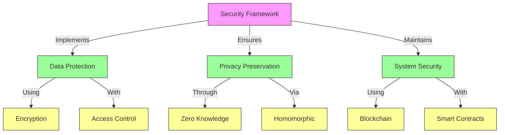

### 5. [Sustainable Computing](sustainable-computing.md)
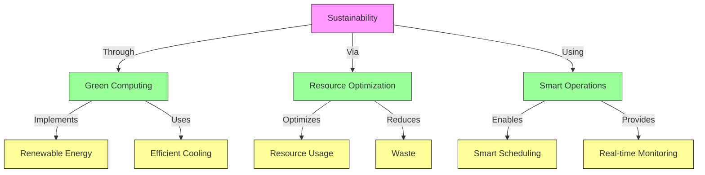

## 💰 Financial Model

### Token Utility Flow
```mermaid
graph TD
    subgraph Data Economy
        D1[Data Providers] -->|Submit Data| D2[Data Pool]
        D2 -->|Validate| D3[Smart Contract]
        D3 -->|Mint| D4[VDATA Tokens]
    end
    
    subgraph Compute Economy
        C1[Compute Providers] -->|Offer Resources| C2[Compute Pool]
        C2 -->|Validate| C3[Smart Contract]
        C3 -->|Mint| C4[VCPU Tokens]
    end
    
    subgraph Intelligence Economy
        I1[AGI Services] -->|Provide Intelligence| I2[Service Pool]
        I2 -->|Validate| I3[Smart Contract]
        I3 -->|Mint| I4[VAGI Tokens]
    end
    
    classDef economy fill:#f9f,stroke:#333
    classDef pool fill:#9f9,stroke:#333
    classDef token fill:#ff9,stroke:#333
    
    class D1,C1,I1 economy
    class D2,C2,I2 pool
    class D4,C4,I4 token
```

### Reward Distribution
```python
REWARD_MECHANISM = {
    'data_rewards': {
        'quality_score': {
            'accuracy': '0.4',
            'relevance': '0.3',
            'timeliness': '0.3'
        },
        'token_distribution': {
            'base_rate': '100 VORTX/TB',
            'quality_multiplier': '1.0-2.0',
            'network_contribution': '10-30%'
        }
    },
    'compute_rewards': {
        'performance_score': {
            'processing_power': '0.4',
            'availability': '0.3',
            'efficiency': '0.3'
        },
        'token_distribution': {
            'base_rate': '100 VORTX/PFLOP',
            'performance_multiplier': '1.0-2.0',
            'network_contribution': '10-30%'
        }
    },
    'intelligence_rewards': {
        'value_score': {
            'accuracy': '0.4',
            'innovation': '0.3',
            'sustainability': '0.3'
        },
        'token_distribution': {
            'base_rate': '100 VORTX/service',
            'value_multiplier': '1.0-3.0',
            'network_contribution': '10-30%'
        }
    }
}
```

## 🔄 Advanced Token Economics

### Token Interaction Model
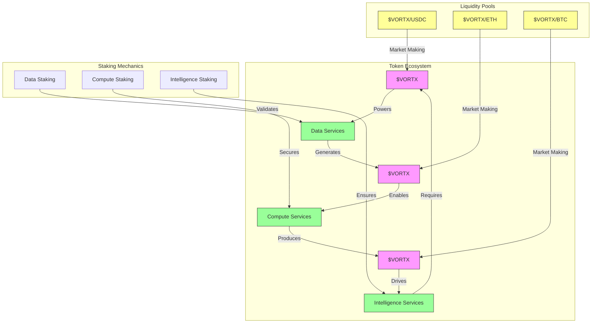

### Token Specifications
```python
TOKEN_SPECIFICATIONS = {
    'vdata': {
        'total_supply': '1,000,000,000',
        'initial_distribution': {
            'ecosystem_rewards': '40%',
            'development': '20%',
            'foundation': '15%',
            'team': '15%',
            'advisors': '5%',
            'community': '5%'
        },
        'vesting_schedule': {
            'team': {
                'cliff': '12 months',
                'vesting': '36 months',
                'release': 'Linear'
            },
            'advisors': {
                'cliff': '6 months',
                'vesting': '24 months',
                'release': 'Linear'
            }
        },
        'utility_mechanisms': {
            'data_validation': True,
            'quality_staking': True,
            'governance_rights': True,
            'fee_reduction': True
        }
    },
    'vcpu': {
        'total_supply': '500,000,000',
        'emission_schedule': {
            'initial_rate': '100 VORTX/block',
            'halving_period': '2 years',
            'minimum_rate': '1 VORTX/block'
        },
        'staking_requirements': {
            'validator_node': '50,000 VORTX',
            'compute_node': '10,000 VORTX',
            'storage_node': '5,000 VORTX'
        }
    },
    'vagi': {
        'total_supply': '100,000,000',
        'minting_policy': {
            'initial_rate': 'Dynamic',
            'based_on': 'Network Intelligence Growth',
            'max_inflation': '2% annually'
        },
        'intelligence_rights': {
            'model_access': True,
            'inference_priority': True,
            'governance_weight': True
        }
    }
}
```

### Economic Security Model
```python
SECURITY_MECHANISMS = {
    'slashing_conditions': {
        'data_manipulation': {
            'detection': 'Zero-Knowledge Proof',
            'penalty': '10% stake',
            'blacklist_period': '30 days'
        },
        'compute_fraud': {
            'detection': 'Proof of Computation',
            'penalty': '20% stake',
            'blacklist_period': '60 days'
        },
        'intelligence_misuse': {
            'detection': 'Consensus Verification',
            'penalty': '30% stake',
            'blacklist_period': '90 days'
        }
    },
    'reward_mechanisms': {
        'data_quality': {
            'base_reward': 'Dynamic',
            'quality_multiplier': '1.0-3.0',
            'reputation_bonus': '0-20%'
        },
        'compute_efficiency': {
            'base_reward': 'Dynamic',
            'performance_multiplier': '1.0-2.5',
            'uptime_bonus': '0-15%'
        },
        'intelligence_contribution': {
            'base_reward': 'Dynamic',
            'impact_multiplier': '1.0-4.0',
            'innovation_bonus': '0-25%'
        }
    }
}
```

## 🏛 Governance Framework

### Governance Architecture
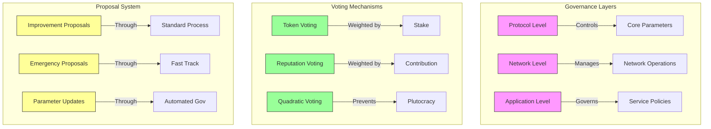

### Governance Parameters
```python
GOVERNANCE_SPEC = {
    'voting_power': {
        'calculation': {
            'base': 'Token Balance',
            'multiplier': 'Staking Duration',
            'cap': 'Quadratic Scaling'
        },
        'delegation': {
            'enabled': True,
            'max_delegations': 5,
            'min_delegation': '1000 tokens'
        }
    },
    'proposal_system': {
        'submission_requirements': {
            'min_tokens': '100,000',
            'holding_period': '30 days',
            'reputation_score': '> 80%'
        },
        'voting_periods': {
            'standard': '7 days',
            'emergency': '24 hours',
            'parameter': '3 days'
        },
        'quorum_requirements': {
            'standard': '40%',
            'emergency': '66%',
            'parameter': '51%'
        }
    }
}
```

## 🔄 AGI Exchange Protocol

### Protocol Architecture
```mermaid
graph TD
    subgraph Data Flow
        D1[Raw Data] -->|Validation| D2[Verified Data]
        D2 -->|Processing| D3[Intelligence Input]
    end
    
    subgraph Compute Flow
        C1[Resource Request] -->|Allocation| C2[Compute Assignment]
        C2 -->|Execution| C3[Results Verification]
    end
    
    subgraph Intelligence Flow
        I1[Model Request] -->|Matching| I2[Service Execution]
        I2 -->|Validation| I3[Result Delivery]
    end
    
    subgraph Value Flow
        V1[Token Generation] -->|Distribution| V2[Reward Settlement]
        V2 -->|Staking| V3[Network Security]
    end
    
    classDef flow fill:#f9f,stroke:#333
    classDef process fill:#9f9,stroke:#333
    classDef result fill:#ff9,stroke:#333
    
    class D1,C1,I1,V1 flow
    class D2,C2,I2,V2 process
    class D3,C3,I3,V3 result
```

### Protocol Specifications
```python
PROTOCOL_SPEC = {
    'data_protocol': {
        'validation_methods': {
            'quality_check': 'ML-based',
            'consensus_required': '66%',
            'verification_time': '< 10s'
        },
        'processing_pipeline': {
            'preprocessing': 'Automated',
            'enrichment': 'AI-driven',
            'standardization': 'Schema-enforced'
        }
    },
    'compute_protocol': {
        'resource_allocation': {
            'scheduling': 'AI-optimized',
            'load_balancing': 'Dynamic',
            'failover': 'Automatic'
        },
        'execution_verification': {
            'proof_generation': 'ZK-SNARK',
            'verification_time': '< 5s',
            'dispute_resolution': 'Automated'
        }
    },
    'intelligence_protocol': {
        'service_matching': {
            'algorithm': 'Multi-dimensional',
            'optimization': 'Cost-performance',
            'response_time': '< 1s'
        },
        'result_validation': {
            'quality_check': 'Consensus-based',
            'performance_metrics': 'Real-time',
            'feedback_loop': 'Continuous'
        }
    }
}
```

## 🎯 Implementation Scenarios

### Enterprise Intelligence
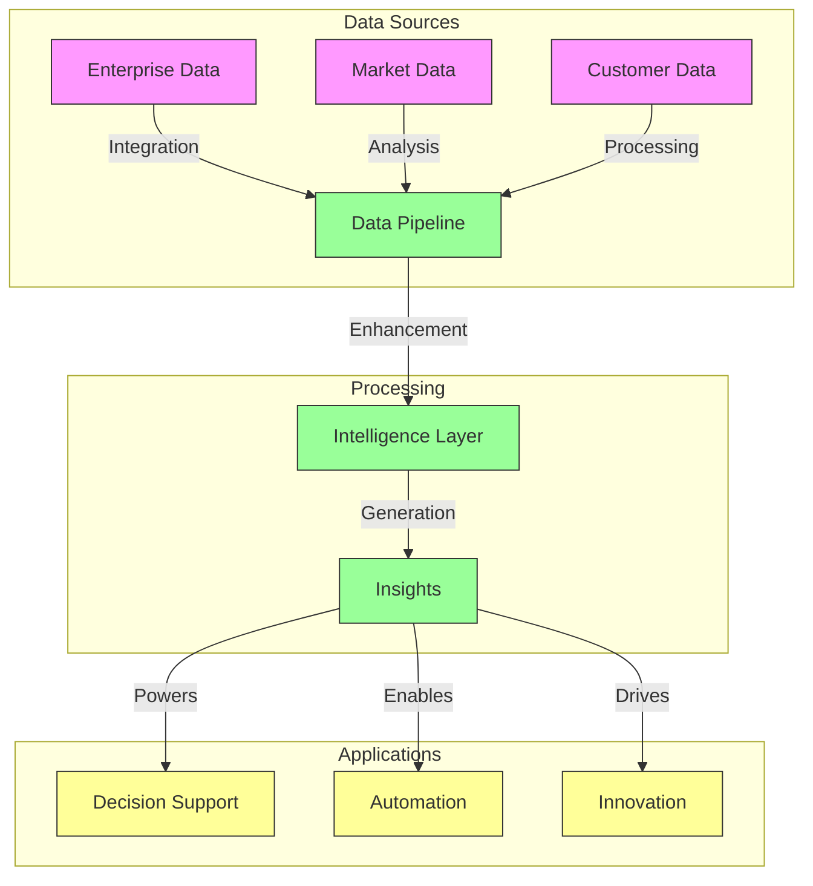

### Scientific Research
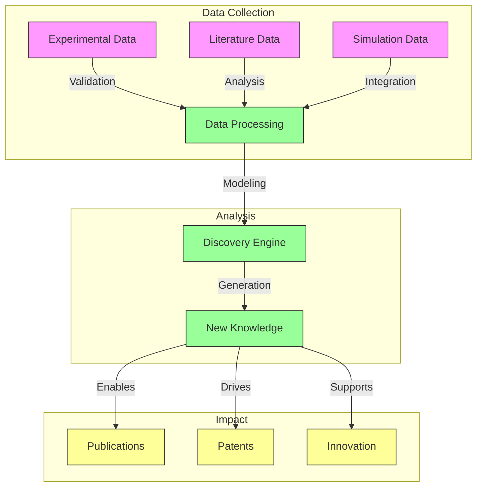

### Environmental Monitoring
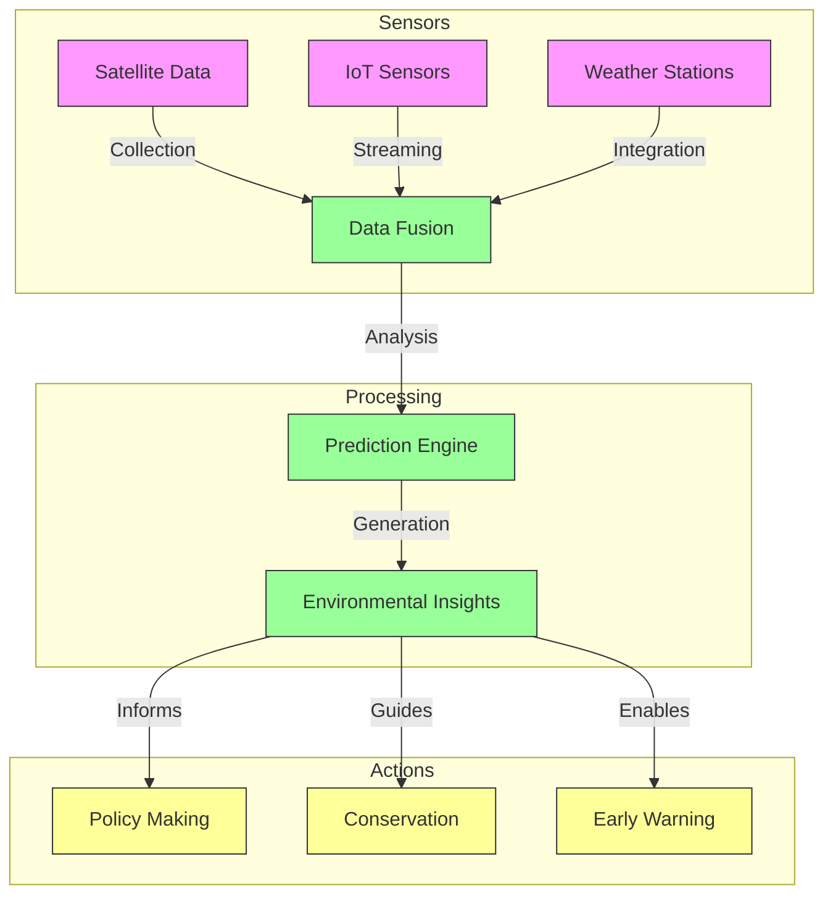

## 🌐 Impact Analysis

### Environmental Impact
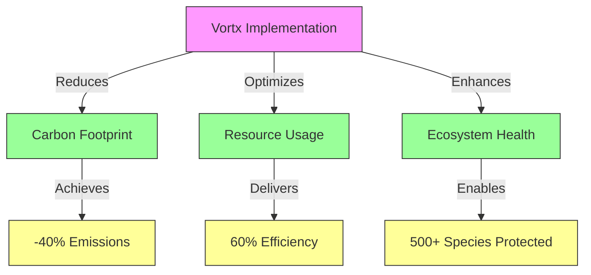

### Economic Impact
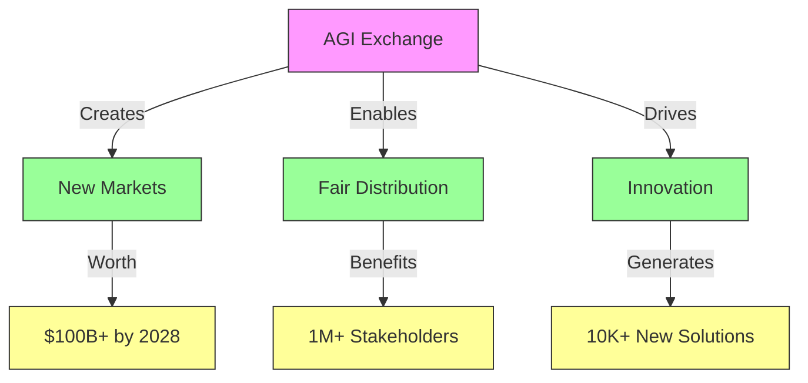

## 🔗 Advanced Token Utilities

### Data Token (VDATA) Use Cases
```mermaid
graph TD
    subgraph Data Quality
        D1[Raw Data] -->|Quality Staking| D2[Verified Data]
        D2 -->|Reputation Building| D3[Premium Data]
        D3 -->|Market Access| D4[Data Marketplace]
    end
    
    subgraph Data Services
        S1[Data Processing] -->|Service Fee| S2[Enhanced Data]
        S2 -->|Value Addition| S3[Specialized Datasets]
        S3 -->|Revenue Share| S4[Data Products]
    end
    
    subgraph Governance
        G1[Proposal Rights] -->|Voting Power| G2[Protocol Changes]
        G2 -->|Implementation| G3[Network Evolution]
    end
    
    classDef quality fill:#f9f,stroke:#333
    classDef service fill:#9f9,stroke:#333
    classDef gov fill:#ff9,stroke:#333
    
    class D1,D2,D3,D4 quality
    class S1,S2,S3,S4 service
    class G1,G2,G3 gov
```

### Compute Token (VCPU) Applications
```mermaid
graph TD
    subgraph Resource Allocation
        R1[Compute Resources] -->|Dynamic Pricing| R2[Resource Market]
        R2 -->|Optimization| R3[Efficient Distribution]
    end
    
    subgraph Network Operations
        N1[Node Operation] -->|Rewards| N2[Network Security]
        N2 -->|Validation| N3[Quality Service]
    end
    
    subgraph Service Level
        S1[Priority Access] -->|QoS| S2[Guaranteed Performance]
        S2 -->|SLA| S3[Enterprise Service]
    end
    
    classDef resource fill:#f9f,stroke:#333
    classDef network fill:#9f9,stroke:#333
    classDef service fill:#ff9,stroke:#333
    
    class R1,R2,R3 resource
    class N1,N2,N3 network
    class S1,S2,S3 service
```

### Intelligence Token (VAGI) Utilities
```mermaid
graph TD
    subgraph Model Access
        M1[AGI Models] -->|Access Rights| M2[Inference Services]
        M2 -->|Quality| M3[Premium Features]
    end
    
    subgraph Innovation
        I1[Research Access] -->|Development| I2[New Models]
        I2 -->|Validation| I3[Network Integration]
    end
    
    subgraph Ecosystem
        E1[Partnership Rights] -->|Collaboration| E2[Joint Development]
        E2 -->|Integration| E3[Extended Services]
    end
    
    classDef model fill:#f9f,stroke:#333
    classDef innovation fill:#9f9,stroke:#333
    classDef eco fill:#ff9,stroke:#333
    
    class M1,M2,M3 model
    class I1,I2,I3 innovation
    class E1,E2,E3 eco
```

## 🔒 Enhanced Security Framework

### Multi-Layer Security Architecture
```mermaid
graph TD
    subgraph Protocol Security
        P1[Zero Knowledge Proofs] -->|Validates| P2[Transactions]
        P2 -->|Ensures| P3[Privacy]
        
        P4[Homomorphic Encryption] -->|Enables| P5[Secure Computation]
        P5 -->|Maintains| P6[Data Privacy]
    end
    
    subgraph Network Security
        N1[Consensus Mechanism] -->|Secures| N2[Network State]
        N2 -->|Prevents| N3[Attacks]
        
        N4[Validator Network] -->|Monitors| N5[Operations]
        N5 -->|Ensures| N6[Integrity]
    end
    
    subgraph Application Security
        A1[Access Control] -->|Manages| A2[Permissions]
        A2 -->|Enforces| A3[Policies]
        
        A4[Audit System] -->|Tracks| A5[Activities]
        A5 -->|Enables| A6[Compliance]
    end
    
    classDef protocol fill:#f9f,stroke:#333
    classDef network fill:#9f9,stroke:#333
    classDef app fill:#ff9,stroke:#333
    
    class P1,P2,P3,P4,P5,P6 protocol
    class N1,N2,N3,N4,N5,N6 network
    class A1,A2,A3,A4,A5,A6 app
```

### Security Specifications
```python
SECURITY_FRAMEWORK = {
    'cryptographic_layer': {
        'encryption': {
            'symmetric': 'AES-256-GCM',
            'asymmetric': 'RSA-4096',
            'quantum_resistant': 'Lattice-based'
        },
        'zero_knowledge_proofs': {
            'protocol': 'zk-SNARKs',
            'setup': 'Trusted',
            'verification_time': '< 1ms'
        },
        'homomorphic_encryption': {
            'type': 'Fully Homomorphic',
            'library': 'SEAL',
            'performance_overhead': '< 100x'
        }
    },
    'consensus_security': {
        'mechanism': 'Hybrid PoS/PoI',
        'validator_requirements': {
            'min_stake': '100,000 tokens',
            'reputation_score': '> 90%',
            'uptime': '> 99.9%'
        },
        'slashing_conditions': {
            'double_signing': '50% stake',
            'downtime': '10% stake',
            'malicious_behavior': '100% stake'
        }
    },
    'access_control': {
        'authentication': {
            'method': 'Multi-factor',
            'token_based': True,
            'biometric_support': True
        },
        'authorization': {
            'model': 'RBAC + ABAC',
            'granularity': 'Resource-level',
            'dynamic_policies': True
        }
    }
}
```

## 🌐 Cross-Chain Integration

### Interoperability Architecture
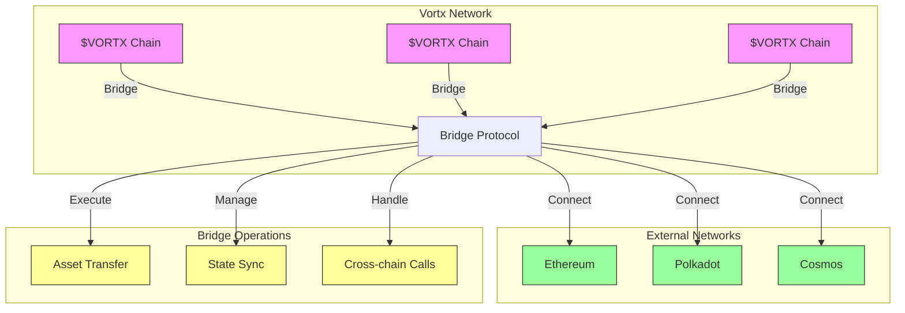

### Cross-Chain Protocol
```python
CROSS_CHAIN_SPEC = {
    'bridge_protocol': {
        'architecture': 'Multi-signature',
        'consensus': 'Threshold Signature',
        'security': {
            'validator_set': '21 nodes',
            'threshold': '15 signatures',
            'rotation_period': '24 hours'
        }
    },
    'supported_networks': {
        'ethereum': {
            'smart_contracts': True,
            'asset_types': ['ERC20', 'ERC721'],
            'finality': '64 blocks'
        },
        'polkadot': {
            'parachain': True,
            'xcmp': True,
            'finality': 'deterministic'
        },
        'cosmos': {
            'ibc': True,
            'interchain_accounts': True,
            'finality': 'instant'
        }
    },
    'operations': {
        'asset_transfer': {
            'confirmation_time': '< 5 minutes',
            'fee_model': 'Dynamic',
            'security_deposit': 'Required'
        },
        'state_sync': {
            'frequency': 'Per block',
            'validation': 'Multi-layer',
            'dispute_resolution': 'Automated'
        },
        'cross_chain_calls': {
            'latency': '< 30 seconds',
            'atomicity': 'Guaranteed',
            'rollback': 'Automatic'
        }
    }
}
```

### Additional Implementation Scenarios

### Healthcare Intelligence
```mermaid
graph TD
    subgraph Medical Data
        H1[Patient Records] -->|Privacy Preserved| P1
        H2[Research Data] -->|Anonymized| P1
        H3[Real-time Monitoring] -->|Secure| P1
    end
    
    subgraph Processing
        P1[HIPAA Compliant Pipeline] -->|Analysis| P2[Medical AGI]
        P2 -->|Generation| P3[Healthcare Insights]
    end
    
    subgraph Applications
        P3 -->|Enables| A1[Diagnosis Support]
        P3 -->|Powers| A2[Treatment Planning]
        P3 -->|Drives| A3[Drug Discovery]
    end
    
    classDef data fill:#f9f,stroke:#333
    classDef process fill:#9f9,stroke:#333
    classDef app fill:#ff9,stroke:#333
    
    class H1,H2,H3 data
    class P1,P2,P3 process
    class A1,A2,A3 app
```

### Financial Intelligence
```mermaid
graph TD
    subgraph Market Data
        F1[Trading Data] -->|Real-time| P1
        F2[Economic Indicators] -->|Analysis| P1
        F3[News Feed] -->|Sentiment| P1
    end
    
    subgraph Analysis
        P1[Data Fusion] -->|Processing| P2[Financial AGI]
        P2 -->|Generation| P3[Market Intelligence]
    end
    
    subgraph Services
        P3 -->|Powers| S1[Trading Strategies]
        P3 -->|Enables| S2[Risk Management]
        P3 -->|Supports| S3[Portfolio Optimization]
    end
    
    classDef data fill:#f9f,stroke:#333
    classDef analysis fill:#9f9,stroke:#333
    classDef service fill:#ff9,stroke:#333
    
    class F1,F2,F3 data
    class P1,P2,P3 analysis
    class S1,S2,S3 service
```

## 📞 Contact

For technical inquiries and collaboration opportunities:
- **Research:** Kumari Jaya (jaya@vortx.ai)
- **Deployment:** Avijeet Singh (avijeet@vortx.ai)
- **Partnerships:** partnerships@vortx.ai

## 📚 Citation

When referencing these whitepapers, please use:
```
Jaya, K., et al. (2024). "Earth Memory System: A Decentralized AGI Exchange."
Vortx Technical Whitepapers Series, v2.0.0. Vortx Research Division.
```

## 🔮 Emerging Technology Token Utilities

### Quantum Computing Integration
```mermaid
graph TD
    subgraph Quantum Resources
        Q1[Quantum Hardware] -->|Access| Q2[Quantum Pool]
        Q2 -->|Allocation| Q3[Quantum Tasks]
    end
    
    subgraph Token Mechanics
        T1[$VORTX Staking] -->|Secures| Q2
        T1 -->|Prioritizes| Q3
        Q3 -->|Rewards| T2[Token Distribution]
    end
    
    subgraph Applications
        Q3 -->|Powers| A1[Cryptography]
        Q3 -->|Enables| A2[Optimization]
        Q3 -->|Drives| A3[Simulation]
    end
    
    classDef quantum fill:#f9f,stroke:#333
    classDef token fill:#9f9,stroke:#333
    classDef app fill:#ff9,stroke:#333
    
    class Q1,Q2,Q3 quantum
    class T1,T2 token
    class A1,A2,A3 app
```

### Biotechnology Integration
```mermaid
graph TD
    subgraph Bio Resources
        B1[Genomic Data] -->|Processing| B2[Bio AGI]
        B2 -->|Analysis| B3[Bio Insights]
    end
    
    subgraph Token Utilities
        T1[$VORTX Staking] -->|Accesses| B2
        T1 -->|Validates| B3
        B3 -->|Rewards| T2[Token Distribution]
    end
    
    subgraph Applications
        B3 -->|Enables| A1[Drug Discovery]
        B3 -->|Powers| A2[Gene Therapy]
        B3 -->|Supports| A3[Personalized Medicine]
    end
    
    classDef bio fill:#f9f,stroke:#333
    classDef token fill:#9f9,stroke:#333
    classDef app fill:#ff9,stroke:#333
    
    class B1,B2,B3 bio
    class T1,T2 token
    class A1,A2,A3 app
```

### Space Technology Integration
```mermaid
graph TD
    subgraph Space Resources
        S1[Satellite Data] -->|Processing| S2[Space AGI]
        S2 -->|Analysis| S3[Space Insights]
    end
    
    subgraph Token Mechanics
        T1[$VORTX Staking] -->|Accesses| S2
        T1 -->|Validates| S3
        S3 -->|Rewards| T2[Token Distribution]
    end
    
    subgraph Applications
        S3 -->|Enables| A1[Earth Observation]
        S3 -->|Powers| A2[Space Exploration]
        S3 -->|Supports| A3[Asteroid Mining]
    end
    
    classDef space fill:#f9f,stroke:#333
    classDef token fill:#9f9,stroke:#333
    classDef app fill:#ff9,stroke:#333
    
    class S1,S2,S3 space
    class T1,T2 token
    class A1,A2,A3 app
```

## 🔒 Quantum-Resistant Security Framework

### Post-Quantum Cryptography
```python
QUANTUM_SECURITY = {
    'lattice_based': {
        'algorithm': 'CRYSTALS-Kyber',
        'key_size': '3072-bit equivalent',
        'implementation': {
            'key_exchange': True,
            'digital_signatures': True,
            'encryption': True
        }
    },
    'hash_based': {
        'algorithm': 'SPHINCS+',
        'security_level': '256-bit quantum',
        'implementation': {
            'signatures': True,
            'message_authentication': True
        }
    },
    'multivariate': {
        'algorithm': 'Rainbow',
        'security_level': 'Category 5',
        'implementation': {
            'signatures': True,
            'authentication': True
        }
    },
    'isogeny_based': {
        'algorithm': 'SIKE',
        'key_size': '751-bit',
        'implementation': {
            'key_exchange': True,
            'encryption': True
        }
    }
}
```

### Quantum-Safe Network Architecture
```mermaid
graph TD
    subgraph Quantum Protection
        Q1[Classical Channel] -->|Upgrade| Q2[Quantum-Safe Channel]
        Q2 -->|Protects| Q3[Network Communications]
    end
    
    subgraph Security Layers
        S1[Post-Quantum Crypto] -->|Secures| Q2
        S2[Quantum Key Distribution] -->|Enhances| Q2
        S3[Hybrid Cryptography] -->|Backs Up| Q2
    end
    
    subgraph Validation
        V1[Security Proofs] -->|Verifies| S1
        V2[Quantum Resistance] -->|Tests| S2
        V3[Classical Security] -->|Validates| S3
    end
    
    classDef quantum fill:#f9f,stroke:#333
    classDef security fill:#9f9,stroke:#333
    classDef validation fill:#ff9,stroke:#333
    
    class Q1,Q2,Q3 quantum
    class S1,S2,S3 security
    class V1,V2,V3 validation
```

## 🌐 Extended Cross-Chain Integration

### Additional Network Support
```python
EXTENDED_NETWORK_SUPPORT = {
    'solana': {
        'integration': {
            'program_accounts': True,
            'spl_tokens': True,
            'serum_dex': True
        },
        'performance': {
            'tps': '50,000+',
            'finality': '< 1 second',
            'cost': 'Ultra low'
        }
    },
    'cardano': {
        'features': {
            'native_tokens': True,
            'plutus_smart_contracts': True,
            'hydra_scaling': True
        },
        'security': {
            'formal_verification': True,
            'ouroboros_consensus': True
        }
    },
    'avalanche': {
        'subnets': {
            'custom_vm': True,
            'private_networks': True,
            'interop': True
        },
        'performance': {
            'finality': '< 2 seconds',
            'subnet_tps': '4,500+'
        }
    },
    'near': {
        'features': {
            'sharding': True,
            'rainbow_bridge': True,
            'aurora_evm': True
        },
        'performance': {
            'tps': '100,000+',
            'cost': 'Predictable'
        }
    }
}
```

## 🎯 Additional Industry Scenarios

### Smart City Implementation
```mermaid
graph TD
    subgraph City Data
        C1[IoT Sensors] -->|Collection| P1
        C2[Traffic Systems] -->|Monitoring| P1
        C3[Utility Grids] -->|Integration| P1
    end
    
    subgraph Processing
        P1[Urban AGI] -->|Analysis| P2[City Intelligence]
        P2 -->|Optimization| P3[Smart Services]
    end
    
    subgraph Services
        P3 -->|Manages| S1[Traffic Flow]
        P3 -->|Optimizes| S2[Energy Usage]
        P3 -->|Controls| S3[Public Services]
    end
    
    classDef data fill:#f9f,stroke:#333
    classDef process fill:#9f9,stroke:#333
    classDef service fill:#ff9,stroke:#333
    
    class C1,C2,C3 data
    class P1,P2,P3 process
    class S1,S2,S3 service
```

### Advanced Manufacturing
```mermaid
graph TD
    subgraph Factory Data
        F1[Production Lines] -->|Monitoring| P1
        F2[Quality Control] -->|Inspection| P1
        F3[Supply Chain] -->|Tracking| P1
    end
    
    subgraph Intelligence
        P1[Industrial AGI] -->|Processing| P2[Manufacturing Intelligence]
        P2 -->|Optimization| P3[Smart Manufacturing]
    end
    
    subgraph Optimization
        P3 -->|Improves| O1[Efficiency]
        P3 -->|Reduces| O2[Waste]
        P3 -->|Ensures| O3[Quality]
    end
    
    classDef data fill:#f9f,stroke:#333
    classDef intel fill:#9f9,stroke:#333
    classDef opt fill:#ff9,stroke:#333
    
    class F1,F2,F3 data
    class P1,P2,P3 intel
    class O1,O2,O3 opt
```

### Defense and Security
```mermaid
graph TD
    subgraph Security Data
        S1[Threat Intel] -->|Analysis| P1
        S2[Network Traffic] -->|Monitoring| P1
        S3[Behavioral Data] -->|Profiling| P1
    end
    
    subgraph Processing
        P1[Security AGI] -->|Analysis| P2[Threat Assessment]
        P2 -->|Response| P3[Security Actions]
    end
    
    subgraph Actions
        P3 -->|Prevents| A1[Attacks]
        P3 -->|Mitigates| A2[Risks]
        P3 -->|Ensures| A3[Compliance]
    end
    
    classDef data fill:#f9f,stroke:#333
    classDef process fill:#9f9,stroke:#333
    classDef action fill:#ff9,stroke:#333
    
    class S1,S2,S3 data
    class P1,P2,P3 process
    class A1,A2,A3 action
```

### Token Flow Architecture
```mermaid
graph TD
    subgraph Data Network
        D1[Data Providers] -->|Submit| D2[Data Pool]
        D2 -->|Validate| D3[Quality Check]
        D3 -->|Mint| D4[$VORTX Rewards]
    end
    
    subgraph Compute Network
        C1[Compute Providers] -->|Process| C2[Compute Pool]
        C2 -->|Validate| C3[Performance Check]
        C3 -->|Mint| C4[$VORTX Rewards]
    end
    
    subgraph Intelligence Network
        I1[AGI Providers] -->|Serve| I2[Intelligence Pool]
        I2 -->|Validate| I3[Value Check]
        I3 -->|Mint| I4[$VORTX Rewards]
    end
    
    subgraph Token Flow
        T1[$VORTX Token Pool] -->|Staking| T2[Provider Staking]
        T2 -->|Data Staking| D1
        T2 -->|Compute Staking| C1
        T2 -->|Intelligence Staking| I1
        
        D4 -->|Rewards| T3[Reward Distribution]
        C4 -->|Rewards| T3
        I4 -->|Rewards| T3
        
        T3 -->|Distribution| T1
    end
    
    classDef network fill:#f9f,stroke:#333,stroke-width:2px
    classDef pool fill:#ff9,stroke:#333,stroke-width:2px
    classDef token fill:#9f9,stroke:#333,stroke-width:2px
    
    class D1,D2,D3,D4 network
    class C1,C2,C3,C4 network
    class I1,I2,I3,I4 network
    class T1,T2,T3 token
```

### Reward Mechanisms
```python
REWARD_MECHANISM = {
    'data_rewards': {
        'quality_score': {
            'accuracy': '0.4',
            'relevance': '0.3',
            'timeliness': '0.3'
        },
        'token_distribution': {
            'base_rate': '100 VORTX/TB',
            'quality_multiplier': '1.0-2.0',
            'network_contribution': '10-30%'
        }
    },
    'compute_rewards': {
        'performance_score': {
            'processing_power': '0.4',
            'availability': '0.3',
            'efficiency': '0.3'
        },
        'token_distribution': {
            'base_rate': '100 VORTX/PFLOP',
            'performance_multiplier': '1.0-2.0',
            'network_contribution': '10-30%'
        }
    },
    'intelligence_rewards': {
        'value_score': {
            'accuracy': '0.4',
            'innovation': '0.3',
            'sustainability': '0.3'
        },
        'token_distribution': {
            'base_rate': '100 VORTX/service',
            'value_multiplier': '1.0-3.0',
            'network_contribution': '10-30%'
        }
    }
}
```

### Token Utility Model
```mermaid
graph TD
    subgraph Service Layer
        V1[$VORTX] -->|Powers| D[Data Services]
        V1 -->|Enables| C[Compute Services]
        V1 -->|Drives| I[Intelligence Services]
    end
    
    subgraph Token Flow
        T1[$VORTX Pool] -->|Staking| T2[Service Staking]
        T2 -->|Data Staking| V1
        T2 -->|Compute Staking| V1
        T2 -->|Intelligence Staking| V1
        
        D -->|Service Rewards| T3[Reward Pool]
        C -->|Performance Rewards| T3
        I -->|Value Rewards| T3
        
        T3 -->|Distribution| T1
    end
    
    classDef service fill:#f9f,stroke:#333,stroke-width:2px
    classDef token fill:#ff9,stroke:#333,stroke-width:2px
    
    class D,C,I service
    class V1,T1,T2,T3 token
```

### Liquidity Model
```mermaid
graph TD
    subgraph Market Making
        L1[$VORTX/USDC] -->|Market Making| V1[$VORTX Pool]
        L2[$VORTX/ETH] -->|Market Making| V1
        L3[$VORTX/BTC] -->|Market Making| V1
    end
    
    subgraph Token Flow
        V1 -->|Staking| S1[Service Staking]
        V1 -->|Rewards| S2[Reward Distribution]
        S1 -->|Returns| V1
        S2 -->|Returns| V1
    end
    
    classDef market fill:#f9f,stroke:#333,stroke-width:2px
    classDef token fill:#ff9,stroke:#333,stroke-width:2px
    
    class L1,L2,L3 market
    class V1,S1,S2 token
```

### Token Distribution
```python
TOKEN_DISTRIBUTION = {
    'total_supply': 1_000_000_000,  # 1 billion $VORTX
    'distribution': {
        'ecosystem_rewards': {
            'percentage': 40,
            'vesting': '10 years linear',
            'initial_rate': '100 VORTX/block',
            'halving_period': '2 years',
            'minimum_rate': '1 VORTX/block'
        },
        'staking_requirements': {
            'validator_node': '50,000 VORTX',
            'compute_node': '10,000 VORTX',
            'storage_node': '5,000 VORTX'
        },
        'development': {
            'percentage': 20,
            'vesting': '5 years linear',
            'cliff': '1 year'
        },
        'foundation': {
            'percentage': 15,
            'vesting': '5 years linear',
            'cliff': '1 year'
        },
        'team': {
            'percentage': 15,
            'vesting': '4 years linear',
            'cliff': '1 year'
        },
        'advisors': {
            'percentage': 5,
            'vesting': '2 years linear',
            'cliff': '6 months'
        },
        'community': {
            'percentage': 5,
            'vesting': 'None',
            'purpose': 'Initial community incentives'
        }
    }
}
```

### Data Services
```mermaid
graph TD
    subgraph Data Layer
        D1[Data Sources] -->|Ingest| D2[Data Pool]
        D2 -->|Process| D3[Data Quality]
        D3 -->|Validate| D4[Data Value]
    end
    
    subgraph Token Flow
        T1[$VORTX Pool] -->|Data Staking| D1
        T1 -->|Quality Power| D3
        D4 -->|Data Rewards| T2[Reward Pool]
        T2 -->|Distribution| T1
    end
    
    subgraph Applications
        D4 -->|Powers| A1[Analytics]
        D4 -->|Enables| A2[Research]
        D4 -->|Drives| A3[Intelligence]
    end
    
    classDef data fill:#f9f,stroke:#333,stroke-width:2px
    classDef token fill:#ff9,stroke:#333,stroke-width:2px
    classDef app fill:#9f9,stroke:#333,stroke-width:2px
    
    class D1,D2,D3,D4 data
    class T1,T2 token
    class A1,A2,A3 app
```

### Compute Services
```mermaid
graph TD
    subgraph Compute Layer
        C1[Compute Nodes] -->|Process| C2[Compute Pool]
        C2 -->|Validate| C3[Performance]
        C3 -->|Optimize| C4[Efficiency]
    end
    
    subgraph Token Flow
        T1[$VORTX Pool] -->|Compute Staking| C1
        T1 -->|Performance Power| C3
        C4 -->|Compute Rewards| T2[Reward Pool]
        T2 -->|Distribution| T1
    end
    
    subgraph Applications
        C4 -->|Powers| A1[Processing]
        C4 -->|Enables| A2[Training]
        C4 -->|Drives| A3[Inference]
    end
    
    classDef compute fill:#f9f,stroke:#333,stroke-width:2px
    classDef token fill:#ff9,stroke:#333,stroke-width:2px
    classDef app fill:#9f9,stroke:#333,stroke-width:2px
    
    class C1,C2,C3,C4 compute
    class T1,T2 token
    class A1,A2,A3 app
```

### Intelligence Services
```mermaid
graph TD
    subgraph Intelligence Layer
        I1[AGI Services] -->|Process| I2[Intelligence Pool]
        I2 -->|Validate| I3[Value Analysis]
        I3 -->|Optimize| I4[Service Quality]
    end
    
    subgraph Token Flow
        T1[$VORTX Pool] -->|Intelligence Staking| I1
        T1 -->|Service Power| I3
        I4 -->|Intelligence Rewards| T2[Reward Pool]
        T2 -->|Distribution| T1
    end
    
    subgraph Applications
        I4 -->|Powers| A1[Reasoning]
        I4 -->|Enables| A2[Learning]
        I4 -->|Drives| A3[Creation]
    end
    
    classDef intelligence fill:#f9f,stroke:#333,stroke-width:2px
    classDef token fill:#ff9,stroke:#333,stroke-width:2px
    classDef app fill:#9f9,stroke:#333,stroke-width:2px
    
    class I1,I2,I3,I4 intelligence
    class T1,T2 token
    class A1,A2,A3 app
```

### Cross-Chain Architecture
```mermaid
graph TD
    subgraph Chains
        V1[$VORTX Chain] -->|Bridge| B1[Bridge Protocol]
        E1[Ethereum] -->|Bridge| B1
        S1[Solana] -->|Bridge| B1
    end
    
    subgraph Token Flow
        B1 -->|Lock| T1[$VORTX Pool]
        T1 -->|Mint| T2[Wrapped $VORTX]
        T2 -->|Burn| T1
        T1 -->|Release| B1
    end
    
    classDef chain fill:#f9f,stroke:#333,stroke-width:2px
    classDef bridge fill:#ff9,stroke:#333,stroke-width:2px
    classDef token fill:#9f9,stroke:#333,stroke-width:2px
    
    class V1,E1,S1 chain
    class B1 bridge
    class T1,T2 token
```
