# Vortx Earth Memory System Technical Whitepapers

## Authors
**Lead Author:** Kumari Jaya  
**Contributors:** Vortx Research Division  
**Version:** 2.0.0 (2024)

## 🌍 Vision
Creating a decentralized, sustainable AGI ecosystem that democratizes access to advanced intelligence while ensuring fair compensation for all stakeholders through transparent, ethical mechanisms.

## 📊 Ecosystem Architecture

### Stakeholder Flow with Tokenomics
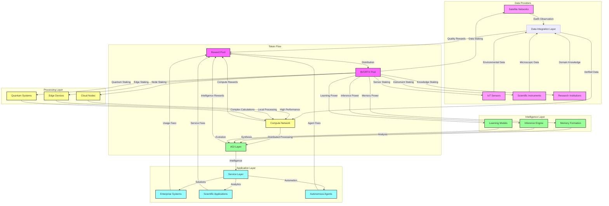

### Token Flow Specifications
```python
STAKEHOLDER_TOKENOMICS = {
    'data_provider_rewards': {
        'satellite_networks': {
            'base_rate': '1000 VORTX/TB',
            'quality_multiplier': '1.0-3.0',
            'coverage_bonus': '10% for global coverage'
        },
        'iot_sensors': {
            'base_rate': '100 VORTX/GB',
            'reliability_multiplier': '1.0-2.5',
            'real_time_bonus': '15% for < 1s latency'
        },
        'scientific_instruments': {
            'base_rate': '500 VORTX/dataset',
            'precision_multiplier': '1.0-4.0',
            'novelty_bonus': '20% for unique data'
        },
        'research_institutions': {
            'base_rate': '2000 VORTX/contribution',
            'impact_multiplier': '1.0-5.0',
            'peer_review_bonus': '25% for validated research'
        }
    },
    'compute_provider_rewards': {
        'cloud_nodes': {
            'base_rate': '50 VORTX/PFLOP-hour',
            'uptime_multiplier': '1.0-2.0',
            'efficiency_bonus': '10% for PUE < 1.1'
        },
        'edge_devices': {
            'base_rate': '20 VORTX/TFLOP-hour',
            'latency_multiplier': '1.0-3.0',
            'availability_bonus': '15% for 99.99% uptime'
        },
        'quantum_systems': {
            'base_rate': '1000 VORTX/qubit-hour',
            'coherence_multiplier': '1.0-10.0',
            'quantum_advantage_bonus': '50% for quantum speedup'
        }
    },
    'intelligence_provider_rewards': {
        'memory_formation': {
            'base_rate': '200 VORTX/pattern',
            'accuracy_multiplier': '1.0-4.0',
            'novelty_bonus': '20% for new patterns'
        },
        'inference_engine': {
            'base_rate': '100 VORTX/inference',
            'precision_multiplier': '1.0-3.0',
            'speed_bonus': '15% for real-time inference'
        },
        'learning_models': {
            'base_rate': '500 VORTX/model',
            'performance_multiplier': '1.0-5.0',
            'innovation_bonus': '30% for breakthrough algorithms'
        }
    },
    'application_fees': {
        'enterprise_systems': {
            'base_fee': '1000 VORTX/month',
            'usage_fee': '10 VORTX/query',
            'volume_discount': 'Up to 50% for high usage'
        },
        'scientific_applications': {
            'base_fee': '500 VORTX/month',
            'compute_fee': '5 VORTX/job',
            'academic_discount': '40% for research institutions'
        },
        'autonomous_agents': {
            'base_fee': '200 VORTX/agent/month',
            'action_fee': '1 VORTX/action',
            'efficiency_rebate': 'Up to 30% for optimal behavior'
        }
    },
    'staking_requirements': {
        'data_providers': {
            'minimum_stake': '10000 VORTX',
            'optimal_stake': '100000 VORTX',
            'maximum_boost': '3x rewards'
        },
        'compute_providers': {
            'minimum_stake': '50000 VORTX',
            'optimal_stake': '500000 VORTX',
            'maximum_boost': '4x rewards'
        },
        'intelligence_providers': {
            'minimum_stake': '100000 VORTX',
            'optimal_stake': '1000000 VORTX',
            'maximum_boost': '5x rewards'
        }
    }
}
```

### Value Flow Architecture
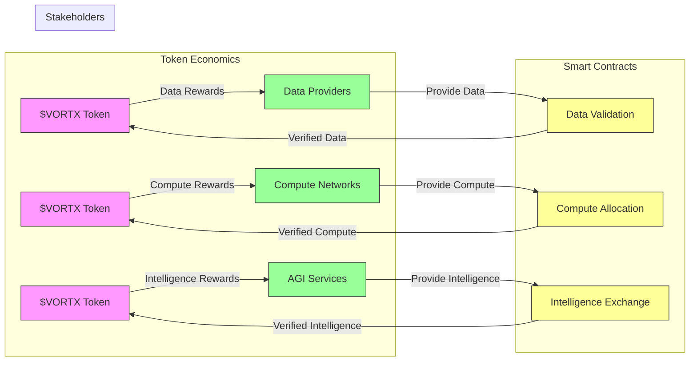

## 📚 Available Whitepapers

### 1. [System Architecture](architecture.md)
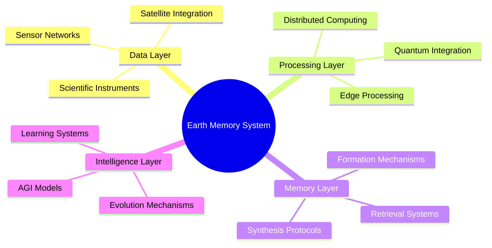

### 2. [Decentralized AGI Exchange](agi-exchange.md)
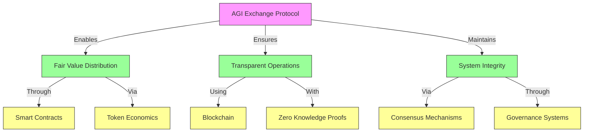

### 3. [Token Economics](token-economics.md)
```python
TOKEN_ARCHITECTURE = {
    'vortx': {
        'symbol': '$VORTX',
        'type': 'Unified Utility Token',
        'total_supply': '1,000,000,000',
        'utilities': {
            'data_operations': 'Data validation and quality staking',
            'compute_resources': 'Processing power allocation',
            'intelligence_services': 'AGI model access and deployment',
            'governance': 'Protocol decision making'
        },
        'distribution': {
            'ecosystem_rewards': '40%',
            'development': '20%',
            'foundation': '15%',
            'team': '15%',
            'advisors': '5%',
            'community': '5%'
        }
    }
}
```

### 4. [Privacy and Security](privacy-security.md)
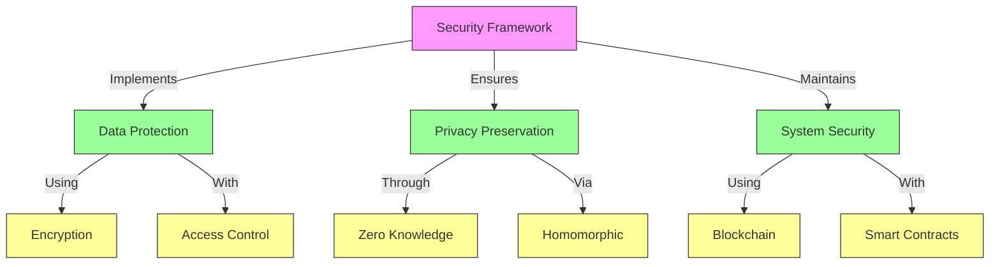

### 5. [Sustainable Computing](sustainable-computing.md)
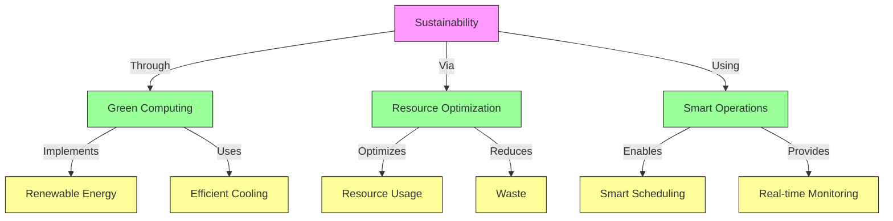

## 💰 Financial Model

### Token Utility Flow
```mermaid
graph TD
    subgraph Data Economy
        D1[Data Providers] -->|Submit Data| D2[Data Pool]
        D2 -->|Validate| D3[Smart Contract]
        D3 -->|Mint| D4[VDATA Tokens]
    end
    
    subgraph Compute Economy
        C1[Compute Providers] -->|Offer Resources| C2[Compute Pool]
        C2 -->|Validate| C3[Smart Contract]
        C3 -->|Mint| C4[VCPU Tokens]
    end
    
    subgraph Intelligence Economy
        I1[AGI Services] -->|Provide Intelligence| I2[Service Pool]
        I2 -->|Validate| I3[Smart Contract]
        I3 -->|Mint| I4[VAGI Tokens]
    end
    
    classDef economy fill:#f9f,stroke:#333
    classDef pool fill:#9f9,stroke:#333
    classDef token fill:#ff9,stroke:#333
    
    class D1,C1,I1 economy
    class D2,C2,I2 pool
    class D4,C4,I4 token
```

### Reward Distribution
```python
REWARD_MECHANISM = {
    'data_rewards': {
        'quality_score': {
            'accuracy': '0.4',
            'relevance': '0.3',
            'timeliness': '0.3'
        },
        'token_distribution': {
            'base_rate': '100 VORTX/TB',
            'quality_multiplier': '1.0-2.0',
            'network_contribution': '10-30%'
        }
    },
    'compute_rewards': {
        'performance_score': {
            'processing_power': '0.4',
            'availability': '0.3',
            'efficiency': '0.3'
        },
        'token_distribution': {
            'base_rate': '100 VORTX/PFLOP',
            'performance_multiplier': '1.0-2.0',
            'network_contribution': '10-30%'
        }
    },
    'intelligence_rewards': {
        'value_score': {
            'accuracy': '0.4',
            'innovation': '0.3',
            'sustainability': '0.3'
        },
        'token_distribution': {
            'base_rate': '100 VORTX/service',
            'value_multiplier': '1.0-3.0',
            'network_contribution': '10-30%'
        }
    }
}
```

## 🔄 Advanced Token Economics

### Token Interaction Model
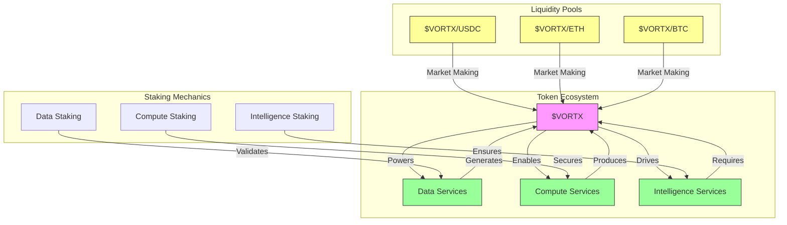

### Token Specifications
```python
TOKEN_SPECIFICATIONS = {
    'vortx': {
        'total_supply': '1,000,000,000',
        'initial_distribution': {
            'ecosystem_rewards': '40%',
            'development': '20%',
            'foundation': '15%',
            'team': '15%',
            'advisors': '5%',
            'community': '5%'
        },
        'vesting_schedule': {
            'team': {
                'cliff': '12 months',
                'vesting': '36 months',
                'release': 'Linear'
            },
            'advisors': {
                'cliff': '6 months',
                'vesting': '24 months',
                'release': 'Linear'
            }
        },
        'utility_mechanisms': {
            'data_validation': True,
            'quality_staking': True,
            'governance_rights': True,
            'fee_reduction': True
        }
    },
    'vcpu': {
        'total_supply': '500,000,000',
        'emission_schedule': {
            'initial_rate': '100 VORTX/block',
            'halving_period': '2 years',
            'minimum_rate': '1 VORTX/block'
        },
        'staking_requirements': {
            'validator_node': '50,000 VORTX',
            'compute_node': '10,000 VORTX',
            'storage_node': '5,000 VORTX'
        }
    },
    'vagi': {
        'total_supply': '100,000,000',
        'minting_policy': {
            'initial_rate': 'Dynamic',
            'based_on': 'Network Intelligence Growth',
            'max_inflation': '2% annually'
        },
        'intelligence_rights': {
            'model_access': True,
            'inference_priority': True,
            'governance_weight': True
        }
    }
}
```

### Economic Security Model
```python
SECURITY_MECHANISMS = {
    'slashing_conditions': {
        'data_manipulation': {
            'detection': 'Zero-Knowledge Proof',
            'penalty': '10% stake',
            'blacklist_period': '30 days'
        },
        'compute_fraud': {
            'detection': 'Proof of Computation',
            'penalty': '20% stake',
            'blacklist_period': '60 days'
        },
        'intelligence_misuse': {
            'detection': 'Consensus Verification',
            'penalty': '30% stake',
            'blacklist_period': '90 days'
        }
    },
    'reward_mechanisms': {
        'data_quality': {
            'base_reward': 'Dynamic',
            'quality_multiplier': '1.0-3.0',
            'reputation_bonus': '0-20%'
        },
        'compute_efficiency': {
            'base_reward': 'Dynamic',
            'performance_multiplier': '1.0-2.5',
            'uptime_bonus': '0-15%'
        },
        'intelligence_contribution': {
            'base_reward': 'Dynamic',
            'impact_multiplier': '1.0-4.0',
            'innovation_bonus': '0-25%'
        }
    }
}
```

## 🏛 Governance Framework

### Governance Architecture
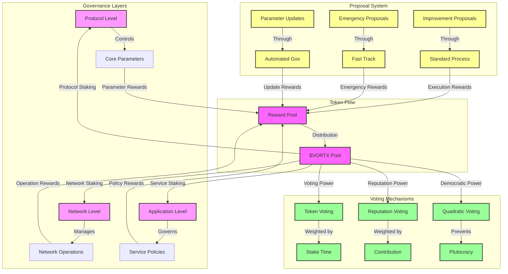

### Enhanced Governance Parameters
```python
GOVERNANCE_TOKENOMICS = {
    'voting_power': {
        'token_based': {
            'base_power': '1 vote per 1000 VORTX',
            'time_multiplier': {
                '6 months': '1.5x',
                '1 year': '2x',
                '2 years': '3x',
                '4 years': '4x'
            },
            'cap': 'Square root of total stake'
        },
        'reputation_based': {
            'contribution_score': {
                'proposals_accepted': '100 points',
                'successful_votes': '10 points',
                'community_activity': '1 point/day'
            },
            'multiplier': 'Up to 2x voting power',
            'decay': '10% per month without activity'
        },
        'quadratic_voting': {
            'cost': 'VORTX^2 per vote',
            'max_votes': '100 per proposal',
            'refund': '50% for winning votes'
        }
    },
    'proposal_system': {
        'standard_proposals': {
            'submission_cost': '10000 VORTX',
            'minimum_stake': '100000 VORTX',
            'reward_pool': '1000 VORTX/day',
            'quorum': '40% of total stake',
            'passing_threshold': '66%'
        },
        'emergency_proposals': {
            'submission_cost': '50000 VORTX',
            'minimum_stake': '500000 VORTX',
            'reward_pool': '5000 VORTX/day',
            'quorum': '60% of total stake',
            'passing_threshold': '75%'
        },
        'parameter_updates': {
            'submission_cost': '5000 VORTX',
            'minimum_stake': '50000 VORTX',
            'reward_pool': '500 VORTX/day',
            'quorum': '30% of total stake',
            'passing_threshold': '60%'
        }
    },
    'governance_rewards': {
        'proposal_creation': {
            'base_reward': '1000 VORTX',
            'acceptance_bonus': '5000 VORTX',
            'implementation_bonus': '10000 VORTX'
        },
        'voting_participation': {
            'base_reward': '10 VORTX/vote',
            'stake_multiplier': '1.0-2.0',
            'consistency_bonus': 'Up to 50%'
        },
        'protocol_improvement': {
            'minor_update': '10000 VORTX',
            'major_update': '50000 VORTX',
            'critical_update': '100000 VORTX'
        }
    },
    'slashing_conditions': {
        'malicious_proposals': {
            'first_offense': '10% stake',
            'second_offense': '50% stake',
            'third_offense': '100% stake'
        },
        'voting_manipulation': {
            'coordinated_voting': '20% stake',
            'multiple_accounts': '100% stake',
            'bribe_acceptance': '100% stake'
        },
        'governance_attacks': {
            'spam_proposals': '5% stake per incident',
            'false_emergency': '30% stake',
            'parameter_manipulation': '100% stake'
        }
    }
}
```

## 🔄 AGI Exchange Protocol

### Protocol Architecture
```mermaid
graph TD
    subgraph Data Flow
        D1[Raw Data] -->|Validation| D2[Verified Data]
        D2 -->|Processing| D3[Intelligence Input]
    end
    
    subgraph Compute Flow
        C1[Resource Request] -->|Allocation| C2[Compute Assignment]
        C2 -->|Execution| C3[Results Verification]
    end
    
    subgraph Intelligence Flow
        I1[Model Request] -->|Matching| I2[Service Execution]
        I2 -->|Validation| I3[Result Delivery]
    end
    
    subgraph Value Flow
        V1[Token Generation] -->|Distribution| V2[Reward Settlement]
        V2 -->|Staking| V3[Network Security]
    end
    
    classDef flow fill:#f9f,stroke:#333,stroke-width:2px
    classDef process fill:#9f9,stroke:#333,stroke-width:2px
    classDef result fill:#ff9,stroke:#333,stroke-width:2px
    
    class D1,C1,I1,V1 flow
    class D2,C2,I2,V2 process
    class D3,C3,I3,V3 result
```

### Protocol Specifications
```python
PROTOCOL_SPEC = {
    'data_protocol': {
        'validation_methods': {
            'quality_check': 'ML-based',
            'consensus_required': '66%',
            'verification_time': '< 10s'
        },
        'processing_pipeline': {
            'preprocessing': 'Automated',
            'enrichment': 'AI-driven',
            'standardization': 'Schema-enforced'
        }
    },
    'compute_protocol': {
        'resource_allocation': {
            'scheduling': 'AI-optimized',
            'load_balancing': 'Dynamic',
            'failover': 'Automatic'
        },
        'execution_verification': {
            'proof_generation': 'ZK-SNARK',
            'verification_time': '< 5s',
            'dispute_resolution': 'Automated'
        }
    },
    'intelligence_protocol': {
        'service_matching': {
            'algorithm': 'Multi-dimensional',
            'optimization': 'Cost-performance',
            'response_time': '< 1s'
        },
        'result_validation': {
            'quality_check': 'Consensus-based',
            'performance_metrics': 'Real-time',
            'feedback_loop': 'Continuous'
        }
    }
}
```

### AGI Exchange Protocol with Tokenomics
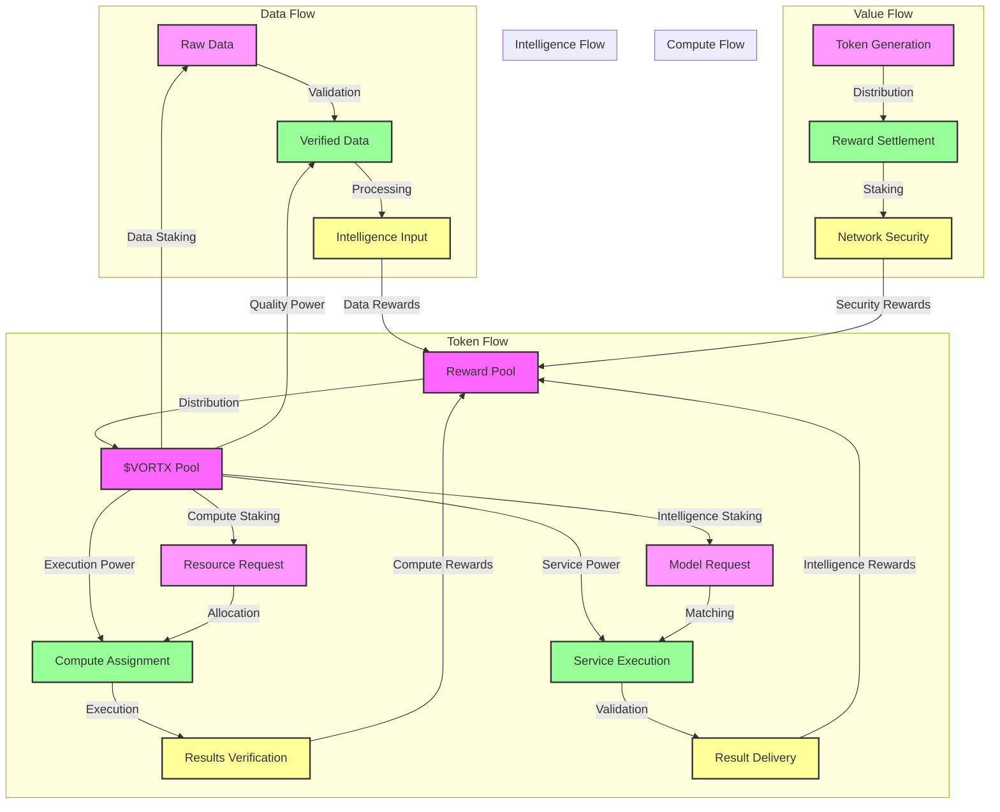

### Exchange Protocol Tokenomics
```python
EXCHANGE_TOKENOMICS = {
    'data_exchange': {
        'validation_rewards': {
            'base_rate': '10 VORTX/validation',
            'accuracy_multiplier': '1.0-3.0',
            'volume_bonus': 'Up to 50% for high throughput'
        },
        'processing_rewards': {
            'base_rate': '20 VORTX/GB',
            'complexity_multiplier': '1.0-4.0',
            'quality_bonus': 'Up to 30% for high-quality outputs'
        },
        'staking_requirements': {
            'validator': '50000 VORTX',
            'processor': '100000 VORTX',
            'maximum_boost': '3x rewards'
        }
    },
    'compute_exchange': {
        'allocation_rewards': {
            'base_rate': '30 VORTX/hour',
            'efficiency_multiplier': '1.0-2.5',
            'utilization_bonus': 'Up to 40% for high utilization'
        },
        'verification_rewards': {
            'base_rate': '5 VORTX/verification',
            'speed_multiplier': '1.0-2.0',
            'accuracy_bonus': 'Up to 20% for perfect verification'
        },
        'staking_requirements': {
            'allocator': '75000 VORTX',
            'verifier': '25000 VORTX',
            'maximum_boost': '2.5x rewards'
        }
    },
    'intelligence_exchange': {
        'matching_rewards': {
            'base_rate': '50 VORTX/match',
            'precision_multiplier': '1.0-3.0',
            'satisfaction_bonus': 'Up to 35% for perfect matches'
        },
        'execution_rewards': {
            'base_rate': '100 VORTX/service',
            'performance_multiplier': '1.0-5.0',
            'innovation_bonus': 'Up to 50% for unique solutions'
        },
        'staking_requirements': {
            'matcher': '100000 VORTX',
            'executor': '200000 VORTX',
            'maximum_boost': '4x rewards'
        }
    },
    'security_incentives': {
        'staking_rewards': {
            'base_rate': '1000 VORTX/month',
            'amount_multiplier': '1.0-2.0',
            'duration_bonus': 'Up to 100% for 4-year lock'
        },
        'slashing_conditions': {
            'minor_violation': '10% stake',
            'major_violation': '50% stake',
            'critical_violation': '100% stake'
        },
        'minimum_requirements': {
            'validator_node': '500000 VORTX',
            'security_node': '250000 VORTX',
            'guardian_node': '1000000 VORTX'
        }
    }
}
```

## 🎯 Implementation Scenarios

### Enterprise Intelligence
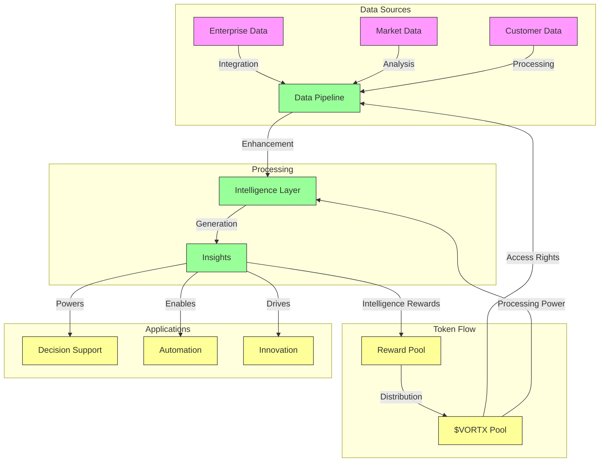

### Scientific Research
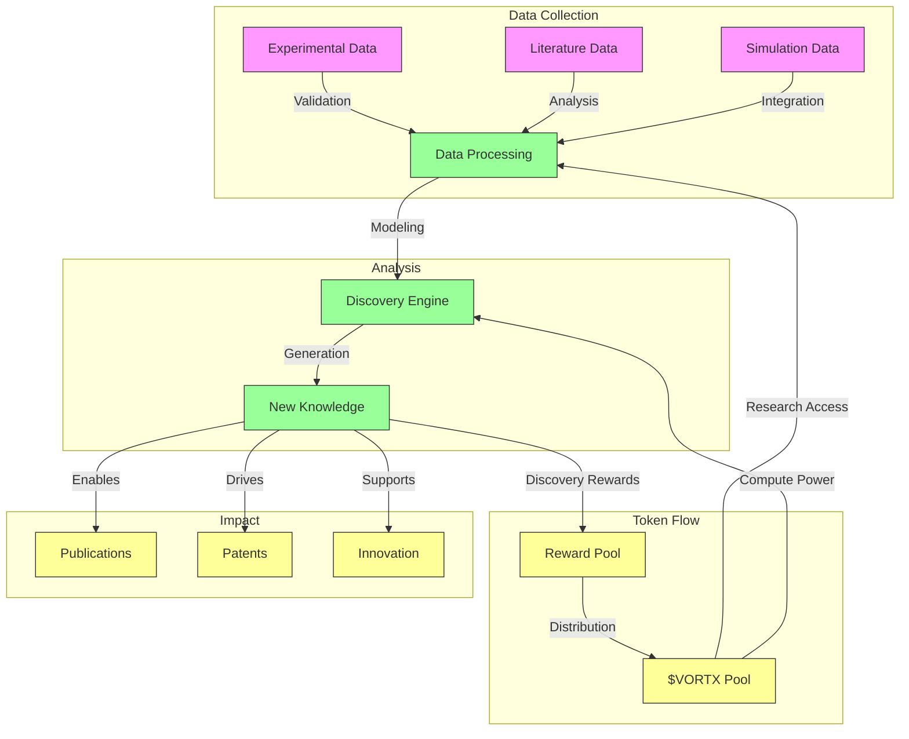

### Environmental Monitoring
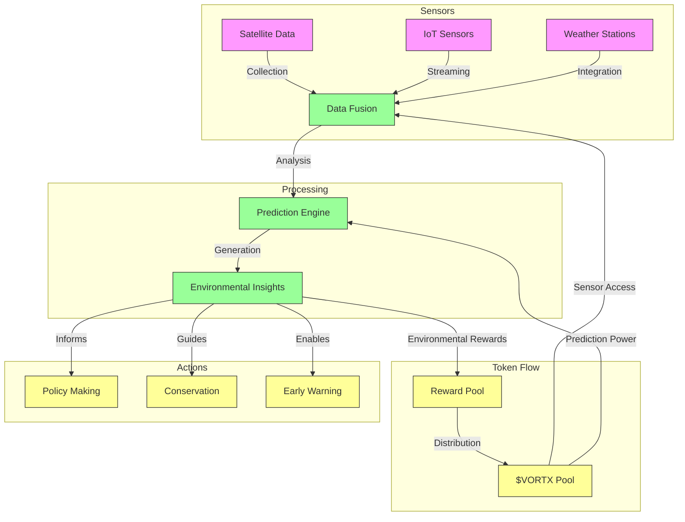

## 🌐 Impact Analysis

### Environmental Impact
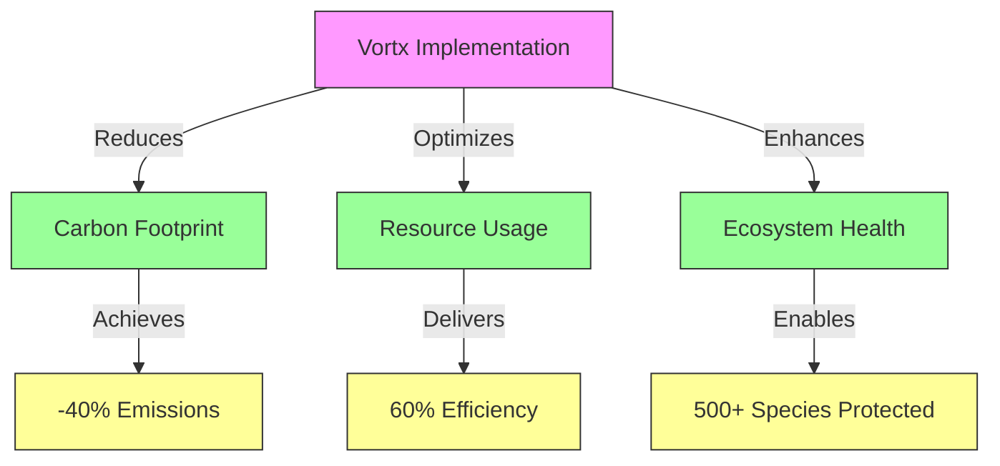

### Economic Impact
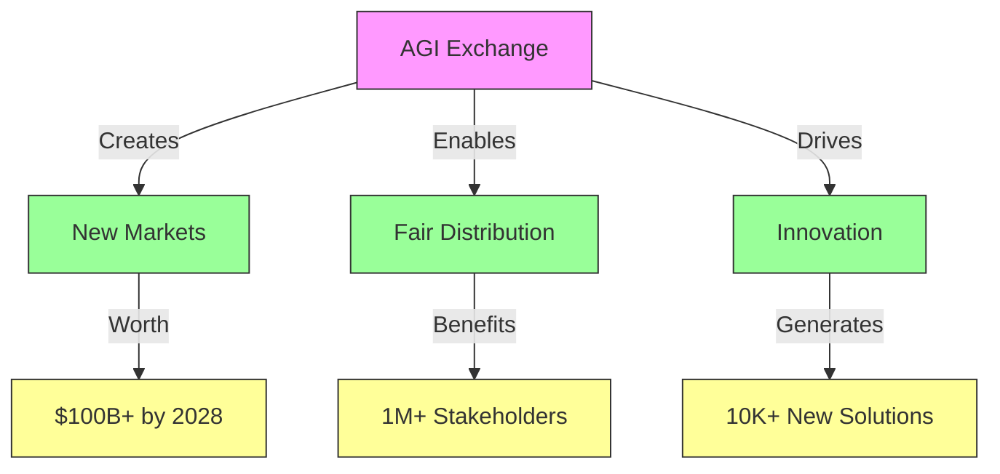

## 🔗 Advanced Token Utilities

### Data Services Use Cases
```mermaid
graph TD
    subgraph Data Quality
        D1[Raw Data] -->|Quality Staking| D2[Verified Data]
        D2 -->|Reputation Building| D3[Premium Data]
        D3 -->|Market Access| D4[Data Marketplace]
    end
    
    subgraph Data Services
        S1[Data Processing] -->|Service Fee| S2[Enhanced Data]
        S2 -->|Value Addition| S3[Specialized Datasets]
        S3 -->|Revenue Share| S4[Data Products]
    end
    
    subgraph Governance
        G1[Proposal Rights] -->|Voting Power| G2[Protocol Changes]
        G2 -->|Implementation| G3[Network Evolution]
    end
    
    classDef quality fill:#f9f,stroke:#333
    classDef service fill:#9f9,stroke:#333
    classDef gov fill:#ff9,stroke:#333
    
    class D1,D2,D3,D4 quality
    class S1,S2,S3,S4 service
    class G1,G2,G3 gov
```

### Compute Services Applications
```mermaid
graph TD
    subgraph Resource Allocation
        R1[Compute Resources] -->|Dynamic Pricing| R2[Resource Market]
        R2 -->|Optimization| R3[Efficient Distribution]
    end
    
    subgraph Network Operations
        N1[Node Operation] -->|Rewards| N2[Network Security]
        N2 -->|Validation| N3[Quality Service]
    end
    
    subgraph Service Level
        S1[Priority Access] -->|QoS| S2[Guaranteed Performance]
        S2 -->|SLA| S3[Enterprise Service]
    end
    
    classDef resource fill:#f9f,stroke:#333
    classDef network fill:#9f9,stroke:#333
    classDef service fill:#ff9,stroke:#333
    
    class R1,R2,R3 resource
    class N1,N2,N3 network
    class S1,S2,S3 service
```

### Intelligence Services Utilities
```mermaid
graph TD
    subgraph Model Access
        M1[AGI Models] -->|Access Rights| M2[Inference Services]
        M2 -->|Quality| M3[Premium Features]
    end
    
    subgraph Innovation
        I1[Research Access] -->|Development| I2[New Models]
        I2 -->|Validation| I3[Network Integration]
    end
    
    subgraph Ecosystem
        E1[Partnership Rights] -->|Collaboration| E2[Joint Development]
        E2 -->|Integration| E3[Extended Services]
    end
    
    classDef model fill:#f9f,stroke:#333
    classDef innovation fill:#9f9,stroke:#333
    classDef eco fill:#ff9,stroke:#333
    
    class M1,M2,M3 model
    class I1,I2,I3 innovation
    class E1,E2,E3 eco
```

### Token Flow Architecture
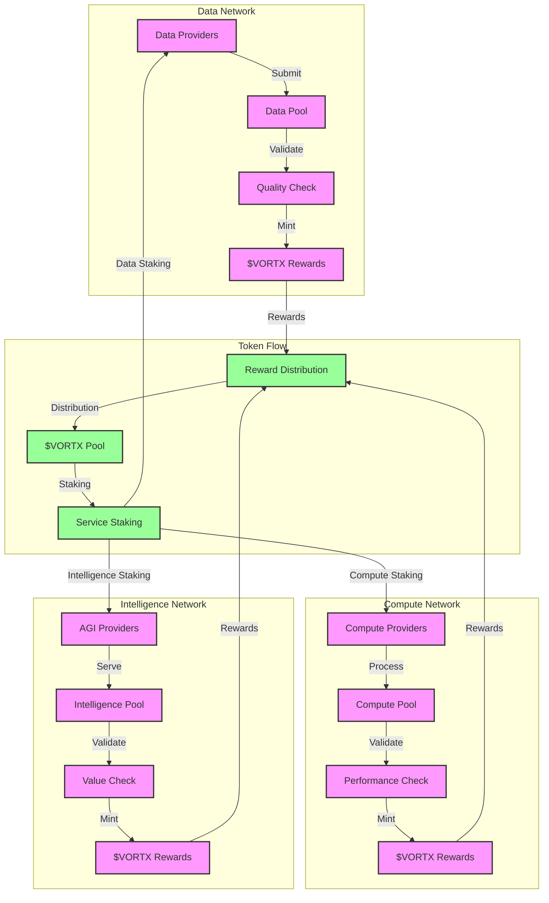

### Reward Mechanisms
```python
REWARD_MECHANISM = {
    'data_rewards': {
        'quality_score': {
            'accuracy': '0.4',
            'relevance': '0.3',
            'timeliness': '0.3'
        },
        'token_distribution': {
            'base_rate': '100 VORTX/TB',
            'quality_multiplier': '1.0-2.0',
            'network_contribution': '10-30%'
        }
    },
    'compute_rewards': {
        'performance_score': {
            'processing_power': '0.4',
            'availability': '0.3',
            'efficiency': '0.3'
        },
        'token_distribution': {
            'base_rate': '100 VORTX/PFLOP',
            'performance_multiplier': '1.0-2.0',
            'network_contribution': '10-30%'
        }
    },
    'intelligence_rewards': {
        'value_score': {
            'accuracy': '0.4',
            'innovation': '0.3',
            'sustainability': '0.3'
        },
        'token_distribution': {
            'base_rate': '100 VORTX/service',
            'value_multiplier': '1.0-3.0',
            'network_contribution': '10-30%'
        }
    }
}
```

### Token Utility Model
```mermaid
graph TD
    subgraph Service Layer
        V1[$VORTX] -->|Powers| D[Data Services]
        V1 -->|Enables| C[Compute Services]
        V1 -->|Drives| I[Intelligence Services]
    end
    
    subgraph Token Flow
        T1[$VORTX Pool] -->|Staking| T2[Service Staking]
        T2 -->|Data Staking| V1
        T2 -->|Compute Staking| V1
        T2 -->|Intelligence Staking| V1
        
        D -->|Service Rewards| T3[Reward Pool]
        C -->|Performance Rewards| T3
        I -->|Value Rewards| T3
        
        T3 -->|Distribution| T1
    end
    
    classDef service fill:#f9f,stroke:#333,stroke-width:2px
    classDef token fill:#ff9,stroke:#333,stroke-width:2px
    
    class D,C,I service
    class V1,T1,T2,T3 token
```

### Liquidity Model
```mermaid
graph TD
    subgraph Market Making
        L1[$VORTX/USDC] -->|Market Making| V1[$VORTX Pool]
        L2[$VORTX/ETH] -->|Market Making| V1
        L3[$VORTX/BTC] -->|Market Making| V1
    end
    
    subgraph Token Flow
        V1 -->|Staking| S1[Service Staking]
        V1 -->|Rewards| S2[Reward Distribution]
        S1 -->|Returns| V1
        S2 -->|Returns| V1
    end
    
    classDef market fill:#f9f,stroke:#333,stroke-width:2px
    classDef token fill:#ff9,stroke:#333,stroke-width:2px
    
    class L1,L2,L3 market
    class V1,S1,S2 token
```

### Token Distribution
```python
TOKEN_DISTRIBUTION = {
    'total_supply': 1_000_000_000,  # 1 billion $VORTX
    'distribution': {
        'ecosystem_rewards': {
            'percentage': 40,
            'vesting': '10 years linear',
            'initial_rate': '100 VORTX/block',
            'halving_period': '2 years',
            'minimum_rate': '1 VORTX/block'
        },
        'staking_requirements': {
            'validator_node': '50,000 VORTX',
            'compute_node': '10,000 VORTX',
            'storage_node': '5,000 VORTX'
        },
        'development': {
            'percentage': 20,
            'vesting': '5 years linear',
            'cliff': '1 year'
        },
        'foundation': {
            'percentage': 15,
            'vesting': '5 years linear',
            'cliff': '1 year'
        },
        'team': {
            'percentage': 15,
            'vesting': '4 years linear',
            'cliff': '1 year'
        },
        'advisors': {
            'percentage': 5,
            'vesting': '2 years linear',
            'cliff': '6 months'
        },
        'community': {
            'percentage': 5,
            'vesting': 'None',
            'purpose': 'Initial community incentives'
        }
    }
}
```

### Data Services
```mermaid
graph TD
    subgraph Data Layer
        D1[Data Sources] -->|Ingest| D2[Data Pool]
        D2 -->|Process| D3[Data Quality]
        D3 -->|Validate| D4[Data Value]
    end
    
    subgraph Token Flow
        T1[$VORTX Pool] -->|Data Staking| D1
        T1 -->|Quality Power| D3
        D4 -->|Data Rewards| T2[Reward Pool]
        T2 -->|Distribution| T1
    end
    
    subgraph Applications
        D4 -->|Powers| A1[Analytics]
        D4 -->|Enables| A2[Research]
        D4 -->|Drives| A3[Intelligence]
    end
    
    classDef data fill:#f9f,stroke:#333,stroke-width:2px
    classDef token fill:#ff9,stroke:#333,stroke-width:2px
    classDef app fill:#9f9,stroke:#333,stroke-width:2px
    
    class D1,D2,D3,D4 data
    class T1,T2 token
    class A1,A2,A3 app
```

### Compute Services
```mermaid
graph TD
    subgraph Compute Layer
        C1[Compute Nodes] -->|Process| C2[Compute Pool]
        C2 -->|Validate| C3[Performance]
        C3 -->|Optimize| C4[Efficiency]
    end
    
    subgraph Token Flow
        T1[$VORTX Pool] -->|Compute Staking| C1
        T1 -->|Performance Power| C3
        C4 -->|Compute Rewards| T2[Reward Pool]
        T2 -->|Distribution| T1
    end
    
    subgraph Applications
        C4 -->|Powers| A1[Processing]
        C4 -->|Enables| A2[Training]
        C4 -->|Drives| A3[Inference]
    end
    
    classDef compute fill:#f9f,stroke:#333,stroke-width:2px
    classDef token fill:#ff9,stroke:#333,stroke-width:2px
    classDef app fill:#9f9,stroke:#333,stroke-width:2px
    
    class C1,C2,C3,C4 compute
    class T1,T2 token
    class A1,A2,A3 app
```

### Intelligence Services
```mermaid
graph TD
    subgraph Intelligence Layer
        I1[AGI Services] -->|Process| I2[Intelligence Pool]
        I2 -->|Validate| I3[Value Analysis]
        I3 -->|Optimize| I4[Service Quality]
    end
    
    subgraph Token Flow
        T1[$VORTX Pool] -->|Intelligence Staking| I1
        T1 -->|Service Power| I3
        I4 -->|Intelligence Rewards| T2[Reward Pool]
        T2 -->|Distribution| T1
    end
    
    subgraph Applications
        I4 -->|Powers| A1[Reasoning]
        I4 -->|Enables| A2[Learning]
        I4 -->|Drives| A3[Creation]
    end
    
    classDef intelligence fill:#f9f,stroke:#333,stroke-width:2px
    classDef token fill:#ff9,stroke:#333,stroke-width:2px
    classDef app fill:#9f9,stroke:#333,stroke-width:2px
    
    class I1,I2,I3,I4 intelligence
    class T1,T2 token
    class A1,A2,A3 app
```

### Cross-Chain Architecture
```mermaid
graph TD
    subgraph Chains
        V1[$VORTX Chain] -->|Bridge| B1[Bridge Protocol]
        E1[Ethereum] -->|Bridge| B1
        S1[Solana] -->|Bridge| B1
    end
    
    subgraph Token Flow
        B1 -->|Lock| T1[$VORTX Pool]
        T1 -->|Mint| T2[Wrapped $VORTX]
        T2 -->|Burn| T1
        T1 -->|Release| B1
    end
    
    classDef chain fill:#f9f,stroke:#333,stroke-width:2px
    classDef bridge fill:#ff9,stroke:#333,stroke-width:2px
    classDef token fill:#9f9,stroke:#333,stroke-width:2px
    
    class V1,E1,S1 chain
    class B1 bridge
    class T1,T2 token
```
