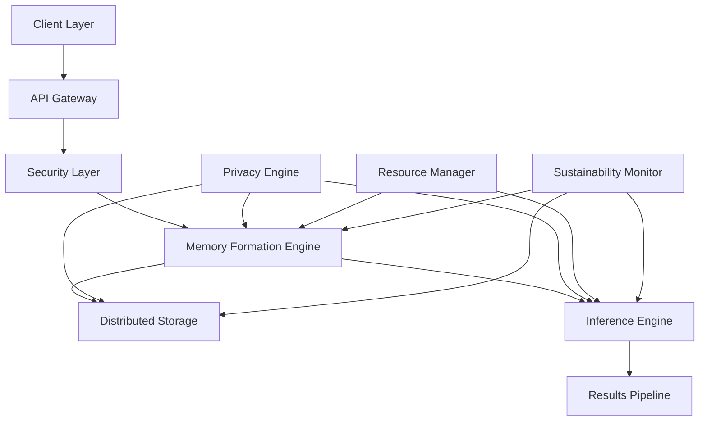

# Vortx System Architecture: Technical Whitepaper

## Executive Summary

This whitepaper presents a comprehensive technical overview of the Vortx Earth Memory System architecture, detailing its distributed memory formation, retrieval mechanisms, and scalability characteristics. The system represents a breakthrough in synthetic satellite technology, combining advanced AGI capabilities with geospatial intelligence.

## 1. System Overview

### 1.1 Architectural Principles
- Distributed memory architecture
- Event-driven processing
- Privacy-by-design
- Sustainable computing
- Horizontal scalability

### 1.2 Core Components

## 2. Memory Formation Architecture

### 2.1 Data Ingestion
- Multi-protocol input support
- Real-time stream processing
- Batch processing capabilities
- Data validation and sanitization

### 2.2 Memory Formation Process
- Neural embedding generation
- Hierarchical memory structures
- Temporal relationship mapping
- Spatial relationship mapping
- Cross-reference indexing

### 2.3 Storage Architecture
- Distributed storage system
- Data sharding strategies
- Replication mechanisms
- Consistency protocols

## 3. Inference Engine

### 3.1 Runtime Inference
- Dynamic query optimization
- Parallel processing pipelines
- Memory access patterns
- Cache optimization

### 3.2 Scaling Strategies
- Horizontal scaling
- Load balancing
- Resource allocation
- Performance optimization

## 4. Privacy and Security Architecture

### 4.1 Zero-Knowledge Implementation
- Homomorphic encryption
- Secure multi-party computation
- Privacy-preserving protocols

### 4.2 Security Measures
- End-to-end encryption
- Access control mechanisms
- Audit logging
- Threat detection

## 5. Performance Characteristics

### 5.1 Scalability Metrics
- Linear scaling capabilities
- Memory formation throughput
- Query response times
- Resource utilization

### 5.2 Benchmarks
- Memory formation speed
- Query performance
- Storage efficiency
- Network utilization

## 6. Sustainability Features

### 6.1 Resource Optimization
- Adaptive resource allocation
- Energy-efficient computing
- Workload optimization
- Green computing practices

### 6.2 Environmental Impact
- Carbon footprint metrics
- Energy consumption analysis
- Resource utilization efficiency
- Sustainability monitoring

## 7. Future Developments

### 7.1 Planned Enhancements
- Advanced neural architectures
- Improved compression techniques
- Enhanced privacy features
- Extended API capabilities

### 7.2 Research Directions
- Novel memory formation methods
- Advanced inference techniques
- Quantum-resistant security
- Sustainable computing innovations

## 8. Technical Specifications

### 8.1 System Requirements
- Compute resources
- Storage requirements
- Network specifications
- Operating environment

### 8.2 Integration Interfaces
- API specifications
- Protocol support
- Client libraries
- Integration patterns

## References

1. Internal System Documentation
2. Performance Benchmarks
3. Security Protocols
4. Sustainability Metrics
5. Research Publications

## Appendix

A. Detailed Component Specifications
B. Performance Benchmark Data
C. Security Protocol Details
D. Environmental Impact Metrics 