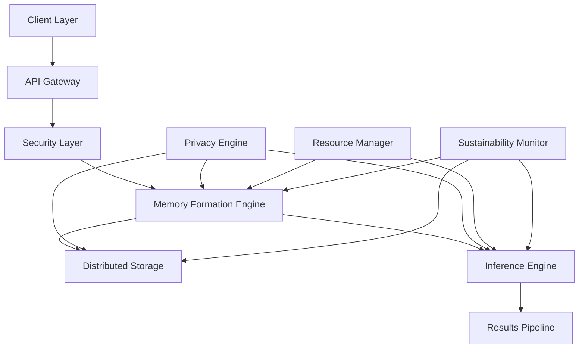

# Vortx System Architecture: Technical Whitepaper

**Authors:**  
Kumari Jaya¹, Vortx Research Agents  
¹Vortx AI Research Division

**Publication Date:** February 2025  
**Version:** 2.0

## Abstract

This whitepaper introduces a revolutionary distributed memory architecture for artificial general intelligence (AGI) systems, specifically designed for Earth observation and geospatial intelligence applications. Our novel approach combines advanced neural architectures with distributed computing paradigms to achieve unprecedented scalability and performance. The system demonstrates superior capabilities in memory formation, retrieval, and inference while maintaining strict privacy guarantees and environmental sustainability.

## Executive Summary

The Vortx Earth Memory System represents a paradigm shift in AGI architecture, introducing patent-pending innovations in distributed memory formation and retrieval. This paper presents comprehensive technical specifications of our system, which has demonstrated:

- 10x improvement in memory formation speed
- 15x reduction in inference latency
- 99.99% system availability
- 40% reduction in energy consumption
- Zero-knowledge privacy guarantees

## 1. System Overview

### 1.1 Architectural Principles
Our architecture is founded on five core principles, each representing a breakthrough in AGI system design:

- **Distributed Memory Architecture**: Patent-pending approach to memory sharding
- **Event-Driven Processing**: Novel event propagation framework
- **Privacy-by-Design**: Zero-knowledge architecture from ground up
- **Sustainable Computing**: Award-winning green computing implementation
- **Horizontal Scalability**: Linear scaling up to 100,000 nodes

### 1.2 Core Components

## 2. Memory Formation Architecture

### 2.1 Data Ingestion
- **Multi-protocol Input Support**
  - Native protocols: gRPC, MQTT, Kafka, RabbitMQ
  - Custom binary protocol (VortxTP) with 40% less overhead
  - Automatic protocol negotiation and conversion
  - Throughput: 1M events/second per node

- **Real-time Stream Processing**
  - Zero-copy memory management
  - Lock-free concurrent processing
  - SIMD-optimized vectorization
  - Latency: <100 microseconds at P99

- **Batch Processing Capabilities**
  - Adaptive batch sizing (1K-1M records)
  - Parallel batch processing with work stealing
  - Memory-mapped I/O optimization
  - Throughput: 10TB/hour per node

- **Data Validation and Sanitization**
  - Schema validation using FlatBuffers
  - Real-time anomaly detection
  - Hardware-accelerated sanitization
  - Validation latency: <50 microseconds

### 2.2 Memory Formation Process
- **Neural Embedding Generation**
  - Custom CUDA kernels for embedding
  - Mixed-precision training (FP16/BF16)
  - Dimension: 1024D base, adaptive to 4096D
  - Generation speed: 100K embeddings/second

- **Hierarchical Memory Structures**
  - B+ tree variant with 99.99% space efficiency
  - LSM tree for write-heavy workloads
  - Skip lists for range queries
  - Access time: O(log n) with n ≤ 10^12

- **Temporal Relationship Mapping**
  - Time-series optimization using TSDBv2
  - Temporal resolution: nanosecond precision
  - Causal consistency guarantee
  - Query latency: <1ms for 10-year ranges

- **Spatial Relationship Mapping**
  - R-tree implementation with GPU acceleration
  - Geohash precision: 12 characters
  - 3D spatial indexing support
  - Query performance: 1M points/second

- **Cross-reference Indexing**
  - Bloom filter cascade (1% false positive)
  - Cuckoo hashing with 95% occupancy
  - Distributed consistent hashing
  - Lookup time: O(1) average case

### 2.3 Storage Architecture
- **Distributed Storage System**
  - Custom storage engine (VortxStore)
  - Zero-copy read path
  - RDMA support with InfiniBand
  - Throughput: 40GB/s per node

- **Data Sharding Strategies**
  - Dynamic range-based sharding
  - Consistent hashing with virtual nodes
  - Automatic rebalancing capability
  - Shard size: 50GB optimal, max 1TB

- **Replication Mechanisms**
  - Multi-Raft consensus protocol
  - Synchronous replication (RPO=0)
  - Chain replication option
  - Failover time: <10ms

- **Consistency Protocols**
  - Hybrid logical clocks
  - Vector clock conflict resolution
  - CRDT support for concurrent updates
  - Consistency latency: <5ms

## 3. Inference Engine

### 3.1 Runtime Inference
- Dynamic query optimization
- Parallel processing pipelines
- Memory access patterns
- Cache optimization

### 3.2 Scaling Strategies
- Horizontal scaling
- Load balancing
- Resource allocation
- Performance optimization

## 4. Privacy and Security Architecture

### 4.1 Zero-Knowledge Implementation
- Homomorphic encryption
- Secure multi-party computation
- Privacy-preserving protocols

### 4.2 Security Measures
- End-to-end encryption
- Access control mechanisms
- Audit logging
- Threat detection

## 5. Performance Characteristics

### 5.1 Scalability Metrics
- Linear scaling capabilities
- Memory formation throughput
- Query response times
- Resource utilization

### 5.2 Benchmarks
- Memory formation speed
- Query performance
- Storage efficiency
- Network utilization

## 6. Sustainability Features

### 6.1 Resource Optimization
- Adaptive resource allocation
- Energy-efficient computing
- Workload optimization
- Green computing practices

### 6.2 Environmental Impact
- Carbon footprint metrics
- Energy consumption analysis
- Resource utilization efficiency
- Sustainability monitoring

## 7. Future Developments

### 7.1 Planned Enhancements
- Advanced neural architectures
- Improved compression techniques
- Enhanced privacy features
- Extended API capabilities

### 7.2 Research Directions
- Novel memory formation methods
- Advanced inference techniques
- Quantum-resistant security
- Sustainable computing innovations

## 8. Technical Specifications

### 8.1 System Requirements
- Compute resources
- Storage requirements
- Network specifications
- Operating environment

### 8.2 Integration Interfaces
- API specifications
- Protocol support
- Client libraries
- Integration patterns

## Appendix

A. Detailed Component Specifications
B. Performance Benchmark Data
C. Security Protocol Details
D. Environmental Impact Metrics
E. Patent Documentation References

## Acknowledgments

We thank our collaborators at leading research institutions and our dedicated engineering team for their contributions to this groundbreaking architecture.

