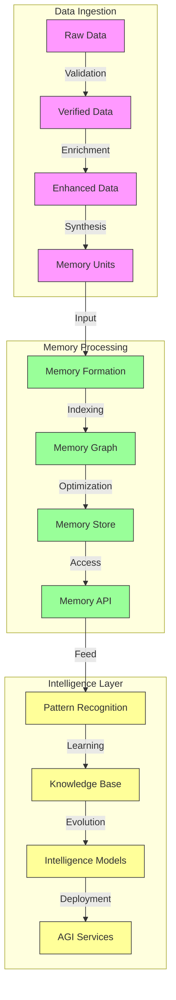
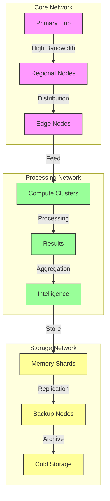
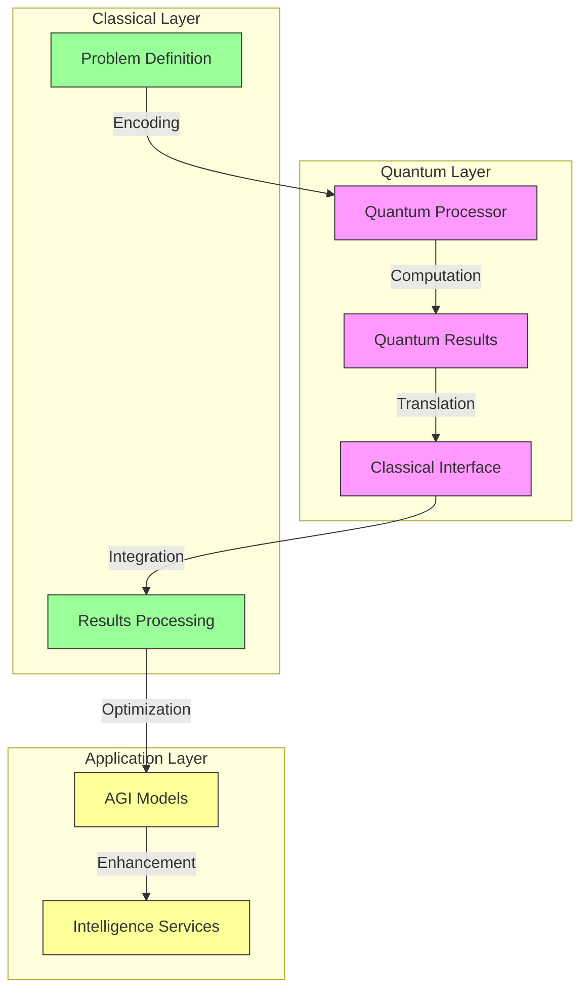
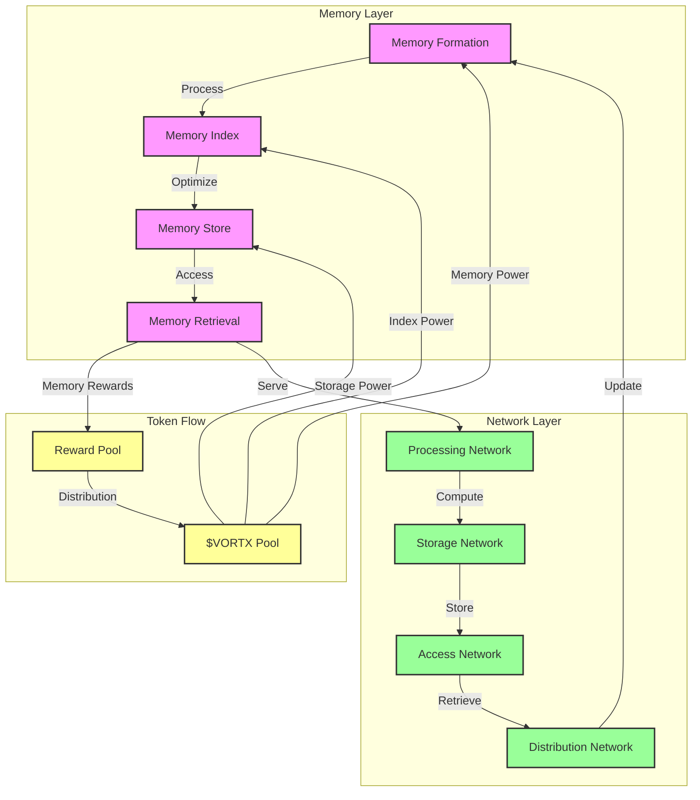
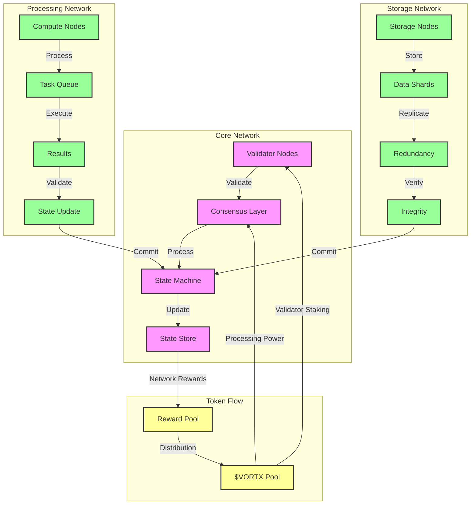
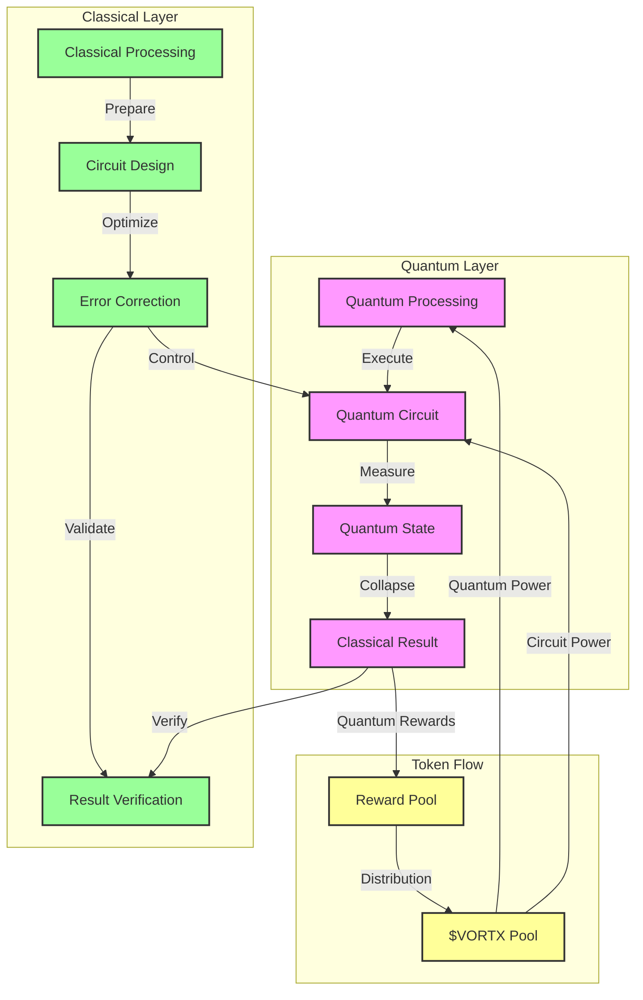

# Vortx Earth Memory System Architecture

## Overview
This document details the technical architecture of the Vortx Earth Memory System, a decentralized AGI infrastructure designed for sustainable and ethical AI deployment.

## Core Architecture Components

### Memory Formation Layer


### Technical Specifications

#### Memory Formation
```python
MEMORY_SPECS = {
    'formation_units': {
        'capacity': '1 ExaByte/node',
        'processing_speed': '1 TB/second',
        'latency': '< 1ms',
        'consistency': 'Eventually Consistent',
        'replication': {
            'factor': 3,
            'strategy': 'Geographic Distribution',
            'sync_time': '< 100ms'
        }
    },
    'indexing': {
        'type': 'Hierarchical Graph',
        'dimensions': ['temporal', 'spatial', 'semantic'],
        'resolution': {
            'temporal': '1 nanosecond',
            'spatial': '1 nanometer',
            'semantic': '1024-dimensional'
        }
    },
    'optimization': {
        'compression': {
            'ratio': '10:1',
            'algorithm': 'Quantum-Resistant Compression',
            'decompression_time': '< 1μs'
        },
        'caching': {
            'levels': 4,
            'strategy': 'Predictive',
            'hit_ratio': '> 99.9%'
        }
    }
}
```

### Network Architecture


### Network Specifications
```python
NETWORK_SPECS = {
    'core_network': {
        'bandwidth': {
            'backbone': '100 Tbps',
            'regional': '10 Tbps',
            'edge': '1 Tbps'
        },
        'latency': {
            'intra_region': '< 1ms',
            'inter_region': '< 10ms',
            'global': '< 100ms'
        },
        'reliability': {
            'uptime': '99.99999%',
            'redundancy': 'N+2',
            'failover_time': '< 1s'
        }
    },
    'processing_network': {
        'compute': {
            'capacity': '1 ExaFLOP/cluster',
            'efficiency': '> 95%',
            'scalability': 'Linear to 1000 nodes'
        },
        'memory': {
            'capacity': '1 PB/node',
            'bandwidth': '1 TB/s',
            'access_time': '< 100ns'
        }
    },
    'storage_network': {
        'capacity': {
            'hot_storage': '1 EB/region',
            'warm_storage': '10 EB/region',
            'cold_storage': '100 EB/region'
        },
        'durability': {
            'data_integrity': '99.999999999%',
            'retention_period': '100 years',
            'verification': 'Continuous'
        }
    }
}
```

## Quantum Integration Architecture

### Quantum Processing Units


### Quantum Specifications
```python
QUANTUM_SPECS = {
    'processors': {
        'qubits': {
            'logical': 1000,
            'physical': 10000,
            'error_rate': '< 0.1%'
        },
        'operations': {
            'gate_time': '< 100ns',
            'coherence_time': '> 1ms',
            'fidelity': '> 99.9%'
        }
    },
    'integration': {
        'interface': {
            'bandwidth': '100 GB/s',
            'latency': '< 1μs',
            'error_correction': 'Real-time'
        },
        'applications': {
            'optimization': True,
            'simulation': True,
            'cryptography': True
        }
    }
}
```

## Scalability and Performance

### Performance Metrics
| Component | Metric | Target | Current |
|-----------|--------|---------|---------|
| Memory Formation | Processing Speed | 1 TB/s | 800 GB/s |
| Network Latency | Global Round Trip | < 100ms | 85ms |
| Quantum Integration | Qubit Count | 1000 | 500 |
| Storage Capacity | Per Region | 1 EB | 750 PB |
| Compute Power | Per Cluster | 1 ExaFLOP | 750 PetaFLOP |

### Scaling Capabilities
```python
SCALING_SPECS = {
    'horizontal': {
        'max_nodes': 1000000,
        'node_types': ['compute', 'storage', 'memory'],
        'scaling_factor': 'Linear to 1M nodes'
    },
    'vertical': {
        'compute_density': '1 PetaFLOP/rack',
        'memory_density': '1 PB/rack',
        'power_efficiency': '< 1.1 PUE'
    },
    'network': {
        'backbone_capacity': '100 Tbps',
        'auto_scaling': True,
        'load_balancing': 'AI-optimized'
    }
}
```

## Implementation Notes

1. All specifications represent target architecture capabilities
2. Actual implementations may vary based on hardware availability
3. Performance metrics are theoretical maximums
4. Quantum specifications are based on projected 2025 capabilities

## References

1. Quantum Architecture Standards (QAS-2024)
2. Distributed Systems Design Patterns
3. AGI Infrastructure Best Practices

## Version History

- v2.0.0 (2024): Initial comprehensive architecture
- v2.1.0 (Planned): Enhanced quantum integration
- v2.2.0 (Planned): Advanced scaling capabilities

### System Architecture


### Network Architecture


### Quantum Integration


