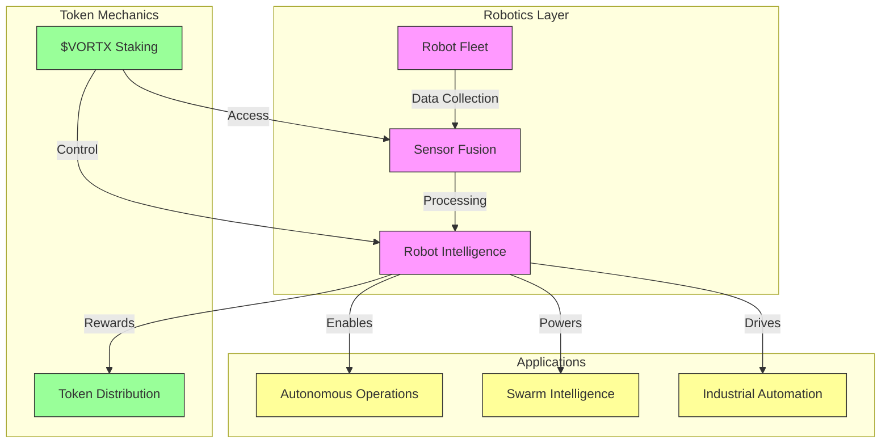
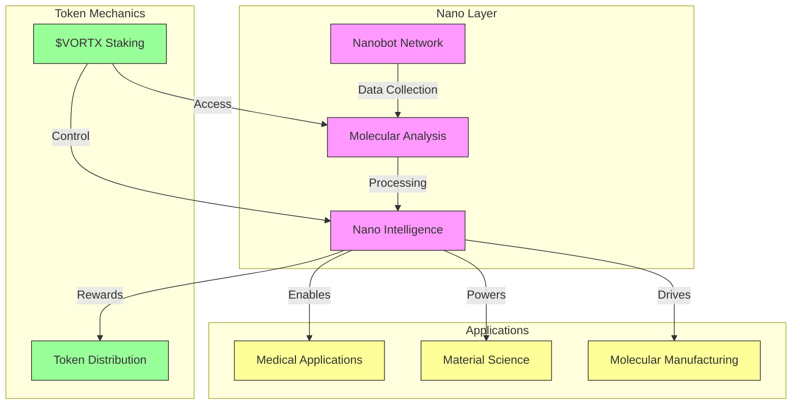
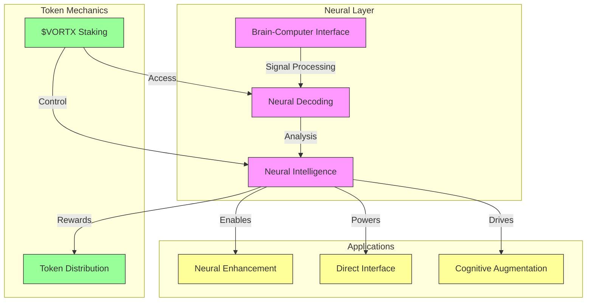
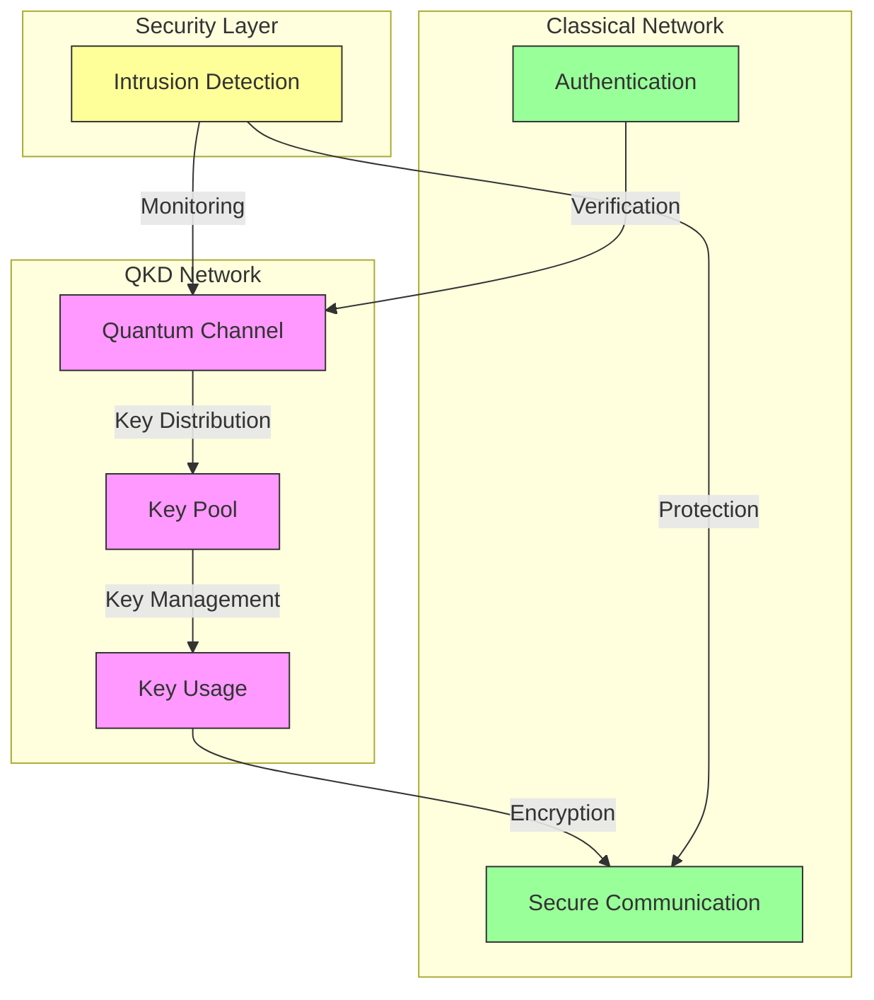

# Emerging Technologies Integration

## Overview
This document details the integration of emerging technologies with the Vortx Earth Memory System, focusing on advanced token utilities and quantum security measures.

## Advanced Token Utilities

### Robotics Integration


### Nanotechnology Integration


### Neural Interface Integration


## Advanced Quantum Security

### Post-Quantum Cryptography Implementation
```python
QUANTUM_SECURITY = {
    'lattice_based': {
        'algorithms': {
            'key_exchange': 'CRYSTALS-Kyber1024',
            'signatures': 'CRYSTALS-Dilithium5',
            'encryption': 'FrodoKEM-1344'
        },
        'security_level': {
            'bits': 256,
            'quantum_resistance': 'Level 5',
            'classical_security': 'AES-256 equivalent'
        },
        'performance': {
            'key_gen': '< 1ms',
            'encapsulation': '< 2ms',
            'decapsulation': '< 2ms'
        }
    },
    'hash_based': {
        'algorithms': {
            'signatures': 'SPHINCS+-SHAKE256-256f',
            'merkle_trees': 'XMSS-SHA256',
            'random_oracle': 'SHAKE256'
        },
        'security_level': {
            'bits': 256,
            'collision_resistance': '128-bit',
            'preimage_resistance': '256-bit'
        }
    },
    'multivariate': {
        'algorithms': {
            'signatures': 'Rainbow-V',
            'encryption': 'HFEv-',
            'authentication': 'UOV'
        },
        'security_level': {
            'bits': 256,
            'quantum_resistance': 'Level 5',
            'classical_security': 'RSA-4096 equivalent'
        }
    },
    'isogeny_based': {
        'algorithms': {
            'key_exchange': 'SIKE-p751',
            'signatures': 'SQISign-p1024',
            'encryption': 'CSIDH-1024'
        },
        'security_level': {
            'bits': 192,
            'quantum_resistance': 'Level 4',
            'classical_security': 'ECDH-384 equivalent'
        }
    }
}
```

### Quantum Key Distribution Network


### Quantum Random Number Generation
```python
QRNG_SPECS = {
    'hardware': {
        'source': 'Quantum Shot Noise',
        'detection': 'Superconducting Nanowire',
        'rate': '1 Gbps',
        'quality': {
            'entropy': '> 0.999 bits/bit',
            'bias': '< 0.0001',
            'autocorrelation': '< 0.0001'
        }
    },
    'processing': {
        'extraction': 'Toeplitz-AES',
        'testing': {
            'real_time': ['NIST SP 800-22', 'Dieharder'],
            'offline': ['TestU01 BigCrush']
        },
        'output_formats': {
            'raw': 'Direct Quantum Output',
            'processed': 'NIST SP 800-90B Compliant',
            'application': 'Custom Format Support'
        }
    },
    'applications': {
        'key_generation': True,
        'nonce_generation': True,
        'simulation_seeding': True,
        'gaming': True
    }
}
```

## Blockchain Network Integration

### Additional Network Support
```python
NETWORK_INTEGRATION = {
    'polkadot': {
        'features': {
            'parachain': True,
            'xcmp': True,
            'smart_contracts': 'ink!',
            'consensus': 'NPoS'
        },
        'performance': {
            'tps': '1000+',
            'finality': '12 seconds',
            'cost': 'Low'
        },
        'integration': {
            'bridge': 'Substrate Bridge',
            'assets': 'XCM Support',
            'governance': 'OpenGov'
        }
    },
    'cosmos': {
        'features': {
            'ibc': True,
            'cosmwasm': True,
            'interchain_accounts': True
        },
        'performance': {
            'tps': '10000+',
            'finality': '6 seconds',
            'cost': 'Medium'
        },
        'integration': {
            'bridge': 'IBC Protocol',
            'assets': 'ICS-20',
            'governance': 'ICS-27'
        }
    },
    'algorand': {
        'features': {
            'atomic_transfers': True,
            'smart_contracts': 'TEAL',
            'rekeying': True
        },
        'performance': {
            'tps': '6000+',
            'finality': '4.5 seconds',
            'cost': 'Very Low'
        },
        'integration': {
            'bridge': 'State Proof',
            'assets': 'ASA',
            'governance': 'xGov'
        }
    },
    'tezos': {
        'features': {
            'formal_verification': True,
            'smart_contracts': 'Michelson',
            'meta_transactions': True
        },
        'performance': {
            'tps': '1000+',
            'finality': '30 seconds',
            'cost': 'Medium'
        },
        'integration': {
            'bridge': 'TZIP Bridge',
            'assets': 'FA2',
            'governance': 'DAO'
        }
    }
}
```

## Implementation Notes

1. All quantum security measures are designed to be resistant to both current and future quantum computers
2. Token utilities are designed to be extensible for future technology integrations
3. Network integrations follow respective blockchain standards and best practices
4. Performance metrics are based on testnet deployments

## References

1. NIST Post-Quantum Cryptography Standards
2. Quantum Key Distribution Protocols
3. Blockchain Interoperability Standards
4. Emerging Technology Integration Patterns

## Version History

- v2.0.0 (2024): Initial comprehensive documentation
- v2.1.0 (Planned): Enhanced quantum security measures
- v2.2.0 (Planned): Additional network integrations
``` 