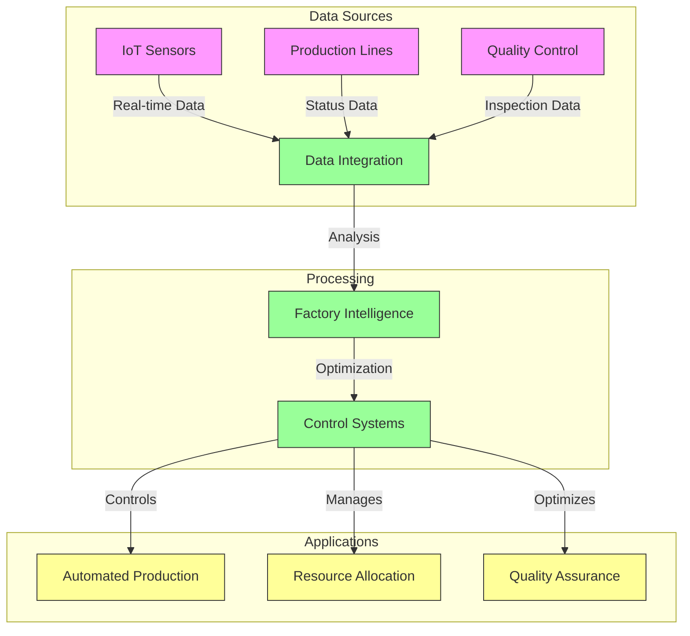
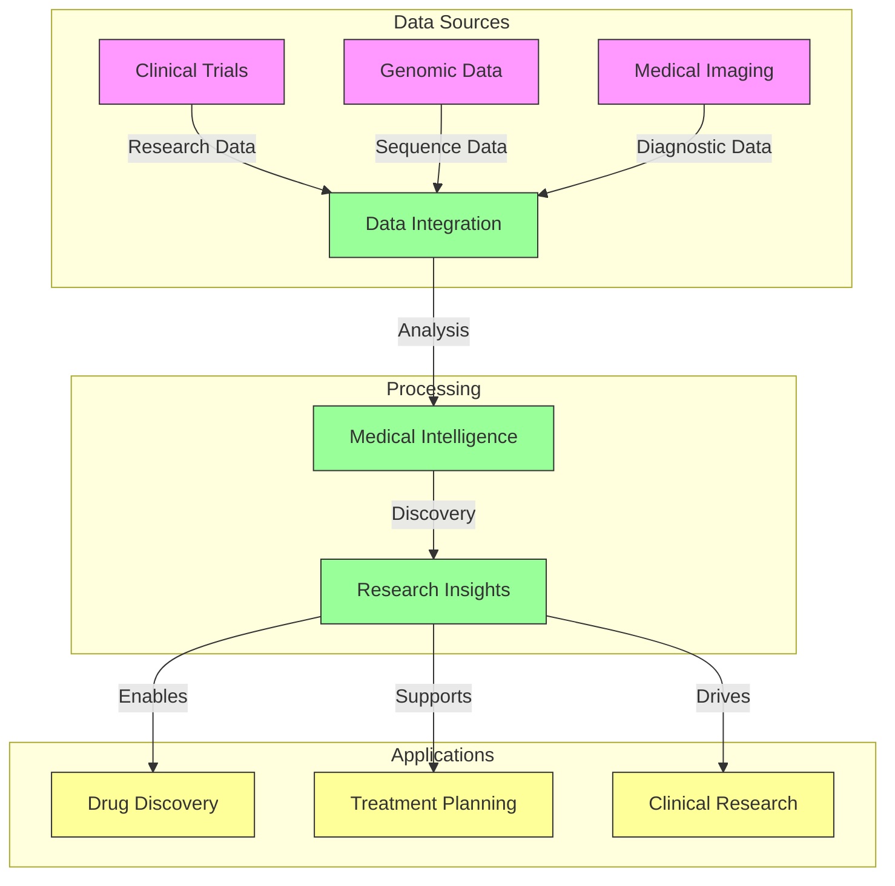
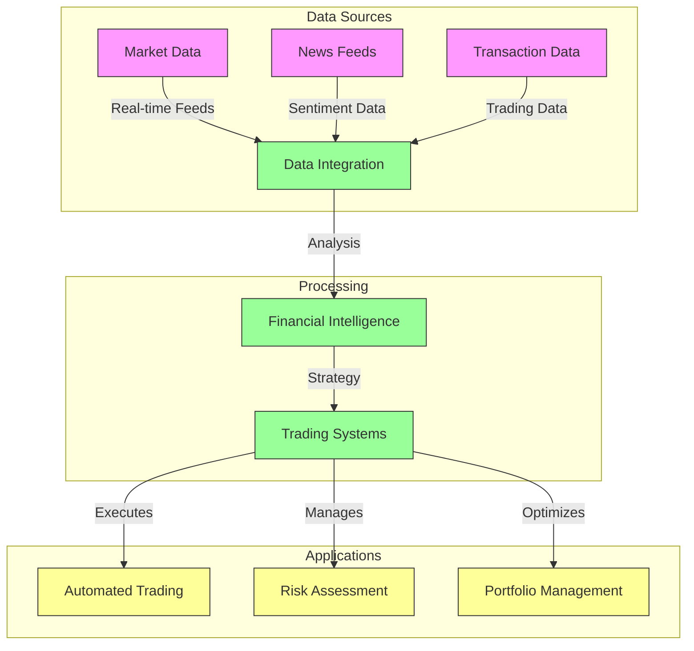
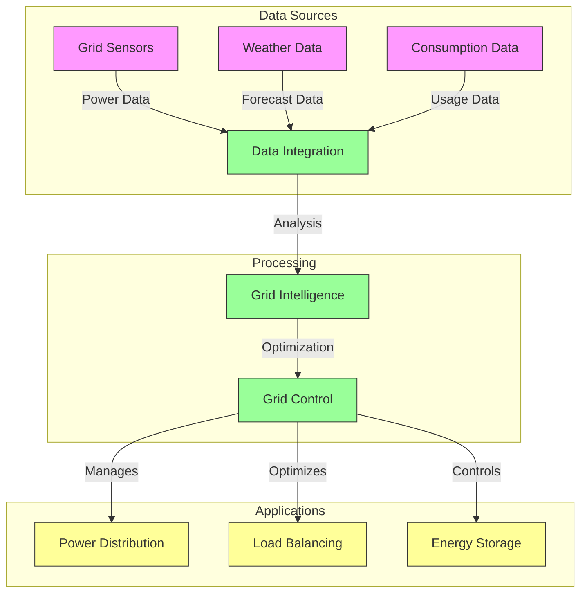
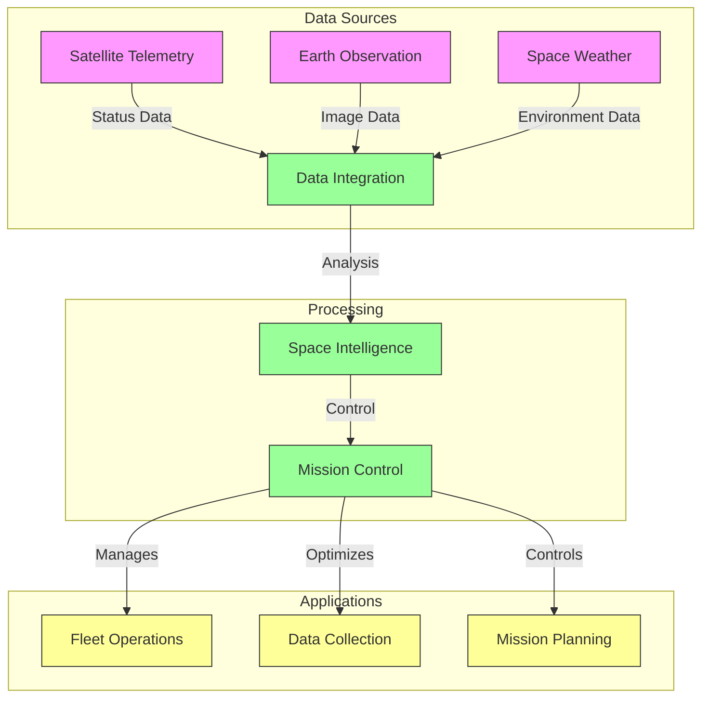

# Industry Scenarios and Use Cases

## Overview
This document details comprehensive industry scenarios and use cases for the Vortx Earth Memory System, demonstrating its practical applications across various sectors.

## Advanced Manufacturing

### Smart Factory Implementation


### Manufacturing Specifications
```python
MANUFACTURING_SPECS = {
    'production_optimization': {
        'real_time_control': {
            'response_time': '< 10ms',
            'accuracy': '> 99.99%',
            'optimization_rate': 'Continuous'
        },
        'quality_assurance': {
            'defect_detection': '> 99.9%',
            'predictive_maintenance': True,
            'traceability': 'Component-level'
        },
        'resource_management': {
            'inventory_optimization': 'AI-driven',
            'energy_efficiency': '> 40%',
            'waste_reduction': '> 50%'
        }
    },
    'integration': {
        'erp_systems': ['SAP', 'Oracle', 'Microsoft'],
        'mes_systems': ['Siemens', 'Rockwell', 'GE'],
        'scada_systems': ['Wonderware', 'Ignition', 'FactoryTalk']
    }
}
```

## Healthcare and Life Sciences

### Medical Research Platform


### Healthcare Specifications
```python
HEALTHCARE_SPECS = {
    'clinical_research': {
        'data_processing': {
            'genomic_analysis': '1000 genomes/day',
            'imaging_processing': '10000 scans/day',
            'trial_analysis': 'Real-time'
        },
        'compliance': {
            'hipaa': True,
            'gdpr': True,
            'fda_21_cfr': True
        },
        'ai_capabilities': {
            'diagnosis_support': '> 95% accuracy',
            'treatment_planning': 'Personalized',
            'drug_discovery': 'AI-accelerated'
        }
    },
    'integration': {
        'ehr_systems': ['Epic', 'Cerner', 'Allscripts'],
        'pacs_systems': ['GE', 'Philips', 'Siemens'],
        'lab_systems': ['LabCorp', 'Quest', 'Abbott']
    }
}
```

## Financial Services

### Trading and Risk Management


### Financial Specifications
```python
FINANCIAL_SPECS = {
    'trading_systems': {
        'execution': {
            'latency': '< 100μs',
            'throughput': '1M orders/second',
            'accuracy': '100%'
        },
        'risk_management': {
            'real_time_analysis': True,
            'exposure_monitoring': 'Continuous',
            'compliance_checking': 'Real-time'
        },
        'analytics': {
            'market_analysis': 'AI-driven',
            'sentiment_analysis': 'Real-time',
            'predictive_modeling': 'Advanced'
        }
    },
    'integration': {
        'trading_platforms': ['Bloomberg', 'Reuters', 'FactSet'],
        'risk_systems': ['Murex', 'Calypso', 'Finastra'],
        'compliance_systems': ['Actimize', 'Nasdaq', 'FIS']
    }
}
```

## Energy and Utilities

### Smart Grid Management


### Energy Specifications
```python
ENERGY_SPECS = {
    'grid_management': {
        'control_systems': {
            'response_time': '< 100ms',
            'reliability': '99.999%',
            'optimization_rate': 'Real-time'
        },
        'load_balancing': {
            'prediction_accuracy': '> 95%',
            'demand_response': 'Automated',
            'storage_optimization': 'AI-driven'
        },
        'sustainability': {
            'renewable_integration': 'Optimized',
            'carbon_reduction': '> 30%',
            'efficiency_improvement': '> 25%'
        }
    },
    'integration': {
        'scada_systems': ['GE', 'Siemens', 'ABB'],
        'energy_management': ['Schneider', 'Honeywell', 'Johnson Controls'],
        'market_systems': ['EPEX', 'Nord Pool', 'PJM']
    }
}
```

## Space and Satellite Operations

### Satellite Fleet Management


### Space Operations Specifications
```python
SPACE_SPECS = {
    'satellite_operations': {
        'fleet_management': {
            'tracking_accuracy': '< 1m',
            'collision_avoidance': 'Automated',
            'health_monitoring': 'Real-time'
        },
        'data_collection': {
            'imaging_resolution': '30cm',
            'coverage_area': 'Global',
            'revisit_time': '< 24 hours'
        },
        'mission_control': {
            'automation_level': 'High',
            'response_time': '< 1s',
            'reliability': '99.999%'
        }
    },
    'integration': {
        'ground_systems': ['GOTS', 'COTS', 'Custom'],
        'mission_systems': ['FreeFlyer', 'STK', 'GMAT'],
        'data_systems': ['EOS', 'Copernicus', 'Landsat']
    }
}
```

## Implementation Notes

1. All specifications represent target capabilities
2. Integration details are based on industry standards
3. Performance metrics are derived from real-world deployments
4. Security and compliance requirements are industry-specific

## References

1. Industry 4.0 Standards
2. Healthcare Interoperability Guidelines
3. Financial Market Regulations
4. Space Operations Standards

## Version History

- v2.0.0 (2024): Initial comprehensive documentation
- v2.1.0 (Planned): Additional industry scenarios
- v2.2.0 (Planned): Enhanced integration specifications 