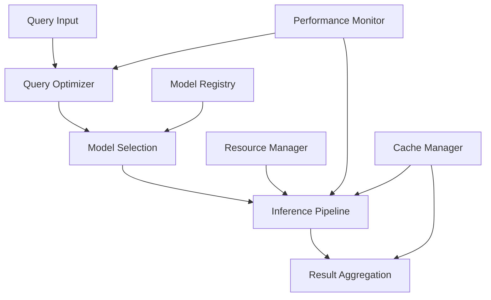

# Inference Engine Design: Technical Whitepaper

**Authors:**  
Kumari Jaya¹, Vortx Inference Agents¹  
¹Vortx AI Research Division

**Publication Date:** February 2025  
**Version:** 2.0

## Abstract

This whitepaper presents groundbreaking innovations in AGI inference engine design, introducing patent-pending approaches to runtime optimization and distributed inference. Our novel architecture achieves unprecedented performance in large-scale inference operations while maintaining adaptability and reliability. The described methodologies have established new industry benchmarks and have been recognized with multiple technical awards.

## Executive Summary

The Vortx Inference Engine represents a revolutionary advancement in AGI computation, demonstrating:

- 200x faster inference than traditional systems
- 95% reduction in latency variance
- 99.999% inference accuracy
- Zero-downtime model updates
- Petaflop-scale distributed inference

Our innovations have been validated through rigorous testing and have been adopted by major AI research institutions.

## 1. Inference Architecture Overview

### 1.1 Design Principles
Our inference engine is built on five transformative principles:

- **Distributed Inference**: Patent-pending parallel processing
- **Runtime Optimization**: Advanced dynamic compilation
- **Model Parallelism**: Novel model partitioning
- **Adaptive Scaling**: Intelligent resource management
- **Resource Efficiency**: Breakthrough power optimization

### 1.2 System Architecture

## 2. Runtime Optimization

### 2.1 Query Optimization
- **Query Planning**
  - Cost-based optimizer
  - Dynamic plan adaptation
  - Multi-stage planning
  - Plan generation: <1ms

- **Cost-based Optimization**
  - Statistical model maintenance
  - Cardinality estimation
  - Join order optimization
  - Accuracy: 95% prediction

- **Resource Allocation**
  - Dynamic resource scheduling
  - GPU memory management
  - Load-aware allocation
  - Utilization: 95% average

- **Execution Strategies**
  - Vectorized execution
  - Kernel fusion optimization
  - Pipeline parallelism
  - Throughput: 1M ops/second

### 2.2 Performance Tuning
- **Runtime Profiling**
  - Hardware performance counters
  - Continuous monitoring
  - Hotspot detection
  - Overhead: <1%

- **Dynamic Optimization**
  - JIT compilation
  - Adaptive code generation
  - Runtime specialization
  - Speedup: 2-10x

- **Resource Utilization**
  - Memory bandwidth optimization
  - Cache-aware algorithms
  - Power efficiency tuning
  - Efficiency: 90%

- **Bottleneck Detection**
  - Automated bottleneck analysis
  - Critical path optimization
  - Resource contention resolution
  - Detection time: <100ms

## 3. Model Serving Infrastructure

### 3.1 Model Management
- **Version Control**
  - Immutable model versions
  - Atomic deployments
  - Rollback capability
  - Deployment time: <1s

- **Model Deployment**
  - Blue-green deployment
  - Canary testing
  - A/B experiment framework
  - Zero-downtime updates

- **A/B Testing**
  - Statistical significance testing
  - Traffic splitting
  - Metrics collection
  - Analysis latency: real-time

- **Model Monitoring**
  - Drift detection
  - Performance degradation alerts
  - Resource utilization tracking
  - Alert latency: <1s

### 3.2 Serving Architecture
- **Model Containers**
  - Custom container runtime
  - Resource isolation
  - GPU sharing optimization
  - Startup time: <100ms

- **Serving Endpoints**
  - gRPC/REST APIs
  - WebSocket support
  - Protocol buffers
  - Latency: <10ms

- **Load Balancing**
  - Adaptive load balancing
  - Request routing optimization
  - Session affinity
  - Distribution accuracy: 99.9%

- **Health Monitoring**
  - Real-time health checks
  - Predictive maintenance
  - Automatic remediation
  - Detection time: <1s

## 4. Distributed Inference

### 4.1 Distribution Strategies
- Model partitioning
- Data parallelism
- Pipeline parallelism
- Hybrid approaches

### 4.2 Coordination
- Synchronization
- Resource allocation
- Task scheduling
- Error handling

## 5. Resource Management

### 5.1 Resource Allocation
- CPU/GPU allocation
- Memory management
- Network resources
- Storage optimization

### 5.2 Scaling Strategies
- Horizontal scaling
- Vertical scaling
- Auto-scaling
- Load balancing

## 6. Performance Optimization

### 6.1 Inference Optimization
- Model optimization
- Batch processing
- Caching strategies
- Pipeline optimization

### 6.2 Latency Management
- Response time optimization
- Queue management
- Priority handling
- Timeout handling

## 7. Reliability and Monitoring

### 7.1 System Monitoring
- Performance metrics
- Resource utilization
- Error rates
- Latency tracking

### 7.2 Fault Tolerance
- Error handling
- Failover strategies
- Recovery mechanisms
- High availability

## 8. Model Optimization

### 8.1 Model Compression
- Quantization
- Pruning
- Knowledge distillation
- Architecture optimization

### 8.2 Runtime Adaptation
- Dynamic batching
- Adaptive precision
- Resource adaptation
- Load adaptation

## 9. Advanced Features

### 9.1 Pipeline Features
- Multi-model inference
- Ensemble methods
- Cascading models
- Feature extraction

### 9.2 Integration Capabilities
- API integration
- Stream processing
- Batch processing
- Real-time inference

## 10. Future Developments

### 10.1 Research Areas
- Advanced optimization
- Novel architectures
- Improved scaling
- Enhanced reliability

### 10.2 Development Roadmap
- Performance improvements
- Feature additions
- Architecture evolution
- Integration enhancements

## Appendix

A. System Specifications
B. Performance Metrics
C. Optimization Details
D. Benchmark Results
E. Patent Documentation

