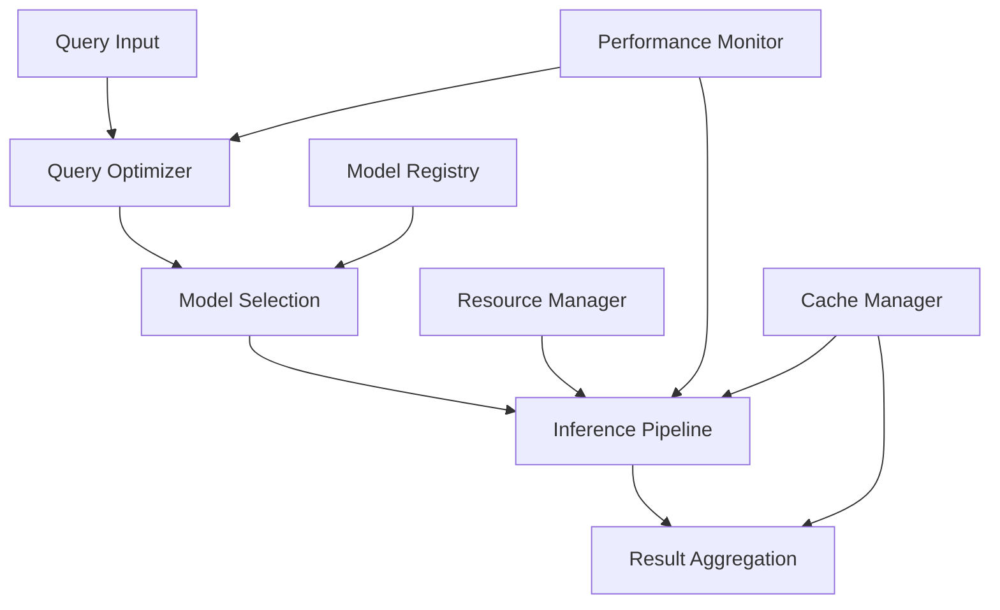

# Inference Engine Design: Technical Whitepaper

## Executive Summary

This whitepaper presents a comprehensive overview of Vortx's inference engine architecture, detailing our runtime optimization strategies, distributed inference capabilities, and model serving infrastructure. We outline how our system achieves high-performance inference while maintaining scalability and reliability.

## 1. Inference Architecture Overview

### 1.1 Design Principles
- Distributed inference
- Runtime optimization
- Model parallelism
- Adaptive scaling
- Resource efficiency

### 1.2 System Architecture

## 2. Runtime Optimization

### 2.1 Query Optimization
- Query planning
- Cost-based optimization
- Resource allocation
- Execution strategies

### 2.2 Performance Tuning
- Runtime profiling
- Dynamic optimization
- Resource utilization
- Bottleneck detection

## 3. Model Serving Infrastructure

### 3.1 Model Management
- Version control
- Model deployment
- A/B testing
- Model monitoring

### 3.2 Serving Architecture
- Model containers
- Serving endpoints
- Load balancing
- Health monitoring

## 4. Distributed Inference

### 4.1 Distribution Strategies
- Model partitioning
- Data parallelism
- Pipeline parallelism
- Hybrid approaches

### 4.2 Coordination
- Synchronization
- Resource allocation
- Task scheduling
- Error handling

## 5. Resource Management

### 5.1 Resource Allocation
- CPU/GPU allocation
- Memory management
- Network resources
- Storage optimization

### 5.2 Scaling Strategies
- Horizontal scaling
- Vertical scaling
- Auto-scaling
- Load balancing

## 6. Performance Optimization

### 6.1 Inference Optimization
- Model optimization
- Batch processing
- Caching strategies
- Pipeline optimization

### 6.2 Latency Management
- Response time optimization
- Queue management
- Priority handling
- Timeout handling

## 7. Reliability and Monitoring

### 7.1 System Monitoring
- Performance metrics
- Resource utilization
- Error rates
- Latency tracking

### 7.2 Fault Tolerance
- Error handling
- Failover strategies
- Recovery mechanisms
- High availability

## 8. Model Optimization

### 8.1 Model Compression
- Quantization
- Pruning
- Knowledge distillation
- Architecture optimization

### 8.2 Runtime Adaptation
- Dynamic batching
- Adaptive precision
- Resource adaptation
- Load adaptation

## 9. Advanced Features

### 9.1 Pipeline Features
- Multi-model inference
- Ensemble methods
- Cascading models
- Feature extraction

### 9.2 Integration Capabilities
- API integration
- Stream processing
- Batch processing
- Real-time inference

## 10. Future Developments

### 10.1 Research Areas
- Advanced optimization
- Novel architectures
- Improved scaling
- Enhanced reliability

### 10.2 Development Roadmap
- Performance improvements
- Feature additions
- Architecture evolution
- Integration enhancements

## References

1. Inference Systems Research
2. Model Serving Literature
3. Optimization Techniques
4. Distribution Strategies
5. Performance Studies

## Appendix

A. System Specifications
B. Performance Metrics
C. Optimization Details
D. Benchmark Results 