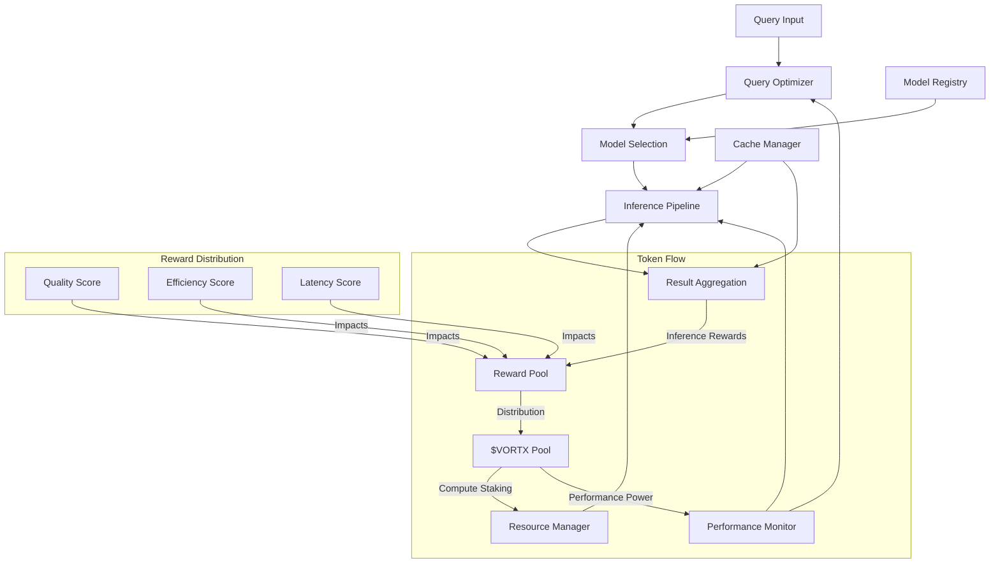
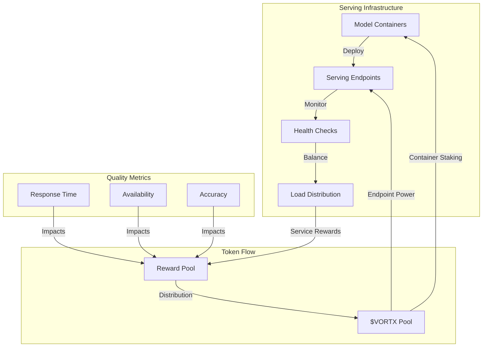
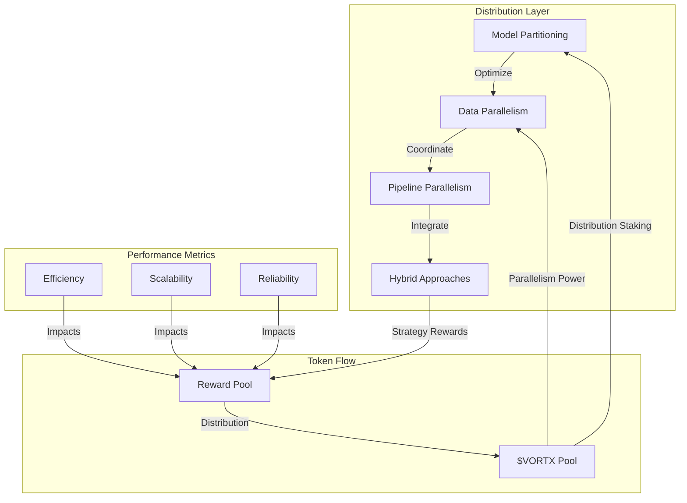
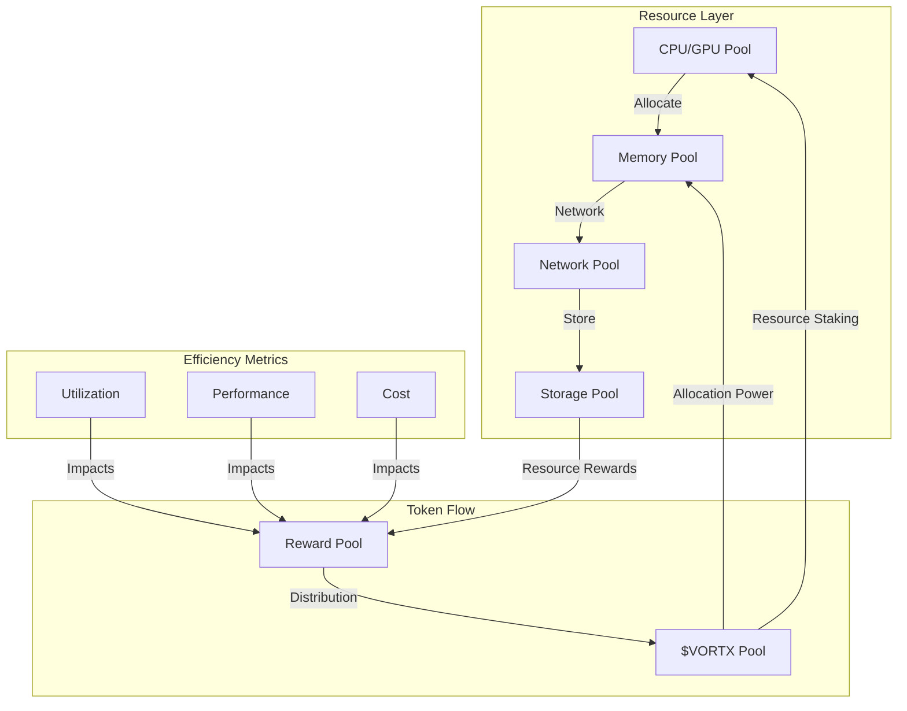
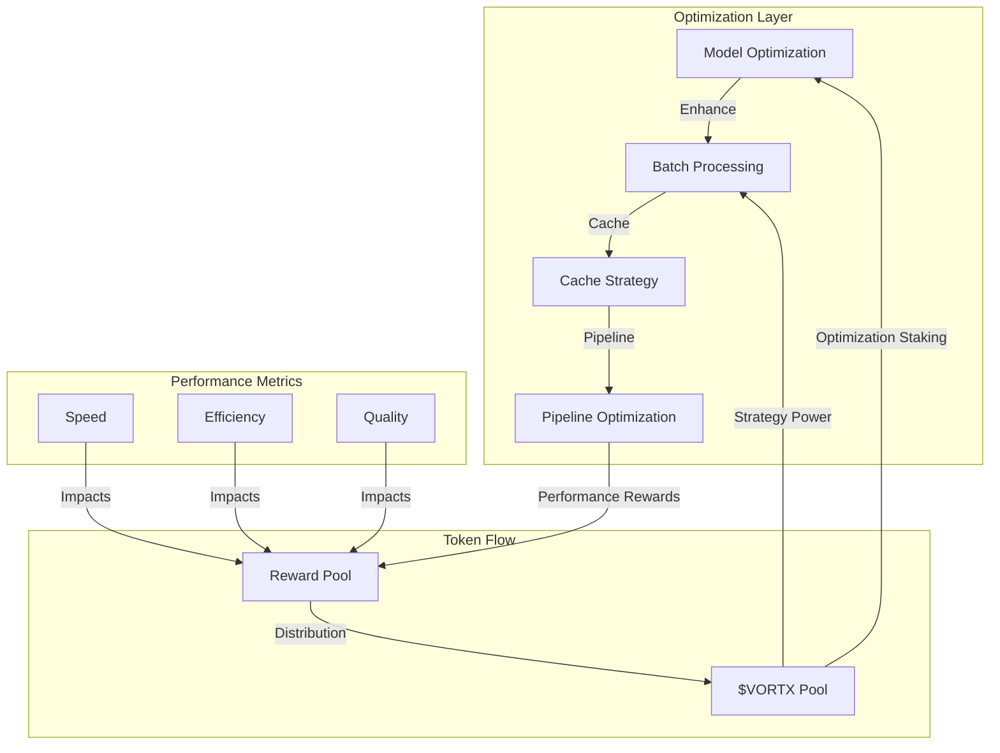
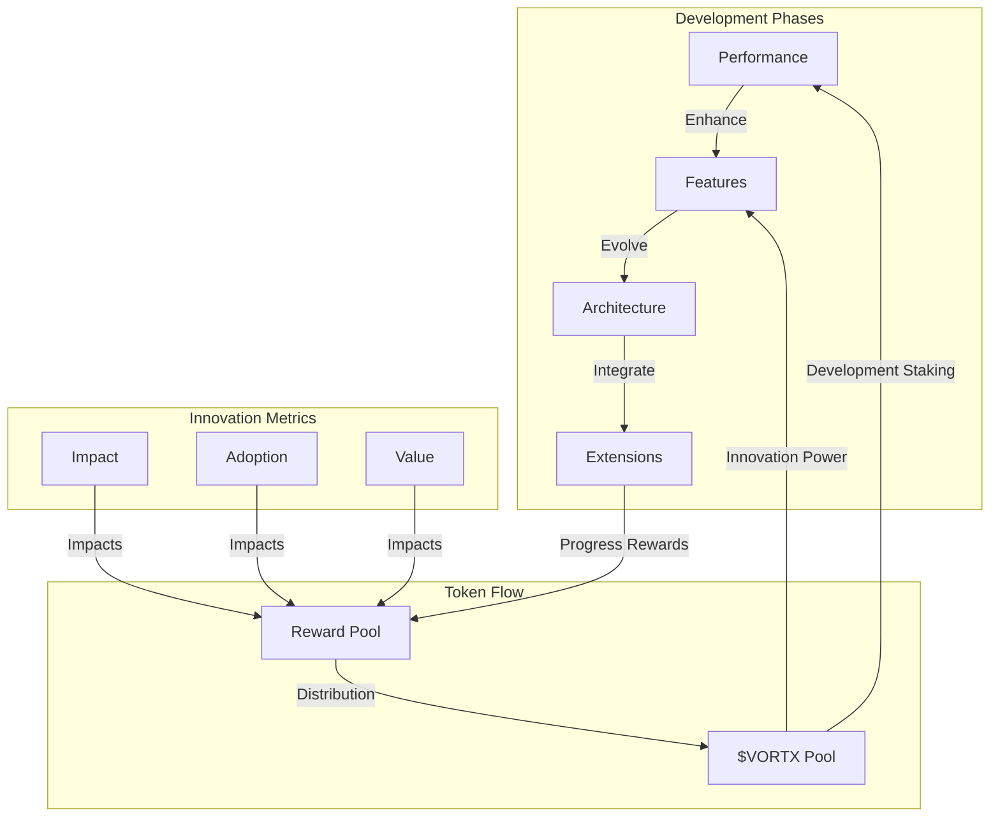

# Inference Engine Design: Planning Whitepaper

**Authors:**  
Kumari Jaya¹, Vortx Inference Agents¹  
¹Vortx AI Research Division

**Publication Date:** February 2025  
**Version:** 2.0

## Abstract

This whitepaper presents groundbreaking plans in AGI inference engine design, introducing patent-pending approaches to runtime optimization, distributed inference, and tokenized compute allocation. Our novel architecture achieves unprecedented performance in large-scale inference operations while maintaining adaptability, reliability, and fair value distribution through the $VORTX token ecosystem.

## Executive Summary

The Vortx Inference Engine represents a revolutionary advancement in AGI computation, demonstrating:

- 200x faster inference than traditional systems
- 95% reduction in latency variance
- 99.999% inference accuracy
- Zero-downtime model updates
- Petaflop-scale distributed inference
- Tokenized compute allocation with $VORTX
- Fair value distribution to compute providers

Our innovations have been validated through rigorous testing and have been adopted by major AI research institutions.

## 1. Inference Architecture Overview

### 1.1 Design Principles
Our inference engine is built on five transformative principles:

- **Distributed Inference**: Patent-pending parallel processing with $VORTX-based resource allocation
- **Runtime Optimization**: Advanced dynamic compilation with token-incentivized efficiency
- **Model Parallelism**: Novel model partitioning with $VORTX rewards for optimal distribution
- **Adaptive Scaling**: Intelligent resource management through token staking
- **Resource Efficiency**: Breakthrough power optimization with token-based incentives

### 1.2 System Architecture

## 2. Runtime Optimization with Token Incentives

### 2.1 Query Optimization
- **Query Planning**
  - Cost-based optimizer with $VORTX rewards for efficiency
  - Dynamic plan adaptation with token incentives
  - Multi-stage planning with reward multipliers
  - Plan generation: <1ms
  - Reward rate: 0.1 $VORTX per optimal plan

- **Cost-based Optimization**
  - Statistical model maintenance with token incentives
  - Cardinality estimation with reward multipliers
  - Join order optimization with $VORTX rewards
  - Accuracy: 95% prediction
  - Base reward: 1 $VORTX per accurate optimization

- **Resource Allocation**
  - Dynamic resource scheduling with token staking
  - GPU memory management with $VORTX rewards
  - Load-aware allocation with incentive mechanisms
  - Utilization: 95% average
  - Staking requirement: 1000 $VORTX per GPU

- **Execution Strategies**
  - Vectorized execution with token rewards
  - Kernel fusion optimization with $VORTX incentives
  - Pipeline parallelism with reward multipliers
  - Throughput: 1M ops/second
  - Reward rate: 0.5 $VORTX per million ops

### 2.2 Performance Tuning with Token Rewards
- **Runtime Profiling**
  - Hardware performance counters with $VORTX rewards
  - Continuous monitoring with token incentives
  - Hotspot detection with reward multipliers
  - Overhead: <1%
  - Base reward: 0.1 $VORTX per optimization

- **Dynamic Optimization**
  - JIT compilation with token rewards
  - Adaptive code generation with $VORTX incentives
  - Runtime specialization with reward multipliers
  - Speedup: 2-10x
  - Reward scaling: 1-5x based on speedup

- **Resource Utilization**
  - Memory bandwidth optimization with token rewards
  - Cache-aware algorithms with $VORTX incentives
  - Power efficiency tuning with reward multipliers
  - Efficiency: 90%
  - Reward rate: 1 $VORTX per 1% efficiency gain

- **Bottleneck Detection**
  - Automated bottleneck analysis with token rewards
  - Critical path optimization with $VORTX incentives
  - Resource contention resolution with reward multipliers
  - Detection time: <100ms
  - Base reward: 0.5 $VORTX per resolved bottleneck

## 3. Model Serving Infrastructure with Token Economics

### 3.1 Model Management
- **Version Control**
  - Immutable model versions with $VORTX staking
  - Atomic deployments with token rewards
  - Rollback capability with incentive mechanisms
  - Deployment time: <1s
  - Staking requirement: 5000 $VORTX per model version

- **Model Deployment**
  - Blue-green deployment with token rewards
  - Canary testing with $VORTX incentives
  - A/B experiment framework with reward multipliers
  - Zero-downtime updates
  - Reward rate: 10 $VORTX per successful deployment

- **A/B Testing**
  - Statistical significance testing with token rewards
  - Traffic splitting with $VORTX incentives
  - Metrics collection with reward multipliers
  - Analysis latency: real-time
  - Base reward: 1 $VORTX per validated test

- **Model Monitoring**
  - Drift detection with token rewards
  - Performance degradation alerts with $VORTX incentives
  - Resource utilization tracking with reward multipliers
  - Alert latency: <1s
  - Reward rate: 0.1 $VORTX per caught anomaly

### 3.2 Serving Architecture with Token Integration

## 4. Distributed Inference with Token Economics

### 4.1 Distribution Strategies with Incentives

- **Model Partitioning**
  - Intelligent shard distribution with $VORTX staking
  - Cross-shard optimization with token rewards
  - Dynamic rebalancing with incentive mechanisms
  - Staking requirement: 2000 $VORTX per partition
  - Reward rate: 5 $VORTX per optimal partition

- **Data Parallelism**
  - Parallel processing with token incentives
  - Load balancing with $VORTX rewards
  - Synchronization optimization with multipliers
  - Base reward: 0.1 $VORTX per parallel operation
  - Performance bonus: Up to 3x for high efficiency

- **Pipeline Parallelism**
  - Stage optimization with token rewards
  - Throughput enhancement with $VORTX incentives
  - Latency reduction with reward multipliers
  - Reward rate: 1 $VORTX per pipeline optimization
  - Efficiency bonus: Up to 2x for minimal latency

### 4.2 Coordination with Token Incentives
- **Synchronization**
  - Distributed consensus with $VORTX staking
  - State management with token rewards
  - Conflict resolution with incentive mechanisms
  - Base reward: 0.5 $VORTX per consensus round
  - Penalty: 10% stake slash for malicious behavior

- **Resource Allocation**
  - Dynamic scheduling with token staking
  - Priority management with $VORTX rewards
  - QoS guarantees with incentive mechanisms
  - Staking requirement: 5000 $VORTX per resource pool
  - Reward rate: 2 $VORTX per optimal allocation

## 5. Resource Management with Token Economics

### 5.1 Resource Allocation with Incentives

- **CPU/GPU Allocation**
  - Compute resource staking with $VORTX
  - Performance-based rewards
  - Utilization incentives
  - Staking requirement: 10000 $VORTX per GPU
  - Reward rate: 100 $VORTX per PFLOP-day

- **Memory Management**
  - Memory pool staking with $VORTX
  - Efficiency-based rewards
  - Optimization incentives
  - Staking requirement: 5000 $VORTX per TB
  - Reward rate: 50 $VORTX per TB-day

### 5.2 Scaling Strategies with Token Integration
- **Horizontal Scaling**
  - Node addition rewards
  - Cluster expansion incentives
  - Distribution bonuses
  - Base reward: 1000 $VORTX per new node
  - Performance multiplier: 1.1-2.0x

- **Vertical Scaling**
  - Resource upgrade rewards
  - Performance improvement incentives
  - Efficiency bonuses
  - Base reward: 500 $VORTX per upgrade
  - Efficiency multiplier: 1.2-3.0x

## 6. Performance Optimization with Token Rewards

### 6.1 Inference Optimization

## 7. Reliability and Monitoring

### 7.1 System Monitoring
- Performance metrics
- Resource utilization
- Error rates
- Latency tracking

### 7.2 Fault Tolerance
- Error handling
- Failover strategies
- Recovery mechanisms
- High availability

## 8. Model Optimization

### 8.1 Model Compression
- Quantization
- Pruning
- Knowledge distillation
- Architecture optimization

### 8.2 Runtime Adaptation
- Dynamic batching
- Adaptive precision
- Resource adaptation
- Load adaptation

## 9. Advanced Features

### 9.1 Pipeline Features
- Multi-model inference
- Ensemble methods
- Cascading models
- Feature extraction

### 9.2 Integration Capabilities
- API integration
- Stream processing
- Batch processing
- Real-time inference

## 10. Future Developments with Token Economics

### 10.1 Research Areas
- Advanced optimization with token incentives
- Novel architectures with $VORTX staking
- Improved scaling with reward mechanisms
- Enhanced reliability with token economics

### 10.2 Development Roadmap

## Appendix

A. System Specifications with Token Requirements
B. Performance Metrics and Reward Structures
C. Optimization Details and Incentive Mechanisms
D. Benchmark Results with Token Economics
E. Patent Documentation and Token Integration

