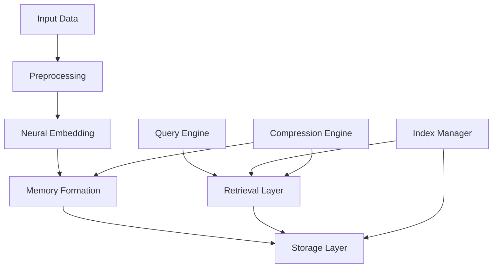

# Memory Formation and Retrieval: Technical Whitepaper

## Executive Summary

This whitepaper presents a detailed technical overview of Vortx's memory formation and retrieval system, including our neural architectures, efficient indexing algorithms, and memory compression techniques. We detail how our system achieves high-performance memory operations while maintaining data integrity and retrieval accuracy.

## 1. Memory Architecture Overview

### 1.1 Core Principles
- Distributed memory formation
- Neural embedding generation
- Efficient retrieval mechanisms
- Adaptive compression
- Temporal-spatial relationships

### 1.2 Memory System Architecture

## 2. Neural Memory Architecture

### 2.1 Embedding Generation
- Neural network architecture
- Feature extraction
- Dimensional reduction
- Semantic preservation

### 2.2 Memory Formation
- Memory structure
- Relationship mapping
- Context preservation
- Memory consolidation

## 3. Indexing and Retrieval

### 3.1 Index Structures
- Hierarchical indexes
- Distributed indexing
- Real-time updates
- Search optimization

### 3.2 Retrieval Algorithms
- Similarity search
- Context-aware retrieval
- Parallel processing
- Result ranking

## 4. Memory Compression

### 4.1 Compression Techniques
- Lossy compression
- Lossless compression
- Adaptive compression
- Progressive encoding

### 4.2 Optimization Strategies
- Memory footprint reduction
- Access speed optimization
- Compression ratio
- Quality preservation

## 5. Temporal-Spatial Processing

### 5.1 Temporal Relations
- Time-series processing
- Sequential patterns
- Temporal dependencies
- Event correlation

### 5.2 Spatial Relations
- Spatial indexing
- Geographic relations
- Spatial queries
- Location awareness

## 6. Performance Optimization

### 6.1 Query Optimization
- Query planning
- Execution optimization
- Cache management
- Load balancing

### 6.2 Memory Management
- Resource allocation
- Memory hierarchy
- Cache strategies
- Garbage collection

## 7. Scalability and Distribution

### 7.1 Distributed Architecture
- Sharding strategies
- Replication
- Consistency protocols
- Fault tolerance

### 7.2 Scaling Mechanisms
- Horizontal scaling
- Vertical scaling
- Load distribution
- Resource management

## 8. Quality Assurance

### 8.1 Memory Integrity
- Data validation
- Consistency checks
- Error detection
- Recovery mechanisms

### 8.2 Retrieval Quality
- Accuracy metrics
- Precision measures
- Recall optimization
- Quality monitoring

## 9. Advanced Features

### 9.1 Memory Augmentation
- Knowledge integration
- Context enhancement
- Relationship inference
- Pattern recognition

### 9.2 Adaptive Learning
- Online learning
- Feedback incorporation
- Model adaptation
- Performance tuning

## 10. Future Developments

### 10.1 Research Areas
- Advanced neural architectures
- Novel compression methods
- Improved retrieval algorithms
- Enhanced scalability

### 10.2 Roadmap
- Architecture improvements
- Performance enhancements
- Feature additions
- Optimization goals

## References

1. Neural Architecture Research
2. Memory Systems Literature
3. Compression Techniques
4. Retrieval Algorithms
5. Performance Studies

## Appendix

A. Neural Network Specifications
B. Algorithm Details
C. Performance Metrics
D. Benchmark Results 