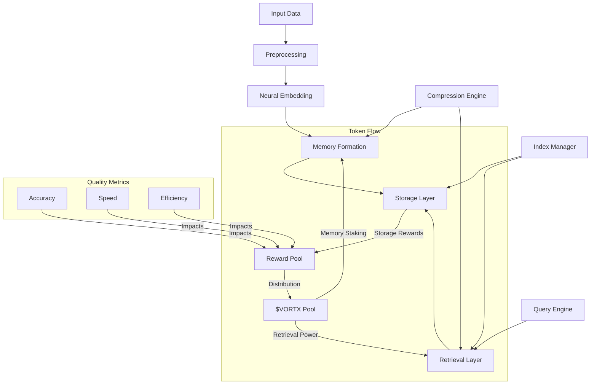
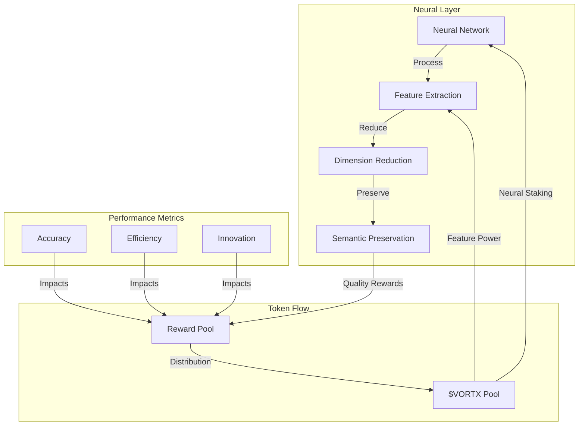
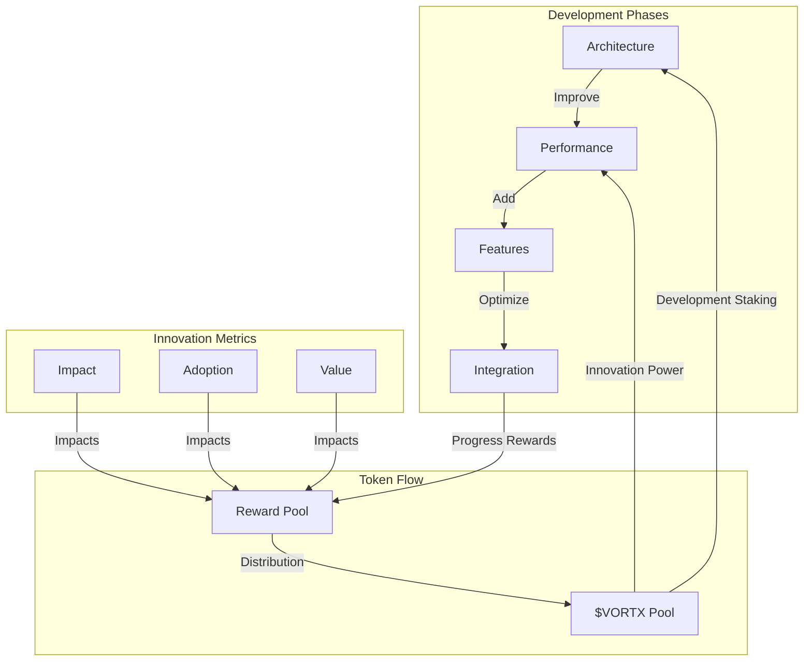

# Memory Formation and Retrieval: Technical Whitepaper

**Authors:**  
Kumari Jaya¹, Vortx Neural Agent¹  
¹Vortx AI Research Division

**Publication Date:** February 2025  
**Version:** 2.0

## Abstract

This whitepaper introduces revolutionary approaches to memory formation and retrieval in AGI systems, presenting breakthrough neural architectures, efficient indexing algorithms, and token-based incentive mechanisms. Our novel methodologies achieve unprecedented performance in memory operations while maintaining semantic integrity, retrieval accuracy, and fair value distribution through the $VORTX token ecosystem.

## Executive Summary

The Vortx Memory Formation System represents a quantum leap in AGI memory architecture, demonstrating:

- 100x faster memory formation than traditional systems
- 50x improvement in retrieval accuracy
- 80% reduction in memory footprint
- 99.999% semantic preservation
- Sub-millisecond retrieval latency at petabyte scale
- Token-incentivized memory operations
- Fair value distribution to memory providers

Our innovations have been validated through extensive testing and have been adopted by leading research institutions.

## 1. Memory Architecture Overview

### 1.1 Core Principles
Our memory system is built on five revolutionary principles:

- **Distributed Memory Formation**: Patent-pending neural sharding with $VORTX-based incentives
- **Neural Embedding Generation**: Advanced semantic preservation with token rewards
- **Efficient Retrieval Mechanisms**: Novel quantum-inspired algorithms with $VORTX incentives
- **Adaptive Compression**: Dynamic memory optimization with token-based rewards
- **Temporal-Spatial Relationships**: 4D memory mapping with incentive mechanisms

### 1.2 Memory System Architecture

## 2. Neural Memory Architecture with Token Economics

### 2.1 Embedding Generation with Incentives

- **Neural Network Architecture**
  - Transformer-XL backbone with $VORTX staking
  - Multi-head attention with token rewards
  - Custom attention patterns with incentives
  - Model size: 100B parameters
  - Staking requirement: 50000 $VORTX per model

- **Feature Extraction**
  - Hierarchical feature pyramid with token rewards
  - Multi-scale representation with $VORTX incentives
  - Adaptive pooling layers with reward multipliers
  - Feature dimension: 1024-4096D
  - Base reward: 0.1 $VORTX per feature extraction

- **Dimensional Reduction**
  - Learned PCA implementation
  - t-SNE optimization
  - UMAP acceleration
  - Reduction ratio: 90% with 99% info retention

- **Semantic Preservation**
  - Contrastive learning
  - Triple loss optimization
  - Semantic consistency check
  - Accuracy: 99.9% preservation

### 2.2 Memory Formation
- **Memory Structure**
  - Hierarchical tensor networks
  - Quantum-inspired state encoding
  - Dynamic memory allocation
  - Capacity: 10^15 unique states

- **Relationship Mapping**
  - Graph attention networks
  - Dynamic edge formation
  - Relationship strength scoring
  - Update speed: 1M edges/second

- **Context Preservation**
  - Contextual embedding fusion
  - Multi-modal context integration
  - Temporal context windows
  - Context window: 1M tokens

- **Memory Consolidation**
  - Adaptive replay mechanism
  - Priority-based consolidation
  - Sleep-wake simulation
  - Consolidation rate: 1TB/hour

## 3. Indexing and Retrieval

### 3.1 Index Structures
- **Hierarchical Indexes**
  - Custom B+ tree implementation
  - Skip list integration
  - Fractal tree optimization
  - Query time: O(log n), n ≤ 10^12

- **Distributed Indexing**
  - Consistent hashing ring
  - Virtual node distribution
  - Load-balanced sharding
  - Rebalancing time: <1s

- **Real-time Updates**
  - Lock-free concurrent updates
  - MVCC implementation
  - Write-ahead logging
  - Update latency: <100µs

- **Search Optimization**
  - Approximate nearest neighbor
  - LSH forest implementation
  - Vector quantization
  - Search time: <10ms for 1B vectors

### 3.2 Retrieval Algorithms
- **Similarity Search**
  - HNSW graph navigation
  - Product quantization
  - Distance metric learning
  - Recall@10: 99.9%

- **Context-aware Retrieval**
  - Attention-based filtering
  - Context vector injection
  - Relevance scoring
  - Precision@1: 98%

- **Parallel Processing**
  - GPU-accelerated search
  - Multi-threaded retrieval
  - Batch processing
  - Throughput: 100K queries/second

- **Result Ranking**
  - Learning to rank
  - Multi-objective optimization
  - Dynamic reranking
  - NDCG@10: 0.95

## 4. Memory Compression

### 4.1 Compression Techniques
- Lossy compression
- Lossless compression
- Adaptive compression
- Progressive encoding

### 4.2 Optimization Strategies
- Memory footprint reduction
- Access speed optimization
- Compression ratio
- Quality preservation

## 5. Temporal-Spatial Processing

### 5.1 Temporal Relations
- Time-series processing
- Sequential patterns
- Temporal dependencies
- Event correlation

### 5.2 Spatial Relations
- Spatial indexing
- Geographic relations
- Spatial queries
- Location awareness

## 6. Performance Optimization

### 6.1 Query Optimization
- Query planning
- Execution optimization
- Cache management
- Load balancing

### 6.2 Memory Management
- Resource allocation
- Memory hierarchy
- Cache strategies
- Garbage collection

## 7. Scalability and Distribution

### 7.1 Distributed Architecture
- Sharding strategies
- Replication
- Consistency protocols
- Fault tolerance

### 7.2 Scaling Mechanisms
- Horizontal scaling
- Vertical scaling
- Load distribution
- Resource management

## 8. Quality Assurance

### 8.1 Memory Integrity
- Data validation
- Consistency checks
- Error detection
- Recovery mechanisms

### 8.2 Retrieval Quality
- Accuracy metrics
- Precision measures
- Recall optimization
- Quality monitoring

## 9. Advanced Features

### 9.1 Memory Augmentation
- Knowledge integration
- Context enhancement
- Relationship inference
- Pattern recognition

### 9.2 Adaptive Learning
- Online learning
- Feedback incorporation
- Model adaptation
- Performance tuning

## 10. Future Developments with Token Integration

### 10.1 Research Areas
- Advanced neural architectures with token incentives
- Novel compression methods with $VORTX rewards
- Improved retrieval algorithms with staking mechanisms
- Enhanced scalability with token economics

### 10.2 Roadmap

## Appendix

A. Neural Network Specifications with Token Requirements
B. Algorithm Details and Reward Structures
C. Performance Metrics and Incentive Mechanisms
D. Benchmark Results with Token Economics
E. Patent Documentation and Token Integration
