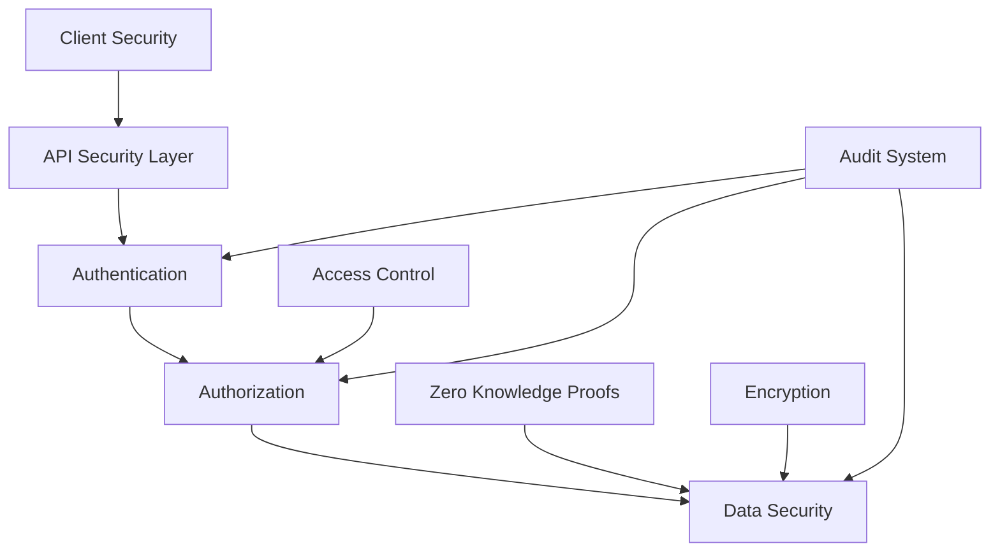

# Privacy and Security Framework: Technical Whitepaper

## Executive Summary

This whitepaper presents a comprehensive overview of Vortx's privacy and security framework, detailing our zero-knowledge implementation, encryption methodologies, and privacy-preserving computation techniques. We outline how we maintain data security while enabling powerful distributed computing capabilities.

## 1. Security Architecture Overview

### 1.1 Security Principles
- Zero-trust architecture
- Defense in depth
- Privacy by design
- Least privilege access
- Data minimization

### 1.2 Security Framework

## 2. Zero-Knowledge Implementation

### 2.1 Zero-Knowledge Protocols
- Proof generation
- Verification mechanisms
- Protocol security
- Performance optimization

### 2.2 Privacy-Preserving Computation
- Homomorphic encryption
- Secure multi-party computation
- Blind computation techniques
- Data anonymization

## 3. Encryption Framework

### 3.1 Data at Rest
- Storage encryption
- Key management
- Secure key storage
- Encryption algorithms

### 3.2 Data in Transit
- Transport layer security
- End-to-end encryption
- Protocol security
- Network protection

### 3.3 Data in Use
- Memory encryption
- Secure enclaves
- Runtime protection
- Process isolation

## 4. Access Control System

### 4.1 Authentication
- Multi-factor authentication
- Identity management
- Session management
- Token security

### 4.2 Authorization
- Role-based access control
- Attribute-based access control
- Permission management
- Policy enforcement

## 5. Threat Protection

### 5.1 Threat Detection
- Intrusion detection
- Anomaly detection
- Behavioral analysis
- Threat intelligence

### 5.2 Incident Response
- Response procedures
- Mitigation strategies
- Recovery processes
- Incident reporting

## 6. Audit and Compliance

### 6.1 Audit System
- Activity logging
- Audit trails
- Compliance monitoring
- Security metrics

### 6.2 Compliance Framework
- Regulatory compliance
- Security standards
- Privacy regulations
- Industry certifications

## 7. Data Privacy

### 7.1 Privacy Controls
- Data minimization
- Purpose limitation
- Storage limitation
- Privacy rights management

### 7.2 Data Governance
- Data classification
- Privacy policies
- Data lifecycle
- Privacy impact assessment

## 8. Security Operations

### 8.1 Security Monitoring
- Real-time monitoring
- Security analytics
- Performance monitoring
- Incident detection

### 8.2 Security Management
- Security policies
- Risk management
- Change management
- Security training

## 9. Future Security Initiatives

### 9.1 Research Areas
- Quantum-resistant cryptography
- Advanced privacy techniques
- AI-powered security
- Blockchain integration

### 9.2 Security Roadmap
- Security enhancements
- Privacy improvements
- Protocol updates
- Architecture evolution

## References

1. Security Standards
2. Privacy Regulations
3. Cryptographic Protocols
4. Industry Best Practices
5. Research Publications

## Appendix

A. Security Protocols
B. Encryption Specifications
C. Compliance Requirements
D. Security Benchmarks 