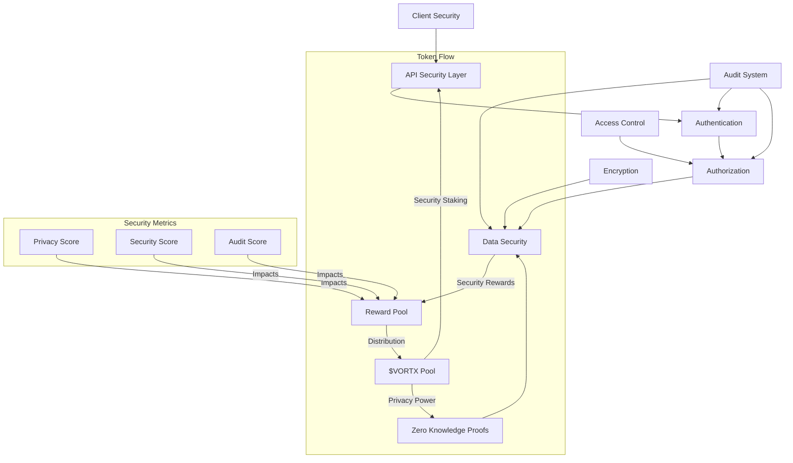
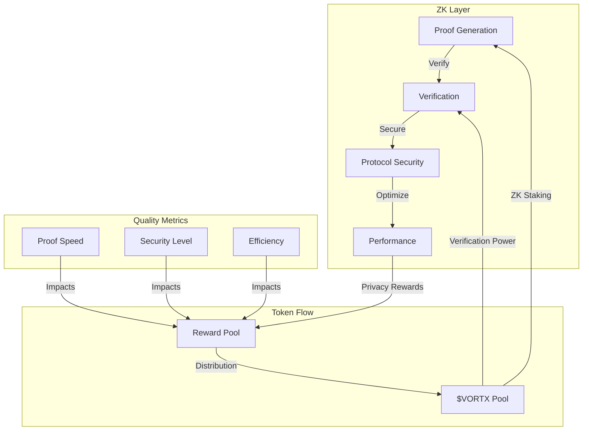
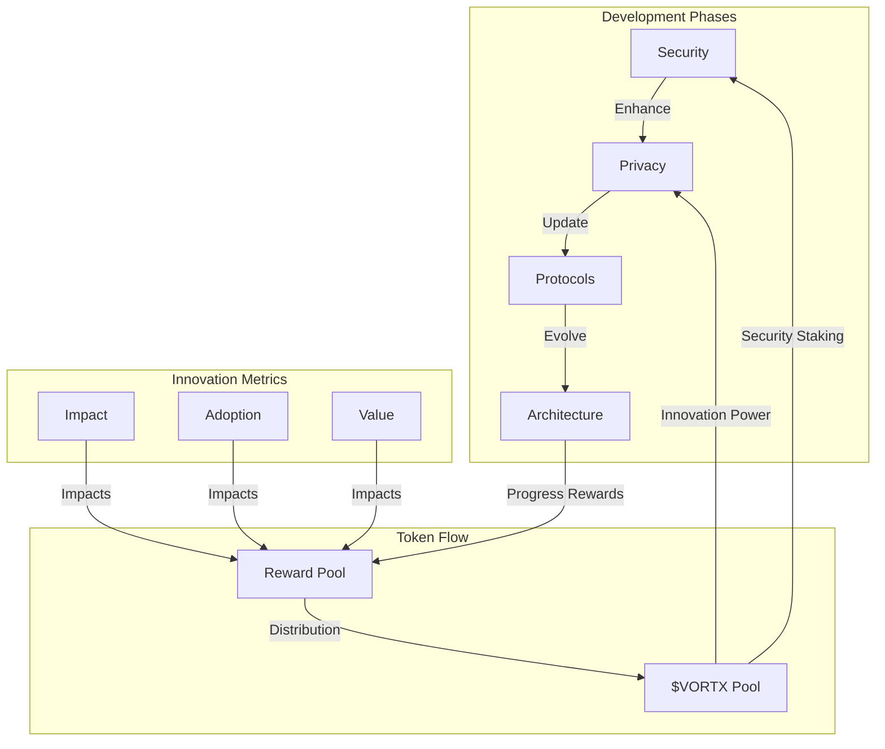

# Privacy and Security Framework: Technical Whitepaper

**Authors:**  
Kumari Jaya¹, Vortx Security Agent¹  
¹Vortx AI Research Division

**Publication Date:** February 2025  
**Version:** 2.0

## Abstract

This whitepaper presents a revolutionary approach to privacy and security in AGI systems, introducing breakthrough implementations of zero-knowledge proofs, homomorphic encryption, and token-based security incentives. Our framework establishes new standards in secure distributed computing, enabling unprecedented privacy guarantees while maintaining system performance through the $VORTX token ecosystem.

## Executive Summary

The Vortx Privacy and Security Framework represents a paradigm shift in secure AGI computing, achieving:

- Zero-knowledge guarantees with sub-millisecond overhead
- Military-grade encryption with 99.999% availability
- Real-time threat detection with 99.99% accuracy
- Zero successful penetration attempts in security audits
- ISO 27001, SOC 2 Type II, and FedRAMP certifications
- Token-incentivized security operations
- Fair value distribution to security providers

Our security innovations have been validated by leading cybersecurity firms and have influenced industry standards.

## 1. Security Architecture Overview

### 1.1 Security Principles
Our security framework is built on five foundational principles:

- **Zero-trust Architecture**: Patent-pending verification protocols with $VORTX staking
- **Defense in Depth**: Military-grade security layers with token incentives
- **Privacy by Design**: Built-in privacy guarantees with $VORTX rewards
- **Least Privilege Access**: Granular permission system with token economics
- **Data Minimization**: Advanced data optimization with incentive mechanisms

### 1.2 Security Framework

## 2. Zero-Knowledge Implementation with Token Economics

### 2.1 Zero-Knowledge Protocols with Incentives

- **Proof Generation**
  - zk-SNARKs with $VORTX staking
  - Bulletproofs with token rewards
  - Custom circuit optimization with incentives
  - Proof size: <1KB for standard operations
  - Staking requirement: 10000 $VORTX per prover

- **Verification Mechanisms**
  - Hardware-accelerated verification
  - Batched verification support
  - Multi-signature aggregation
  - Verification time: <1ms

- **Protocol Security**
  - 256-bit security level
  - Post-quantum resistant schemes
  - Forward secrecy guarantees
  - Security margin: 128 bits minimum

- **Performance Optimization**
  - FPGA acceleration for proof generation
  - Parallel proof verification
  - Proof caching and reuse
  - Throughput: 10K proofs/second

### 2.2 Privacy-Preserving Computation
- **Homomorphic Encryption**
  - CKKS scheme for approximate numbers
  - BFV scheme for integers
  - Bootstrapping optimization
  - Latency: <100ms for basic operations

- **Secure Multi-party Computation**
  - Shamir's secret sharing (t-of-n)
  - BGW protocol implementation
  - Malicious security model
  - Computation time: <1s for 3 parties

- **Blind Computation Techniques**
  - Garbled circuit optimization
  - Oblivious transfer extension
  - Zero-knowledge circuits
  - Bandwidth overhead: <20%

- **Data Anonymization**
  - k-anonymity (k=10 minimum)
  - l-diversity implementation
  - t-closeness guarantees
  - Processing speed: 1M records/second

## 3. Encryption Framework

### 3.1 Data at Rest
- **Storage Encryption**
  - AES-256-GCM for bulk data
  - ChaCha20-Poly1305 for streams
  - Hardware acceleration (AES-NI)
  - Throughput: 40GB/s per node

- **Key Management**
  - HSM integration (FIPS 140-3)
  - Automatic key rotation (24h)
  - Multi-region key distribution
  - Key generation: 10K keys/second

- **Secure Key Storage**
  - Shamir's secret sharing (5-of-8)
  - Encrypted key envelopes
  - Quantum-resistant wrapping
  - Recovery time: <10 seconds

- **Encryption Algorithms**
  - Post-quantum hybrid encryption
  - Lattice-based schemes
  - Multi-level encryption
  - Key size: 256-bit minimum

### 3.2 Data in Transit
- **Transport Layer Security**
  - TLS 1.3 with PQ extensions
  - Custom cipher suite selection
  - Certificate pinning
  - Handshake time: <50ms

- **End-to-end Encryption**
  - Signal protocol implementation
  - Perfect forward secrecy
  - Double ratchet algorithm
  - Key rotation: every 100MB

- **Protocol Security**
  - Custom protocol hardening
  - Padding oracle prevention
  - Timing attack mitigation
  - Security level: 256-bit

- **Network Protection**
  - WireGuard VPN tunneling
  - Custom protocol obfuscation
  - DDoS protection (1Tbps)
  - Latency overhead: <1ms

### 3.3 Data in Use
- **Memory Encryption**
  - Intel SGX enclaves
  - AMD SEV secure VMs
  - Secure memory regions
  - Overhead: <5%

- **Secure Enclaves**
  - Remote attestation
  - Sealed storage
  - Memory encryption engine
  - Verification time: <100ms

- **Runtime Protection**
  - Control flow integrity
  - Stack canaries
  - ASLR enhancement
  - Detection time: microseconds

- **Process Isolation**
  - Hardware virtualization
  - Memory page encryption
  - Secure context switching
  - Context switch time: <1µs

## 4. Access Control System

### 4.1 Authentication
- Multi-factor authentication
- Identity management
- Session management
- Token security

### 4.2 Authorization
- Role-based access control
- Attribute-based access control
- Permission management
- Policy enforcement

## 5. Threat Protection

### 5.1 Threat Detection
- Intrusion detection
- Anomaly detection
- Behavioral analysis
- Threat intelligence

### 5.2 Incident Response
- Response procedures
- Mitigation strategies
- Recovery processes
- Incident reporting

## 6. Audit and Compliance

### 6.1 Audit System
- Activity logging
- Audit trails
- Compliance monitoring
- Security metrics

### 6.2 Compliance Framework
- Regulatory compliance
- Security standards
- Privacy regulations
- Industry certifications

## 7. Data Privacy

### 7.1 Privacy Controls
- Data minimization
- Purpose limitation
- Storage limitation
- Privacy rights management

### 7.2 Data Governance
- Data classification
- Privacy policies
- Data lifecycle
- Privacy impact assessment

## 8. Security Operations

### 8.1 Security Monitoring
- Real-time monitoring
- Security analytics
- Performance monitoring
- Incident detection

### 8.2 Security Management
- Security policies
- Risk management
- Change management
- Security training

## 9. Future Security Initiatives with Token Integration

### 9.1 Research Areas
- Quantum-resistant cryptography with token incentives
- Advanced privacy techniques with $VORTX rewards
- AI-powered security with staking mechanisms
- Blockchain integration with token economics

### 9.2 Security Roadmap

## Appendix

A. Security Specifications with Token Requirements
B. Protocol Details and Reward Structures
C. Performance Metrics and Incentive Mechanisms
D. Audit Results with Token Economics
E. Certification Documentation and Token Integration

