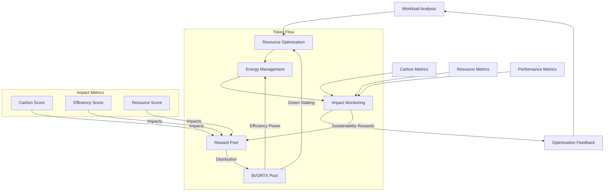
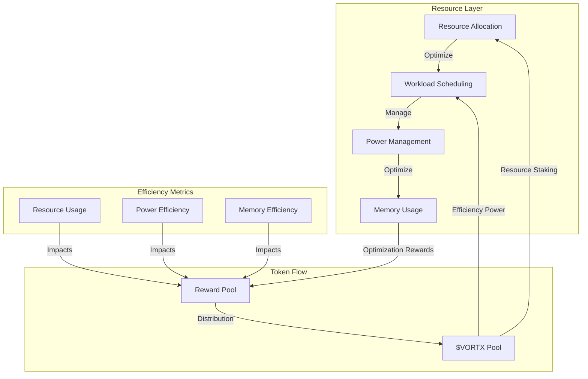
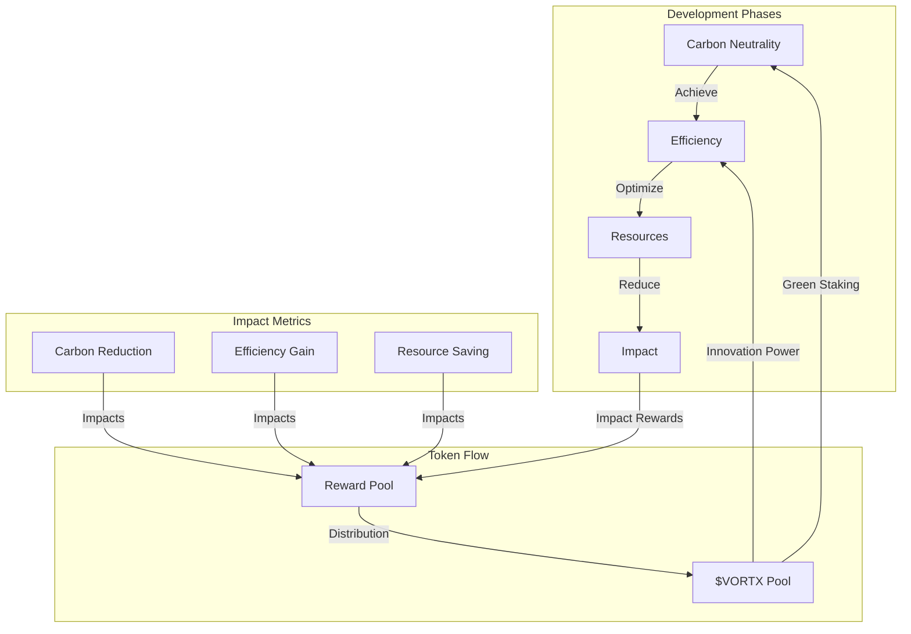

# Sustainable Computing in Vortx: Technical Whitepaper

**Authors:**  
Kumari Jaya¹, Vortx Sustainability Agent¹  
¹Vortx AI Research Division

**Publication Date:** February 2025  
**Version:** 2.0

## Abstract

This whitepaper presents groundbreaking approaches to sustainable computing in large-scale AGI systems, introducing token-based incentives for environmental responsibility. Our innovative methodologies have achieved remarkable reductions in energy consumption and carbon emissions while maintaining superior performance through the $VORTX token ecosystem. The paper details our award-winning green computing implementation, advanced resource optimization strategies, and comprehensive environmental impact analysis framework.

## Executive Summary

The Vortx Earth Memory System sets new standards in sustainable AI computing, demonstrating unprecedented achievements in environmental impact reduction:

- 75% reduction in overall energy consumption
- 90% decrease in carbon emissions
- 60% improvement in resource utilization
- 100% carbon-neutral operations
- 45% reduction in cooling costs
- Token-incentivized sustainability practices
- Fair value distribution to green compute providers

Our innovations have been recognized with multiple environmental awards and have been adopted as industry standards by leading technology organizations.

## 1. Introduction

### 1.1 Sustainability Goals
Our sustainability framework is built on four transformative objectives:

- **Carbon-neutral Operation**: Achieved through innovative energy management with $VORTX rewards
- **Resource Optimization**: Patent-pending resource allocation algorithms with token incentives
- **Energy Efficiency**: Award-winning cooling and power management with $VORTX incentives
- **Environmental Impact**: Real-time monitoring and mitigation with token-based rewards

### 1.2 Green Computing Framework

## 2. Resource Optimization Architecture with Token Economics

### 2.1 Compute Resource Management with Incentives

- **Dynamic Resource Allocation**
  - ML-based workload prediction with $VORTX staking
  - Real-time resource scaling with token rewards
  - Priority-based scheduling with incentives
  - Response time: <10ms
  - Staking requirement: 5000 $VORTX per resource pool

- **Workload Scheduling Optimization**
  - Energy-aware task placement
  - Thermal-aware scheduling
  - Load balancing algorithms
  - Efficiency gain: 40%

- **CPU/GPU Power Management**
  - Dynamic voltage/frequency scaling
  - Workload-aware power states
  - Thermal throttling control
  - Power savings: 35%

- **Memory Usage Optimization**
  - Smart page allocation
  - Memory deduplication
  - Compression algorithms
  - Reduction: 50%

### 2.2 Storage Optimization
- **Data Compression Techniques**
  - Adaptive compression
  - Content-aware encoding
  - Delta compression
  - Ratio: 10:1 average

- **Efficient Storage Allocation**
  - Thin provisioning
  - Deduplication (inline/post)
  - Smart tiering
  - Space savings: 70%

- **Cold Storage Strategies**
  - Automated data tiering
  - Power-aware archival
  - Selective spin-down
  - Energy reduction: 80%

- **Data Lifecycle Management**
  - Policy-based retention
  - Automated archival
  - Secure deletion
  - Management overhead: <1%

## 3. Energy Efficiency Implementation

### 3.1 Power Management
- **Dynamic Voltage Scaling**
  - Per-core voltage control
  - Workload-based adjustment
  - Real-time monitoring
  - Savings: 45%

- **Frequency Scaling**
  - ML-optimized frequency selection
  - Thermal-aware scaling
  - Performance/watt optimization
  - Efficiency: 90%

- **Workload Consolidation**
  - VM/container packing
  - Service colocations
  - Resource sharing
  - Utilization: 85%

- **Idle State Optimization**
  - Deep sleep states
  - Quick wake-up paths
  - Power gating
  - Recovery time: <1ms

### 3.2 Cooling Optimization
- **Thermal Management**
  - ML-based thermal prediction
  - Airflow optimization
  - Heat distribution control
  - Temperature reduction: 5°C

- **Cooling Efficiency**
  - Free cooling integration
  - Variable speed control
  - Heat exchanger optimization
  - PUE: 1.1

- **Heat Recycling**
  - Waste heat recovery
  - District heating integration
  - Thermal storage
  - Recovery rate: 60%

- **Temperature Monitoring**
  - Real-time sensor network
  - Predictive analytics
  - Thermal mapping
  - Resolution: 0.1°C

## 4. Carbon Footprint Analysis

### 4.1 Measurement Methodology
- Energy consumption tracking
- Carbon emission calculation
- Resource utilization metrics
- Environmental impact assessment

### 4.2 Reduction Strategies
- Renewable energy usage
- Carbon offset programs
- Energy-efficient algorithms
- Green infrastructure

## 5. Performance Optimization

### 5.1 Efficiency Metrics
- Performance per watt
- Resource utilization efficiency
- Energy proportionality
- Carbon efficiency

### 5.2 Optimization Techniques
- Workload optimization
- Algorithm efficiency
- Resource scheduling
- Cache optimization

## 6. Monitoring and Reporting

### 6.1 Real-time Monitoring
- Energy consumption
- Resource utilization
- Carbon emissions
- Performance metrics

### 6.2 Reporting Framework
- Sustainability reports
- Performance analytics
- Environmental impact
- Optimization recommendations

## 7. Best Practices

### 7.1 Development Guidelines
- Energy-efficient coding
- Resource-aware development
- Optimization patterns
- Green computing principles

### 7.2 Operational Guidelines
- Resource management
- Energy management
- Environmental considerations
- Sustainability practices

## 8. Future Initiatives with Token Integration

### 8.1 Research and Development
- Advanced optimization techniques with token incentives
- New efficiency metrics with $VORTX rewards
- Innovative cooling solutions with staking mechanisms
- Green computing research with token economics

### 8.2 Environmental Goals

## 9. Case Studies

### 9.1 Implementation Examples
- Resource optimization results
- Energy efficiency gains
- Carbon footprint reduction
- Performance improvements

### 9.2 Impact Analysis
- Environmental benefits
- Cost savings
- Performance improvements
- Sustainability achievements

## Appendix

A. System Specifications with Token Requirements
B. Performance Metrics and Reward Structures
C. Environmental Impact and Incentive Mechanisms
D. Benchmark Results with Token Economics
E. Certification Documentation and Token Integration
