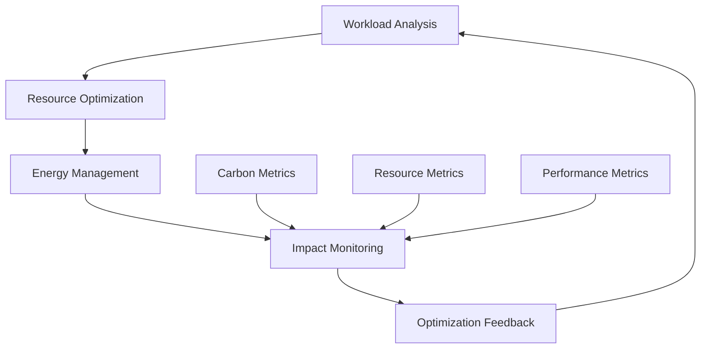

# Sustainable Computing in Vortx: Technical Whitepaper

## Executive Summary

This whitepaper details Vortx's approach to sustainable computing, outlining our green computing implementation, resource optimization strategies, and environmental impact analysis. We present our methodologies for achieving high-performance computing while minimizing environmental impact.

## 1. Introduction

### 1.1 Sustainability Goals
- Carbon-neutral operation
- Resource optimization
- Energy efficiency
- Environmental impact minimization

### 1.2 Green Computing Framework

## 2. Resource Optimization Architecture

### 2.1 Compute Resource Management
- Dynamic resource allocation
- Workload scheduling optimization
- CPU/GPU power management
- Memory usage optimization

### 2.2 Storage Optimization
- Data compression techniques
- Efficient storage allocation
- Cold storage strategies
- Data lifecycle management

### 2.3 Network Efficiency
- Bandwidth optimization
- Traffic management
- Protocol optimization
- Cache strategies

## 3. Energy Efficiency Implementation

### 3.1 Power Management
- Dynamic voltage scaling
- Frequency scaling
- Workload consolidation
- Idle state optimization

### 3.2 Cooling Optimization
- Thermal management
- Cooling efficiency
- Heat recycling
- Temperature monitoring

## 4. Carbon Footprint Analysis

### 4.1 Measurement Methodology
- Energy consumption tracking
- Carbon emission calculation
- Resource utilization metrics
- Environmental impact assessment

### 4.2 Reduction Strategies
- Renewable energy usage
- Carbon offset programs
- Energy-efficient algorithms
- Green infrastructure

## 5. Performance Optimization

### 5.1 Efficiency Metrics
- Performance per watt
- Resource utilization efficiency
- Energy proportionality
- Carbon efficiency

### 5.2 Optimization Techniques
- Workload optimization
- Algorithm efficiency
- Resource scheduling
- Cache optimization

## 6. Monitoring and Reporting

### 6.1 Real-time Monitoring
- Energy consumption
- Resource utilization
- Carbon emissions
- Performance metrics

### 6.2 Reporting Framework
- Sustainability reports
- Performance analytics
- Environmental impact
- Optimization recommendations

## 7. Best Practices

### 7.1 Development Guidelines
- Energy-efficient coding
- Resource-aware development
- Optimization patterns
- Green computing principles

### 7.2 Operational Guidelines
- Resource management
- Energy management
- Environmental considerations
- Sustainability practices

## 8. Future Initiatives

### 8.1 Research and Development
- Advanced optimization techniques
- New efficiency metrics
- Innovative cooling solutions
- Green computing research

### 8.2 Environmental Goals
- Carbon neutrality targets
- Energy efficiency improvements
- Resource optimization goals
- Environmental impact reduction

## 9. Case Studies

### 9.1 Implementation Examples
- Resource optimization results
- Energy efficiency gains
- Carbon footprint reduction
- Performance improvements

### 9.2 Impact Analysis
- Environmental benefits
- Cost savings
- Performance improvements
- Sustainability achievements

## References

1. Environmental Impact Studies
2. Green Computing Research
3. Energy Efficiency Standards
4. Sustainability Metrics
5. Industry Best Practices

## Appendix

A. Detailed Metrics and Calculations
B. Implementation Guidelines
C. Performance Data
D. Environmental Impact Reports 