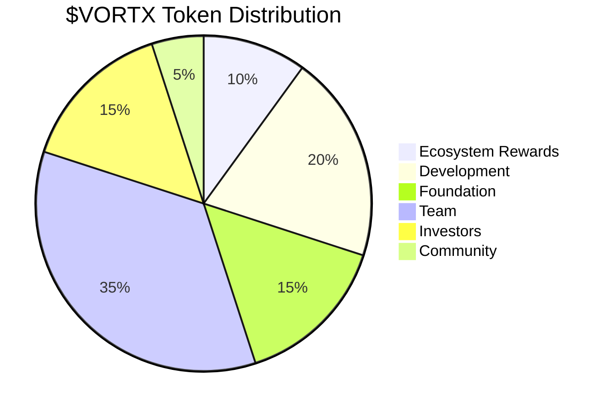
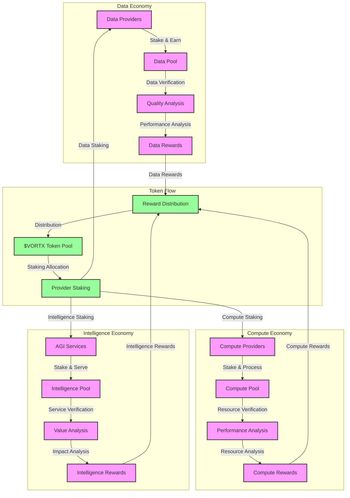
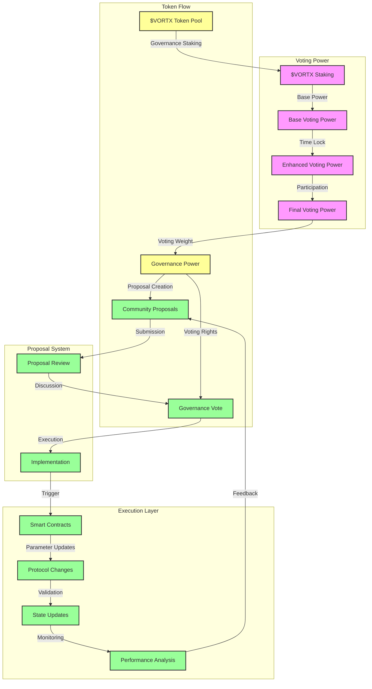
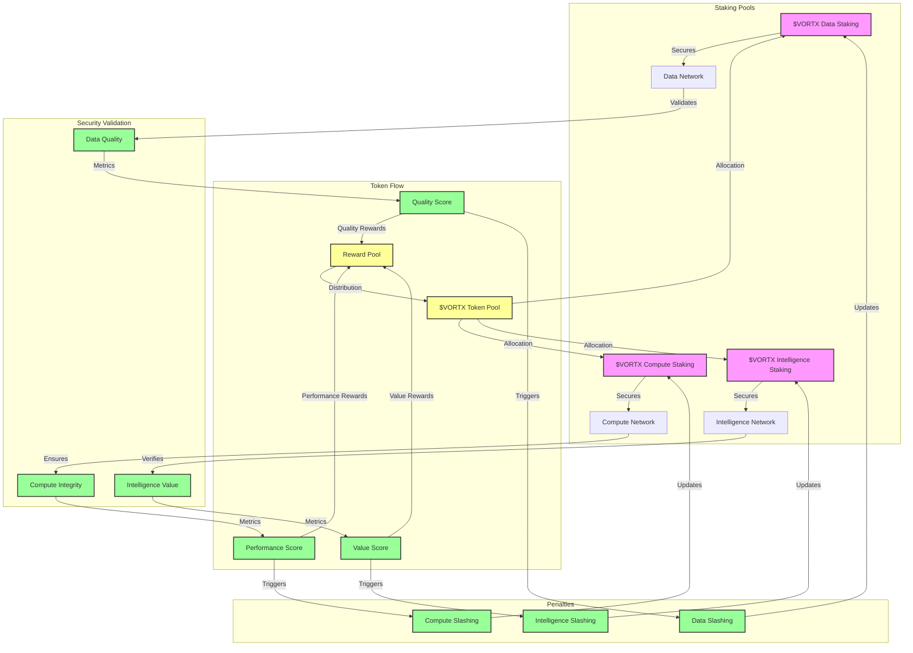

# Token Economics and Governance

## Overview
This document details the token economics and governance model of the Vortx Earth Memory System, focusing on the $VORTX token utility, distribution, and governance mechanisms.

## Token Economics

### Token Distribution Planned


### Token Specifications
```python
TOKEN_SPECS = {
    'token': {
        'name': 'Vortx',
        'symbol': '$VORTX',
        'type': 'Utility Token',
        'standard': 'ERC-20',
        'total_supply': '1,000,000,000',
        'decimal_places': 18
    },
    'distribution': {
        'ecosystem_rewards': {
            'percentage': '40%',
            'vesting': 'Linear over 4 years',
            'cliff': 'None',
            'allocation': {
                'data_providers': '15%',
                'compute_providers': '15%',
                'intelligence_providers': '10%'
            }
        },
        'development': {
            'percentage': '20%',
            'vesting': 'Linear over 5 years',
            'cliff': '1 year',
            'allocation': {
                'research': '10%',
                'development': '7%',
                'operations': '3%'
            }
        },
        'foundation': {
            'percentage': '15%',
            'vesting': 'Linear over 5 years',
            'cliff': 'None',
            'allocation': {
                'grants': '5%',
                'partnerships': '5%',
                'ecosystem_growth': '5%'
            }
        },
        'team': {
            'percentage': '15%',
            'vesting': 'Linear over 4 years',
            'cliff': '1 year',
            'allocation': {
                'founders': '5%',
                'core_team': '7%',
                'future_hires': '3%'
            }
        },
        'advisors': {
            'percentage': '5%',
            'vesting': 'Linear over 2 years',
            'cliff': '6 months'
        },
        'community': {
            'percentage': '5%',
            'vesting': 'None',
            'allocation': {
                'airdrops': '2%',
                'rewards': '3%'
            }
        }
    }
}
```

### Token Utility Model


### Reward Mechanisms
```python
REWARD_MECHANISMS = {
    'data_rewards': {
        'base_rate': {
            'amount': '100 VORTX/TB',
            'adjustment': 'Dynamic based on quality',
            'frequency': 'Per validation cycle'
        },
        'quality_multiplier': {
            'range': '1.0-3.0',
            'factors': {
                'accuracy': 0.4,
                'uniqueness': 0.3,
                'timeliness': 0.3
            }
        },
        'staking_requirements': {
            'minimum': '10000 VORTX',
            'optimal': '100000 VORTX',
            'maximum_boost': '3x'
        }
    },
    'compute_rewards': {
        'base_rate': {
            'amount': '1000 VORTX/PFLOP-hour',
            'adjustment': 'Dynamic based on demand',
            'frequency': 'Per computation cycle'
        },
        'performance_multiplier': {
            'range': '1.0-2.5',
            'factors': {
                'reliability': 0.4,
                'speed': 0.3,
                'efficiency': 0.3
            }
        },
        'staking_requirements': {
            'minimum': '50000 VORTX',
            'optimal': '500000 VORTX',
            'maximum_boost': '2.5x'
        }
    },
    'intelligence_rewards': {
        'base_rate': {
            'amount': '10000 VORTX/model/month',
            'adjustment': 'Dynamic based on usage',
            'frequency': 'Monthly'
        },
        'value_multiplier': {
            'range': '1.0-4.0',
            'factors': {
                'accuracy': 0.3,
                'uniqueness': 0.3,
                'utility': 0.4
            }
        },
        'staking_requirements': {
            'minimum': '100000 VORTX',
            'optimal': '1000000 VORTX',
            'maximum_boost': '4x'
        }
    }
}
```

## Governance Model

### Governance Architecture


### Governance Parameters
```python
GOVERNANCE_PARAMS = {
    'voting_power': {
        'calculation': {
            'base': 'Staked Amount',
            'time_multiplier': {
                'range': '1.0-2.0',
                'max_lock': '4 years'
            },
            'participation_boost': {
                'range': '1.0-1.5',
                'factors': ['proposal_creation', 'voting_history']
            }
        },
        'delegation': {
            'enabled': True,
            'max_delegations': 10,
            'min_delegation': '1000 VORTX'
        }
    },
    'proposal_system': {
        'creation': {
            'threshold': '100000 VORTX',
            'fee': '1000 VORTX',
            'cool_down': '7 days'
        },
        'voting': {
            'duration': '14 days',
            'quorum': '40%',
            'majority': '66%'
        },
        'execution': {
            'timelock': '48 hours',
            'grace_period': '24 hours'
        }
    },
    'parameter_ranges': {
        'reward_rates': {
            'min_adjustment': '-20%',
            'max_adjustment': '+20%',
            'frequency': '30 days'
        },
        'staking_requirements': {
            'min_adjustment': '-10%',
            'max_adjustment': '+10%',
            'frequency': '90 days'
        },
        'governance_settings': {
            'min_adjustment': '-5%',
            'max_adjustment': '+5%',
            'frequency': '180 days'
        }
    }
}
```

## Economic Security

### Staking Mechanics


### Security Parameters
```python
SECURITY_PARAMS = {
    'slashing_conditions': {
        'data_network': {
            'invalid_data': {
                'threshold': '3 strikes',
                'penalty': '10% stake',
                'lockout': '30 days'
            },
            'manipulation': {
                'threshold': '1 strike',
                'penalty': '50% stake',
                'lockout': '180 days'
            }
        },
        'compute_network': {
            'downtime': {
                'threshold': '99% uptime',
                'penalty': '5% stake',
                'lockout': '7 days'
            },
            'malicious_behavior': {
                'threshold': '1 strike',
                'penalty': '100% stake',
                'lockout': '365 days'
            }
        },
        'intelligence_network': {
            'poor_performance': {
                'threshold': '3 strikes',
                'penalty': '20% stake',
                'lockout': '60 days'
            },
            'malicious_models': {
                'threshold': '1 strike',
                'penalty': '100% stake',
                'lockout': '365 days'
            }
        }
    }
}
```

## Implementation Notes

1. All token metrics and parameters are subject to governance
2. Security measures are designed to ensure network stability
3. Reward mechanisms are designed to incentivize quality
4. Governance parameters are optimized for decentralization

## References

1. Token Economic Models
2. Governance Best Practices
3. DeFi Security Standards
4. Staking Mechanism Designs

## Version History

- v2.0.0 (2024): Initial comprehensive documentation
- v2.1.0 (Planned): Enhanced governance mechanisms
- v2.2.0 (Planned): Advanced staking features
``` 
