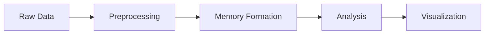
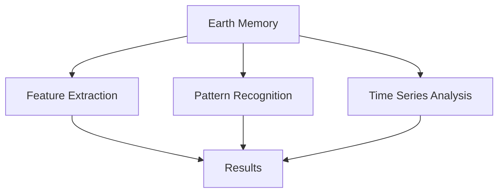
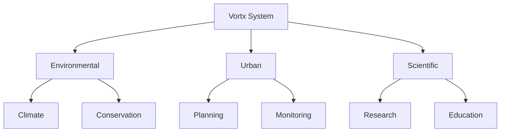

# Vortx Examples

This directory contains example notebooks and scripts demonstrating various use cases of the Vortx Earth Memory System. Each example is thoroughly documented and designed to showcase specific capabilities of the system.

## 🚀 Getting Started

### Prerequisites
```bash
pip install -r requirements.txt
```

### Environment Setup
```python
from vortx import EarthMemorySystem
from vortx.utils import setup_environment

# Initialize environment with your API key
setup_environment(api_key="your-api-key")
```

## 📚 Examples Overview

### Basic Usage
1. [Quick Start](01_quickstart.py) - Basic initialization and simple operations
2. [Data Loading](02_data_loading.py) - Loading and preprocessing Earth observation data
3. [Memory Formation](03_memory_formation.py) - Creating and managing Earth memories

### Earth Observation
4. [Satellite Data Processing](04_satellite_processing.py) - Working with satellite imagery
5. [Climate Analysis](05_climate_analysis.py) - Climate data analysis and visualization
6. [Terrain Mapping](06_terrain_mapping.py) - 3D terrain visualization and analysis

### Advanced Applications
7. [ML Integration](07_ml_integration.py) - Machine learning with Earth Memory System
8. [Real-time Monitoring](08_realtime_monitoring.py) - Real-time Earth observation
9. [Change Detection](09_change_detection.py) - Detecting environmental changes

### Specialized Use Cases
10. [AR/VR Integration](10_ar_vr_integration.py) - Augmented/Virtual reality applications
11. [Disaster Response](11_disaster_response.py) - Emergency response simulations
12. [Urban Planning](12_urban_planning.py) - City planning and development analysis

## 🎯 Example Categories

### 1. Data Processing


### 2. Analysis Workflows


### 3. Applications


## 📊 Performance Benchmarks

| Example | Processing Time | Memory Usage | GPU Usage |
|---------|----------------|--------------|-----------|
| Quick Start | < 1s | 500MB | N/A |
| Satellite Processing | ~5s | 2GB | 4GB |
| ML Integration | ~30s | 4GB | 8GB |
| Real-time Monitoring | Real-time | 1GB | 2GB |

## 🛠️ Best Practices

1. **Memory Management**
   - Use context managers for resource cleanup
   - Implement proper error handling
   - Monitor memory usage

2. **Performance Optimization**
   - Enable GPU acceleration when available
   - Use batch processing for large datasets
   - Implement caching strategies

3. **Security**
   - Secure API key management
   - Implement access controls
   - Follow data privacy guidelines

## 📖 Documentation

Each example includes:
- Detailed comments and explanations
- Input/output specifications
- Performance considerations
- Error handling examples
- Visualization options

## 🤝 Contributing

We welcome contributions! Please see our [Contributing Guide](../CONTRIBUTING.md) for details.

## 📝 License

These examples are licensed under the same terms as the main project. See [LICENSE](../LICENSE) for details. 